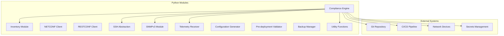
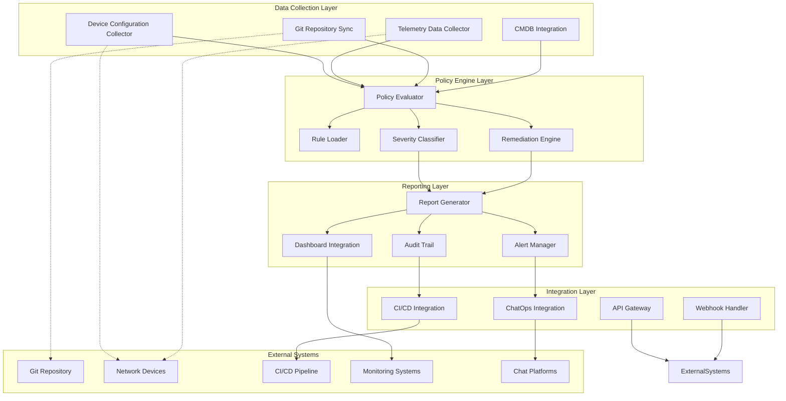
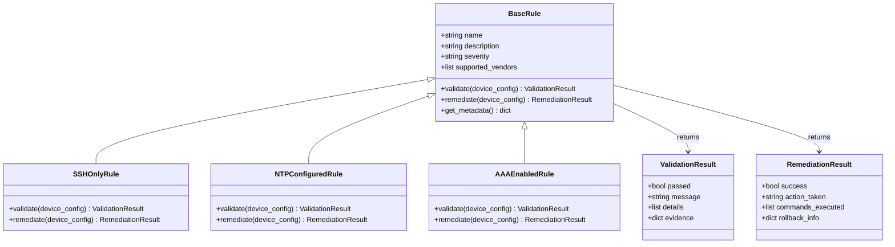
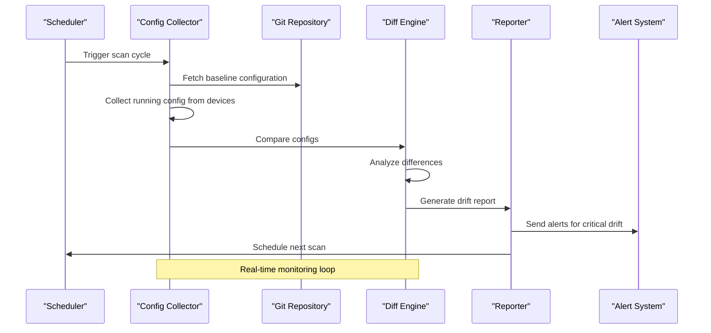
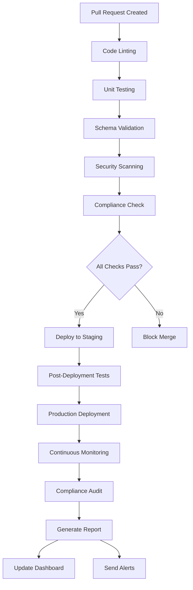

# Compliance Engine

<cite>
**Referenced Files in This Document**
- [README.md](file://README.md)
</cite>

## Table of Contents
1. [Introduction](#introduction)
2. [Project Structure](#project-structure)
3. [Core Components](#core-components)
4. [Architecture Overview](#architecture-overview)
5. [Detailed Component Analysis](#detailed-component-analysis)
6. [Dependency Analysis](#dependency-analysis)
7. [Performance Considerations](#performance-considerations)
8. [Troubleshooting Guide](#troubleshooting-guide)
9. [Conclusion](#conclusion)
10. [Appendices](#appendices)

## Introduction

The Enterprise Network Automation Platform includes a sophisticated compliance engine designed to enforce security policies and configuration standards across thousands of network devices in multi-vendor, multi-region environments. The compliance system operates as part of a comprehensive GitOps workflow, ensuring that all network configurations meet organizational security requirements before deployment and continuously monitoring running configurations for drift from approved baselines.

The compliance engine supports pluggable rule architectures, allowing organizations to define custom compliance policies tailored to their specific security requirements and operational needs. It integrates seamlessly with CI/CD pipelines, providing automated compliance validation at every stage of the development lifecycle.

## Project Structure

The compliance engine is organized within the Python modules structure under `python/compliance/`, following the modular architecture pattern established throughout the platform. The overall project structure positions compliance as a core component alongside other critical automation modules:



**Diagram sources**
- [README.md:130-141](file://README.md#L130-L141)

The compliance module follows the same architectural principles as other Python modules, providing reusable, typed, and documented functionality with comprehensive unit test coverage.

**Section sources**
- [README.md:130-141](file://README.md#L130-L141)
- [README.md:438-456](file://README.md#L438-L456)

## Core Components

The compliance engine consists of several interconnected components that work together to provide comprehensive policy enforcement and monitoring capabilities:

### Pluggable Rule Architecture

The compliance engine implements a flexible rule-based system that allows organizations to define custom compliance policies without modifying core engine logic. Rules are defined as Python modules that implement standardized interfaces, enabling easy extension and customization.

### Severity Classification System

The system categorizes compliance violations into severity levels to help prioritize remediation efforts:

| Severity Level | Description | Response Required |
|---|---|---|
| Critical | Security vulnerabilities or major policy violations | Immediate action required |
| High | Significant deviations from security baselines | Action within 24 hours |
| Medium | Moderate policy violations | Action within 7 days |
| Low | Minor deviations or recommendations | Scheduled maintenance window |

### Remediation Actions Framework

Each compliance rule can specify automated remediation actions when violations are detected. The framework supports various remediation strategies including configuration corrections, alerting workflows, and integration with change management systems.

### Drift Detection Mechanism

The engine continuously compares running device configurations against desired state definitions stored in Git repositories. This real-time monitoring capability ensures that any unauthorized changes are immediately detected and reported.

### Reporting and Integration System

The compliance engine generates comprehensive reports that integrate with CI/CD pipelines, providing automated gatekeeping for deployments and continuous monitoring for production environments.

**Section sources**
- [README.md:452-456](file://README.md#L452-L456)
- [README.md:552-567](file://README.md#L552-L567)

## Architecture Overview

The compliance engine architecture follows a layered approach that separates concerns between data collection, policy evaluation, reporting, and integration:



**Diagram sources**
- [README.md:438-456](file://README.md#L438-L456)
- [README.md:470-476](file://README.md#L470-L476)

The architecture emphasizes modularity, scalability, and extensibility, allowing organizations to customize each layer according to their specific requirements while maintaining compatibility with the core compliance framework.

## Detailed Component Analysis

### Pluggable Rule Architecture

The rule architecture provides a standardized interface for defining compliance checks that can be dynamically loaded and executed by the compliance engine. Rules follow a consistent pattern that enables easy creation, testing, and maintenance.

#### Rule Definition Format

Rules are implemented as Python classes that inherit from a base rule interface. Each rule defines its metadata, validation logic, and remediation actions through standardized methods and properties.



**Diagram sources**
- [README.md:452-456](file://README.md#L452-L456)

#### Severity Levels and Classification

The severity classification system provides a standardized way to categorize compliance violations based on their potential impact on security and operations:

| Severity | Impact Level | Response Time | Examples |
|---|---|---|---|
| Critical | Immediate security risk | 0-4 hours | Missing authentication, weak ciphers |
| High | Significant security gap | 4-24 hours | Unencrypted protocols, missing logging |
| Medium | Operational concern | 24-72 hours | Non-standard configurations, missing backups |
| Low | Best practice recommendation | 7-30 days | Documentation gaps, optimization suggestions |

#### Remediation Actions Framework

The remediation framework supports multiple action types for addressing compliance violations:

- **Automatic Remediation**: Direct configuration changes applied to devices
- **Workflow-Based Remediation**: Triggers approval workflows for manual intervention
- **Alert-Only**: Generates alerts without automatic changes
- **Rollback Support**: Maintains ability to revert remediation actions

### Drift Detection Mechanism

The drift detection system continuously monitors device configurations against their desired state defined in Git repositories. This real-time comparison ensures immediate detection of unauthorized changes.



**Diagram sources**
- [README.md:428-435](file://README.md#L428-L435)

The drift detection mechanism supports incremental scanning, parallel processing across device fleets, and intelligent scheduling to minimize performance impact on network devices.

### Reporting System

The reporting system generates comprehensive compliance reports that integrate seamlessly with CI/CD pipelines and monitoring dashboards. Reports include violation details, severity classifications, remediation recommendations, and trend analysis.

#### CI/CD Integration

The compliance engine integrates with CI/CD pipelines through standardized APIs and webhook mechanisms:



**Diagram sources**
- [README.md:479-514](file://README.md#L479-L514)

#### Report Formats and Outputs

The reporting system supports multiple output formats for different consumption patterns:

- **JSON Reports**: Machine-readable format for programmatic processing
- **HTML Reports**: Human-readable format for review and audit purposes
- **PDF Reports**: Formal documentation for compliance audits
- **Dashboard Integration**: Real-time visualization of compliance status
- **API Endpoints**: Programmatic access to compliance data

### Custom Compliance Rules Development

Organizations can extend the compliance engine by creating custom rules that address their specific security requirements and operational policies. The development process follows established patterns and best practices.

#### Rule Creation Workflow

1. **Define Rule Requirements**: Identify the specific compliance requirement to be enforced
2. **Implement Rule Class**: Create Python class inheriting from base rule interface
3. **Add Validation Logic**: Implement configuration validation methods
4. **Define Remediation Actions**: Specify automated or manual remediation steps
5. **Write Unit Tests**: Create comprehensive test coverage for the rule
6. **Document Rule Behavior**: Provide clear documentation for rule purpose and behavior
7. **Register Rule**: Add rule to the compliance engine's rule registry

#### Example Rule Categories

Common categories of compliance rules include:

- **Security Hardening**: SSH-only access, strong cipher suites, authentication policies
- **Operational Standards**: NTP configuration, logging setup, backup procedures
- **Vendor-Specific Policies**: Platform-specific security and operational requirements
- **Regulatory Compliance**: Industry-specific compliance requirements (PCI-DSS, SOX, etc.)
- **Best Practices**: Recommended configurations based on industry standards

**Section sources**
- [README.md:452-456](file://README.md#L452-L456)
- [README.md:552-567](file://README.md#L552-L567)
- [README.md:470-476](file://README.md#L470-L476)

## Dependency Analysis

The compliance engine maintains well-defined dependencies on other platform components while providing clear interfaces for external integrations:

```mermaid
graph TB
subgraph "Internal Dependencies"
Utils[Utils Module]
Inventory[Inventory Module]
SSH[SSH Module]
SNMP[SNMP Module]
Telemetry[Telemetry Module]
Validation[Validation Module]
end
subgraph "External Dependencies"
Git[Git Libraries]
PyYAML[YAML Processing]
Jinja2[Template Engine]
Requests[HTTP Client]
Paramiko[SSH Library]
Netmiko[Multi-Vendor SSH]
end
subgraph "Optional Integrations"
Prometheus[Prometheus Client]
Slack[Slack SDK]
Teams[Microsoft Teams SDK]
Jira[Jira API]
ServiceNow[ServiceNow API]
end
ComplianceEngine[Compliance Engine] --> Utils
ComplianceEngine --> Inventory
ComplianceEngine --> SSH
ComplianceEngine --> SNMP
ComplianceEngine --> Telemetry
ComplianceEngine --> Validation
ComplianceEngine --> Git
ComplianceEngine --> PyYAML
ComplianceEngine --> Jinja2
ComplianceEngine --> Requests
ComplianceEngine --> Paramiko
ComplianceEngine --> Netmiko
ComplianceEngine --> Prometheus
ComplianceEngine --> Slack
ComplianceEngine --> Teams
ComplianceEngine --> Jira
ComplianceEngine --> ServiceNow
```



**Diagram sources**
- [README.md:438-456](file://README.md#L438-L456)

The dependency structure emphasizes loose coupling and high cohesion, allowing individual components to be updated or replaced without affecting the entire compliance system.

**Section sources**
- [README.md:438-456](file://README.md#L438-L456)

## Performance Considerations

The compliance engine is designed to handle large-scale network environments efficiently while minimizing impact on device performance and network bandwidth.

### Scalability Architecture

The engine employs several strategies to optimize performance across large device fleets:

- **Parallel Processing**: Concurrent scanning of multiple devices using async I/O
- **Incremental Scanning**: Only checking changed configurations rather than full fleet scans
- **Intelligent Scheduling**: Distributing scan loads across off-peak hours
- **Caching Strategies**: Caching device capabilities and connection parameters
- **Connection Pooling**: Reusing network connections to reduce overhead

### Resource Optimization

Key performance optimizations include:

- **Memory Management**: Efficient handling of large configuration files
- **CPU Utilization**: Multi-threaded processing for CPU-intensive tasks
- **Network Bandwidth**: Compression and delta transfers for configuration comparisons
- **Storage Efficiency**: Incremental storage of configuration snapshots
- **Database Optimization**: Indexed queries and efficient data structures

### Real-Time Monitoring Considerations

For real-time compliance monitoring scenarios:

- **Event-Driven Architecture**: Reacting to configuration changes rather than polling
- **Stream Processing**: Handling telemetry data streams efficiently
- **State Management**: Maintaining minimal state for optimal performance
- **Backpressure Handling**: Graceful degradation under high load conditions

## Troubleshooting Guide

Common issues and their resolutions when working with the compliance engine:

### Connection and Authentication Issues

| Issue | Symptoms | Resolution |
|---|---|---|
| Device Connection Timeout | Scan failures, timeout errors | Verify network connectivity, check firewall rules, validate credentials |
| Authentication Failures | Login errors, permission denied | Verify credentials, check account permissions, validate certificate chains |
| Protocol Mismatch | Unsupported protocol errors | Ensure device supports configured protocol, update device firmware if needed |

### Performance and Scaling Issues

| Issue | Symptoms | Resolution |
|---|---|---|
| Slow Scan Performance | Long scan times, resource exhaustion | Enable parallel processing, adjust batch sizes, optimize query filters |
| Memory Leaks | Increasing memory usage over time | Review custom rules for memory leaks, restart service periodically |
| Database Bloat | Slow queries, disk space issues | Clean up old scan results, optimize database indexes, archive historical data |

### Rule Development Issues

| Issue | Symptoms | Resolution |
|---|---|---|
| Rule Not Loading | Missing rule errors, registration failures | Verify rule syntax, check import paths, ensure proper inheritance |
| False Positives | Incorrect violation reports | Review rule logic, update validation criteria, add exception handling |
| Performance Degradation | Slow rule execution | Optimize rule logic, use caching, implement early exits |

### Integration Issues

| Issue | Symptoms | Resolution |
|---|---|---|
| CI/CD Pipeline Failures | Pipeline blocking, integration errors | Check API endpoints, verify webhook configurations, review error logs |
| Report Generation Errors | Missing reports, formatting issues | Validate template syntax, check data availability, verify output permissions |
| Alert Delivery Failures | Missed notifications, delivery errors | Verify notification channels, check rate limits, review retry logic |

**Section sources**
- [README.md:674-685](file://README.md#L674-L685)

## Conclusion

The compliance engine represents a comprehensive solution for enforcing security policies and configuration standards across enterprise network environments. Its pluggable architecture enables organizations to define custom compliance rules tailored to their specific requirements while maintaining compatibility with the core framework.

The system's integration with CI/CD pipelines ensures that compliance is enforced throughout the development lifecycle, from initial code commits to production deployment. The drift detection mechanism provides continuous monitoring of running configurations, enabling rapid detection and response to unauthorized changes.

Key strengths of the compliance engine include its scalability for large device fleets, extensibility through custom rule development, and comprehensive reporting capabilities that support both automated and manual compliance workflows. The modular architecture facilitates easy maintenance and updates while ensuring system stability and performance.

For organizations implementing this compliance solution, the recommended approach is to start with foundational security policies, gradually expand to operational standards, and continuously refine rules based on evolving security requirements and operational feedback. The comprehensive testing framework and documentation support facilitate smooth adoption and ongoing maintenance of the compliance system.

## Appendices

### Quick Start Commands

Basic compliance engine operations and common workflows:

```bash
# Run compliance scan against lab devices
ansible-playbook playbooks/compliance_scan.yml -i inventories/lab/hosts.yml --check --diff

# Run compliance checks locally
python -m python.compliance --inventory inventories/lab/hosts.yml

# Run compliance tests
pytest tests/compliance/ -v

# Generate configuration for a device
python -m python.config_gen --device core-rtr-01 --output ./output/
```

### Supported Compliance Policies

The platform includes built-in support for common compliance policies:

- **SSH Security**: Enforce SSH-only access, disable Telnet, configure strong ciphers
- **Authentication Standards**: Require TACACS+ or RADIUS, enforce password policies
- **Logging and Monitoring**: Configure syslog, enable audit trails, set up monitoring
- **Protocol Security**: Disable insecure protocols, enforce encryption standards
- **Firmware Management**: Maintain approved firmware versions, track upgrade status
- **Access Control**: Implement least privilege, manage administrative access
- **Backup and Recovery**: Ensure regular backups, validate recovery procedures

### Integration Points

The compliance engine integrates with various platform components and external systems:

- **CI/CD Pipelines**: GitHub Actions, Jenkins, Azure DevOps
- **Monitoring Systems**: Prometheus, Grafana, Splunk
- **Chat Platforms**: Slack, Microsoft Teams, Discord
- **Ticketing Systems**: Jira, ServiceNow, Zendesk
- **Configuration Management**: Ansible, Terraform, Puppet
- **Secrets Management**: HashiCorp Vault, AWS Secrets Manager, Azure Key Vault