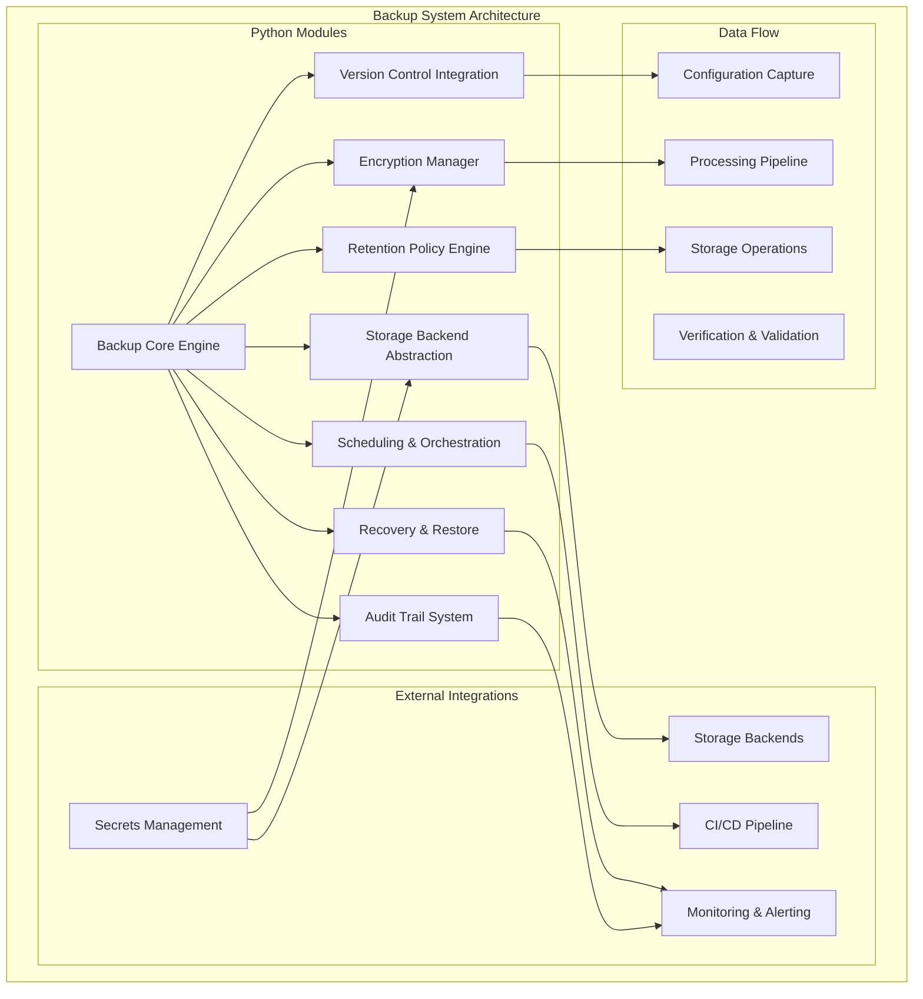
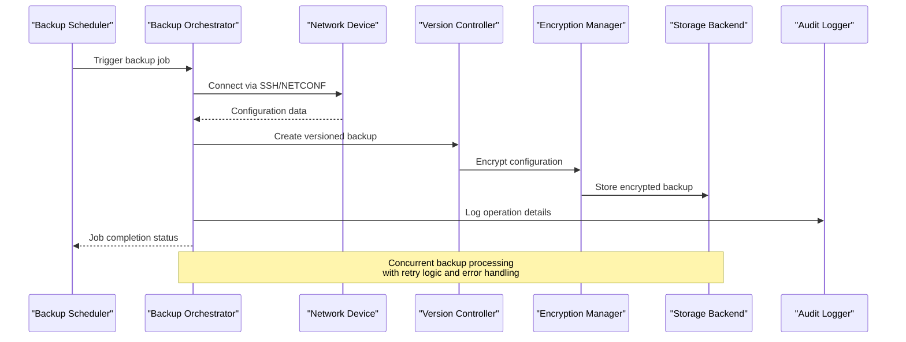
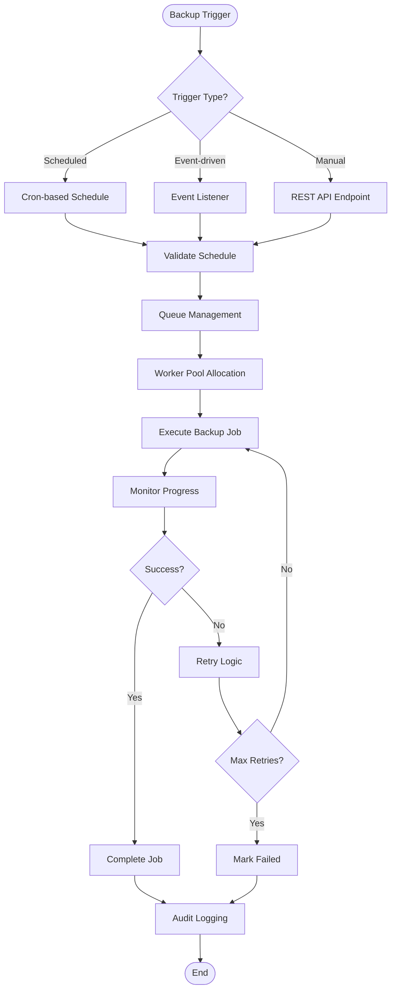
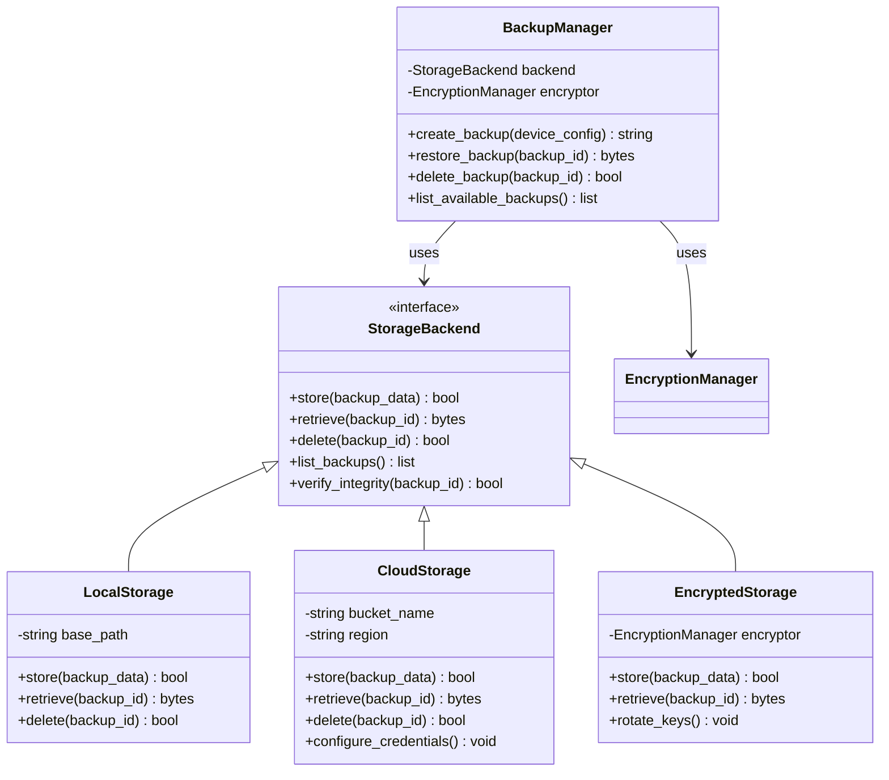
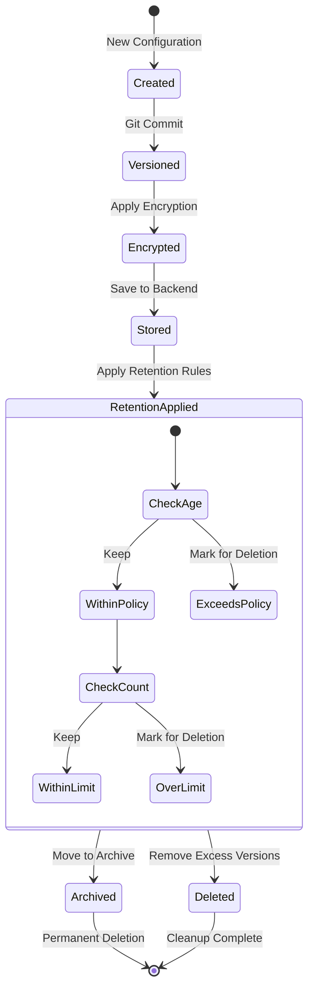
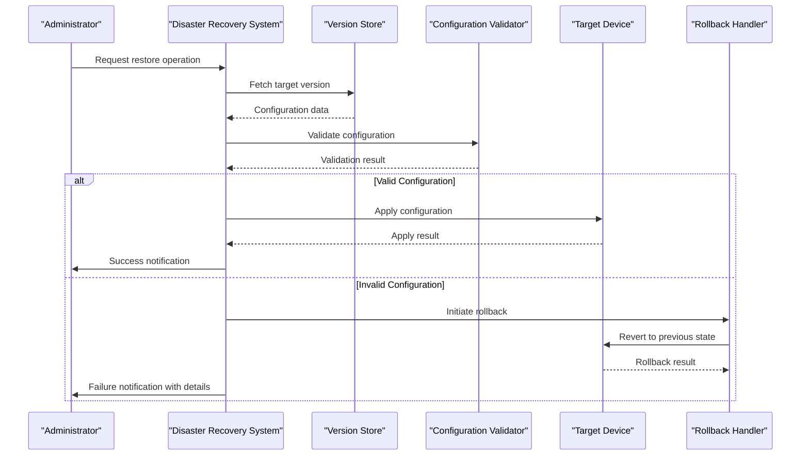
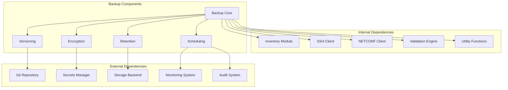

# Backup Management System

<cite>
**Referenced Files in This Document**
- [README.md](file://README.md)
</cite>

## Table of Contents
1. [Introduction](#introduction)
2. [Project Structure](#project-structure)
3. [Core Components](#core-components)
4. [Architecture Overview](#architecture-overview)
5. [Detailed Component Analysis](#detailed-component-analysis)
6. [Dependency Analysis](#dependency-analysis)
7. [Performance Considerations](#performance-considerations)
8. [Troubleshooting Guide](#troubleshooting-guide)
9. [Conclusion](#conclusion)
10. [Appendices](#appendices)

## Introduction

The Backup Management System is a critical component of the Enterprise Network Automation Platform, designed to provide comprehensive configuration backup capabilities for thousands of network devices across multi-vendor, multi-region environments. This system implements automated backup infrastructure with versioning, encryption, retention policies, and disaster recovery procedures.

The backup system integrates seamlessly with the GitOps workflow, ensuring all device configurations are captured, secured, and maintainable throughout their lifecycle. It supports multiple storage backends, secrets management integration, and provides audit trail capabilities for compliance requirements.

## Project Structure

The backup management system is organized under the `python/backup/` directory within the broader network automation platform structure:

**Diagram sources**
- [README.md:130-180](file://README.md#L130-L180)
- [README.md:438-456](file://README.md#L438-L456)

**Section sources**
- [README.md:130-180](file://README.md#L130-L180)
- [README.md:438-456](file://README.md#L438-L456)

## Core Components

The backup management system consists of several interconnected components that work together to provide comprehensive backup capabilities:

### Backup Core Engine
The central orchestrator that manages the entire backup lifecycle, from initiation to completion. It coordinates between different subsystems and handles error scenarios.

### Version Control Integration
Seamless integration with Git for maintaining historical versions of device configurations. Each backup creates a new commit with metadata including timestamp, device information, and change details.

### Encryption Manager
Handles cryptographic operations for securing backup data at rest and in transit. Supports multiple encryption algorithms and key management strategies.

### Retention Policy Engine
Implements configurable retention rules based on time-based, count-based, or custom criteria. Ensures compliance with organizational data governance policies.

### Storage Backend Abstraction
Provides a unified interface for multiple storage backends including local filesystem, cloud storage (S3, Azure Blob, GCS), and enterprise storage solutions.

### Scheduling & Orchestration
Manages backup schedules, concurrent operations, and resource allocation across thousands of devices.

### Recovery & Restore
Provides point-in-time recovery capabilities with verification and validation before applying restored configurations.

### Audit Trail System
Maintains comprehensive logs of all backup operations, access patterns, and policy enforcement for compliance and troubleshooting.

**Section sources**
- [README.md:438-456](file://README.md#L438-L456)

## Architecture Overview

The backup management system follows a modular, extensible architecture designed for enterprise-scale deployments:

**Diagram sources**
- [README.md:438-456](file://README.md#L438-L456)
- [README.md:339-368](file://README.md#L339-L368)

The architecture supports horizontal scaling through distributed scheduling and load balancing across multiple worker nodes. Each component is independently scalable and can be deployed as microservices or monolithic applications depending on deployment requirements.

## Detailed Component Analysis

### Backup Scheduling System

The scheduling system provides flexible backup orchestration with support for various trigger mechanisms:

**Diagram sources**
- [README.md:468-475](file://README.md#L468-L475)
- [README.md:511-513](file://README.md#L511-L513)

### Storage Backend Abstraction

The storage abstraction layer provides seamless integration with multiple storage providers:

**Diagram sources**
- [README.md:339-368](file://README.md#L339-L368)
- [README.md:438-456](file://README.md#L438-L456)

### Versioning and Retention Policies

The versioning system maintains complete history of device configurations with intelligent retention management:

**Diagram sources**
- [README.md:438-456](file://README.md#L438-L456)

### Disaster Recovery Procedures

The disaster recovery system provides comprehensive restore capabilities with validation and rollback support:

**Diagram sources**
- [README.md:421-428](file://README.md#L421-L428)

## Dependency Analysis

The backup system has well-defined dependencies and integration points:

**Diagram sources**
- [README.md:438-456](file://README.md#L438-L456)
- [README.md:339-368](file://README.md#L339-L368)

**Section sources**
- [README.md:438-456](file://README.md#L438-L456)
- [README.md:339-368](file://README.md#L339-L368)

## Performance Considerations

For managing backups across thousands of devices with concurrent operations, the system implements several performance optimization strategies:

### Concurrency Management
- **Worker Pool Scaling**: Dynamic worker pool adjustment based on available resources and queue depth
- **Connection Pooling**: Efficient connection reuse for device communication
- **Batch Processing**: Grouped operations to minimize overhead
- **Asynchronous Operations**: Non-blocking I/O for improved throughput

### Resource Optimization
- **Memory Management**: Streaming processing for large configuration files
- **CPU Utilization**: Parallel encryption and compression operations
- **Network Bandwidth**: Compression and deduplication to reduce transfer sizes
- **Storage Efficiency**: Incremental backups and delta storage

### Scalability Patterns
- **Horizontal Scaling**: Stateless worker nodes for elastic scaling
- **Load Balancing**: Intelligent distribution of backup jobs
- **Caching**: Frequently accessed metadata and configuration templates
- **Partitioning**: Geographic and logical partitioning for large deployments

## Troubleshooting Guide

Common issues and resolution strategies for the backup management system:

### Connection Issues
- **Device Connectivity**: Verify network reachability and authentication credentials
- **Timeout Errors**: Adjust timeout settings based on device response times
- **Authentication Failures**: Check secrets management integration and credential rotation

### Storage Problems
- **Storage Backend Access**: Verify storage credentials and permissions
- **Disk Space**: Monitor storage utilization and implement cleanup policies
- **Network Latency**: Configure appropriate timeouts for remote storage backends

### Performance Issues
- **Slow Backups**: Analyze device performance and network conditions
- **High Memory Usage**: Review configuration sizes and implement streaming
- **CPU Bottlenecks**: Optimize encryption algorithms and parallel processing

### Compliance and Audit
- **Missing Audit Logs**: Verify audit logging configuration and storage
- **Policy Violations**: Review retention policies and compliance rules
- **Security Alerts**: Investigate encryption key management and access controls

**Section sources**
- [README.md:674-685](file://README.md#L674-L685)

## Conclusion

The Backup Management System provides a comprehensive, enterprise-grade solution for network configuration backup and recovery. Its modular architecture supports scalability, security, and compliance requirements while maintaining operational simplicity. The system's integration with secrets management, version control, and monitoring ensures reliable operation in production environments.

Key strengths include:
- **Scalability**: Support for thousands of concurrent backup operations
- **Security**: End-to-end encryption with robust key management
- **Compliance**: Comprehensive audit trails and retention policies
- **Reliability**: Multi-backend storage with automatic failover
- **Flexibility**: Pluggable architecture supporting various storage and protocol requirements

The system is designed to evolve with organizational needs, providing a solid foundation for network automation and disaster recovery operations.

## Appendices

### Configuration Examples

#### Basic Backup Configuration
Configure core backup parameters including schedule, retention, and storage settings.

#### Advanced Retention Policies
Set up complex retention rules based on business requirements and compliance obligations.

#### Storage Backend Setup
Configure different storage backends including local, cloud, and enterprise storage solutions.

#### Secrets Management Integration
Integrate with HashiCorp Vault, AWS Secrets Manager, or other supported secrets backends.

### API Reference

#### Backup Bot Endpoints
- `/api/v1/backup` - Trigger and manage backup operations
- `/api/v1/backup/status` - Check backup job status
- `/api/v1/backup/configure` - Update backup configuration
- `/api/v1/backup/restore` - Initiate restore operations

### Monitoring and Metrics

#### Key Performance Indicators
- Backup success rate and duration
- Storage utilization trends
- Error rates and failure patterns
- Resource consumption metrics

#### Alerting Configuration
Set up alerts for backup failures, storage capacity, and performance degradation.