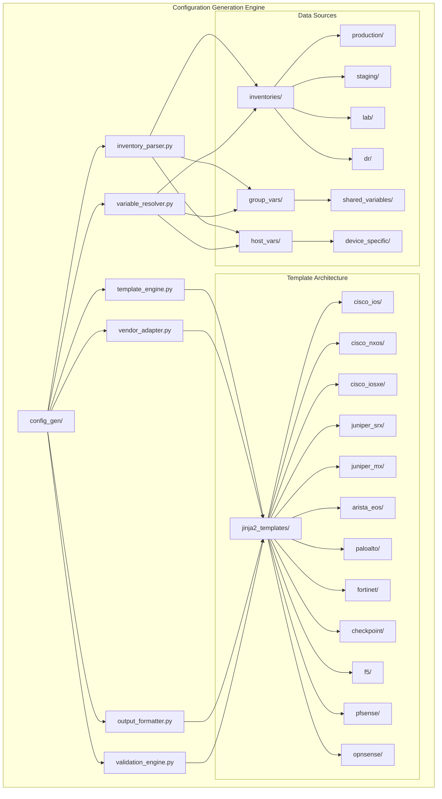
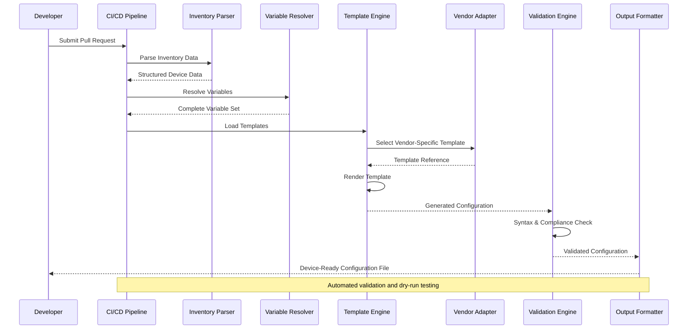
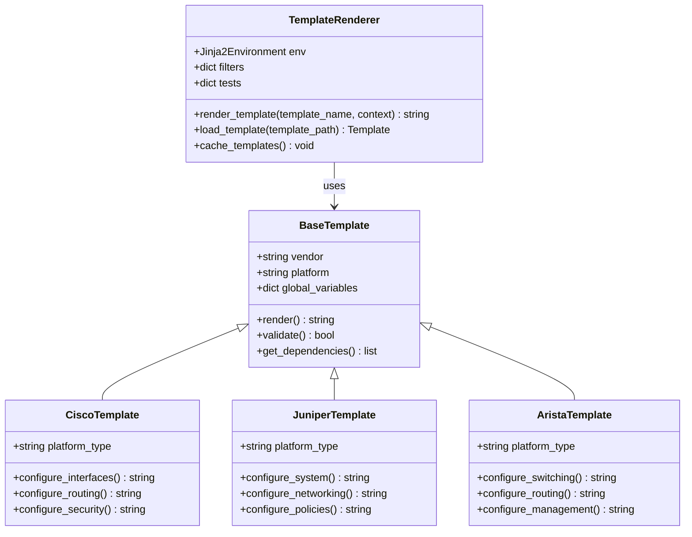
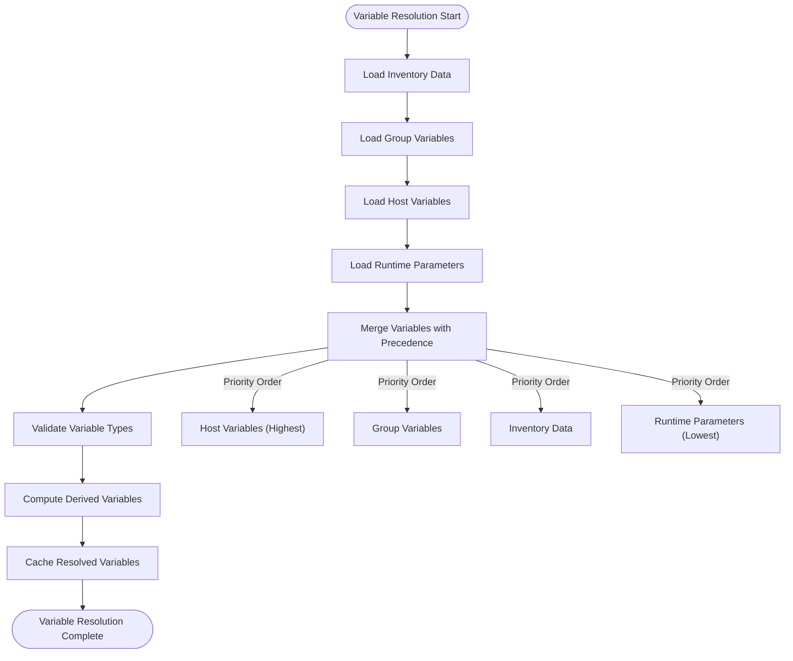
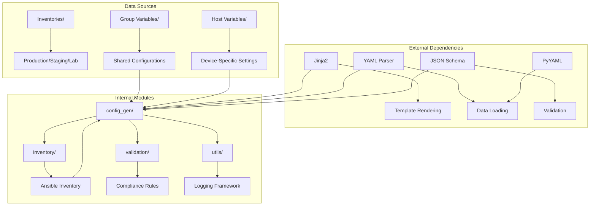

# Configuration Generation Engine

<cite>
**Referenced Files in This Document**
- [README.md](file://README.md)
</cite>

## Table of Contents
1. [Introduction](#introduction)
2. [Project Structure](#project-structure)
3. [Core Components](#core-components)
4. [Architecture Overview](#architecture-overview)
5. [Detailed Component Analysis](#detailed-component-analysis)
6. [Dependency Analysis](#dependency-analysis)
7. [Performance Considerations](#performance-considerations)
8. [Troubleshooting Guide](#troubleshooting-guide)
9. [Conclusion](#conclusion)
10. [Appendices](#appendices)

## Introduction

The Configuration Generation Engine is a sophisticated Jinja2-based template rendering system designed to transform structured YAML data into vendor-specific network configurations. This enterprise-grade solution supports multi-vendor environments including Cisco (IOS, IOS-XE, NX-OS), Juniper (SRX, MX), Arista (EOS), Palo Alto, Fortinet, Check Point, F5, pfSense, and OPNsense platforms.

The engine operates as part of a comprehensive network automation platform that follows Infrastructure as Code principles, where all device configurations are generated from Jinja2 templates combined with structured data. This approach ensures consistency, maintainability, and scalability across thousands of network devices in multi-region, multi-vendor environments.

The system integrates seamlessly with GitOps workflows, providing automated validation, compliance checking, and deployment pipelines that enforce security policies and best practices throughout the configuration lifecycle.

## Project Structure

The Configuration Generation Engine is organized within the Python automation modules under `python/config_gen/`. The overall project structure follows a modular architecture that separates concerns between inventory management, template rendering, validation, and deployment operations.



**Diagram sources**
- [README.md:103-180](file://README.md#L103-L180)

The engine processes structured data from multiple sources including Ansible inventories, group variables, and host-specific configurations to generate vendor-specific network configurations through a sophisticated template rendering pipeline.

**Section sources**
- [README.md:103-180](file://README.md#L103-L180)

## Core Components

The Configuration Generation Engine consists of several interconnected components that work together to provide a robust and scalable template rendering solution:

### Template Engine Core
The central template engine manages Jinja2 template loading, compilation, and rendering operations. It provides caching mechanisms for improved performance and handles template inheritance and includes for code reuse across vendor-specific implementations.

### Variable Resolution System
A hierarchical variable resolution system that merges data from multiple sources including inventory files, group variables, host variables, and runtime parameters. The system implements proper precedence rules and supports dynamic variable computation.

### Vendor Adapter Layer
An abstraction layer that handles vendor-specific template selection, syntax variations, and platform differences. This component ensures consistent behavior across different network device vendors while maintaining vendor-specific optimizations.

### Output Formatter
Responsible for formatting rendered configurations according to vendor-specific requirements, including indentation standards, comment placement, and configuration block organization.

### Validation Engine
Pre-deployment validation system that checks configuration syntax, semantic correctness, and compliance with organizational policies before deployment.

**Section sources**
- [README.md:438-456](file://README.md#L438-L456)

## Architecture Overview

The Configuration Generation Engine follows a layered architecture pattern that separates concerns and promotes reusability across different vendors and use cases.



**Diagram sources**
- [README.md:36-50](file://README.md#L36-L50)
- [README.md:479-501](file://README.md#L479-L501)

The architecture supports concurrent processing for large-scale deployments, with each device configuration generated independently and validated before deployment. The system integrates with GitOps workflows to ensure all changes are tracked, reviewed, and auditable.

## Detailed Component Analysis

### Template Architecture

The template system is built around Jinja2 with extensive customization for network configuration generation. Templates are organized by vendor and platform, with shared base templates for common functionality.

#### Template Organization Pattern



**Diagram sources**
- [README.md:116-128](file://README.md#L116-L128)

#### Variable Resolution Hierarchy

The variable resolution system implements a well-defined precedence hierarchy that ensures predictable behavior when merging configuration data from multiple sources.



**Diagram sources**
- [README.md:311-335](file://README.md#L311-L335)

### Multi-Vendor Support Patterns

The engine implements several patterns to support multiple vendors efficiently:

#### Vendor Abstraction Interface
Each vendor implements a common interface that defines configuration generation methods while allowing vendor-specific optimizations and syntax variations.

#### Template Inheritance Strategy
Base templates define common configuration blocks, with vendor-specific templates inheriting and extending functionality. This reduces duplication and ensures consistency across platforms.

#### Conditional Logic Framework
Sophisticated conditional logic allows templates to adapt to different device capabilities, software versions, and feature availability without requiring separate template files.

### Custom Filter Creation

The system supports custom Jinja2 filters for complex data transformations and vendor-specific formatting requirements.

#### Filter Development Guidelines
Custom filters should be stateless, idempotent, and handle edge cases gracefully. They should include comprehensive error handling and logging for debugging purposes.

#### Built-in Filter Categories
- **Network Calculations**: Subnet calculations, IP address manipulation, VLAN numbering
- **Formatting Filters**: Vendor-specific output formatting, indentation control
- **Validation Filters**: Data validation and sanitization
- **Transformation Filters**: Data structure transformations and normalization

### Conditional Logic Implementation

Templates implement sophisticated conditional logic to handle device-specific features and configuration variations.

#### Feature Detection
Dynamic feature detection allows templates to automatically adapt to available hardware and software capabilities.

#### Environment-Based Rendering
Conditional rendering based on environment (production, staging, lab) enables different configuration strategies for different operational contexts.

#### Platform-Specific Branches
Vendor and platform-specific conditional branches ensure optimal configuration generation for each target device type.

**Section sources**
- [README.md:116-128](file://README.md#L116-L128)
- [README.md:311-335](file://README.md#L311-L335)

## Dependency Analysis

The Configuration Generation Engine has well-defined dependencies on external systems and internal modules that support its core functionality.



**Diagram sources**
- [README.md:438-456](file://README.md#L438-L456)

### Component Coupling Analysis

The engine maintains loose coupling between components through well-defined interfaces and dependency injection patterns. This design enables independent testing, replacement of components, and scaling of individual services.

### External Integration Points

The system integrates with multiple external systems including secrets managers, version control systems, and deployment orchestration tools through standardized APIs and protocols.

**Section sources**
- [README.md:438-456](file://README.md#L438-L456)

## Performance Considerations

The Configuration Generation Engine is designed for high-performance operation in large-scale enterprise environments with thousands of devices.

### Template Caching Strategy

Templates are compiled and cached to avoid repeated parsing overhead. The cache strategy includes:
- **Template Compilation Caching**: Compiled Jinja2 templates are stored in memory
- **Render Result Caching**: Frequently used render results are cached with invalidation policies
- **Variable Resolution Caching**: Resolved variable sets are cached per device group

### Concurrent Processing Architecture

The engine supports concurrent template rendering using:
- **Thread Pool Management**: Configurable thread pools for parallel template processing
- **Memory Pool Optimization**: Efficient memory usage through object pooling
- **Batch Processing**: Grouped processing of related devices for optimal resource utilization

### Scalability Patterns

For large-scale deployments, the engine implements:
- **Distributed Rendering**: Horizontal scaling across multiple worker nodes
- **Load Balancing**: Intelligent distribution of rendering tasks across available resources
- **Graceful Degradation**: Fallback mechanisms when resources are constrained

### Memory Management

Efficient memory management prevents resource exhaustion during large batch operations:
- **Streaming Processing**: Large configurations are processed in streaming fashion
- **Garbage Collection Optimization**: Strategic cleanup of temporary objects
- **Resource Limits**: Configurable limits prevent single operations from consuming excessive resources

## Troubleshooting Guide

Common issues and their resolutions when working with the Configuration Generation Engine:

### Template Rendering Errors
- **Syntax Errors**: Use debug mode to identify template syntax issues
- **Variable Resolution Failures**: Verify variable hierarchy and data types
- **Missing Dependencies**: Ensure all required templates and filters are available

### Performance Issues
- **Slow Rendering**: Enable profiling to identify bottlenecks
- **Memory Exhaustion**: Adjust thread pool size and memory limits
- **Cache Inefficiency**: Review cache key strategies and invalidation policies

### Vendor-Specific Problems
- **Platform Compatibility**: Verify platform detection and feature availability
- **Syntax Variations**: Check vendor-specific template adaptations
- **Feature Limitations**: Confirm device capabilities match template requirements

### Debugging Techniques
- **Verbose Logging**: Enable detailed logging for troubleshooting
- **Template Inspection**: Examine rendered output at intermediate stages
- **Variable Dump**: Inspect resolved variable sets for validation

**Section sources**
- [README.md:674-685](file://README.md#L674-L685)

## Conclusion

The Configuration Generation Engine represents a mature, enterprise-grade solution for automated network configuration management. Its Jinja2-based architecture provides flexibility and power while maintaining clarity and maintainability. The multi-vendor support, comprehensive validation, and GitOps integration make it suitable for production environments managing thousands of network devices across diverse vendor ecosystems.

The engine's design emphasizes scalability, performance, and reliability through careful attention to caching, concurrency, and resource management. Its extensible architecture allows for easy addition of new vendors and platforms while maintaining consistency across the entire fleet.

By following Infrastructure as Code principles and integrating with modern DevOps practices, the Configuration Generation Engine enables organizations to achieve consistent, compliant, and auditable network configuration management at scale.

## Appendices

### Quick Start Examples

Basic usage of the configuration generation engine:

```bash
# Generate configuration for a specific device
python -m python.config_gen --device core-rtr-01 --output ./output/

# Run with debug logging
python -m python.config_gen --debug --device <device-name>

# Generate configurations for multiple devices
python -m python.config_gen --inventory inventories/lab/hosts.yml --output ./output/

# Validate templates without deployment
python -m python.config_gen --validate-only --device <device-name>
```

### Template Development Best Practices

- **Modular Design**: Break complex templates into smaller, reusable components
- **Documentation**: Include comprehensive comments explaining configuration logic
- **Testing**: Write unit tests for template logic and custom filters
- **Version Control**: Track template changes with meaningful commit messages
- **Backward Compatibility**: Maintain compatibility with existing configurations when possible

### Security Considerations

- **Secrets Management**: Never embed credentials in templates or configuration files
- **Input Validation**: Sanitize all input data to prevent injection attacks
- **Access Control**: Implement proper authorization for template modification
- **Audit Logging**: Log all template rendering operations for compliance