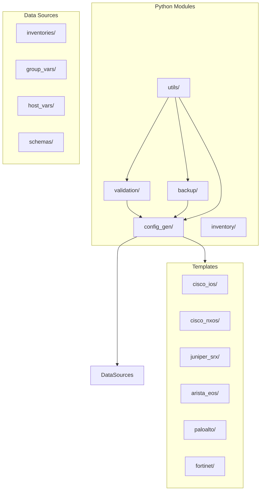
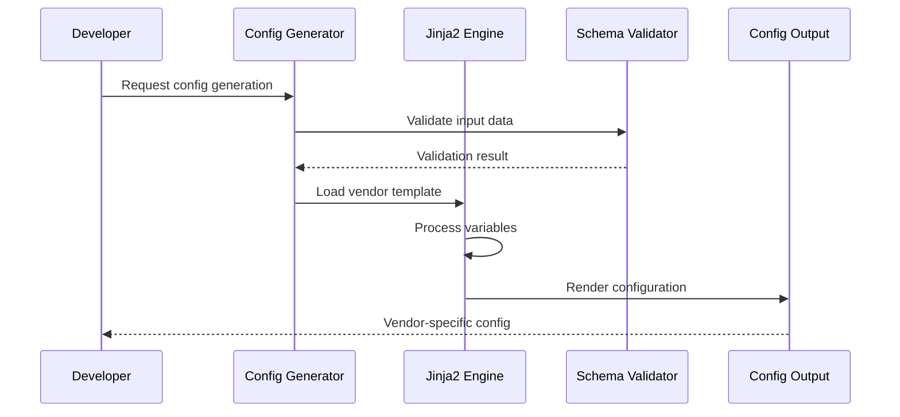
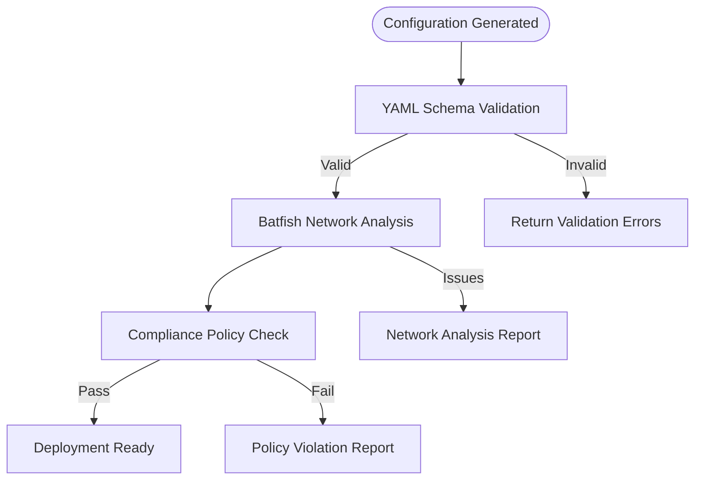
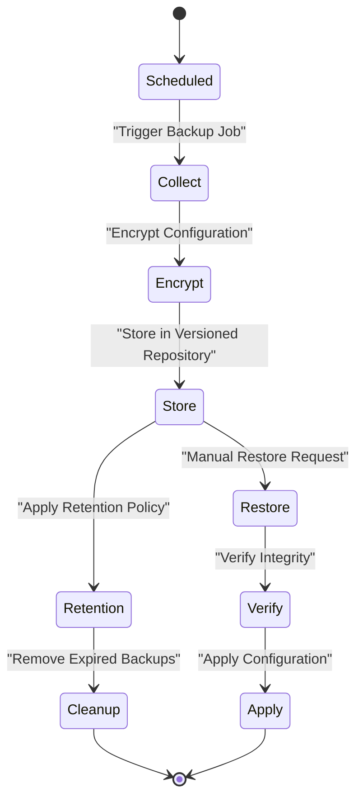
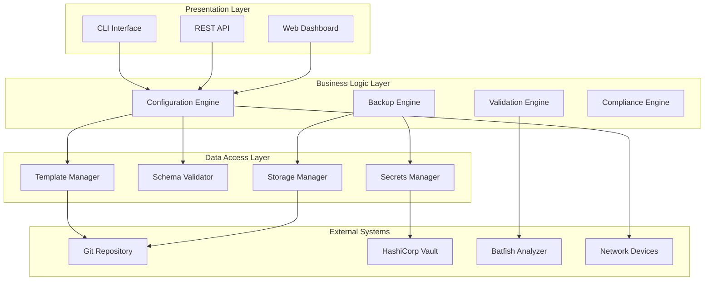
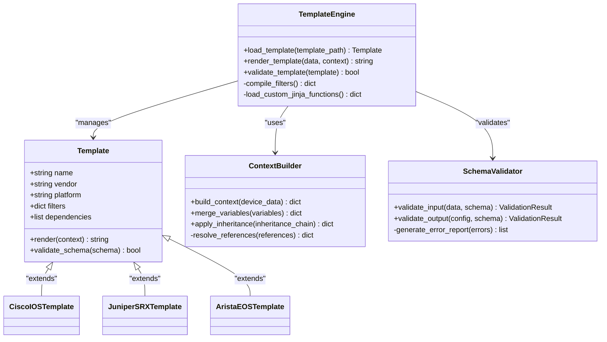
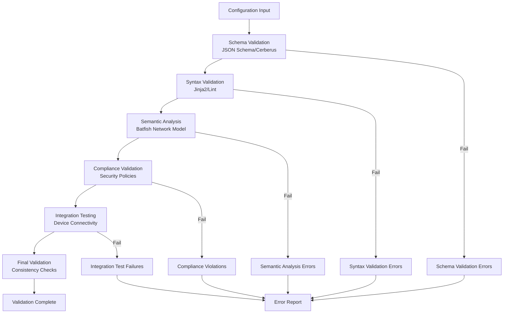
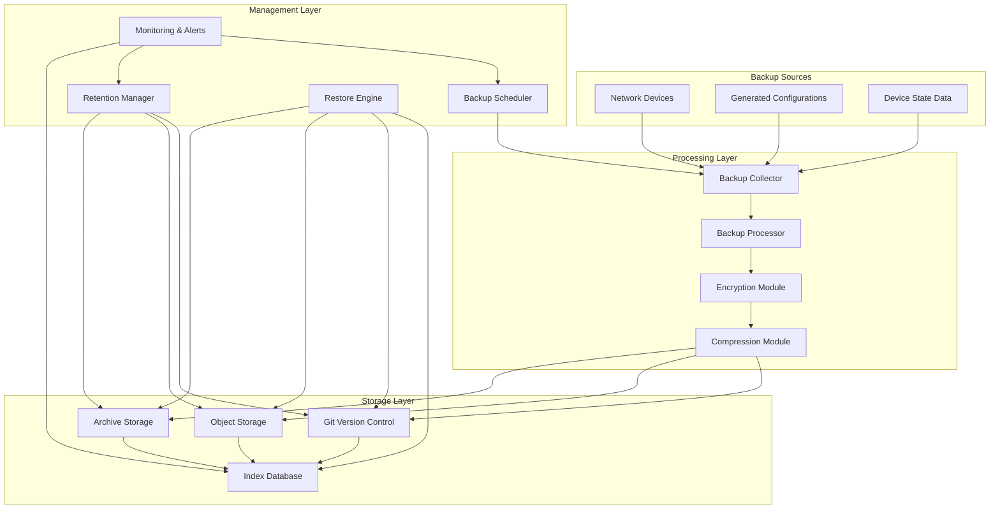

# Configuration Management

<cite>
**Referenced Files in This Document**
- [README.md](file://README.md)
</cite>

## Table of Contents
1. [Introduction](#introduction)
2. [Project Structure](#project-structure)
3. [Core Components](#core-components)
4. [Architecture Overview](#architecture-overview)
5. [Detailed Component Analysis](#detailed-component-analysis)
6. [Dependency Analysis](#dependency-analysis)
7. [Performance Considerations](#performance-considerations)
8. [Troubleshooting Guide](#troubleshooting-guide)
9. [Conclusion](#conclusion)

## Introduction

This document provides comprehensive coverage of the configuration management subsystem for the Enterprise Network Automation Platform. The system implements a production-grade, vendor-agnostic approach to network automation using Infrastructure as Code principles, GitOps workflows, and automated compliance enforcement.

The configuration management subsystem consists of three primary components:
- **Configuration Generation Engine**: A Jinja2-based system that transforms structured YAML data into vendor-specific configurations
- **Validation Framework**: Pre-deployment syntax and semantic validation using Batfish integration
- **Backup Management System**: Versioned, encrypted backups with automated retention policies

These components work together to provide a robust, scalable solution for managing thousands of network devices across multi-vendor, multi-region environments.

## Project Structure

The configuration management subsystem follows a modular architecture organized under the `python/` directory structure:

**Diagram sources**
- [README.md:103-180](file://README.md#L103-L180)

The architecture supports multiple vendors including Cisco (IOS, IOS-XE, NX-OS), Juniper (SRX, MX), Arista (EOS), Palo Alto, Fortinet, Check Point, F5, pfSense, and OPNsense, each with dedicated template directories and platform-specific implementations.

**Section sources**
- [README.md:103-180](file://README.md#L103-L180)

## Core Components

### Configuration Generation Engine

The configuration generation engine serves as the central component responsible for transforming structured YAML data into vendor-specific network configurations using Jinja2 templates.

#### Key Features
- **Template-Based Generation**: Uses Jinja2 templating engine for flexible configuration generation
- **Multi-Vendor Support**: Supports 10+ network vendors with platform-specific templates
- **Structured Data Input**: Processes YAML inventory data and device variables
- **Vendor Abstraction**: Provides consistent interface across different vendor platforms
- **Template Inheritance**: Supports template inheritance and composition patterns

#### Data Flow Architecture

**Diagram sources**
- [README.md:438-456](file://README.md#L438-L456)

### Validation Framework

The validation framework provides comprehensive pre-deployment checks ensuring configuration correctness before deployment to production environments.

#### Validation Layers
- **Syntax Validation**: YAML schema validation using JSON Schema and Cerberus
- **Semantic Validation**: Network logic validation using Batfish analysis
- **Compliance Checks**: Security and policy compliance verification
- **Integration Testing**: Device connectivity and configuration parsing tests

#### Batfish Integration

**Diagram sources**
- [README.md:517-544](file://README.md#L517-L544)

### Backup Management System

The backup management system provides comprehensive configuration backup capabilities with versioning, encryption, and automated retention policies.

#### Core Capabilities
- **Automated Backups**: Scheduled configuration collection from all managed devices
- **Version Control**: Git-integrated backup storage with full history tracking
- **Encryption**: AES-256 encryption for backup artifacts at rest
- **Retention Policies**: Configurable retention rules based on time and count
- **Restore Operations**: One-click restore to any previous configuration state

#### Backup Workflow

**Diagram sources**
- [README.md:438-456](file://README.md#L438-L456)

## Architecture Overview

The configuration management subsystem follows a layered architecture pattern with clear separation of concerns:

**Diagram sources**
- [README.md:52-99](file://README.md#L52-L99)

## Detailed Component Analysis

### Configuration Generation Engine Deep Dive

The configuration generation engine implements a sophisticated template-based approach to network configuration generation.

#### Template Architecture

**Diagram sources**
- [README.md:116-128](file://README.md#L116-L128)

#### Template Development Workflow

Developers follow a structured process for creating and maintaining Jinja2 templates:

1. **Template Creation**: Create vendor-specific templates in appropriate directories
2. **Variable Definition**: Define required variables and their schemas
3. **Filter Development**: Implement custom Jinja2 filters for complex transformations
4. **Testing**: Use unit tests and integration tests for validation
5. **Documentation**: Maintain comprehensive template documentation

#### Example Template Structure

Templates are organized by vendor and platform:
- `templates/cisco_ios/` - Cisco IOS specific templates
- `templates/cisco_nxos/` - Cisco NX-OS specific templates  
- `templates/juniper_srx/` - Juniper SRX specific templates
- `templates/arista_eos/` - Arista EOS specific templates

Each template directory contains:
- Base templates for common functionality
- Platform-specific overrides
- Variable definition files
- Test fixtures and examples

**Section sources**
- [README.md:116-128](file://README.md#L116-L128)
- [README.md:438-456](file://README.md#L438-L456)

### Validation Framework Implementation

The validation framework provides comprehensive pre-deployment validation through multiple layers of checks.

#### Validation Pipeline Architecture

**Diagram sources**
- [README.md:517-544](file://README.md#L517-L544)

#### Batfish Integration Details

The system integrates with Batfish for deep network analysis:

- **Network Topology Analysis**: Validates routing protocols, ACLs, and firewall rules
- **Reachability Testing**: Ensures proper network connectivity between endpoints
- **Policy Compliance**: Verifies security policies and access controls
- **Configuration Consistency**: Checks for conflicting or redundant rules

#### Custom Validation Rules

Organizations can implement custom validation rules:

1. **Rule Definition**: Define validation rules in Python modules
2. **Rule Registration**: Register rules with the validation framework
3. **Rule Execution**: Execute rules during the validation pipeline
4. **Result Reporting**: Generate detailed violation reports

**Section sources**
- [README.md:517-544](file://README.md#L517-L544)

### Backup Management System Architecture

The backup management system provides enterprise-grade backup capabilities with comprehensive features.

#### Backup Storage Architecture

**Diagram sources**
- [README.md:438-456](file://README.md#L438-L456)

#### Encryption and Security

The backup system implements multiple layers of security:

- **At-Rest Encryption**: AES-256 encryption for backup artifacts
- **In-Transit Encryption**: TLS 1.3 for data transmission
- **Access Control**: Role-based access control for backup operations
- **Audit Logging**: Comprehensive audit trails for all backup operations
- **Integrity Verification**: SHA-256 checksums for backup integrity

#### Retention Policy Management

Configurable retention policies support various organizational requirements:

- **Time-Based Retention**: Automatic cleanup based on backup age
- **Count-Based Retention**: Limit number of retained versions per device
- **Compliance-Based Retention**: Extended retention for regulatory compliance
- **Tiered Storage**: Move older backups to cost-effective storage tiers

**Section sources**
- [README.md:438-456](file://README.md#L438-L456)

## Dependency Analysis

The configuration management subsystem has well-defined dependencies between components:

```mermaid
graph TB
subgraph "Core Dependencies"
Jinja2[Jinja2 Templating]
PyYAML[YAML Processing]
Cryptography[Cryptography Library]
GitPython[Git Integration]
Batfish[Batfish Client]
end
subgraph "Framework Dependencies"
Click[CLI Framework]
Pydantic[Data Validation]
SQLAlchemy[Database ORM]
Celery[Task Queue]
Redis[Cache/Queue]
end
subgraph "External Integrations"
HashiCorpVault[HashiCorp Vault]
AWS[Cloud Storage APIs]
Azure[Azure Services]
GCP[GCP Services]
end
ConfigGen --> Jinja2
ConfigGen --> PyYAML
Validation --> Batfish
Backup --> Cryptography
Backup --> GitPython
Backup --> HashiCorpVault
ConfigGen --> Pydantic
Validation --> Pydantic
Backup --> SQLAlchemy
ConfigGen --> Click
Validation --> Click
Backup --> Click
Backup --> Celery
Backup --> Redis
```

**Diagram sources**
- [README.md:184-199](file://README.md#L184-L199)

### Component Coupling Analysis

- **Low Coupling**: Each module maintains clear interfaces and minimal dependencies
- **High Cohesion**: Related functionality is grouped within modules
- **Plugin Architecture**: Extensible design allows for custom validators and processors
- **Event-Driven**: Asynchronous processing for long-running operations

### External Dependencies

The system integrates with external services for enhanced functionality:

- **Secrets Management**: HashiCorp Vault, AWS Secrets Manager, Azure Key Vault
- **Storage**: Multiple cloud providers and on-premises storage solutions
- **Monitoring**: Prometheus, Grafana, OpenTelemetry for observability
- **CI/CD**: GitHub Actions, Jenkins, GitLab CI for automation pipelines

**Section sources**
- [README.md:184-199](file://README.md#L184-L199)

## Performance Considerations

### Large-Scale Configuration Generation

For environments with thousands of devices, the configuration generation engine implements several performance optimizations:

#### Parallel Processing
- **Concurrent Rendering**: Multiple templates processed simultaneously using async/await patterns
- **Connection Pooling**: Reused connections to external systems reduce overhead
- **Memory Management**: Streaming processing for large configuration files
- **Caching Strategy**: Intelligent caching of template compilation results

#### Resource Optimization
- **Template Compilation Caching**: Compiled templates cached in memory
- **Variable Resolution Optimization**: Efficient variable lookup and inheritance resolution
- **Batch Processing**: Group similar operations to minimize I/O overhead
- **Lazy Loading**: Load only required templates and dependencies

### Concurrent Backup Operations

The backup system handles concurrent operations efficiently:

#### Concurrency Controls
- **Rate Limiting**: Configurable limits for device connection attempts
- **Resource Throttling**: CPU and memory usage monitoring and throttling
- **Queue Management**: Priority-based job queuing for backup operations
- **Retry Logic**: Exponential backoff for failed operations

#### Scalability Patterns
- **Horizontal Scaling**: Stateless design allows easy horizontal scaling
- **Distributed Processing**: Task distribution across multiple workers
- **Load Balancing**: Even distribution of backup jobs across available resources
- **Monitoring**: Real-time performance metrics and alerting

### Memory and CPU Optimization

- **Streaming Processing**: Process large files without loading entire content into memory
- **Garbage Collection Tuning**: Optimized garbage collection for long-running processes
- **Connection Reuse**: Minimize connection establishment overhead
- **Compression**: Efficient compression algorithms for backup storage

## Troubleshooting Guide

### Common Configuration Generation Issues

| Issue | Symptoms | Resolution |
|-------|----------|------------|
| Template Rendering Errors | Jinja2 syntax errors, undefined variables | Check template syntax and variable definitions |
| Missing Variables | Undefined variable exceptions | Verify inventory data completeness |
| Vendor Mismatch | Incorrect vendor-specific output | Validate vendor detection logic |
| Performance Degradation | Slow template rendering | Enable template caching and optimize variables |

### Validation Framework Problems

| Issue | Symptoms | Resolution |
|-------|----------|------------|
| Batfish Analysis Failures | Network analysis timeouts | Check Batfish service availability and configuration |
| Schema Validation Errors | Invalid YAML structure | Review schema definitions and input data format |
| Compliance Check Failures | Policy violations detected | Update compliance rules or fix configuration issues |
| Custom Rule Errors | Custom validation failures | Debug custom rule implementation |

### Backup System Issues

| Issue | Symptoms | Resolution |
|-------|----------|------------|
| Backup Failures | Connection timeouts, authentication errors | Verify device connectivity and credentials |
| Storage Space Issues | Disk space warnings, backup failures | Clean up old backups or expand storage |
| Encryption Errors | Decryption failures, corrupted backups | Verify encryption keys and backup integrity |
| Retention Policy Issues | Unexpected backup deletion | Review retention policy configuration |

### Debugging Tools and Techniques

#### Configuration Generation Debugging
- Enable debug logging for template rendering
- Use dry-run mode to preview generated configurations
- Validate templates independently before integration
- Monitor resource usage during generation

#### Validation Framework Debugging
- Enable verbose logging for Batfish analysis
- Export network models for manual inspection
- Test validation rules in isolation
- Review error reports for detailed failure information

#### Backup System Debugging
- Monitor backup job queues and worker status
- Check storage backend connectivity and permissions
- Verify encryption key accessibility
- Review audit logs for backup operations

**Section sources**
- [README.md:674-685](file://README.md#L674-L685)

## Conclusion

The configuration management subsystem provides a comprehensive, enterprise-grade solution for network automation. The three core components—configuration generation, validation, and backup management—work together to deliver a robust platform capable of managing thousands of network devices across diverse vendor ecosystems.

Key strengths of the system include:

- **Scalability**: Designed for large-scale deployments with efficient resource utilization
- **Flexibility**: Multi-vendor support with extensible architecture for new platforms
- **Reliability**: Comprehensive validation and backup mechanisms ensure operational stability
- **Security**: Enterprise-grade security with encryption, access control, and audit logging
- **Maintainability**: Modular design with clear separation of concerns and comprehensive testing

The system's adherence to Infrastructure as Code principles, GitOps workflows, and automated compliance enforcement makes it suitable for production environments requiring high reliability and strict governance. Future enhancements focus on AI-driven anomaly detection, zero-touch provisioning, and advanced self-healing capabilities to further improve operational efficiency and reduce manual intervention.