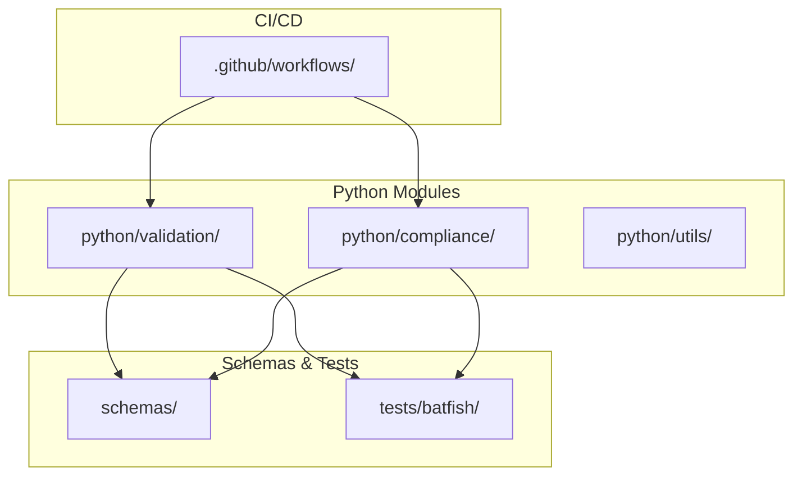
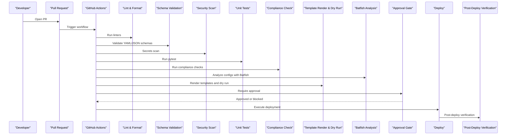
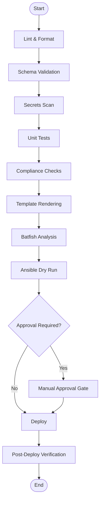
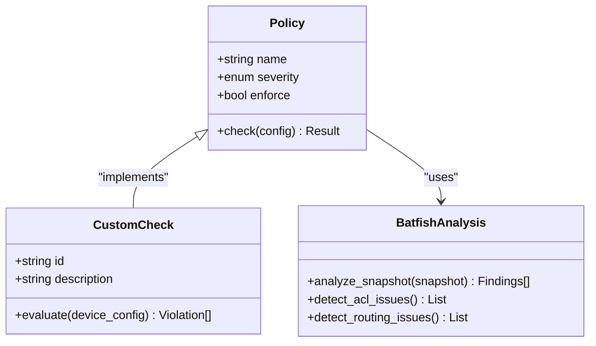
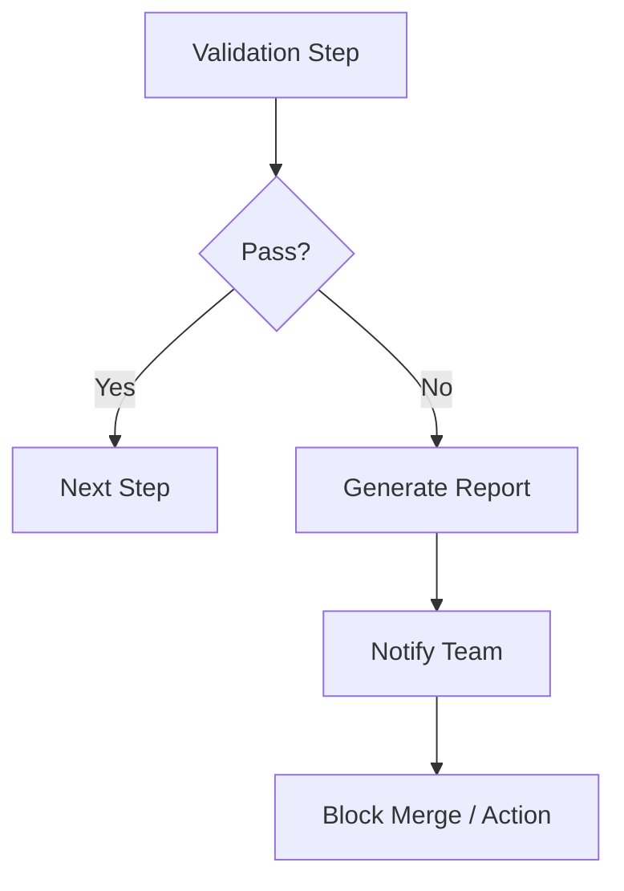
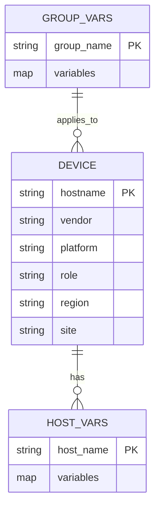
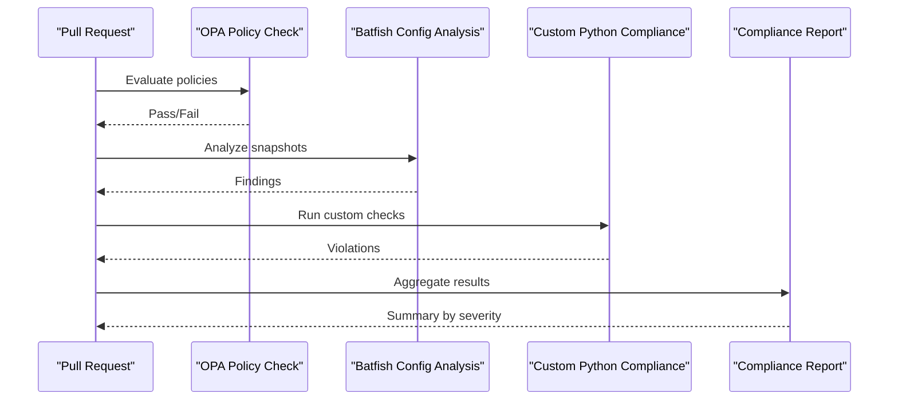
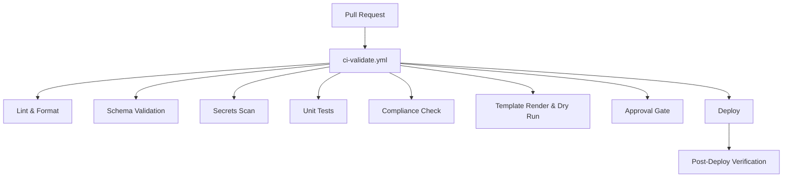
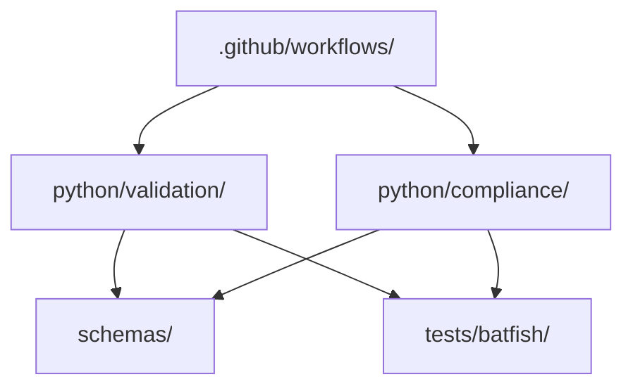

# Configuration Validation Framework

<cite>
**Referenced Files in This Document**
- [README.md](file://README.md)
</cite>

## Table of Contents
1. [Introduction](#introduction)
2. [Project Structure](#project-structure)
3. [Core Components](#core-components)
4. [Architecture Overview](#architecture-overview)
5. [Detailed Component Analysis](#detailed-component-analysis)
6. [Dependency Analysis](#dependency-analysis)
7. [Performance Considerations](#performance-considerations)
8. [Troubleshooting Guide](#troubleshooting-guide)
9. [Conclusion](#conclusion)
10. [Appendices](#appendices)

## Introduction
This document describes the configuration validation framework for pre-deployment checks, focusing on syntax and semantic validation using Batfish integration. It explains the validation pipeline architecture, rule definition patterns, error reporting mechanisms, schema definitions, compliance checks, CI/CD integration, and performance considerations for large configuration sets and parallel execution. The content is derived from the repository’s documented structure and workflows.

## Project Structure
The repository organizes Python automation modules under python/, including a dedicated validation module for pre-deployment config validation (syntax + semantics). Related directories include schemas for JSON/YAML validation, tests/batfish for network simulation, and pipelines/workflows that orchestrate validation steps.

**Diagram sources**
- [README.md:130-141](file://README.md#L130-L141)
- [README.md:171-172](file://README.md#L171-L172)
- [README.md:155-158](file://README.md#L155-L158)
- [README.md:479-514](file://README.md#L479-L514)

**Section sources**
- [README.md:130-141](file://README.md#L130-L141)
- [README.md:171-172](file://README.md#L171-L172)
- [README.md:155-158](file://README.md#L155-L158)
- [README.md:479-514](file://README.md#L479-L514)

## Core Components
- Pre-deployment validation module: Provides syntax and semantic checks prior to deployment.
- Schema validation: Uses jsonschema/cerberus to validate inventories and variables.
- Compliance engine: Pluggable rule sets with custom Python checks and OPA policies.
- Batfish integration: Network simulation for ACL, routing, and firewall rule analysis.
- CI/CD orchestration: GitHub Actions workflows trigger linting, schema validation, security scans, unit tests, compliance checks, template rendering, dry runs, and post-deploy verification.

Key responsibilities:
- Validate structured data against schemas before generating device configurations.
- Run semantic checks via Batfish to detect policy violations and reachability issues.
- Enforce compliance rules across PRs and scheduled audits.
- Report actionable errors and integrate results into CI status and notifications.

**Section sources**
- [README.md:450-456](file://README.md#L450-L456)
- [README.md:522-529](file://README.md#L522-L529)
- [README.md:548-579](file://README.md#L548-L579)
- [README.md:479-514](file://README.md#L479-L514)

## Architecture Overview
The validation pipeline integrates multiple stages to ensure correctness and compliance before deployment.

**Diagram sources**
- [README.md:479-514](file://README.md#L479-L514)
- [README.md:522-529](file://README.md#L522-L529)
- [README.md:548-579](file://README.md#L548-L579)

## Detailed Component Analysis

### Validation Pipeline Architecture
The pipeline enforces early feedback through linting, schema validation, security scanning, unit testing, compliance checks, template rendering, and dry runs. Batfish provides deep semantic analysis of generated configurations.

**Diagram sources**
- [README.md:479-514](file://README.md#L479-L514)
- [README.md:522-529](file://README.md#L522-L529)

**Section sources**
- [README.md:479-514](file://README.md#L479-L514)
- [README.md:522-529](file://README.md#L522-L529)

### Rule Definition Patterns
- Policy-level rules are defined in compliance policies and enforced by OPA and custom Python checks.
- Severity levels categorize violations (Critical, High, Medium, Low).
- Rules cover SSH-only access, NTP configuration, AAA enablement, SNMPv3 enforcement, logging, cipher standards, firmware approvals, password policies, ACL standards, firewall rule hygiene, and unused object detection.

**Diagram sources**
- [README.md:548-579](file://README.md#L548-L579)

**Section sources**
- [README.md:548-579](file://README.md#L548-L579)

### Error Reporting Mechanisms
- Failures in linting, schema validation, secrets scanning, unit tests, compliance checks, and Batfish analysis block merges and notify teams.
- Reports summarize violations by severity and provide actionable guidance.
- Post-deploy verification ensures runtime correctness and triggers rollback if needed.

[No sources needed since this diagram shows conceptual workflow, not actual code structure]

### Schema Definitions
- JSON/YAML schemas define the structure for inventories, group_vars, host_vars, and other configuration artifacts.
- Schemas are validated at every PR to prevent malformed inputs from reaching downstream stages.

**Diagram sources**
- [README.md:311-335](file://README.md#L311-L335)
- [README.md:171-172](file://README.md#L171-L172)

**Section sources**
- [README.md:311-335](file://README.md#L311-L335)
- [README.md:171-172](file://README.md#L171-L172)

### Compliance Check Implementation
- Compliance checks combine OPA policies, custom Python rules, and Batfish analyses.
- Scheduled daily scans perform comprehensive audits; PR-triggered scans enforce policies on changes.

**Diagram sources**
- [README.md:548-579](file://README.md#L548-L579)

**Section sources**
- [README.md:548-579](file://README.md#L548-L579)

### CI/CD Integration and Automated Workflows
- Workflows defined under .github/workflows orchestrate validation steps.
- Key workflows include ci-validate.yml for PR validation, compliance-scan.yml for scheduled audits, and deployment workflows with manual approval gates.

**Diagram sources**
- [README.md:479-514](file://README.md#L479-L514)

**Section sources**
- [README.md:479-514](file://README.md#L479-L514)

## Dependency Analysis
The validation framework depends on:
- Python modules for validation and compliance logic.
- Schemas for structural validation.
- Batfish for semantic analysis of network configurations.
- CI/CD workflows to orchestrate and gate deployments.

**Diagram sources**
- [README.md:130-141](file://README.md#L130-L141)
- [README.md:171-172](file://README.md#L171-L172)
- [README.md:155-158](file://README.md#L155-L158)
- [README.md:479-514](file://README.md#L479-L514)

**Section sources**
- [README.md:130-141](file://README.md#L130-L141)
- [README.md:171-172](file://README.md#L171-L172)
- [README.md:155-158](file://README.md#L155-L158)
- [README.md:479-514](file://README.md#L479-L514)

## Performance Considerations
- Parallel execution: Use pytest parallelization and concurrent workers for compliance checks and Batfish analyses to reduce total validation time.
- Incremental validation: Limit scope to changed files and affected devices to minimize overhead.
- Snapshot optimization: Reuse Batfish snapshots where possible and cache analysis results.
- Resource limits: Configure worker pools and timeouts to avoid resource exhaustion during large-scale validations.
- Batch processing: Group devices by region or role to balance load and improve throughput.

[No sources needed since this section provides general guidance]

## Troubleshooting Guide
Common issues and resolutions:
- Ansible connection timeout: Verify SSH reachability using inventory-based ping commands.
- Template rendering error: Debug Jinja2 rendering with verbose output for specific devices.
- Compliance check failure: Review compliance policies and diffs between current and target configurations.
- CI pipeline failure: Inspect GitHub Actions logs for actionable error messages.
- Vault authentication failure: Confirm OIDC token or AppRole credentials and Vault policies.
- Molecule test failure: Ensure Docker/Podman is running and review molecule configuration.
- Batfish analysis error: Validate snapshots under tests/batfish/snapshots/.

**Section sources**
- [README.md:674-685](file://README.md#L674-L685)

## Conclusion
The configuration validation framework integrates schema validation, compliance checks, and Batfish-based semantic analysis within a robust CI/CD pipeline. By enforcing policies early and providing detailed reports, it ensures safe and compliant deployments at enterprise scale. Continuous improvement areas include scaling parallel execution, optimizing snapshot reuse, and expanding automated remediation capabilities.

[No sources needed since this section summarizes without analyzing specific files]

## Appendices
- Quick start commands for local validation and compliance scans are provided in the repository documentation.
- Playbooks catalog includes compliance scanning and license validation operations.

**Section sources**
- [README.md:266-280](file://README.md#L266-L280)
- [README.md:428-434](file://README.md#L428-L434)