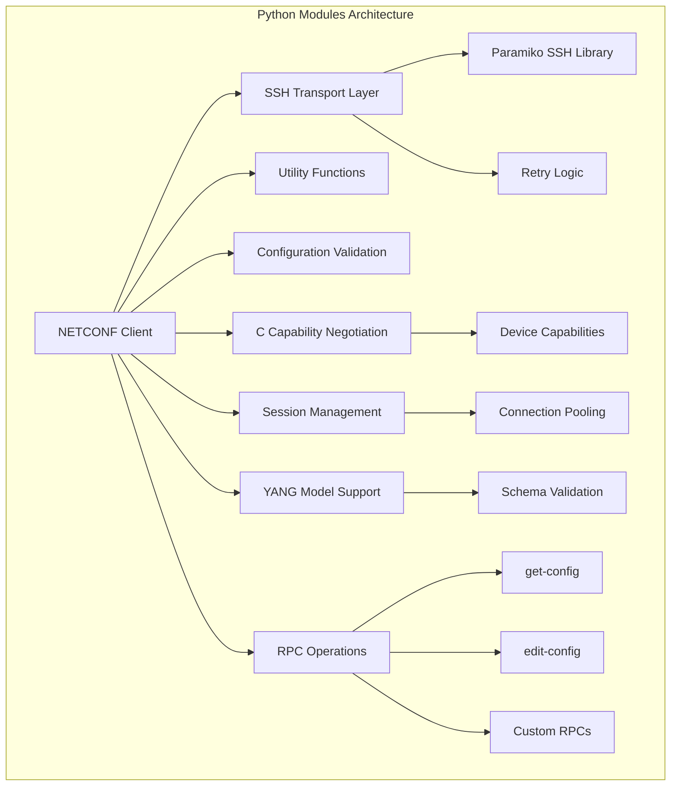
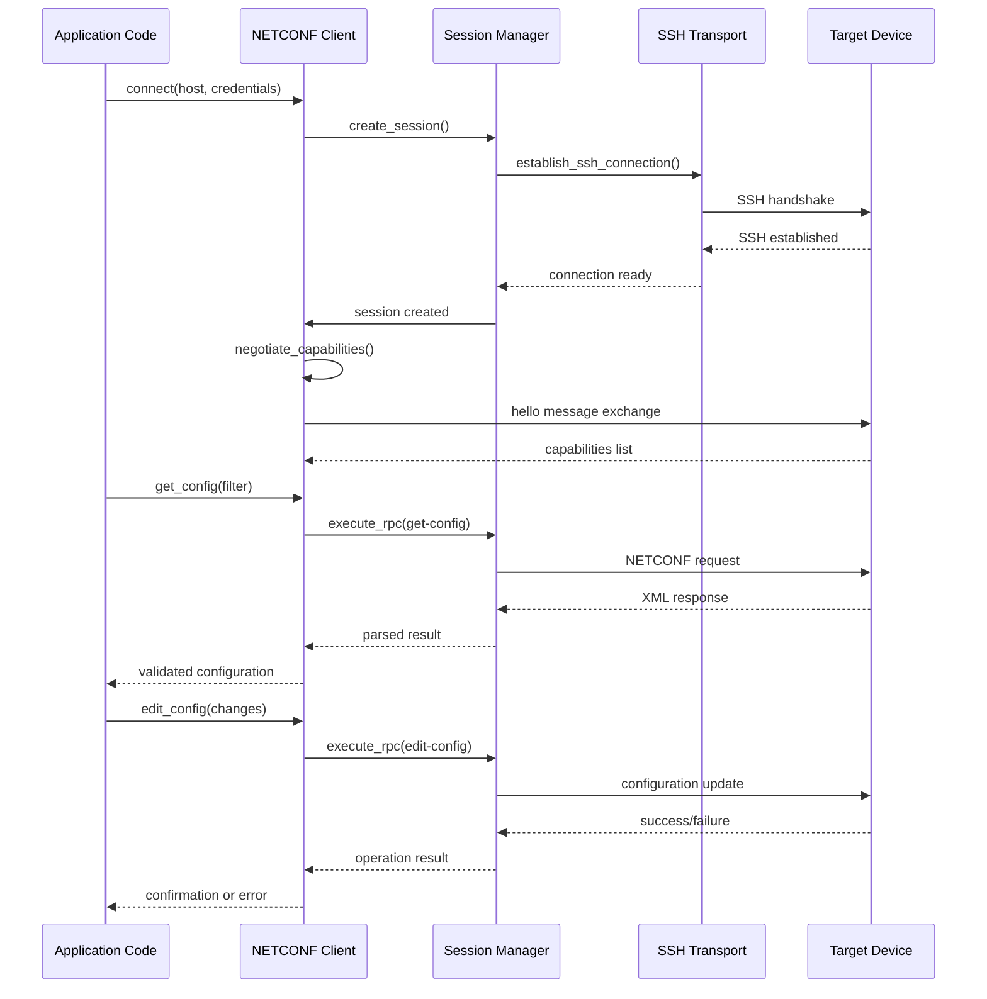
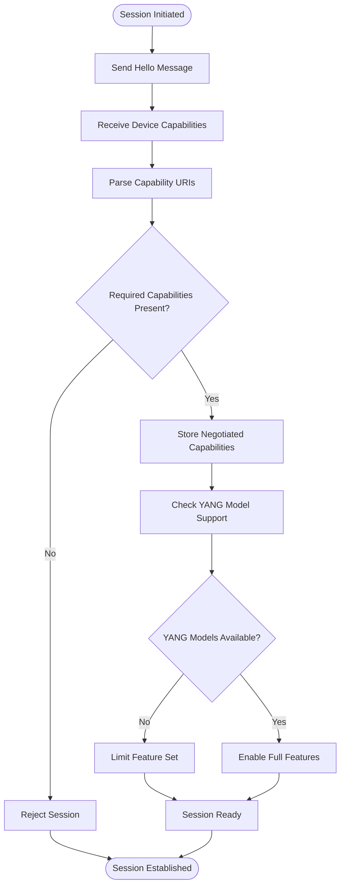
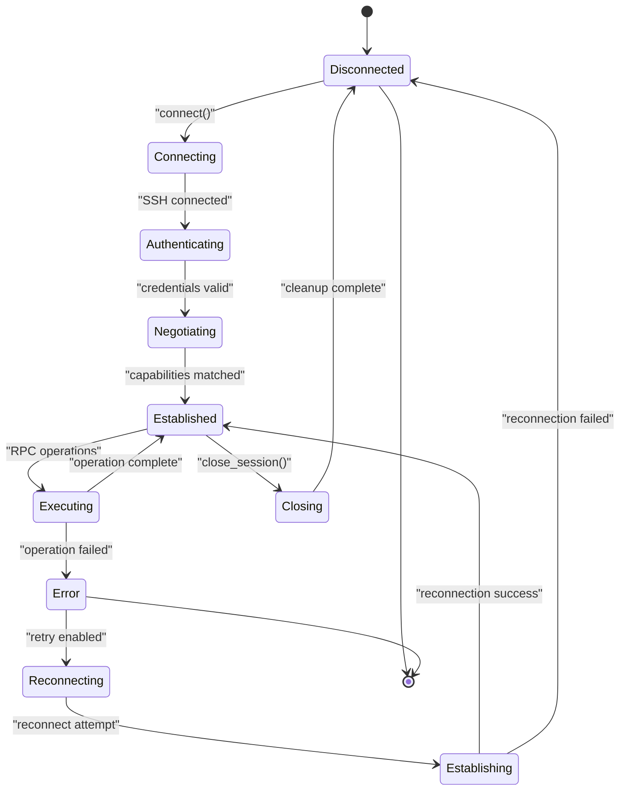
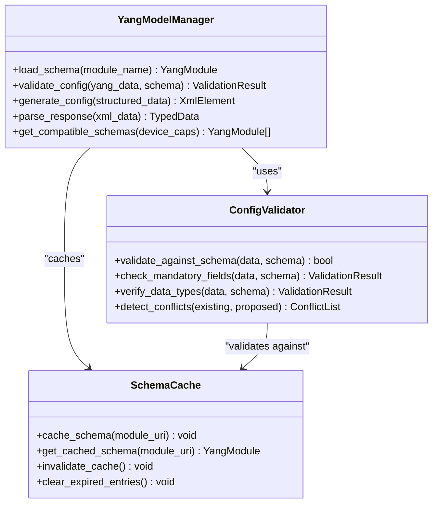
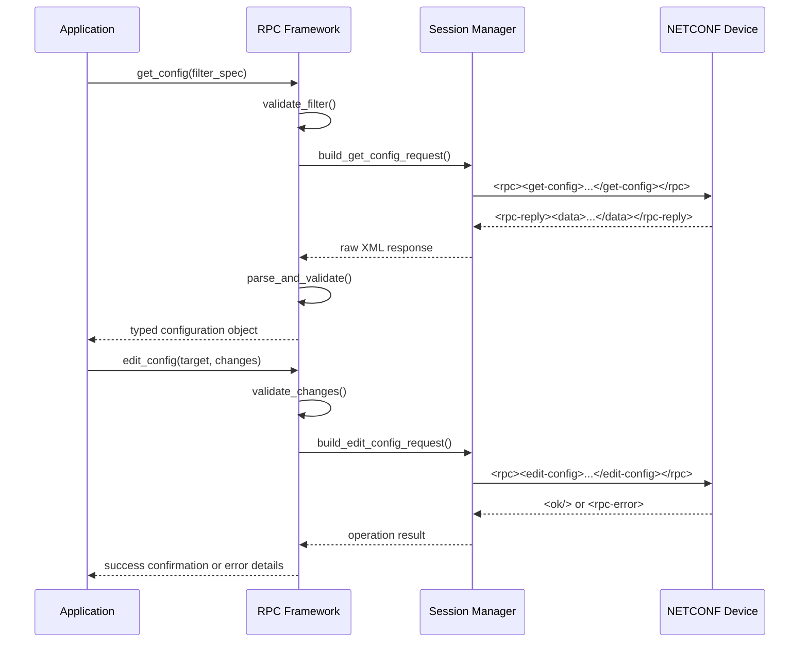
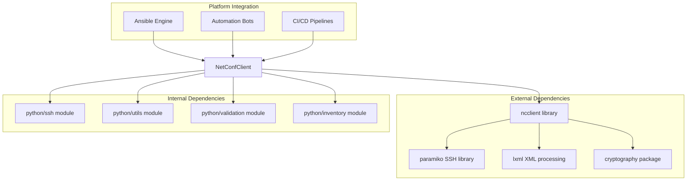

# NETCONF Client

<cite>
**Referenced Files in This Document**
- [README.md](file://README.md)
</cite>

## Table of Contents
1. [Introduction](#introduction)
2. [Project Structure](#project-structure)
3. [Core Components](#core-components)
4. [Architecture Overview](#architecture-overview)
5. [Detailed Component Analysis](#detailed-component-analysis)
6. [Dependency Analysis](#dependency-analysis)
7. [Performance Considerations](#performance-considerations)
8. [Security Considerations](#security-considerations)
9. [Troubleshooting Guide](#troubleshooting-guide)
10. [Conclusion](#conclusion)

## Introduction

The NETCONF client is a core component of the Enterprise Network Automation Platform, providing robust NETCONF protocol support for network device management. As part of the modular Python architecture, the NETCONF client implements capability negotiation, session management, YANG model support, and RPC operations with comprehensive error handling and security features.

This client enables automated configuration management, state retrieval, and operational data access across multi-vendor network devices including Cisco IOS/IOS-XE/NX-OS, Juniper SRX/MX, and Arista EOS platforms through the standardized NETCONF protocol over SSH transport.

## Project Structure

The NETCONF client follows the modular Python architecture defined in the platform's structure:

**Diagram sources**
- [README.md:438-459](file://README.md#L438-L459)

The NETCONF client integrates with the broader automation ecosystem through well-defined interfaces and follows PEP 8 standards with comprehensive type hints and documentation.

**Section sources**
- [README.md:438-459](file://README.md#L438-L459)

## Core Components

The NETCONF client implementation consists of several key components working together to provide comprehensive NETCONF functionality:

### Capability Negotiation Engine
Handles automatic discovery and validation of NETCONF capabilities supported by target devices, ensuring compatibility before establishing full sessions.

### Session Management System
Manages connection lifecycle, authentication, keep-alive mechanisms, and resource cleanup with intelligent retry logic and timeout handling.

### YANG Model Integration
Provides structured configuration management through YANG schema validation, enabling type-safe configuration operations and automated compliance checking.

### RPC Operation Framework
Implements standard NETCONF RPC operations (get-config, edit-config, get, close-session) along with custom vendor-specific extensions.

### Error Handling and Recovery
Comprehensive exception management with detailed logging, automatic retry strategies, and graceful degradation patterns.

**Section sources**
- [README.md:438-459](file://README.md#L438-L459)

## Architecture Overview

The NETCONF client follows a layered architecture pattern that separates concerns and promotes reusability:

**Diagram sources**
- [README.md:438-459](file://README.md#L438-L459)

The architecture emphasizes modularity, allowing individual components to be tested, replaced, or enhanced independently while maintaining consistent interfaces.

## Detailed Component Analysis

### Capability Negotiation Mechanism

The capability negotiation system automatically discovers and validates NETCONF capabilities during session establishment:

**Diagram sources**
- [README.md:438-459](file://README.md#L438-L459)

Key capabilities negotiated include:
- Standard NETCONF base capabilities (RFC 4741, RFC 6241)
- Candidate configuration support
- Running configuration access
- Default configuration retrieval
- Rollback-on-error functionality
- YANG model support (RFC 7950)

### Session Management and Connection Lifecycle

The session management system handles the complete lifecycle of NETCONF connections:

**Diagram sources**
- [README.md:438-459](file://README.md#L438-L459)

Session management features include:
- Automatic reconnection with exponential backoff
- Keep-alive mechanisms to prevent idle timeouts
- Resource cleanup and connection pooling
- Timeout configuration per operation type
- Graceful degradation when partial capabilities are unavailable

### YANG Model Support for Structured Configuration

The YANG integration provides type-safe configuration management:

**Diagram sources**
- [README.md:438-459](file://README.md#L438-L459)

YANG model support includes:
- Dynamic schema loading from device capabilities
- Real-time configuration validation against schemas
- Type coercion and data normalization
- Conflict detection between existing and proposed configurations
- Schema caching for performance optimization

### RPC Operations Framework

The RPC framework provides a unified interface for NETCONF operations:

**Diagram sources**
- [README.md:438-459](file://README.md#L438-L459)

Standard RPC operations implemented:
- **get-config**: Retrieve running, candidate, or startup configuration
- **edit-config**: Apply atomic configuration changes with rollback support
- **get**: Query operational data and device state
- **copy-config**: Copy configuration between targets
- **lock/unlock**: Manage configuration locks for concurrent access
- **close-session**: Gracefully terminate NETCONF sessions

## Dependency Analysis

The NETCONF client has well-defined dependencies within the platform architecture:

**Diagram sources**
- [README.md:438-459](file://README.md#L438-L459)

Key dependency relationships:
- **ncclient**: Primary NETCONF protocol implementation
- **paramiko**: SSH transport layer for secure connectivity
- **lxml**: High-performance XML parsing and manipulation
- **cryptography**: Encryption and certificate handling
- **Internal modules**: Shared utilities, validation, and inventory management

**Section sources**
- [README.md:438-459](file://README.md#L438-L459)

## Performance Considerations

The NETCONF client is optimized for enterprise-scale deployments with thousands of devices:

### Connection Pooling
- Maintains persistent connections to frequently accessed devices
- Implements connection recycling and health checks
- Supports configurable pool sizes per device group

### Batch Operations
- Aggregates multiple RPC calls into single transactions where possible
- Implements parallel execution with controlled concurrency
- Provides transaction rollback for batch failures

### Caching Strategies
- Caches device capabilities to avoid repeated negotiation
- Implements schema caching for rapid validation
- Stores recent configuration snapshots for diff operations

### Memory Management
- Streams large configuration responses instead of loading entirely into memory
- Implements garbage collection for temporary objects
- Uses efficient XML parsing with minimal overhead

## Security Considerations

The NETCONF client implements comprehensive security measures aligned with enterprise requirements:

### SSH Transport Security
- Enforces SSHv2 protocol exclusively
- Supports key-based authentication with RSA, ECDSA, and Ed25519 keys
- Implements host key verification with strict mode
- Configurable cipher suites following FIPS 140-2 guidelines

### Authentication Methods
- Password-based authentication with secure credential storage
- Public key authentication with optional passphrase protection
- Certificate-based authentication for mutual TLS scenarios
- Integration with HashiCorp Vault for dynamic credential management

### Encryption Settings
- AES-256-CBC and AES-128-GCM cipher support
- SHA-2 family hash algorithms for integrity verification
- Perfect Forward Secrecy (PFS) with ECDH key exchange
- Certificate pinning for high-security environments

### Audit and Compliance
- Comprehensive logging of all NETCONF operations
- Configuration change tracking with user attribution
- Compliance reporting for regulatory requirements
- Integration with centralized logging systems (Syslog, SIEM)

## Troubleshooting Guide

Common issues and their resolutions:

### Connection Issues
- **SSH Connection Failures**: Verify network reachability, firewall rules, and SSH service status
- **Authentication Errors**: Check credentials, key permissions, and account lockout status
- **Capability Mismatch**: Review device NETCONF support and filter incompatible features

### Performance Problems
- **Slow Configuration Updates**: Check device CPU/memory utilization and optimize configuration batches
- **Connection Timeouts**: Adjust timeout values and implement proper retry logic
- **Memory Leaks**: Monitor connection pool usage and implement proper cleanup

### Configuration Validation
- **YANG Schema Errors**: Verify schema versions and device compatibility
- **Configuration Conflicts**: Use diff tools to identify conflicting changes
- **Rollback Failures**: Ensure backup configurations are intact and accessible

**Section sources**
- [README.md:674-685](file://README.md#L674-L685)

## Conclusion

The NETCONF client implementation provides a robust, enterprise-grade solution for network device automation through the NETCONF protocol. Its modular architecture, comprehensive error handling, and security features make it suitable for large-scale deployments across multi-vendor environments. The integration with the broader automation platform enables seamless configuration management, compliance enforcement, and operational monitoring.

The client's emphasis on capability negotiation, YANG model support, and structured configuration management ensures reliable operation across diverse network equipment while maintaining the flexibility needed for evolving network architectures and requirements.