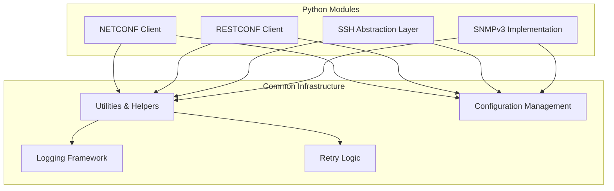
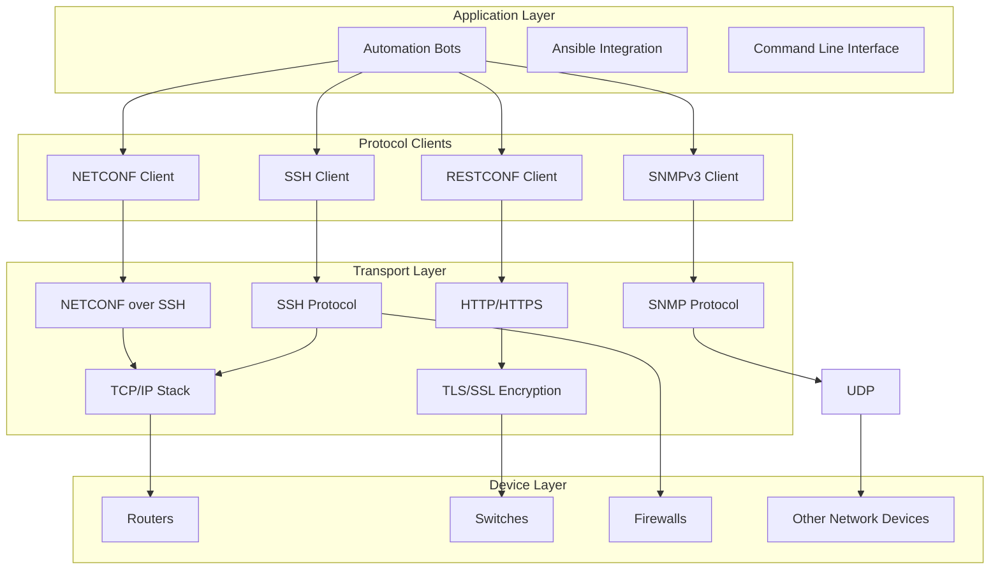
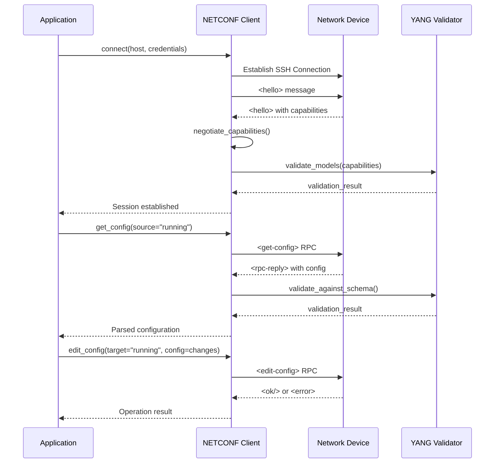
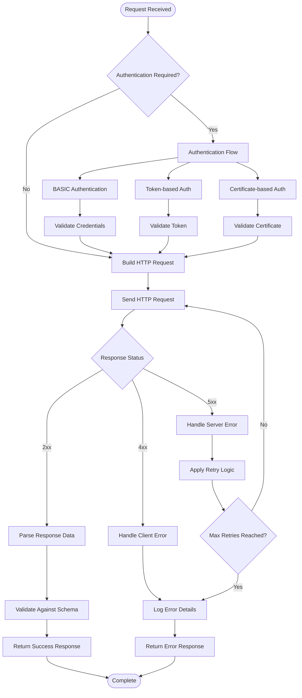
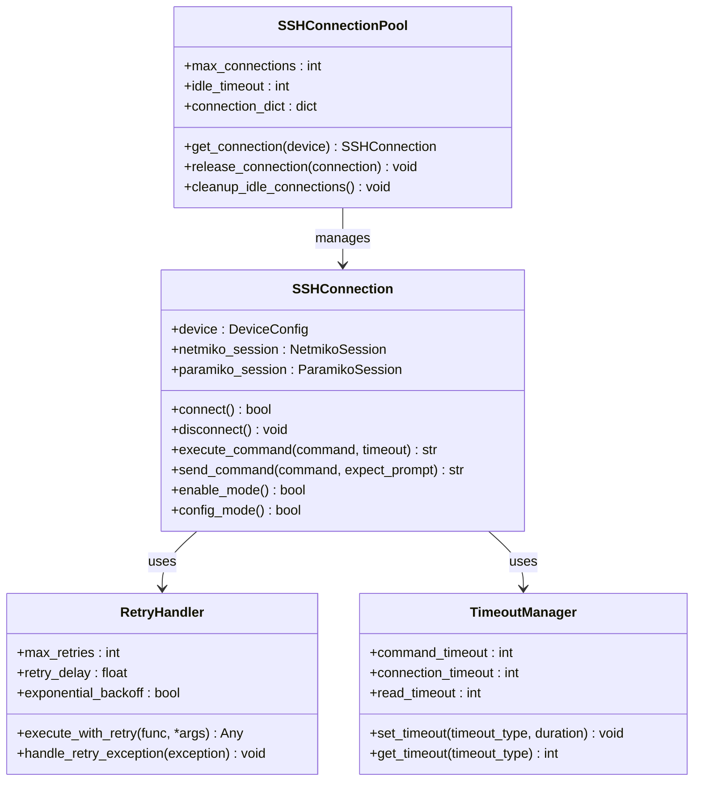
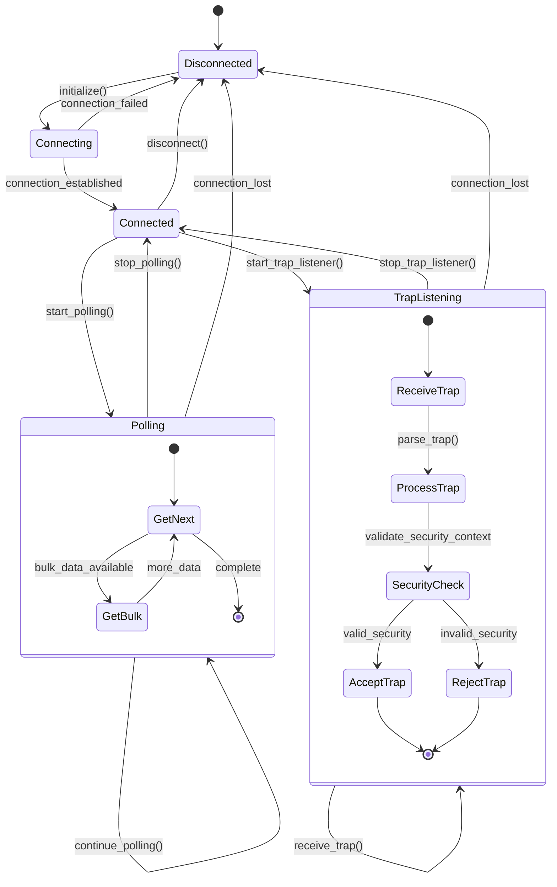
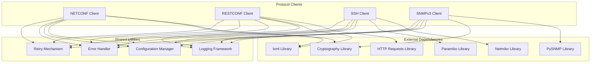

# Protocol Clients

<cite>
**Referenced Files in This Document**
- [README.md](file://README.md)
</cite>

## Table of Contents
1. [Introduction](#introduction)
2. [Project Structure](#project-structure)
3. [Core Components](#core-components)
4. [Architecture Overview](#architecture-overview)
5. [Detailed Component Analysis](#detailed-component-analysis)
6. [Dependency Analysis](#dependency-analysis)
7. [Performance Considerations](#performance-considerations)
8. [Troubleshooting Guide](#troubleshooting-guide)
9. [Conclusion](#conclusion)

## Introduction

This document provides comprehensive documentation for the protocol clients subsystem within the Enterprise Network Automation Platform. The system implements four primary protocol clients: NETCONF, RESTCONF, SSH, and SNMPv3, each designed to handle specific communication patterns with network devices across multi-vendor environments.

The protocol clients form the foundation of the automation platform, enabling configuration management, monitoring, and operational tasks through standardized interfaces. Each client is built with enterprise-grade features including connection pooling, retry logic, error handling, and security contexts.

## Project Structure

The protocol clients are organized under the `python/` directory with dedicated subdirectories for each protocol implementation:

**Diagram sources**
- [README.md:438-459](file://README.md#L438-L459)

**Section sources**
- [README.md:438-459](file://README.md#L438-L459)

## Core Components

### NETCONF Client
The NETCONF client provides capability negotiation, session management, and YANG model support for device configuration and state data retrieval. It implements RFC 6241 standards with vendor-specific extensions.

### RESTCONF Client  
The RESTCONF client handles HTTP/HTTPS communications with authentication mechanisms and comprehensive error handling patterns. It supports both XML and JSON data formats with automatic content negotiation.

### SSH Abstraction Layer
Built over Netmiko and Paramiko, this layer provides connection pooling, retry logic, timeout handling, and multi-vendor command execution capabilities with consistent interface abstraction.

### SNMPv3 Implementation
The SNMPv3 client supports polling operations and trap handling with security contexts (USM), bulk data retrieval using GetBulk requests, and comprehensive error handling for network operations.

**Section sources**
- [README.md:438-459](file://README.md#L438-L459)

## Architecture Overview

The protocol clients follow a layered architecture pattern with common utilities and shared infrastructure components:

**Diagram sources**
- [README.md:34-99](file://README.md#L34-L99)
- [README.md:438-459](file://README.md#L438-L459)

## Detailed Component Analysis

### NETCONF Client Implementation

The NETCONF client implements comprehensive capability negotiation and session management with YANG model validation:

**Diagram sources**
- [README.md:438-459](file://README.md#L438-L459)

Key features include:
- **Capability Negotiation**: Automatic discovery and validation of supported NETCONF capabilities
- **Session Management**: Persistent connections with automatic reconnection and heartbeat monitoring
- **YANG Model Support**: Schema validation for configuration and state data
- **Error Handling**: Comprehensive error mapping and recovery strategies
- **Connection Pooling**: Efficient resource management for high-throughput scenarios

### RESTCONF Client Implementation

The RESTCONF client provides robust HTTP/HTTPS handling with multiple authentication mechanisms:

**Diagram sources**
- [README.md:438-459](file://README.md#L438-L459)

Authentication mechanisms supported:
- **BASIC Authentication**: Username/password over HTTPS
- **Token-based Authentication**: JWT and OAuth2 token handling
- **Certificate-based Authentication**: Mutual TLS with client certificates
- **Session Management**: Cookie-based session persistence

### SSH Abstraction Layer

The SSH abstraction layer provides a unified interface over Netmiko and Paramiko:

**Diagram sources**
- [README.md:438-459](file://README.md#L438-L459)

Key features:
- **Connection Pooling**: Efficient reuse of SSH connections with configurable limits
- **Retry Logic**: Exponential backoff with configurable retry attempts
- **Timeout Handling**: Granular timeout control for different operation types
- **Multi-vendor Support**: Unified interface across Cisco IOS, Juniper, Arista, etc.
- **Command Execution**: Consistent command execution with output parsing

### SNMPv3 Implementation

The SNMPv3 client provides comprehensive polling and trap handling capabilities:

**Diagram sources**
- [README.md:438-459](file://README.md#L438-L459)

Security contexts supported:
- **User-based Security Model (USM)**: Authentication and privacy protocols
- **Access Control Lists**: Fine-grained access permissions per user
- **Encryption Options**: DES, 3DES, AES-128, AES-192, AES-256
- **Authentication Protocols**: MD5, SHA, SHA-96, SHA-384, SHA-512

## Dependency Analysis

The protocol clients have well-defined dependencies and interaction patterns:

**Diagram sources**
- [README.md:438-459](file://README.md#L438-L459)

**Section sources**
- [README.md:438-459](file://README.md#L438-L459)

## Performance Considerations

### Connection Management
- **Connection Pooling**: Implement connection reuse to reduce overhead
- **Keep-alive Mechanisms**: Configure appropriate keep-alive intervals
- **Resource Cleanup**: Ensure proper cleanup of connections and resources

### Error Handling and Recovery
- **Graceful Degradation**: Continue operations when partial failures occur
- **Circuit Breaker Pattern**: Prevent cascading failures in distributed systems
- **Fallback Strategies**: Implement fallback mechanisms for critical operations

### Scalability Patterns
- **Asynchronous Operations**: Use async/await patterns for I/O bound operations
- **Batch Processing**: Group similar operations to reduce connection overhead
- **Load Balancing**: Distribute requests across multiple device instances

## Troubleshooting Guide

### Common Issues and Solutions

| Issue | Symptoms | Resolution |
|-------|----------|------------|
| NETCONF Capability Mismatch | Connection fails during hello exchange | Verify device NETCONF capabilities match client expectations |
| RESTCONF Authentication Failure | 401/403 HTTP responses | Check credential format and token expiration |
| SSH Connection Timeouts | Connection establishment hangs | Verify firewall rules and device reachability |
| SNMPv3 Security Context Errors | Authentication or privacy failures | Validate username, auth/privacy passwords, and algorithms |
| Connection Pool Exhaustion | Resource allocation errors | Increase pool size or implement connection recycling |

### Debugging Techniques

1. **Enable Verbose Logging**: Configure detailed logging for all protocol operations
2. **Packet Capture**: Use Wireshark/tcpdump for protocol-level debugging
3. **Health Checks**: Implement regular connectivity and capability checks
4. **Metrics Collection**: Track connection times, error rates, and throughput

**Section sources**
- [README.md:674-685](file://README.md#L674-L685)

## Conclusion

The protocol clients subsystem provides a comprehensive foundation for network automation across multiple protocols and vendors. Each client is designed with enterprise-grade features including robust error handling, connection management, and security contexts. The modular architecture allows for easy extension and maintenance while providing consistent interfaces for higher-level automation components.

The implementation follows best practices for production network automation, including comprehensive testing, documentation, and observability integration. The system is designed to scale horizontally and handle large numbers of concurrent connections while maintaining reliability and performance.