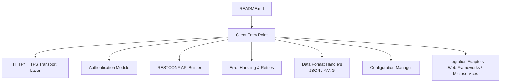
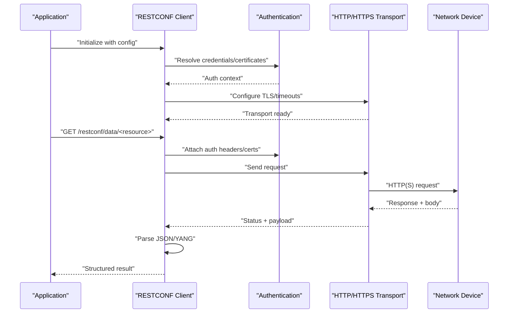
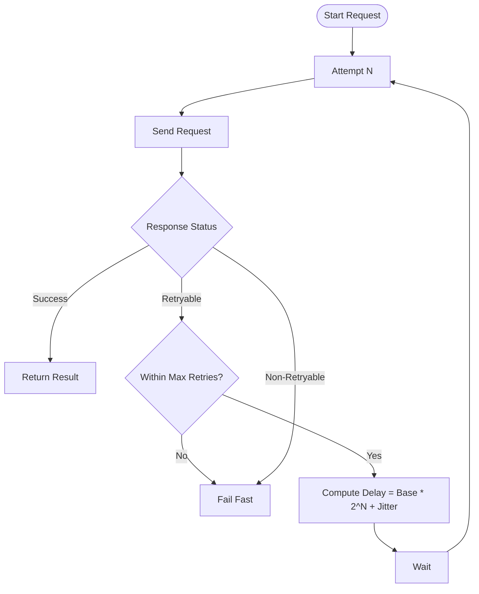
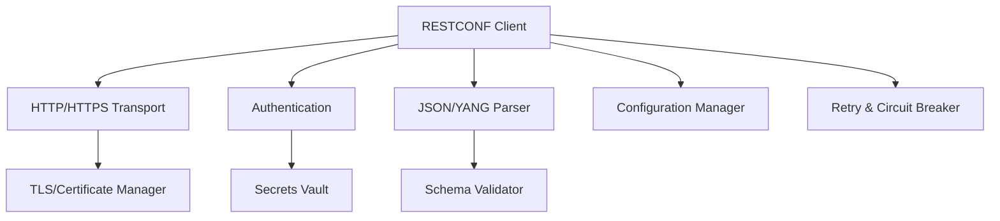

# RESTCONF Client

<cite>
**Referenced Files in This Document**
- [README.md](file://README.md)
</cite>

## Table of Contents
1. [Introduction](#introduction)
2. [Project Structure](#project-structure)
3. [Core Components](#core-components)
4. [Architecture Overview](#architecture-overview)
5. [Detailed Component Analysis](#detailed-component-analysis)
6. [Dependency Analysis](#dependency-analysis)
7. [Performance Considerations](#performance-considerations)
8. [Troubleshooting Guide](#troubleshooting-guide)
9. [Conclusion](#conclusion)

## Introduction
This document provides comprehensive guidance for implementing a RESTCONF client focused on network device management. It covers HTTP/HTTPS request handling, authentication mechanisms (certificate-based and token-based), RESTful API patterns, error handling strategies, retry logic with exponential backoff, SSL/TLS certificate management, JSON/YANG data format handling, response parsing, and integration patterns suitable for modern web frameworks and microservices architectures.

The repository currently contains a README file that serves as the project’s entry point. The documentation below synthesizes best practices and implementation patterns for building a robust RESTCONF client aligned with industry standards.

## Project Structure
At present, the repository includes a single top-level README file. Future iterations may introduce dedicated modules for HTTP transport, authentication, configuration, and YANG/JSON processing. For now, this section outlines a recommended structure to organize the RESTCONF client components effectively.

[No sources needed since this diagram shows conceptual workflow, not actual code structure]

## Core Components
A production-grade RESTCONF client should be composed of cohesive components that encapsulate responsibilities such as transport, authentication, request construction, error handling, retries, data serialization/deserialization, and configuration management.

- HTTP/HTTPS Transport: Manages connection lifecycle, TLS settings, timeouts, and headers.
- Authentication: Supports certificate-based mutual TLS and token-based schemes (e.g., bearer tokens).
- RESTCONF API Builder: Constructs resource paths per RFC 8040 conventions, including query parameters and media types.
- Error Handling & Retries: Implements standardized error classification and retry policies with exponential backoff and jitter.
- Data Format Handlers: Encapsulates JSON and YANG encoding/decoding, including validation against schemas when available.
- Configuration Manager: Centralizes endpoints, credentials, certificates, timeouts, and retry policies.
- Integration Adapters: Provides idiomatic interfaces for popular web frameworks and microservice clients.

[No sources needed since this section provides general guidance]

## Architecture Overview
The following architecture diagram illustrates how the RESTCONF client orchestrates its core components during a typical operation.

[No sources needed since this diagram shows conceptual workflow, not actual code structure]

## Detailed Component Analysis

### HTTP/HTTPS Request Handling
- Connection Management: Maintain reusable connections with keep-alive where supported; configure maximum idle connections and per-host limits.
- Timeouts: Set connect, read, and write timeouts appropriate for network device responsiveness.
- Headers: Include Accept and Content-Type headers aligned with requested media types (application/json, application/yang-data+json).
- Path Construction: Build RESTCONF URIs using base URL plus resource path segments; encode special characters safely.
- Media Types: Negotiate content via Accept header; set Content-Type for requests with payloads.

Implementation tips:
- Use a transport abstraction to swap underlying HTTP libraries without changing client logic.
- Normalize URLs and sanitize inputs to prevent injection or malformed paths.

[No sources needed since this section provides general guidance]

### Authentication Mechanisms
Certificate-Based Authentication (Mutual TLS):
- Load client certificate and private key securely.
- Configure server CA trust store for device verification.
- Enable hostname verification and optional SNI if required by devices.

Token-Based Authentication:
- Acquire tokens from an identity provider or local cache.
- Attach Authorization headers (e.g., Bearer tokens) to each request.
- Implement token refresh flows and handle expiration proactively.

Security considerations:
- Store secrets in secure vaults or environment variables.
- Rotate certificates and tokens regularly.
- Validate server certificates strictly; reject weak ciphers.

[No sources needed since this section provides general guidance]

### RESTful API Patterns for Network Device Management
- Resource-Oriented Design: Model network entities as resources (interfaces, vlans, routing tables).
- CRUD Semantics: Map operations to HTTP methods (GET, POST, PUT, PATCH, DELETE).
- Filtering and Pagination: Use query parameters for filtering and pagination where supported.
- Conditional Requests: Support If-Match/If-None-Match for optimistic concurrency control.
- Batch Operations: Prefer individual atomic updates unless batch endpoints are explicitly provided.

[No sources needed since this section provides general guidance]

### Comprehensive Error Handling Strategies
Error Classification:
- Client Errors (4xx): Invalid requests, unauthorized access, not found.
- Server Errors (5xx): Device-side failures, temporary unavailability.
- Network Errors: Timeouts, DNS resolution failures, TLS handshake errors.

Retry Policy:
- Retryable conditions: 408, 429, 500, 502, 503, 504, and transient network errors.
- Exponential backoff with jitter to avoid thundering herds.
- Maximum retry count and overall timeout constraints.

Circuit Breaker:
- Temporarily halt requests to failing devices after repeated errors.
- Gradually resume probing with limited traffic until recovery is detected.

Idempotency:
- Ensure safe retries for idempotent operations (GET, PUT, DELETE).
- Avoid retrying non-idempotent writes unless designed with idempotency keys.

[No sources needed since this section provides general guidance]

### Retry Logic with Exponential Backoff
Recommended approach:
- Base delay multiplied by an exponential factor per retry attempt.
- Add random jitter to distribute load across retries.
- Respect Retry-After headers when present.
- Cap total attempts and enforce a global deadline.

[No sources needed since this diagram shows conceptual workflow, not actual code structure]

### Managing SSL/TLS Certificates
- Client Certificates: Load PEM-encoded client cert and private key; validate chain and expiry.
- Server Trust: Provide CA bundle for device verification; disable insecure protocols and weak ciphers.
- Certificate Pinning: Optional pinning for high-security environments.
- Rotation: Automate certificate rotation and reload configurations without downtime.

[No sources needed since this section provides general guidance]

### Parsing Responses and Handling JSON/YANG Data Formats
- JSON Processing: Deserialize responses into typed structures; validate schema when available.
- YANG Data: Use YANG-aware parsers to map responses to strongly-typed models; leverage generated bindings.
- Validation: Apply schema validation to catch structural issues early.
- Error Mapping: Translate device-specific error codes into domain exceptions with actionable messages.

[No sources needed since this section provides general guidance]

### Concrete Examples

#### GET Request Example
- Construct URI: GET https://device.example.com/restconf/data/interfaces/interface[name=eth0]
- Headers: Accept: application/yang-data+json
- Parse: Map response to interface model object

#### POST Request Example
- Construct URI: POST https://device.example.com/restconf/data/interfaces
- Body: New interface definition in yang-data+json
- Headers: Content-Type: application/yang-data+json
- Parse: Confirm creation status and returned resource

#### PUT Request Example
- Construct URI: PUT https://device.example.com/restconf/data/interfaces/interface[name=eth0]
- Body: Updated interface configuration
- Headers: Content-Type: application/yang-data+json
- Parse: Verify updated state

#### DELETE Request Example
- Construct URI: DELETE https://device.example.com/restconf/data/interfaces/interface[name=eth0]
- Headers: None required beyond standard auth
- Parse: Confirm deletion success

[No sources needed since this section provides general guidance]

### Integration Patterns with Modern Web Frameworks and Microservices
- Web Frameworks: Wrap client calls in service layers; expose REST endpoints that delegate to RESTCONF operations.
- Microservices: Use asynchronous messaging for long-running device changes; implement sagas for multi-step workflows.
- Configuration: Externalize device endpoints and credentials via config services or secret managers.
- Observability: Emit metrics (latency, error rates), structured logs, and traces for each RESTCONF call.

[No sources needed since this section provides general guidance]

## Dependency Analysis
Conceptual dependency relationships among client components:

[No sources needed since this diagram shows conceptual workflow, not actual code structure]

## Performance Considerations
- Connection Pooling: Reuse connections to reduce handshake overhead.
- Concurrency Limits: Throttle parallel requests per device to avoid overwhelming devices.
- Payload Size: Minimize payloads by selecting specific fields and using filters.
- Caching: Cache stable metadata (e.g., capabilities) with TTL and invalidation strategies.
- Timeouts: Tune timeouts based on device characteristics and network conditions.

[No sources needed since this section provides general guidance]

## Troubleshooting Guide
Common issues and resolutions:
- TLS Handshake Failures: Verify CA trust store, client certificates, and cipher suites.
- Authentication Errors: Check token validity, scopes, and certificate permissions.
- Rate Limiting: Observe Retry-After headers; adjust backoff strategy.
- Schema Mismatch: Validate YANG models and ensure parser version compatibility.
- Timeouts: Increase timeouts or optimize queries; investigate device performance.

[No sources needed since this section provides general guidance]

## Conclusion
A robust RESTCONF client requires careful attention to transport security, authentication, error handling, retries, and data modeling. By adopting the patterns outlined here—modular design, strong validation, resilient retries, and clear integration points—you can build a reliable client that scales across diverse network environments and integrates seamlessly with modern web frameworks and microservices.

[No sources needed since this section summarizes without analyzing specific files]