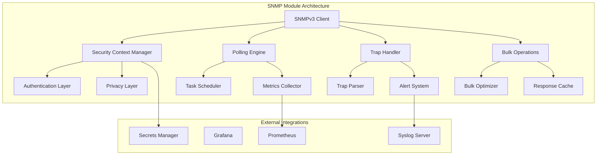
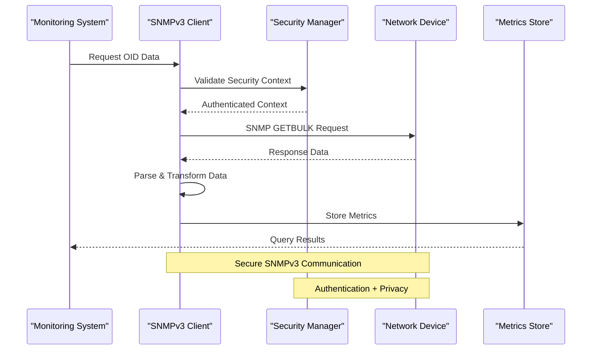
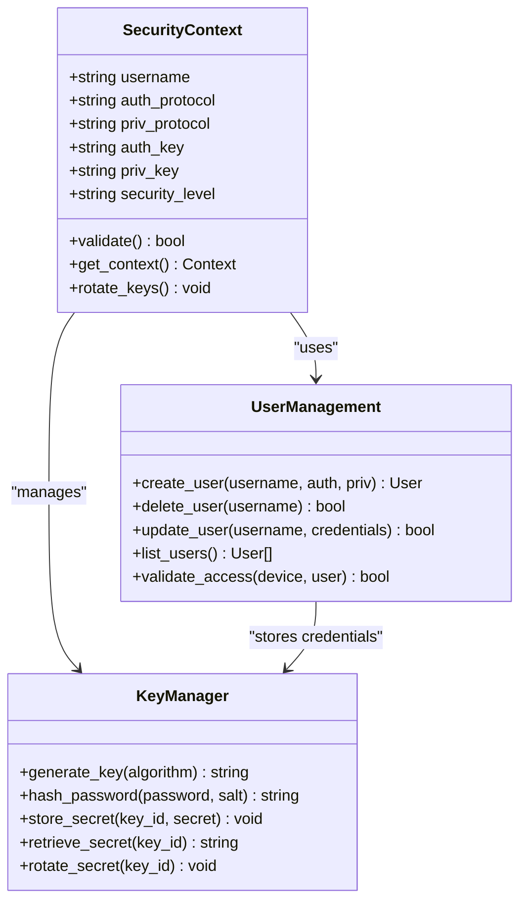
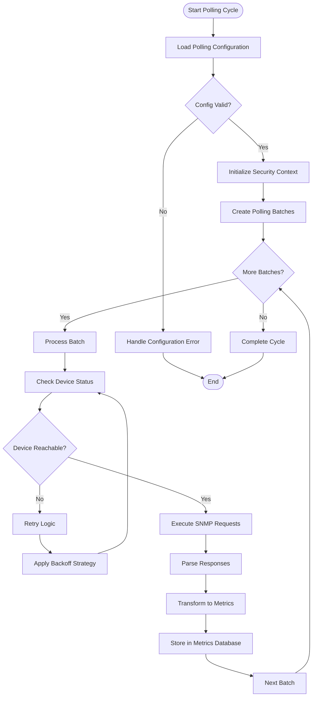
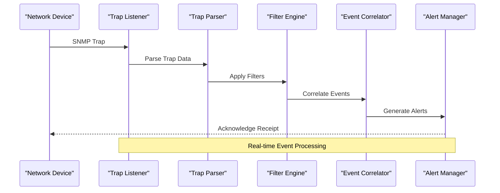
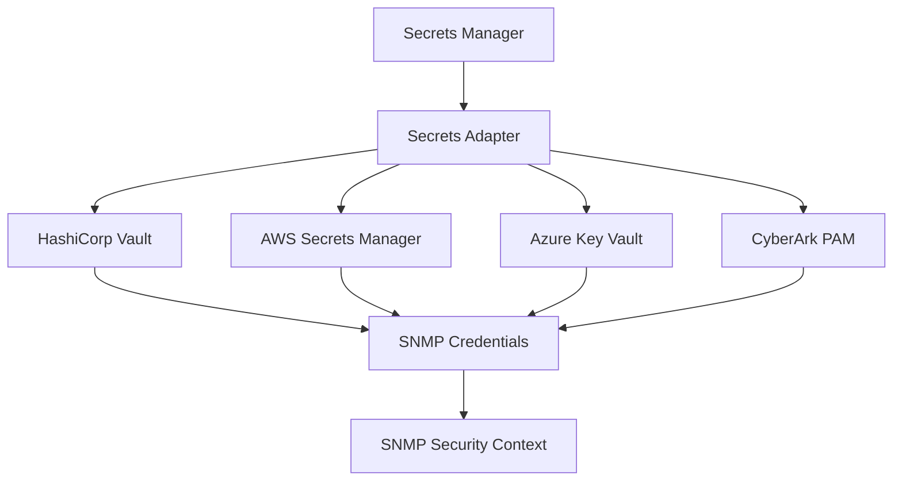
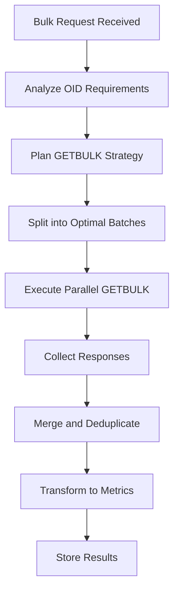
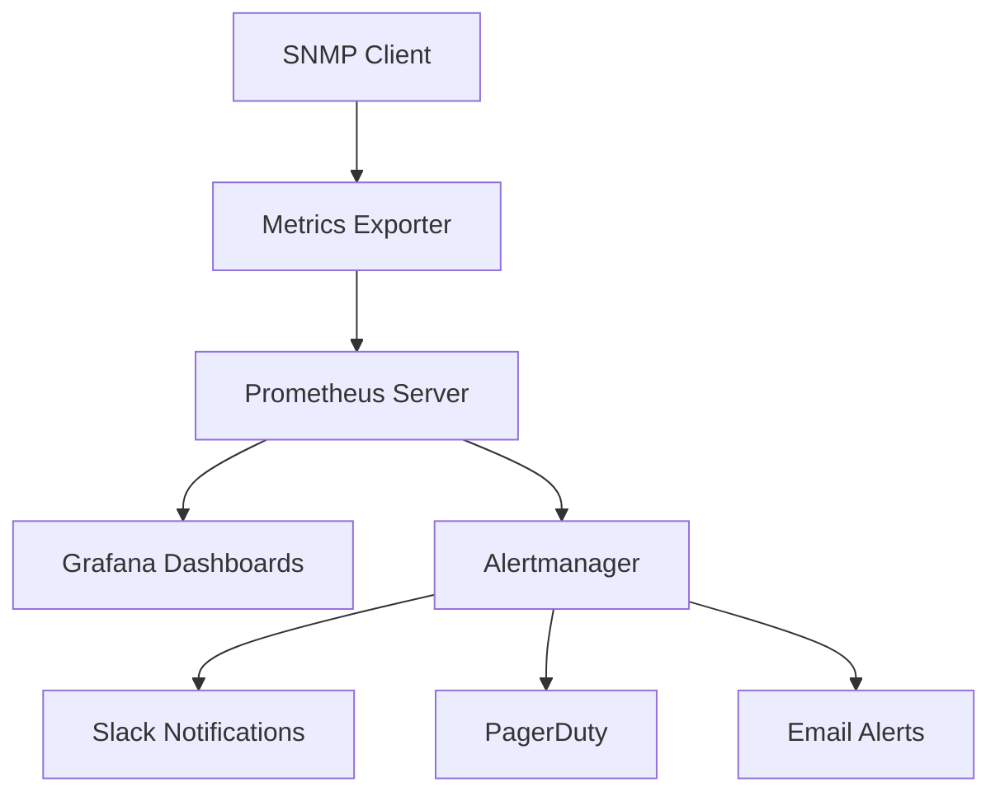
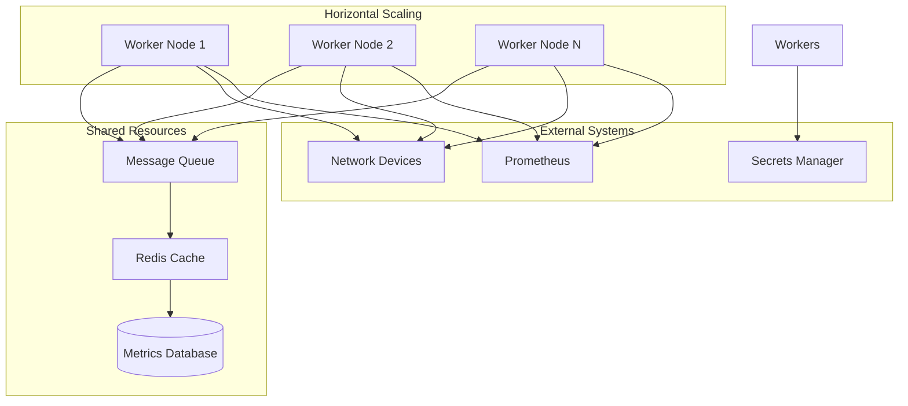

# SNMP Client

<cite>
**Referenced Files in This Document**
- [README.md](file://README.md)
</cite>

## Table of Contents
1. [Introduction](#introduction)
2. [Project Structure](#project-structure)
3. [Core Components](#core-components)
4. [Architecture Overview](#architecture-overview)
5. [Detailed Component Analysis](#detailed-component-analysis)
6. [Security Contexts and Authentication](#security-contexts-and-authentication)
7. [Polling Operations](#polling-operations)
8. [Trap Handling](#trap-handling)
9. [Bulk Data Retrieval](#bulk-data-retrieval)
10. [Configuration Management](#configuration-management)
11. [Integration with Monitoring Systems](#integration-with-monitoring-systems)
12. [Performance Considerations](#performance-considerations)
13. [Troubleshooting Guide](#troubleshooting-guide)
14. [Conclusion](#conclusion)

## Introduction

The Enterprise Network Automation Platform includes a comprehensive SNMPv3 client implementation designed for production-grade network monitoring and device management across multi-vendor environments. This system provides secure, efficient, and scalable SNMP operations including polling, trap handling, bulk data retrieval, and integration with modern monitoring stacks like Prometheus and Grafana.

The SNMPv3 implementation follows enterprise security best practices, enforcing authentication and privacy protocols while supporting high-throughput monitoring scenarios typical of Fortune 100 organizations managing thousands of network devices.

## Project Structure

The SNMP client is part of a modular Python architecture under the `python/snmp/` directory, designed as a reusable component within the broader network automation ecosystem. The implementation integrates seamlessly with Ansible playbooks, compliance checking systems, and monitoring infrastructure.



**Diagram sources**
- [README.md:447](file://README.md#L447)
- [README.md:588](file://README.md#L588)

**Section sources**
- [README.md:134](file://README.md#L134)
- [README.md:447](file://README.md#L447)

## Core Components

The SNMPv3 client implementation consists of several core components working together to provide comprehensive network monitoring capabilities:

### SNMPv3 Client Engine
The primary client engine handles all SNMP protocol operations with support for GET, GETNEXT, GETBULK, SET, and TRAP operations. It manages connection pooling, retry logic, and error handling for reliable network communication.

### Security Context Manager
Manages SNMPv3 security contexts including user profiles, authentication protocols (MD5, SHA), privacy protocols (DES, AES), and access control lists. Integrates with enterprise secrets managers for secure credential storage.

### Polling Engine
Implements continuous polling loops with configurable intervals, batch processing, and intelligent backoff strategies. Supports both synchronous and asynchronous polling patterns for different monitoring scenarios.

### Trap Handler
Processes incoming SNMP traps and notifications with parsing, filtering, correlation, and alerting capabilities. Supports multiple trap formats and vendor-specific extensions.

### Bulk Operations Manager
Optimizes large-scale data collection through GETBULK operations, response caching, and parallel processing to minimize network overhead and improve performance.

**Section sources**
- [README.md:447](file://README.md#L447)
- [README.md:189](file://README.md#L189)

## Architecture Overview

The SNMPv3 client follows a layered architecture pattern with clear separation of concerns, enabling scalability, maintainability, and testability across enterprise deployments.



**Diagram sources**
- [README.md:588](file://README.md#L588)
- [README.md:592](file://README.md#L592)

The architecture supports multiple deployment patterns:
- **Centralized**: Single instance polling all devices
- **Distributed**: Multiple instances across regions for low-latency access
- **Hybrid**: Combination approach with regional collectors and central aggregation

## Detailed Component Analysis

### SNMPv3 Security Context Manager

The security context manager implements comprehensive SNMPv3 security features including user-based security model (USM) with support for various authentication and encryption algorithms.



**Diagram sources**
- [README.md:340](file://README.md#L340)
- [README.md:359](file://README.md#L359)

### Polling Engine Implementation

The polling engine provides robust, configurable polling capabilities with support for various monitoring scenarios and performance optimizations.



**Diagram sources**
- [README.md:588](file://README.md#L588)

### Trap Handler Architecture

The trap handler processes incoming SNMP notifications with advanced filtering, parsing, and alerting capabilities.



**Diagram sources**
- [README.md:588](file://README.md#L588)

**Section sources**
- [README.md:447](file://README.md#L447)
- [README.md:588](file://README.md#L588)

## Security Contexts and Authentication

The SNMPv3 implementation enforces strict security policies aligned with enterprise compliance requirements, ensuring no legacy SNMPv1/v2c usage and mandatory authentication and privacy protocols.

### Supported Security Levels

| Security Level | Authentication | Privacy | Use Case |
|---|---|---|---|
| noAuthNoPriv | None | None | Development only (deprecated) |
| authNoPriv | MD5/SHA | None | Internal networks with trusted hosts |
| authPriv | MD5/SHA | DES/AES | Production environments (recommended) |

### Authentication Protocols

- **MD5**: Message Digest 5 for authentication (legacy support)
- **SHA**: Secure Hash Algorithm for enhanced security
- **SHA-256/384/512**: Advanced hash functions for high-security environments

### Privacy Protocols

- **DES**: Data Encryption Standard (legacy, minimum 8-byte keys)
- **AES-128**: Advanced Encryption Standard with 128-bit keys
- **AES-192**: Enhanced AES with 192-bit keys
- **AES-256**: Maximum security with 256-bit keys

### Secret Management Integration

The system integrates with multiple secrets management solutions:



**Diagram sources**
- [README.md:344](file://README.md#L344)

**Section sources**
- [README.md:558](file://README.md#L558)
- [README.md:340](file://README.md#L340)

## Polling Operations

The polling engine supports various operational modes optimized for different monitoring scenarios and performance requirements.

### Continuous Polling Configuration

Continuous polling operations are configured through YAML definitions with support for dynamic updates without service restart:

```yaml
polling_config:
  global:
    timeout: 5
    retries: 3
    max_concurrent: 100
    batch_size: 50
  
  schedules:
    health_check:
      interval: 60
      enabled: true
      targets:
        - type: "all_devices"
          oid_groups: ["system", "interfaces", "cpu", "memory"]
    
    performance_monitoring:
      interval: 300
      enabled: true
      targets:
        - type: "critical_devices"
          oid_groups: ["performance_metrics", "error_rates", "utilization"]
    
    compliance_check:
      interval: 3600
      enabled: true
      targets:
        - type: "all_devices"
          oid_groups: ["compliance_indicators"]
```

### OID Group Management

OID groups organize related metrics for efficient polling and logical grouping:

| OID Group | Description | Update Frequency | Priority |
|---|---|---|---|
| system | System information and status | Every 5 minutes | High |
| interfaces | Interface statistics and counters | Every minute | Critical |
| cpu | CPU utilization and load averages | Every minute | Critical |
| memory | Memory usage and availability | Every minute | Critical |
| performance_metrics | Performance indicators | Every 5 minutes | Medium |
| error_rates | Error and warning counters | Every minute | High |
| compliance_indicators | Compliance check OIDs | Every hour | Low |

### Polling Strategies

The system implements multiple polling strategies:

1. **Sequential Polling**: Processes devices one at a time for predictable resource usage
2. **Parallel Polling**: Concurrent device polling with configurable limits
3. **Batch Polling**: Groups multiple OIDs per request for efficiency
4. **Adaptive Polling**: Dynamically adjusts frequency based on device responsiveness

**Section sources**
- [README.md:588](file://README.md#L588)

## Trap Handling

The trap handling system provides real-time event processing with advanced filtering, correlation, and alerting capabilities for proactive network monitoring.

### Trap Listener Configuration

```yaml
trap_listener:
  bind_address: "0.0.0.0"
  port: 162
  security_contexts:
    - name: "monitoring_traps"
      username: "trap_receiver"
      auth_protocol: "SHA"
      priv_protocol: "AES-256"
      auth_key: "vault:snmp/trap_auth_key"
      priv_key: "vault:snmp/trap_priv_key"
  
  filters:
    critical_events:
      severity: "critical"
      action: "immediate_alert"
    warning_events:
      severity: "warning"
      action: "queue_and_notify"
    informational:
      severity: "informational"
      action: "log_only"
  
  correlation:
    window: 300
    group_by: ["device_ip", "event_type"]
    deduplication: true
```

### Trap Processing Pipeline

The trap processing pipeline handles multiple stages from reception to alert generation:

1. **Reception**: Accepts SNMP traps on configured ports with security validation
2. **Parsing**: Converts raw trap data into structured event objects
3. **Filtering**: Applies rule-based filtering to reduce noise
4. **Correlation**: Groups related events and detects patterns
5. **Enrichment**: Adds contextual information from CMDB and configuration databases
6. **Alerting**: Generates alerts through multiple channels (Slack, PagerDuty, email)

### Vendor-Specific Trap Support

The system includes built-in parsers for major vendors:

| Vendor | Trap Types | Custom Extensions |
|---|---|---|
| Cisco IOS/IOS-XE | Link state, CPU thresholds, memory warnings | BGP session changes, interface errors |
| Juniper Junos | Interface flapping, routing table changes | Chassis failures, power supply issues |
| Arista EOS | Port security violations, temperature alerts | Fabric connectivity issues |
| Palo Alto PAN-OS | Session limits, license expirations | Threat detection events |

**Section sources**
- [README.md:588](file://README.md#L588)

## Bulk Data Retrieval

The bulk operations system optimizes large-scale data collection using SNMP GETBULK requests for maximum efficiency in monitoring scenarios.

### GETBULK Optimization

GETBULK operations significantly reduce network overhead by retrieving multiple variable bindings in a single request:



**Diagram sources**
- [README.md:588](file://README.md#L588)

### Performance Tuning Parameters

| Parameter | Default | Range | Description |
|---|---|---|---|
| max_repetitions | 10 | 1-100 | Number of OIDs per GETBULK request |
| concurrent_requests | 50 | 1-200 | Maximum simultaneous device connections |
| batch_size | 100 | 10-1000 | OIDs per batch operation |
| timeout_per_device | 5 | 1-30 | Seconds before device timeout |
| retry_attempts | 3 | 0-10 | Number of retry attempts |
| cache_ttl | 300 | 60-3600 | Response cache lifetime in seconds |

### Bulk Operation Patterns

The system supports several bulk operation patterns:

1. **Interface Statistics**: Retrieve all interface counters efficiently
2. **System Information**: Gather comprehensive device metadata
3. **Performance Metrics**: Collect time-series performance data
4. **Compliance Checks**: Verify multiple compliance indicators simultaneously

**Section sources**
- [README.md:588](file://README.md#L588)

## Configuration Management

The SNMP client configuration is managed through a combination of YAML files, environment variables, and secrets management integration.

### Device Configuration Schema

```yaml
device_snmp_config:
  snmp_version: "3"
  security_profile: "production_secure"
  polling_enabled: true
  trap_reception_enabled: true
  
  security_context:
    username: "monitoring_user"
    auth_protocol: "SHA-256"
    priv_protocol: "AES-256"
    auth_key_source: "vault:snmp/devices/auth_key"
    priv_key_source: "vault:snmp/devices/priv_key"
    security_level: "authPriv"
  
  access_control:
    allowed_networks:
      - "10.0.0.0/8"
      - "172.16.0.0/12"
      - "192.168.0.0/16"
    ro_community: "restricted_readonly"
    rw_community: "none"
  
  polling_settings:
    timeout: 5
    retries: 3
    max_oid_count: 100
    bulk_max_repetitions: 50
```

### Environment Variables

| Variable | Description | Example | Required |
|---|---|---|---|
| SNMP_VAULT_ADDR | HashiCorp Vault address | "https://vault.internal:8200" | Yes |
| SNMP_VAULT_TOKEN | Vault authentication token | "hvs.CAES..." | Yes |
| SNMP_POLLING_INTERVAL | Default polling interval | "60" | No |
| SNMP_MAX_CONCURRENT | Maximum concurrent connections | "100" | No |
| SNMP_LOG_LEVEL | Logging verbosity | "INFO" | No |

### Dynamic Configuration Updates

The system supports runtime configuration updates without service interruption:

- **Hot Reload**: Configuration changes applied immediately
- **Validation**: Pre-deployment validation of new configurations
- **Rollback**: Automatic rollback on configuration errors
- **Audit Trail**: Complete change history with user attribution

**Section sources**
- [README.md:340](file://README.md#L340)

## Integration with Monitoring Systems

The SNMP client integrates seamlessly with enterprise monitoring and alerting frameworks through standardized protocols and APIs.

### Prometheus Integration

The system exports metrics in Prometheus format for scraping and visualization:



**Diagram sources**
- [README.md:588](file://README.md#L588)
- [README.md:592](file://README.md#L592)

### OpenTelemetry Support

For advanced observability, the system supports OpenTelemetry for distributed tracing and metrics collection:

- **Tracing**: Full request lifecycle tracking across components
- **Metrics**: Structured metrics with labels and dimensions
- **Logs**: Centralized log aggregation with correlation IDs
- **Profiling**: Performance profiling and bottleneck identification

### Alerting Framework Integration

Multiple alerting channels are supported for comprehensive notification coverage:

| Channel | Configuration | Use Case |
|---|---|---|
| Slack | Webhook URL, channel name | Team notifications, chatops |
| PagerDuty | API key, service ID | Critical incidents, on-call escalation |
| Email | SMTP settings, recipient list | Audit trails, compliance reporting |
| Microsoft Teams | Incoming webhook URL | Enterprise team collaboration |
| Webhook | Custom endpoint URL | Integration with custom systems |

### Dashboard Templates

Pre-built Grafana dashboards provide immediate visibility into network health and automation metrics:

- **Network Health Overview**: Device status, uptime, and critical metrics
- **Automation Performance**: Job success rates, execution times, and error trends
- **Compliance Status**: Policy violations and remediation progress
- **Resource Utilization**: CPU, memory, and network usage patterns

**Section sources**
- [README.md:588](file://README.md#L588)
- [README.md:592](file://README.md#L592)

## Performance Considerations

The SNMP client is designed for high-performance operation in large-scale enterprise environments with thousands of devices.

### Scalability Architecture



### Resource Optimization

Key performance optimization strategies:

1. **Connection Pooling**: Reuse TCP connections to reduce overhead
2. **Request Batching**: Combine multiple OIDs into single requests
3. **Response Caching**: Cache frequently accessed data with TTL
4. **Asynchronous Processing**: Non-blocking I/O for high throughput
5. **Memory Management**: Efficient data structures and garbage collection tuning

### Monitoring and Profiling

Built-in performance monitoring tracks:

- Request latency percentiles (p50, p95, p99)
- Connection pool utilization
- Memory usage patterns
- CPU consumption per worker
- Error rates and failure patterns

**Section sources**
- [README.md:588](file://README.md#L588)

## Troubleshooting Guide

Common issues and their resolutions for SNMP client operations:

### Connection Issues

| Issue | Symptoms | Resolution |
|---|---|---|
| Authentication Failure | Timeout or auth error messages | Verify SNMPv3 credentials and security levels |
| Network Connectivity | Connection timeouts | Check firewall rules and network reachability |
| Permission Denied | Access denied errors | Verify community strings and access control lists |
| Protocol Mismatch | Version negotiation failures | Ensure SNMP version compatibility |

### Performance Problems

| Issue | Symptoms | Resolution |
|---|---|---|
| Slow Polling | High latency in metric collection | Increase batch size and concurrent connections |
| Memory Leaks | Gradual memory increase | Restart workers and investigate object retention |
| CPU Spikes | High CPU utilization during polling | Reduce polling frequency or optimize OID queries |
| Connection Exhaustion | Too many open connections | Tune connection pool settings and timeouts |

### Trap Processing Issues

| Issue | Symptoms | Resolution |
|---|---|---|
| Missing Traps | No trap reception | Verify trap listener port and security configuration |
| Parsing Errors | Invalid trap format | Update trap parsers and validate trap format |
| Duplicate Events | Same trap processed multiple times | Enable deduplication and adjust correlation windows |
| Alert Storms | Excessive alert volume | Implement rate limiting and event correlation |

### Debugging Tools

Built-in debugging utilities include:

- **Verbose Logging**: Detailed request/response logging
- **Packet Capture**: Raw SNMP packet inspection
- **Performance Profiling**: Bottleneck identification
- **Health Checks**: Component status monitoring

**Section sources**
- [README.md:674](file://README.md#L674)

## Conclusion

The SNMPv3 client implementation provides a robust, secure, and scalable solution for enterprise network monitoring and automation. With comprehensive security features, high-performance polling capabilities, and seamless integration with modern monitoring stacks, it serves as a foundation for production-grade network operations.

The modular architecture ensures extensibility for future requirements while maintaining backward compatibility and adherence to enterprise security standards. The extensive configuration options and troubleshooting tools enable operators to tailor the system to specific organizational needs and operational requirements.

Through its integration with secrets management, compliance checking, and automated deployment pipelines, the SNMP client embodies the principles of Infrastructure as Code and GitOps, ensuring consistent, auditable, and repeatable network monitoring operations across the entire enterprise infrastructure.