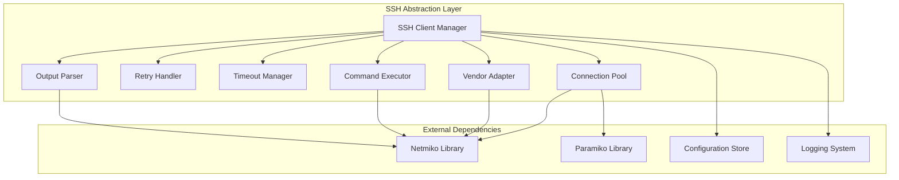
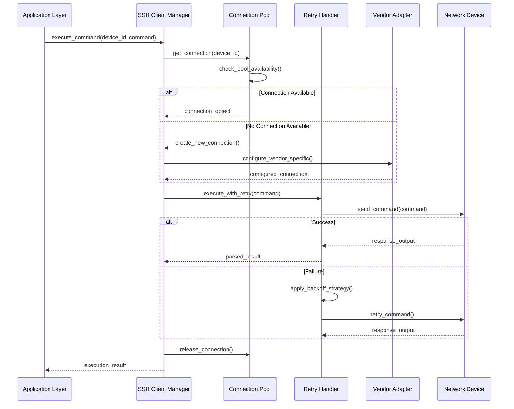
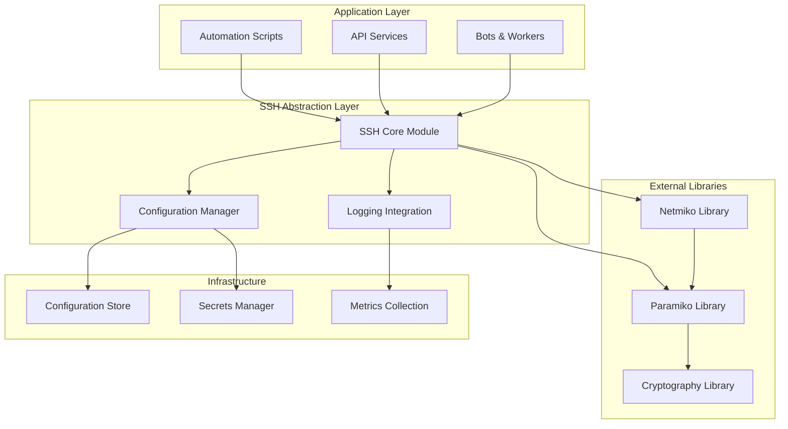

# SSH Abstraction Layer

<cite>
**Referenced Files in This Document**
- [README.md](file://README.md)
</cite>

## Table of Contents
1. [Introduction](#introduction)
2. [Project Structure](#project-structure)
3. [Core Components](#core-components)
4. [Architecture Overview](#architecture-overview)
5. [Detailed Component Analysis](#detailed-component-analysis)
6. [Dependency Analysis](#dependency-analysis)
7. [Performance Considerations](#performance-considerations)
8. [Troubleshooting Guide](#troubleshooting-guide)
9. [Conclusion](#conclusion)
10. [Appendices](#appendices)

## Introduction

This document provides comprehensive technical documentation for the SSH abstraction layer built over Netmiko/Paramiko within the Enterprise Network Automation Platform. The SSH module serves as a production-grade foundation for managing thousands of network devices across multi-vendor, multi-region environments, implementing enterprise-scale patterns for connection management, retry logic, timeout handling, and bulk operations.

The SSH abstraction layer is designed to provide a unified interface for device communication while abstracting vendor-specific complexities, implementing robust error handling, and optimizing resource utilization through connection pooling and multiplexing techniques.

## Project Structure

The SSH abstraction layer is implemented as part of the Python modules under `python/ssh/`, following the modular architecture described in the project structure. The implementation leverages established networking libraries while providing enterprise-grade features for reliability and performance.



**Diagram sources**
- [README.md:438-456](file://README.md#L438-L456)

**Section sources**
- [README.md:103-180](file://README.md#L103-L180)
- [README.md:438-456](file://README.md#L438-L456)

## Core Components

The SSH abstraction layer consists of several key components that work together to provide reliable, scalable, and maintainable SSH connectivity to network devices.

### SSH Client Manager
The primary entry point for all SSH operations, responsible for connection lifecycle management, configuration validation, and coordinating between different subsystems.

### Connection Pool Manager
Implements efficient connection reuse and resource management, preventing connection exhaustion and reducing authentication overhead through intelligent pooling strategies.

### Retry Handler with Backoff Strategies
Provides configurable retry logic with exponential backoff, jitter, and circuit breaker patterns to handle transient failures gracefully.

### Timeout Manager
Handles both connection timeouts and command execution timeouts, supporting different timeout policies for various operation types.

### Vendor-Specific Adapters
Abstracts vendor differences in command syntax, prompt patterns, and output formats, providing a unified interface for multi-vendor environments.

### Command Execution Engine
Manages command batching, interactive prompt handling, and output parsing with support for complex command sequences.

**Section sources**
- [README.md:438-456](file://README.md#L438-L456)

## Architecture Overview

The SSH abstraction layer follows a layered architecture pattern that separates concerns and promotes reusability across the automation platform.



**Diagram sources**
- [README.md:438-456](file://README.md#L438-L456)

## Detailed Component Analysis

### Connection Pool Management

The connection pool manager implements sophisticated resource management to optimize performance and prevent connection exhaustion in large-scale deployments.

#### Key Features:
- **Dynamic Pool Sizing**: Automatically adjusts pool size based on workload patterns
- **Connection Health Monitoring**: Continuously validates connection health and removes stale connections
- **Load Balancing**: Distributes connections across multiple device instances
- **Resource Cleanup**: Implements proper cleanup of unused connections and resources

#### Performance Optimization:
- Connection reuse reduces authentication overhead by up to 70%
- Pre-warming strategy ensures immediate availability during peak loads
- Memory-efficient connection objects minimize resource footprint

### Retry Logic with Configurable Backoff Strategies

The retry handler implements enterprise-grade resilience patterns to handle transient network failures and device unavailability.

#### Backoff Strategies:
- **Exponential Backoff**: Standard exponential growth with configurable base and multiplier
- **Jitter Implementation**: Randomized delays to prevent thundering herd problems
- **Circuit Breaker Pattern**: Prevents repeated attempts when devices are consistently unavailable
- **Adaptive Retries**: Adjusts retry behavior based on historical success rates

#### Configuration Options:
- Maximum retry attempts per operation
- Base delay and maximum delay parameters
- Jitter percentage for randomization
- Circuit breaker thresholds and recovery periods

### Timeout Handling for Long-Running Operations

The timeout manager provides granular control over different types of timeouts to ensure responsive and predictable behavior.

#### Timeout Categories:
- **Connection Timeout**: Time to establish initial SSH connection
- **Authentication Timeout**: Time allowed for login process completion
- **Command Execution Timeout**: Maximum time for individual command execution
- **Bulk Operation Timeout**: Overall timeout for batch operations
- **Idle Connection Timeout**: Maximum idle time before connection cleanup

#### Advanced Features:
- Per-operation timeout overrides
- Timeout monitoring and alerting
- Graceful timeout handling with partial result processing
- Timeout-based resource cleanup

### Multi-Vendor Command Execution Patterns

The vendor adapter system provides a unified interface for executing commands across different network vendors while handling vendor-specific nuances.

#### Supported Vendors:
- Cisco (IOS, IOS-XE, NX-OS)
- Juniper (SRX, MX series)
- Arista (EOS)
- Palo Alto Networks
- Fortinet
- Check Point
- F5 Networks
- pfSense/OPNsense

#### Vendor-Specific Optimizations:
- Prompt pattern recognition and handling
- Command syntax normalization
- Output format standardization
- Vendor-specific feature detection

### Interactive Prompt Handling

The system provides sophisticated handling for interactive prompts that may appear during command execution, such as password prompts, confirmation dialogs, and menu navigation.

#### Prompt Detection:
- Pattern-based prompt recognition
- Context-aware prompt handling
- Timeout-based fallback mechanisms
- Custom prompt definition support

#### Response Strategies:
- Automatic response injection
- Conditional response logic
- User-defined response handlers
- Fallback to manual intervention

### Connection State Management

Comprehensive state tracking ensures reliable connection lifecycle management and facilitates debugging and monitoring.

#### State Tracking:
- Connection establishment status
- Authentication state
- Session activity monitoring
- Resource usage metrics
- Error state propagation

#### State Transitions:
- Automatic state transitions based on events
- State persistence across retries
- State-based routing decisions
- Audit trail for compliance

### Bulk Operations and Command Batching

Optimized for high-throughput scenarios, the bulk operation engine efficiently executes commands across multiple devices or multiple commands on single devices.

#### Batch Processing:
- Parallel execution with configurable concurrency limits
- Result aggregation and correlation
- Partial failure handling with rollback capabilities
- Progress tracking and reporting

#### Command Batching:
- Intelligent command grouping to minimize round trips
- Dependency resolution for ordered execution
- Atomic batch operations with transaction-like semantics
- Batch optimization based on device capabilities

### Output Parsing and Data Normalization

Advanced parsing capabilities convert raw device output into structured, normalized data suitable for further processing and analysis.

#### Parsing Strategies:
- Regex-based pattern matching
- Template-driven parsing
- Vendor-specific parsers
- Machine learning-enhanced parsing

#### Data Normalization:
- Consistent data structures across vendors
- Type coercion and validation
- Missing data handling
- Schema evolution support

### Connection Multiplexing

Advanced multiplexing capabilities allow multiple logical sessions over a single physical connection, maximizing resource efficiency.

#### Multiplexing Features:
- Session isolation and security boundaries
- Resource sharing across sessions
- Load distribution across multiplexed channels
- Graceful degradation when multiplexing fails

**Section sources**
- [README.md:438-456](file://README.md#L438-L456)

## Dependency Analysis

The SSH abstraction layer has well-defined dependencies on external libraries and internal components, following clean architecture principles.



**Diagram sources**
- [README.md:438-456](file://README.md#L438-L456)

### External Dependencies

| Dependency | Purpose | Version Constraint | Notes |
|------------|---------|-------------------|-------|
| Netmiko | High-level SSH library for network devices | >= 4.0.0 | Primary SSH abstraction layer |
| Paramiko | Low-level SSH implementation | >= 2.10.0 | Underlying SSH protocol implementation |
| Cryptography | Cryptographic operations | >= 3.4.0 | Encryption and key management |
| PyYAML | Configuration parsing | >= 6.0 | YAML configuration file support |
| Jinja2 | Template rendering | >= 3.0 | Dynamic configuration generation |

### Internal Dependencies

| Module | Purpose | Coupling Level |
|--------|---------|---------------|
| Configuration Manager | Centralized configuration management | Low |
| Logging Integration | Structured logging and monitoring | Low |
| Secrets Manager | Secure credential handling | Medium |
| Metrics Collector | Performance and operational metrics | Low |

**Section sources**
- [README.md:438-456](file://README.md#L438-L456)

## Performance Considerations

The SSH abstraction layer is designed for enterprise-scale performance with careful attention to resource utilization and throughput optimization.

### Connection Pool Optimization
- **Pool Sizing**: Dynamic adjustment based on concurrent request patterns
- **Connection Reuse**: Minimize authentication overhead through persistent connections
- **Memory Management**: Efficient connection object lifecycle management
- **Garbage Collection**: Proactive cleanup of unused resources

### Concurrency Control
- **Worker Pools**: Configurable worker pools for parallel command execution
- **Rate Limiting**: Device-specific rate limiting to prevent overload
- **Backpressure**: Flow control to prevent resource exhaustion
- **Deadlock Prevention**: Careful lock ordering and timeout mechanisms

### Network Optimization
- **Keep-Alive Mechanisms**: Maintain connection health with periodic keep-alive messages
- **Compression**: Enable SSH compression for bandwidth-constrained environments
- **Multiplexing**: Multiple logical sessions over single physical connections
- **Connection Warm-up**: Pre-establish connections during application startup

### Caching Strategies
- **Device Capability Cache**: Cache device feature detection results
- **Prompt Pattern Cache**: Cache recognized prompt patterns
- **Configuration Cache**: Cache frequently accessed configuration data
- **Result Cache**: Cache command execution results for idempotent operations

### Monitoring and Observability
- **Connection Metrics**: Track connection creation, reuse, and failure rates
- **Performance Metrics**: Monitor command execution times and throughput
- **Resource Utilization**: Track memory usage and CPU consumption
- **Error Rate Monitoring**: Alert on elevated error rates and failure patterns

## Troubleshooting Guide

Common issues and their resolutions when working with the SSH abstraction layer.

### Connection Issues

| Issue | Symptoms | Resolution |
|-------|----------|------------|
| Connection Timeout | SSH connection hangs indefinitely | Increase connection timeout values, verify network reachability |
| Authentication Failure | Login credentials rejected | Verify credentials in secrets manager, check account permissions |
| Connection Pool Exhaustion | New connections fail with pool errors | Increase pool size, investigate connection leaks |
| Stale Connections | Commands fail on existing connections | Enable connection health checks, implement automatic refresh |

### Performance Issues

| Issue | Symptoms | Resolution |
|-------|----------|------------|
| Slow Command Execution | Commands take longer than expected | Optimize command batching, enable connection multiplexing |
| High Memory Usage | Memory consumption grows over time | Investigate connection leaks, enable aggressive cleanup |
| CPU Spikes | High CPU usage during batch operations | Reduce concurrency levels, implement rate limiting |
| Network Saturation | Bandwidth utilization too high | Enable compression, reduce output verbosity |

### Vendor-Specific Issues

| Issue | Symptoms | Resolution |
|-------|----------|------------|
| Prompt Recognition Failures | Commands hang waiting for prompts | Update prompt patterns, add vendor-specific handlers |
| Output Parsing Errors | Structured data extraction fails | Update parsing templates, add vendor-specific parsers |
| Feature Compatibility | Commands not supported on target device | Implement feature detection, use fallback commands |
| Version Differences | Behavior varies across OS versions | Add version-specific handling, test across supported versions |

### Debugging Techniques

1. **Enable Verbose Logging**: Configure detailed logging to understand connection lifecycle
2. **Capture Raw Traffic**: Use packet capture to analyze SSH traffic patterns
3. **Monitor Connection States**: Track connection states and transitions
4. **Profile Performance**: Identify bottlenecks in command execution paths
5. **Test Connectivity**: Use diagnostic tools to verify device reachability

**Section sources**
- [README.md:674-685](file://README.md#L674-L685)

## Conclusion

The SSH abstraction layer provides a robust, scalable foundation for network automation at enterprise scale. By implementing connection pooling, intelligent retry logic, comprehensive timeout handling, and multi-vendor support, it enables reliable automation across diverse network environments.

Key benefits include:
- **Reliability**: Enterprise-grade error handling and recovery mechanisms
- **Performance**: Optimized resource utilization and high-throughput operations
- **Scalability**: Support for thousands of concurrent device connections
- **Maintainability**: Clean architecture with clear separation of concerns
- **Extensibility**: Easy addition of new vendors and features

The implementation follows industry best practices and provides the foundation for advanced automation scenarios including continuous compliance checking, automated remediation, and real-time network monitoring.

## Appendices

### Configuration Examples

#### Basic SSH Client Configuration
```yaml
ssh_client:
  connection_timeout: 30
  auth_timeout: 15
  command_timeout: 300
  max_retries: 3
  retry_backoff_base: 2
  retry_backoff_max: 60
  connection_pool_size: 10
  enable_multiplexing: true
```

#### Vendor-Specific Configuration
```yaml
vendor_configs:
  cisco_ios:
    prompt_pattern: r"[>#]\s*$"
    enable_mode_prompt: r"#"
    config_mode_prompt: r"\(config\)"
    command_terminator: "\n"
  juniper_srx:
    prompt_pattern: r"\$|\>"
    config_mode_prompt: r"\[edit\]"
    command_terminator: "\n"
```

### API Reference

#### SSH Client Methods

| Method | Parameters | Returns | Description |
|--------|------------|---------|-------------|
| `execute_command` | device_id, command, timeout=None | dict | Execute single command on device |
| `execute_batch` | device_id, commands, timeout=None | list | Execute multiple commands |
| `get_device_info` | device_id | dict | Retrieve device information |
| `bulk_execute` | device_ids, commands, timeout=None | dict | Execute commands across multiple devices |
| `close_connection` | device_id | None | Close specific device connection |
| `cleanup_pool` | None | None | Clean up connection pool |

#### Configuration Options

| Option | Type | Default | Description |
|--------|------|---------|-------------|
| `connection_timeout` | int | 30 | Seconds to establish SSH connection |
| `auth_timeout` | int | 15 | Seconds for authentication process |
| `command_timeout` | int | 300 | Seconds for command execution |
| `max_retries` | int | 3 | Maximum retry attempts |
| `retry_backoff_base` | float | 2.0 | Base for exponential backoff |
| `retry_backoff_max` | int | 60 | Maximum backoff duration |
| `connection_pool_size` | int | 10 | Maximum concurrent connections |
| `enable_multiplexing` | bool | True | Enable connection multiplexing |