# Python Modules

<cite>
**Referenced Files in This Document**
- [README.md](file://README.md)
</cite>

## Table of Contents
1. [Introduction](#introduction)
2. [Project Structure](#project-structure)
3. [Core Components](#core-components)
4. [Architecture Overview](#architecture-overview)
5. [Detailed Component Analysis](#detailed-component-analysis)
6. [Dependency Analysis](#dependency-analysis)
7. [Performance Considerations](#performance-considerations)
8. [Troubleshooting Guide](#troubleshooting-guide)
9. [Conclusion](#conclusion)
10. [Appendices](#appendices)

## Introduction

The Enterprise Network Automation Platform's Python modules subsystem provides a comprehensive, production-grade framework for network automation across multi-vendor, multi-region environments. Built following Infrastructure as Code principles, these modules enable automated configuration management, compliance enforcement, monitoring, and operational workflows for thousands of network devices including routers, switches, firewalls, load balancers, VPN gateways, and cloud networking components.

The platform emphasizes vendor-agnostic design, GitOps workflows, security-first practices, and enterprise-scale reliability. All configurations, policies, templates, tests, and automation logic are stored in Git, ensuring full traceability, version control, and collaborative development capabilities.

## Project Structure

The Python modules are organized under the `python/` directory with a feature-based architecture that separates concerns by functional domain while maintaining clear interfaces between components.

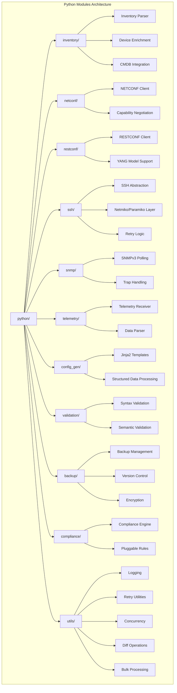

**Diagram sources**
- [README.md:130-141](file://README.md#L130-L141)

**Section sources**
- [README.md:130-141](file://README.md#L130-L141)

## Core Components

The Python modules subsystem consists of eleven primary components, each designed with specific responsibilities and clear interfaces for integration within the broader automation ecosystem.

### Module Responsibilities

| Module | Primary Responsibility | Key Dependencies | Output Format |
|--------|----------------------|------------------|---------------|
| **inventory/** | Device discovery and enrichment | YAML parsers, CMDB APIs | Structured device metadata |
| **netconf/** | NETCONF protocol communication | ncclient library | XML/RPC responses |
| **restconf/** | RESTCONF API interactions | HTTP clients, JSON/YAML | Structured data objects |
| **ssh/** | Secure shell connectivity | Netmiko, Paramiko | Command outputs, configurations |
| **snmp/** | Simple Network Management Protocol | pysnmp library | Performance metrics, traps |
| **telemetry/** | Real-time streaming data | gRPC, protobuf | Time-series data points |
| **config_gen/** | Configuration template rendering | Jinja2, YAML processors | Vendor-specific configurations |
| **validation/** | Configuration quality assurance | Schema validators, parsers | Validation reports |
| **backup/** | Configuration lifecycle management | Storage backends, crypto libraries | Versioned, encrypted backups |
| **compliance/** | Policy enforcement engine | Rule engines, reporting tools | Compliance reports |
| **utils/** | Shared utilities and helpers | Standard library extensions | Common functionality |

All modules follow PEP 8 standards, use type hints extensively, include comprehensive docstrings, and maintain corresponding unit test coverage.

**Section sources**
- [README.md:439-456](file://README.md#L439-L456)

## Architecture Overview

The Python modules subsystem implements a layered architecture pattern that promotes separation of concerns, testability, and maintainability. The system follows dependency injection principles and maintains loose coupling between components through well-defined interfaces.

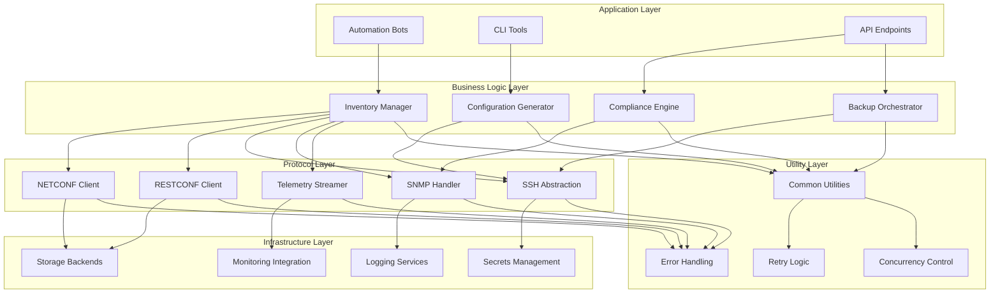

**Diagram sources**
- [README.md:52-99](file://README.md#L52-L99)

The architecture supports multiple deployment models including standalone execution, containerized services, and distributed worker pools. Each component can operate independently or as part of the integrated automation pipeline.

## Detailed Component Analysis

### Inventory Management Module

The inventory module serves as the foundation for device discovery, metadata management, and CMDB integration. It provides a unified interface for accessing device information regardless of the underlying data source.

#### Key Features
- Multi-source inventory aggregation (YAML, CMDB APIs, discovery scans)
- Device attribute enrichment and validation
- Environment-based filtering and grouping
- Dynamic device state tracking

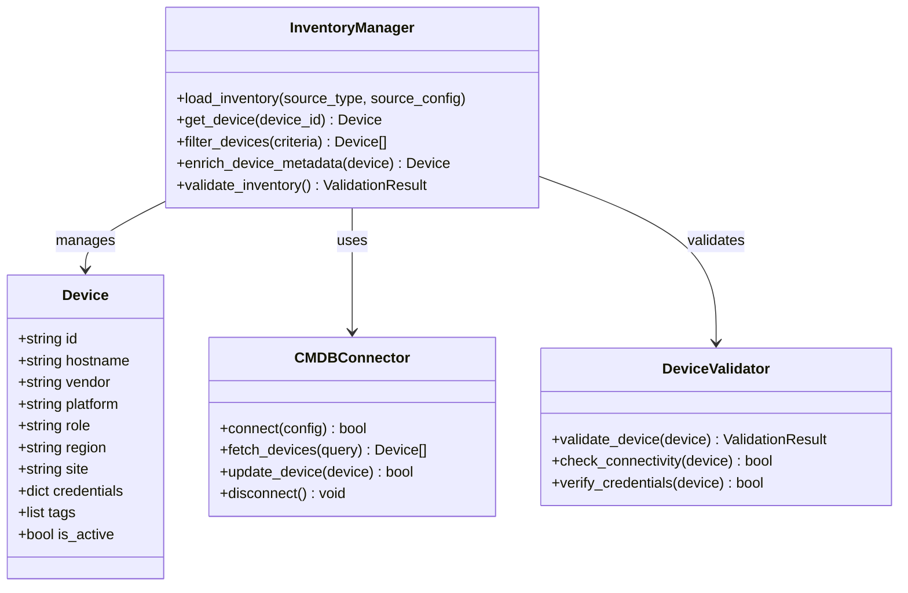

**Diagram sources**
- [README.md:444](file://README.md#L444)

#### Usage Example
```python
from python.inventory import InventoryManager

# Initialize inventory manager
manager = InventoryManager()

# Load inventory from multiple sources
manager.load_inventory("yaml", {"path": "inventories/production/hosts.yml"})
manager.load_inventory("cmdb", {"api_url": "https://cmdb.example.com", "auth": vault_secrets})

# Get specific device information
device = manager.get_device("core-rtr-01")

# Filter devices by criteria
core_routers = manager.filter_devices({
    "role": "core_router",
    "region": "us-east",
    "vendor": "cisco"
})

# Validate inventory integrity
result = manager.validate_inventory()
if result.has_errors():
    print(f"Found {len(result.errors)} validation errors")
```

**Section sources**
- [README.md:444](file://README.md#L444)

### NETCONF Client Module

The NETCONF client provides robust NETCONF protocol implementation with automatic capability negotiation, session management, and error handling. It supports multiple vendors and handles protocol variations gracefully.

#### Key Features
- Automatic capability negotiation and feature detection
- Connection pooling and session management
- RPC request/response handling with timeout management
- Error recovery and retry logic
- Multi-vendor compatibility layer

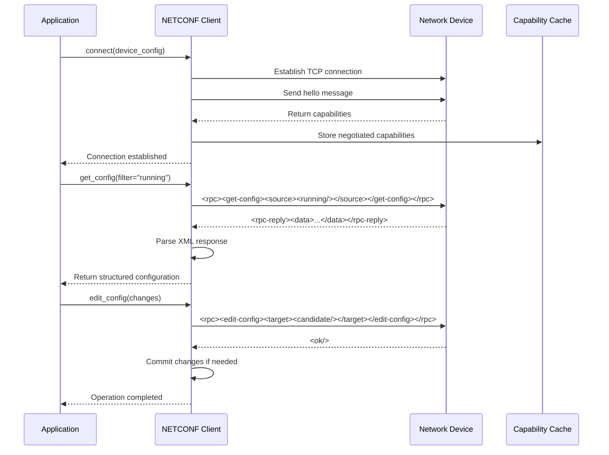

**Diagram sources**
- [README.md:445](file://README.md#L445)

#### Usage Example
```python
from python.netconf import NETCONFClient

# Initialize client with device configuration
client = NETCONFClient({
    "host": "10.0.1.1",
    "username": "automation",
    "password": vault_secrets["device_password"],
    "timeout": 30,
    "retry_count": 3
})

# Connect to device and negotiate capabilities
client.connect()
capabilities = client.get_capabilities()

# Retrieve running configuration
config = client.get_config(filter_type="running")

# Apply configuration changes
changes = {
    "interfaces": {
        "GigabitEthernet0/1": {
            "description": "Uplink to core switch",
            "ip_address": "10.0.1.2/24"
        }
    }
}
client.edit_config(target="candidate", config=changes)
client.commit()

# Close connection
client.disconnect()
```

**Section sources**
- [README.md:445](file://README.md#L445)

### RESTCONF Client Module

The RESTCONF client provides HTTP-based RESTful API access to network devices with built-in YANG model support, schema validation, and automatic serialization/deserialization.

#### Key Features
- YANG model-aware API calls with schema validation
- Automatic request/response serialization
- Authentication and authorization handling
- Rate limiting and request throttling
- Comprehensive error handling and retry logic

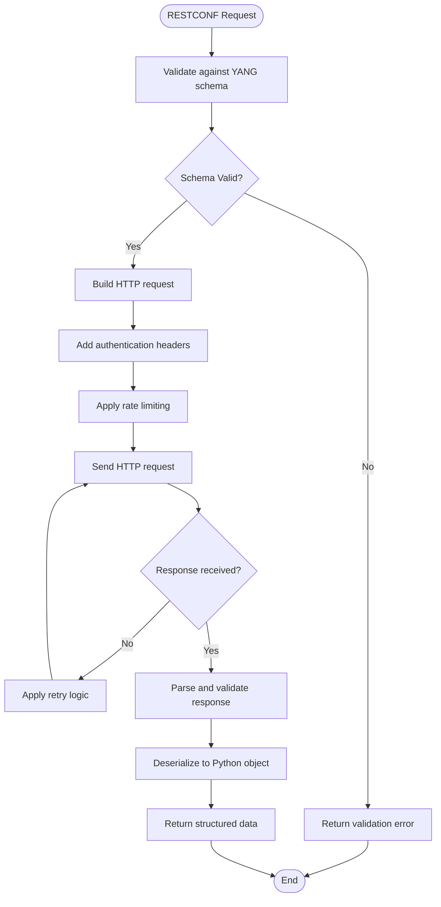

**Diagram sources**
- [README.md:446](file://README.md#L446)

#### Usage Example
```python
from python.restconf import RESTCONFClient

# Initialize client with device configuration
client = RESTCONFClient({
    "base_url": "https://10.0.1.1/restconf",
    "username": "automation",
    "password": vault_secrets["device_password"],
    "verify_ssl": True,
    "timeout": 30
})

# Get device inventory using YANG models
inventory = client.get("/ietf-network:networks")

# Update interface configuration
interface_data = {
    "name": "GigabitEthernet0/1",
    "description": "Uplink to core switch",
    "ipv4-address": "10.0.1.2/24"
}
client.put("/ietf-interfaces:interfaces/interface=GigabitEthernet0/1", 
          data=interface_data)

# Subscribe to notifications
def notification_handler(notification):
    print(f"Received notification: {notification}")

client.subscribe_notifications(
    filter={"event-type": "link-status"},
    callback=notification_handler
)
```

**Section sources**
- [README.md:446](file://README.md#L446)

### SSH Abstraction Layer

The SSH abstraction layer provides a unified interface for SSH-based device management built on top of Netmiko and Paramiko, with enhanced retry logic, connection pooling, and error handling.

#### Key Features
- Unified SSH interface across multiple vendors
- Automatic connection retry with exponential backoff
- Command output parsing and formatting
- Session persistence and connection pooling
- Timeout management and graceful degradation

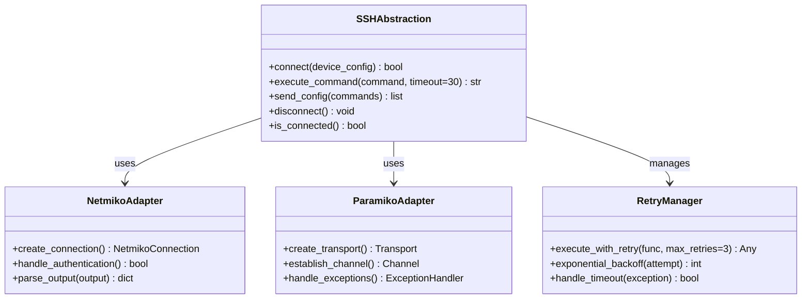

**Diagram sources**
- [README.md:447](file://README.md#L447)

#### Usage Example
```python
from python.ssh import SSHAbstraction

# Initialize SSH abstraction
ssh = SSHAbstraction({
    "host": "10.0.1.1",
    "username": "automation",
    "password": vault_secrets["device_password"],
    "platform": "cisco_ios",
    "timeout": 30,
    "retry_count": 3
})

# Connect to device
if ssh.connect():
    # Execute show commands
    output = ssh.execute_command("show version")
    print(f"Device: {output['hostname']}")
    
    # Configure device
    config_commands = [
        "interface GigabitEthernet0/1",
        "description Uplink to core switch",
        "ip address 10.0.1.2 255.255.255.0",
        "no shutdown"
    ]
    ssh.send_config(config_commands)
    
    # Disconnect when done
    ssh.disconnect()
else:
    print("Failed to connect to device")
```

**Section sources**
- [README.md:447](file://README.md#L447)

### SNMPv3 Module

The SNMPv3 module provides secure SNMP operations including polling, trap handling, and performance monitoring with comprehensive security features and error resilience.

#### Key Features
- SNMPv3 security model with authentication and encryption
- High-performance polling with connection pooling
- Asynchronous trap reception and processing
- Performance metric collection and trending
- Alert generation and notification integration

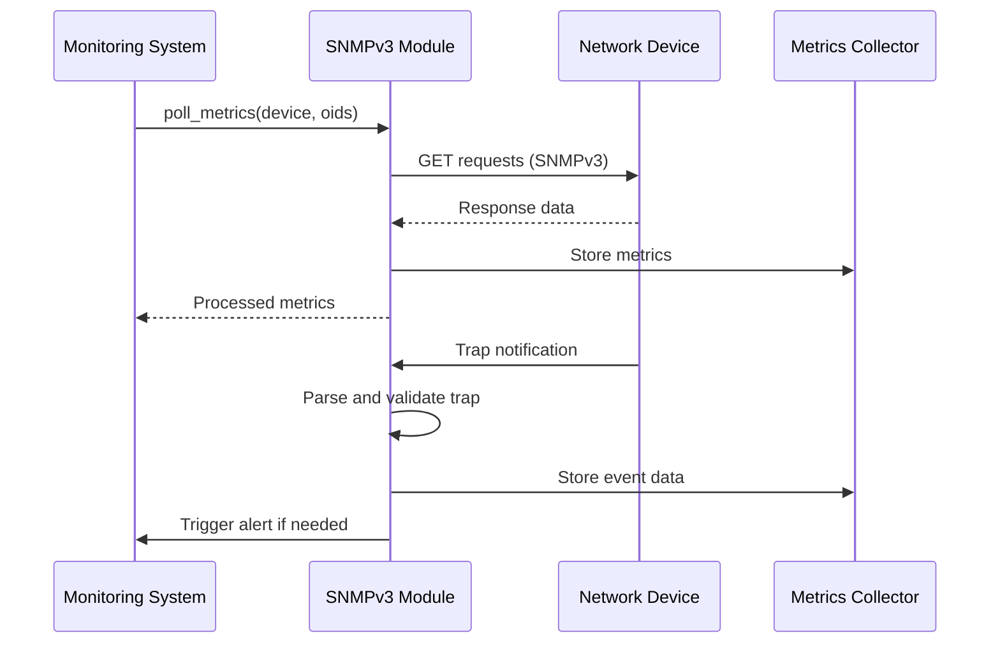

**Diagram sources**
- [README.md:448](file://README.md#L448)

#### Usage Example
```python
from python.snmp import SNMPv3Client

# Initialize SNMPv3 client with security parameters
snmp = SNMPv3Client({
    "security_username": "monitoring_user",
    "security_level": "authPriv",
    "auth_protocol": "SHA",
    "auth_password": vault_secrets["snmp_auth"],
    "priv_protocol": "AES",
    "priv_password": vault_secrets["snmp_priv"]
})

# Poll device metrics
metrics = snmp.poll_metrics(
    target="10.0.1.1",
    oids=["IF-MIB::ifInOctets", "IF-MIB::ifOutOctets", "HOST-RESOURCES-MIB::hrSystemUptime"],
    interval=60
)

# Configure trap receiver
def trap_handler(trap):
    print(f"Received trap: {trap}")
    if trap["severity"] == "critical":
        trigger_alert(trap)

snmp.start_trap_receiver(
    port=1162,
    handler=trap_handler,
    security_params=snmp.security_params
)

# Stop trap receiver when done
snmp.stop_trap_receiver()
```

**Section sources**
- [README.md:448](file://README.md#L448)

### Telemetry Module

The telemetry module implements model-driven telemetry streaming with real-time data processing, time-series storage, and analytics capabilities for proactive network monitoring.

#### Key Features
- gRPC-based telemetry streaming
- Protobuf message parsing and validation
- Real-time data processing and filtering
- Time-series data storage and retrieval
- Anomaly detection and alerting

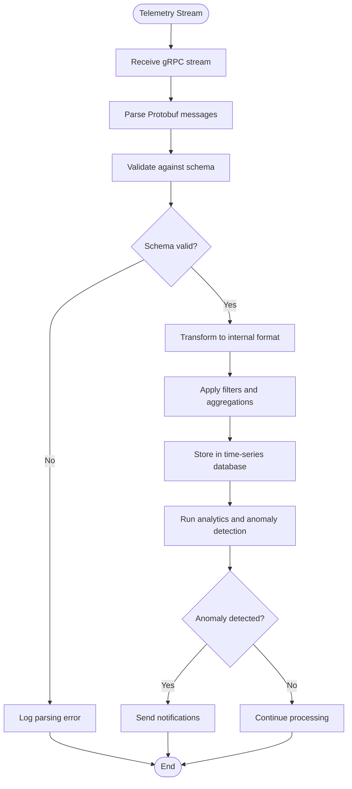

**Diagram sources**
- [README.md:449](file://README.md#L449)

#### Usage Example
```python
from python.telemetry import TelemetryReceiver

# Initialize telemetry receiver
receiver = TelemetryReceiver({
    "grpc_port": 50051,
    "models_path": "/etc/telemetry/models/",
    "storage_backend": "influxdb",
    "batch_size": 1000
})

# Define telemetry subscription
subscription = {
    "model": "Cisco-IOS-XE-interfaces-oper:interfaces",
    "encoding": "GPB",
    "sample_interval": 10000,
    "destination": "10.0.1.100:50051"
}

# Start receiving telemetry
def telemetry_handler(data):
    print(f"Interface utilization: {data['utilization']}%")
    if data['utilization'] > 90:
        trigger_high_utilization_alert(data)

receiver.start_subscription(subscription, handler=telemetry_handler)

# Query historical data
historical_data = receiver.query_historical(
    model="Cisco-IOS-XE-interfaces-oper:interfaces",
    start_time="2024-01-01T00:00:00Z",
    end_time="2024-01-01T23:59:59Z",
    filters={"interface": "GigabitEthernet0/1"}
)

# Stop receiver
receiver.stop_all_subscriptions()
```

**Section sources**
- [README.md:449](file://README.md#L449)

### Configuration Generation Module

The configuration generation module provides Jinja2-based template rendering with structured data processing, multi-vendor support, and comprehensive validation capabilities.

#### Key Features
- Jinja2 template engine with custom filters and functions
- Structured data processing from YAML/JSON sources
- Multi-vendor template management
- Template syntax validation and testing
- Configuration diff generation and comparison

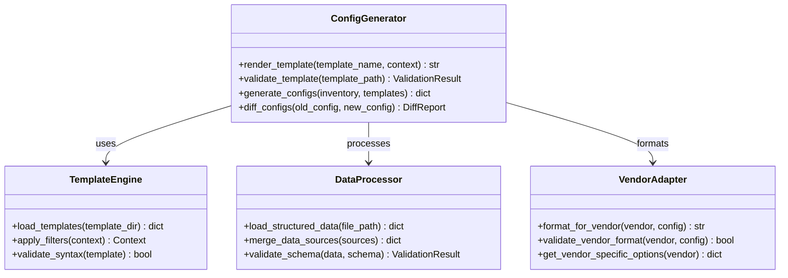

**Diagram sources**
- [README.md:450](file://README.md#L450)

#### Usage Example
```python
from python.config_gen import ConfigGenerator

# Initialize configuration generator
generator = ConfigGenerator({
    "template_dir": "templates/",
    "data_dir": "group_vars/",
    "output_dir": "generated_configs/"
})

# Generate configuration for specific device
config = generator.render_template(
    template_name="cisco_ios/base_config.j2",
    context={
        "hostname": "core-rtr-01",
        "interfaces": [
            {
                "name": "GigabitEthernet0/1",
                "description": "Uplink to core switch",
                "ip_address": "10.0.1.2/24"
            }
        ],
        "routing": {
            "ospf": {
                "process_id": 1,
                "networks": ["10.0.0.0/8"]
            }
        }
    }
)

# Generate configs for entire inventory
configs = generator.generate_configs(
    inventory_file="inventories/production/hosts.yml",
    template_map={
        "core_router": "cisco_ios/core_router.j2",
        "access_switch": "cisco_ios/access_switch.j2"
    }
)

# Validate generated configuration
validation_result = generator.validate_template("cisco_ios/base_config.j2")
if validation_result.has_errors():
    print(f"Template validation failed: {validation_result.errors}")
```

**Section sources**
- [README.md:450](file://README.md#L450)

### Validation Module

The validation module provides comprehensive configuration validation including syntax checking, semantic analysis, and policy compliance verification before deployment.

#### Key Features
- Syntax validation for multiple vendor platforms
- Semantic validation against best practices
- Policy compliance checking
- Configuration diff analysis
- Risk assessment and impact analysis

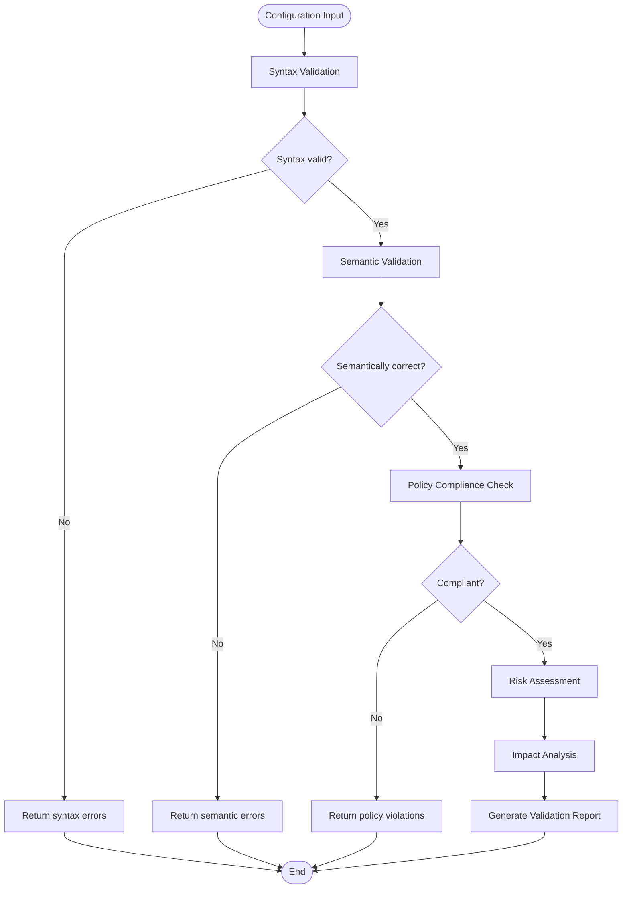

**Diagram sources**
- [README.md:451](file://README.md#L451)

#### Usage Example
```python
from python.validation import ConfigValidator

# Initialize validator
validator = ConfigValidator({
    "vendor": "cisco_ios",
    "policies_dir": "compliance/policies/",
    "schemas_dir": "schemas/"
})

# Validate configuration
config = """
interface GigabitEthernet0/1
 description Uplink to core switch
 ip address 10.0.1.2 255.255.255.0
 no shutdown
!
router ospf 1
 network 10.0.0.0/8 area 0
"""

result = validator.validate(config)

if result.is_valid():
    print("Configuration is valid")
    print(f"Impact score: {result.impact_score}/100")
else:
    print(f"Validation failed with {len(result.errors)} errors:")
    for error in result.errors:
        print(f"  - {error.severity}: {error.message}")
        print(f"    Line {error.line}: {error.context}")
```

**Section sources**
- [README.md:451](file://README.md#L451)

### Backup Module

The backup module provides comprehensive configuration backup management with versioning, encryption, retention policies, and disaster recovery capabilities.

#### Key Features
- Automated backup scheduling and triggers
- Version control integration with Git
- AES-256 encryption for backup storage
- Retention policy management
- Disaster recovery and restoration workflows

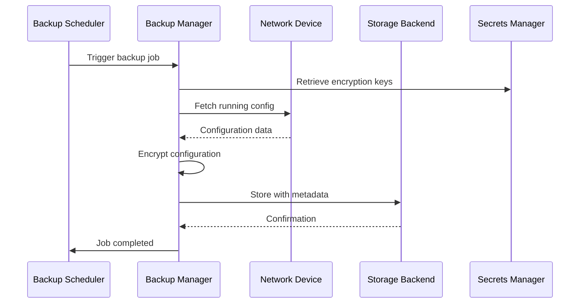

**Diagram sources**
- [README.md:452](file://README.md#L452)

#### Usage Example
```python
from python.backup import BackupManager

# Initialize backup manager
backup_mgr = BackupManager({
    "storage_backend": "vault",
    "encryption_key": vault_secrets["backup_encryption_key"],
    "retention_days": 90,
    "git_repo": "https://github.com/org/config-backups.git"
})

# Create backup for specific device
backup_result = backup_mgr.create_backup(
    device_id="core-rtr-01",
    config_source="running",
    labels=["production", "monthly"]
)

print(f"Backup created: {backup_result.backup_id}")
print(f"Stored at: {backup_result.storage_location}")

# Restore configuration from backup
restore_result = backup_mgr.restore_backup(
    device_id="core-rtr-01",
    backup_id="backup_20240101_000000",
    dry_run=True
)

if restore_result.dry_run:
    print("Restore would apply the following changes:")
    for change in restore_result.diff:
        print(f"  {change.action}: {change.path}")

# Schedule regular backups
backup_mgr.schedule_backup(
    device_id="core-rtr-01",
    schedule="0 2 * * *",  # Daily at 2 AM
    retention_days=90
)
```

**Section sources**
- [README.md:452](file://README.md#L452)

### Compliance Module

The compliance module implements a flexible compliance engine with pluggable rule sets, continuous monitoring, and comprehensive reporting capabilities for security and operational policy enforcement.

#### Key Features
- Pluggable rule engine with custom rule development
- Continuous compliance monitoring
- Multi-format compliance reports
- Remediation workflow integration
- Audit trail and change tracking

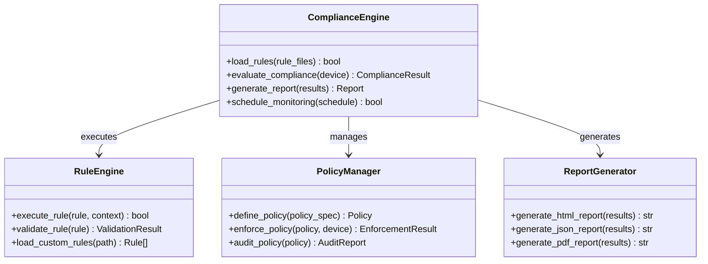

**Diagram sources**
- [README.md:453](file://README.md#L453)

#### Usage Example
```python
from python.compliance import ComplianceEngine

# Initialize compliance engine
engine = ComplianceEngine({
    "rules_dir": "compliance/rules/",
    "reporting_dir": "compliance/reports/",
    "notification_channels": ["slack", "email"]
})

# Load compliance rules
engine.load_rules([
    "ssh_security.yaml",
    "snmp_security.yaml", 
    "logging_standards.yaml",
    "access_control.yaml"
])

# Evaluate compliance for device
result = engine.evaluate_compliance(device_id="core-rtr-01")

if result.overall_status == "non_compliant":
    print(f"Device has {len(result.violations)} violations:")
    for violation in result.violations:
        print(f"  [{violation.severity}] {violation.rule}: {violation.description}")
    
    # Generate compliance report
    report = engine.generate_report(result)
    print(f"Report saved to: {report.file_path}")
    
    # Trigger remediation workflow
    if result.auto_remediation_available:
        remediation = engine.apply_remediation(result)
        print(f"Remediation applied: {remediation.status}")
```

**Section sources**
- [README.md:453](file://README.md#L453)

### Utilities Module

The utilities module provides shared functionality including logging, retry mechanisms, concurrency controls, diff operations, and bulk processing utilities used across all other modules.

#### Key Features
- Structured logging with multiple output formats
- Exponential backoff retry logic
- Thread-safe concurrent operations
- Configuration diff generation and comparison
- Bulk operation processing with progress tracking

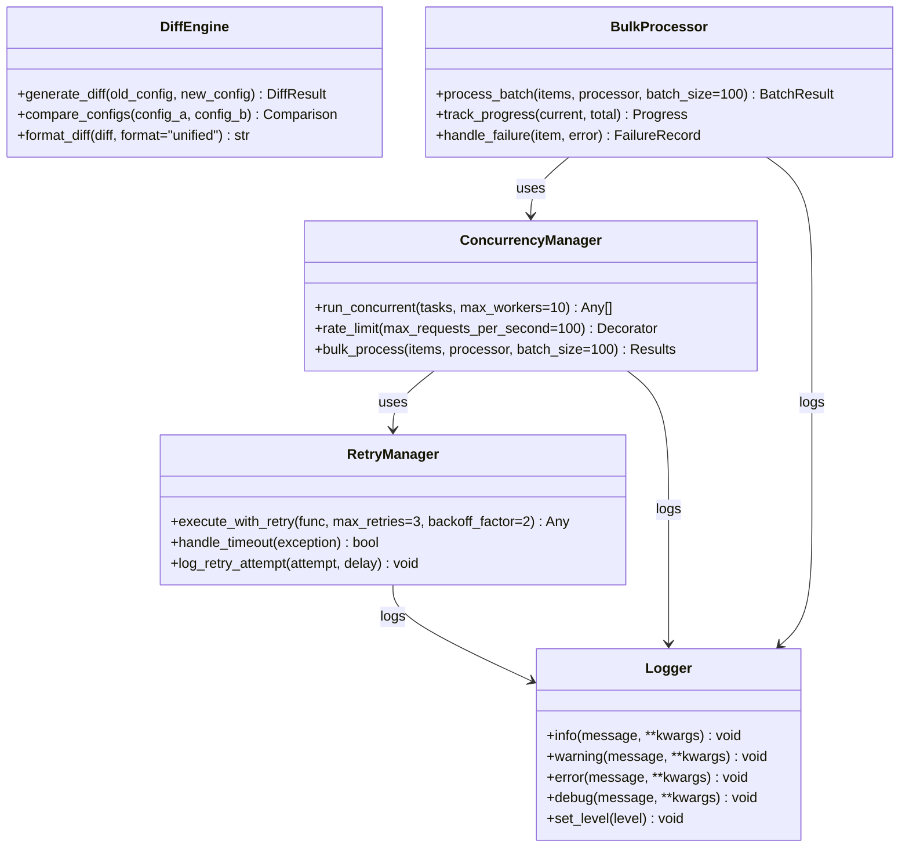

**Diagram sources**
- [README.md:454](file://README.md#L454)

#### Usage Example
```python
from python.utils import Logger, RetryManager, ConcurrencyManager, DiffEngine

# Initialize components
logger = Logger({
    "level": "INFO",
    "format": "json",
    "output_file": "automation.log"
})

retry_manager = RetryManager({
    "max_retries": 3,
    "backoff_factor": 2,
    "retry_on_timeout": True
})

concurrency_manager = ConcurrencyManager({
    "max_workers": 10,
    "rate_limit": 50  # requests per second
})

diff_engine = DiffEngine({
    "ignore_whitespace": True,
    "ignore_comments": True
})

# Use retry logic for unreliable operations
@retry_manager.execute_with_retry
def fetch_device_config(device_id):
    return get_config_from_device(device_id)

# Process multiple devices concurrently
devices = ["core-rtr-01", "dist-sw-01", "fw-edge-01"]
results = concurrency_manager.run_concurrent(
    tasks=[lambda d=device: fetch_device_config(d) for device in devices],
    max_workers=5
)

# Compare configurations
old_config = get_current_config("core-rtr-01")
new_config = generate_new_config("core-rtr-01")
diff_result = diff_engine.generate_diff(old_config, new_config)

if diff_result.has_changes():
    logger.info(f"Configuration changes detected for {device_id}")
    print(diff_engine.format_diff(diff_result, format="unified"))
```

**Section sources**
- [README.md:454](file://README.md#L454)

## Dependency Analysis

The Python modules subsystem follows a layered architecture with clear dependency boundaries and minimal coupling between components. The dependency graph shows how modules interact while maintaining separation of concerns.

```mermaid
graph TB
subgraph "External Dependencies"
Ext1[Netmiko]
Ext2[Paramiko]
Ext3[pysnmp]
Ext4[Jinja2]
Ext5[ncclient]
Ext6[HTTP Clients]
Ext7[gRPC]
Ext8[Protobuf]
end
subgraph "Core Modules"
M1[Utils]
M2[Inventory]
M3[SSH]
M4[NETCONF]
M5[RESTCONF]
M6[SNMP]
M7[Telemetry]
M8[Config Gen]
M9[Validation]
M10[Backup]
M11[Compliance]
end
Utils --> Ext1
Utils --> Ext2
Utils --> Ext3
Utils --> Ext4
Utils --> Ext5
Utils --> Ext6
Utils --> Ext7
Utils --> Ext8
SSH --> Utils
SSH --> Ext1
SSH --> Ext2
NETCONF --> Utils
NETCONF --> Ext5
RESTCONF --> Utils
RESTCONF --> Ext6
SNMP --> Utils
SNMP --> Ext3
Telemetry --> Utils
Telemetry --> Ext7
Telemetry --> Ext8
Config Gen --> Utils
Config Gen --> Ext4
Inventory --> Utils
Inventory --> Ext6
Validation --> Utils
Validation --> Ext4
Backup --> Utils
Backup --> Ext6
Compliance --> Utils
Compliance --> Ext6
M1 --> M2
M1 --> M3
M1 --> M4
M1 --> M5
M1 --> M6
M1 --> M7
M1 --> M8
M1 --> M9
M1 --> M10
M1 --> M11
M2 --> M3
M2 --> M4
M2 --> M5
M2 --> M6
M2 --> M7
M8 --> M9
M10 --> M3
M11 --> M9
```

**Diagram sources**
- [README.md:184-199](file://README.md#L184-L199)

The dependency structure ensures that:
- External dependencies are isolated behind module interfaces
- Core modules have minimal coupling through the utils layer
- Business logic modules depend on protocol modules but not vice versa
- Testing can be performed at any layer with appropriate mocking

**Section sources**
- [README.md:184-199](file://README.md#L184-L199)

## Performance Considerations

The Python modules subsystem is designed for enterprise-scale performance with several key optimization strategies:

### Connection Management
- **Connection Pooling**: Reuse persistent connections to reduce overhead
- **Connection Multiplexing**: Handle multiple requests over single connections where supported
- **Graceful Degradation**: Fall back to slower protocols when faster ones fail

### Concurrency and Parallelism
- **Thread Safety**: All modules are thread-safe for concurrent access
- **Asynchronous Operations**: Non-blocking I/O for network operations
- **Batch Processing**: Efficient bulk operations for large datasets

### Memory Management
- **Streaming Processing**: Process large configurations without loading entirely into memory
- **Resource Cleanup**: Proper resource disposal and garbage collection
- **Memory Limits**: Configurable memory usage limits per operation

### Caching Strategies
- **Metadata Caching**: Cache device capabilities and inventory data
- **Template Caching**: Pre-compile Jinja2 templates
- **Result Caching**: Cache frequently accessed query results

### Network Optimization
- **Timeout Tuning**: Configurable timeouts based on operation type
- **Retry Logic**: Intelligent retry with exponential backoff
- **Rate Limiting**: Prevent overwhelming target devices

## Troubleshooting Guide

### Common Issues and Solutions

| Issue Category | Symptoms | Diagnostic Steps | Resolution |
|----------------|----------|------------------|------------|
| **Connection Failures** | Timeout errors, connection refused | Check network reachability, verify credentials | Validate firewall rules, check device accessibility |
| **Authentication Problems** | Login failures, permission denied | Verify secret rotation, check account status | Update secrets in vault, verify account permissions |
| **Protocol Errors** | Malformed responses, unsupported features | Check device capabilities, verify protocol versions | Update device firmware, adjust client configuration |
| **Performance Issues** | Slow operations, high memory usage | Monitor resource utilization, profile slow operations | Optimize queries, increase timeouts, add caching |
| **Template Rendering Errors** | Jinja2 syntax errors, missing variables | Validate template syntax, check variable definitions | Fix template syntax, ensure required variables exist |
| **Backup Failures** | Storage write errors, encryption failures | Check storage backend, verify encryption keys | Validate storage connectivity, refresh encryption keys |

### Debugging Techniques

```python
# Enable detailed logging for troubleshooting
import logging
from python.utils import Logger

logger = Logger({
    "level": "DEBUG",
    "format": "verbose",
    "output_file": "debug.log",
    "console_output": True
})

# Use context managers for operation tracing
with logger.operation_context("device_configuration"):
    try:
        result = configure_device(device_id, config)
        logger.info("Configuration applied successfully")
    except Exception as e:
        logger.error(f"Configuration failed: {str(e)}", exc_info=True)
        raise

# Profile slow operations
import cProfile
import pstats

profiler = cProfile.Profile()
profiler.enable()

# Your slow operation here
result = process_large_dataset(large_dataset)

profiler.disable()
stats = pstats.Stats(profiler)
stats.sort_stats('cumulative')
stats.print_stats(20)
```

### Health Check Procedures

```python
from python.utils import HealthChecker

health_checker = HealthChecker({
    "endpoints": [
        {"name": "database", "type": "connection", "timeout": 5},
        {"name": "secrets_vault", "type": "http", "url": "https://vault.internal:8200"},
        {"name": "storage_backend", "type": "write_test", "path": "/health/test"}
    ]
})

health_status = health_checker.check_all()
for endpoint, status in health_status.items():
    print(f"{endpoint}: {status['status']} ({status['response_time']}ms)")
```

**Section sources**
- [README.md:674-685](file://README.md#L674-L685)

## Conclusion

The Python modules subsystem of the Enterprise Network Automation Platform provides a comprehensive, production-ready foundation for network automation at scale. The modular architecture ensures maintainability, testability, and extensibility while providing robust abstractions over complex network protocols and operations.

Key strengths of the implementation include:

- **Vendor Agnostic Design**: Consistent interfaces across multiple network vendors and platforms
- **Enterprise Security**: Comprehensive secrets management, encryption, and audit capabilities  
- **Operational Excellence**: Built-in monitoring, logging, and troubleshooting capabilities
- **Scalability**: Designed for thousands of devices with efficient resource utilization
- **Compliance Focus**: Integrated policy enforcement and continuous compliance monitoring

The system follows modern software engineering practices with comprehensive testing, documentation, and CI/CD integration. The modular design allows teams to adopt individual components incrementally while maintaining compatibility with the broader automation ecosystem.

Future enhancements will focus on AI-driven anomaly detection, zero-touch provisioning integration, and advanced analytics capabilities to further improve operational efficiency and proactive network management.

## Appendices

### Installation and Setup

```bash
# Install Python dependencies
pip install -r requirements.txt

# Set up environment variables
export VAULT_ADDR="https://vault.internal:8200"
export VAULT_TOKEN="your-vault-token"

# Initialize the automation platform
python scripts/init_platform.py --environment production

# Run initial health checks
python scripts/health_check.py --all
```

### Development Workflow

```bash
# Create virtual environment
python -m venv .venv
source .venv/bin/activate  # Linux/macOS
# .venv\Scripts\activate   # Windows

# Install development dependencies
pip install -r requirements-dev.txt

# Run linting and formatting
pre-commit run --all-files

# Execute unit tests
pytest tests/unit/ -v --cov=python/

# Run integration tests
pytest tests/integration/ -v --asyncio-mode=auto

# Generate documentation
sphinx-build docs/source docs/build/html
```

### API Reference

For complete API documentation, refer to the auto-generated documentation available at `/docs/api/` or generate it locally using:

```bash
sphinx-apidoc -o docs/api python/
sphinx-build docs/source docs/build/html
```