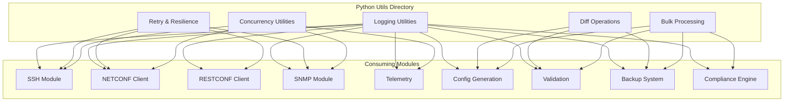
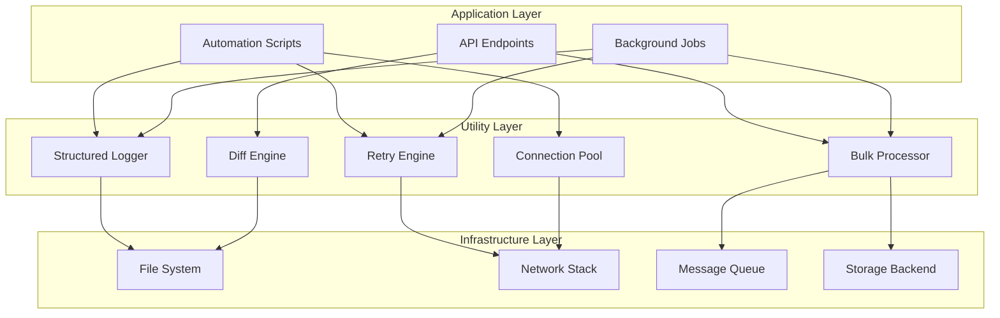
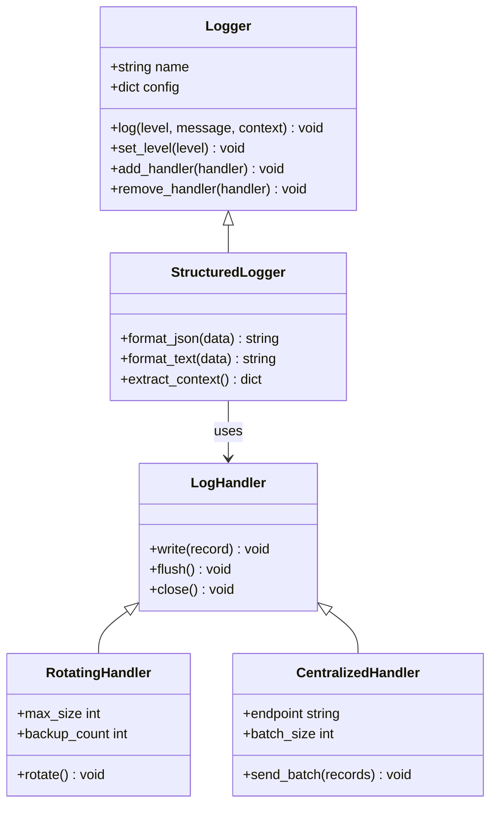
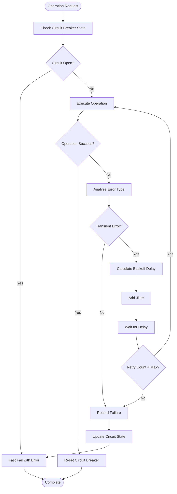
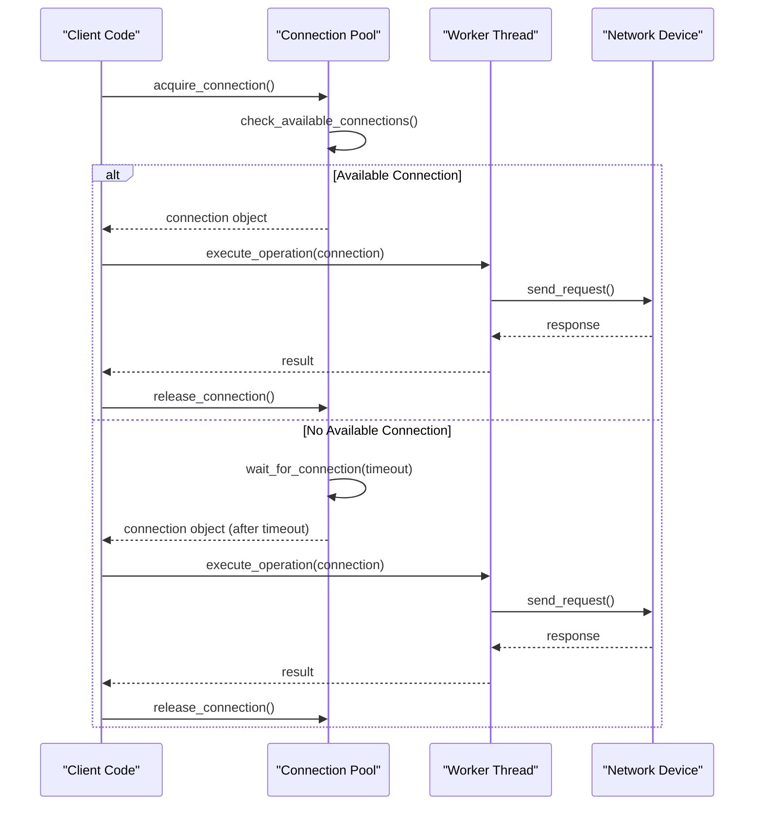
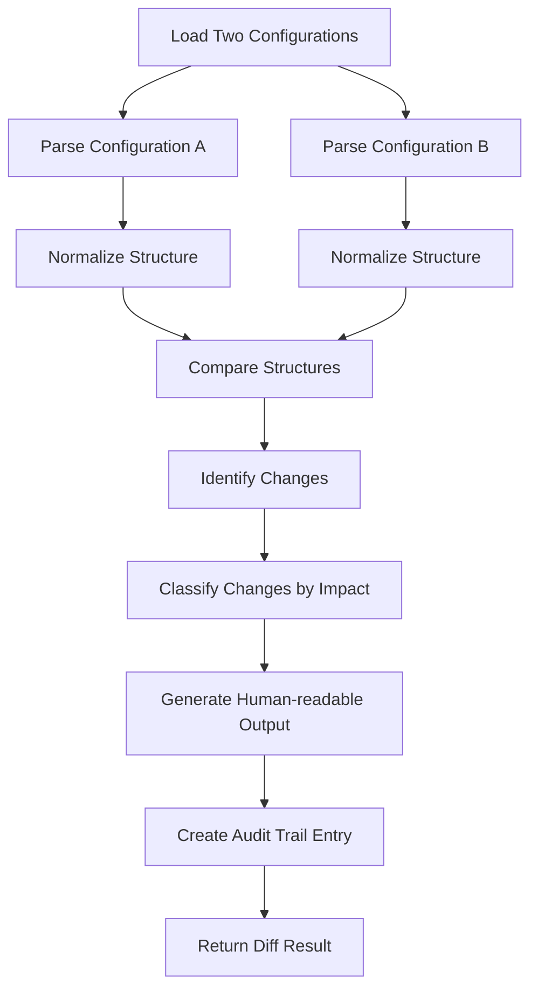
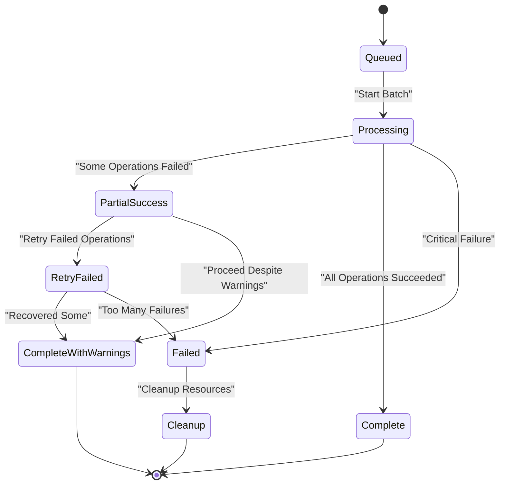
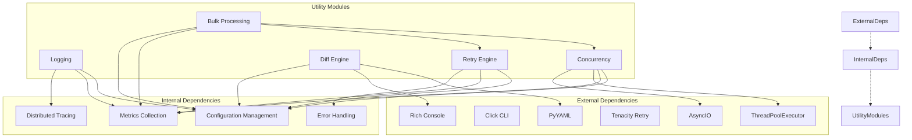

# Utility Modules

<cite>
**Referenced Files in This Document**
- [README.md](file://README.md)
</cite>

## Table of Contents
1. [Introduction](#introduction)
2. [Project Structure](#project-structure)
3. [Core Components](#core-components)
4. [Architecture Overview](#architecture-overview)
5. [Detailed Component Analysis](#detailed-component-analysis)
6. [Dependency Analysis](#dependency-analysis)
7. [Performance Considerations](#performance-considerations)
8. [Troubleshooting Guide](#troubleshooting-guide)
9. [Conclusion](#conclusion)
10. [Appendices](#appendices)

## Introduction

The Enterprise Network Automation Platform provides a comprehensive set of utility modules under `python/utils/` that deliver common functionality across the entire platform. These utilities form the foundation for reliable, scalable, and maintainable network automation operations, supporting thousands of devices across multi-vendor, multi-region environments.

The utility modules are designed following production-grade principles, emphasizing reliability, observability, and extensibility. They provide essential building blocks for logging, error handling, concurrent operations, configuration management, and large-scale data processing - all critical components for enterprise network automation at scale.

## Project Structure

The utility modules are organized within the `python/utils/` directory as part of the broader Python automation framework. According to the platform architecture, these utilities support various automation components including SSH connections, NETCONF clients, RESTCONF interfaces, SNMP operations, telemetry collection, configuration generation, validation, backup systems, and compliance checking.



**Diagram sources**
- [README.md:438-456](file://README.md#L438-L456)

**Section sources**
- [README.md:103-180](file://README.md#L103-L180)
- [README.md:438-456](file://README.md#L438-L456)

## Core Components

The utility modules provide five core areas of functionality that are essential for enterprise network automation:

### Logging Utilities
Structured logging with log rotation and centralized aggregation capabilities, providing consistent observability across all automation components.

### Retry Mechanisms
Sophisticated retry logic with exponential backoff, circuit breaker patterns, and failure recovery strategies for handling transient network failures.

### Concurrency Utilities
Parallel device operation support, connection pooling, and resource management for efficient scaling across thousands of devices.

### Diff Operations
Configuration comparison tools with change detection and human-readable output formatting for audit trails and compliance reporting.

### Bulk Processing
High-performance utilities for handling large-scale operations efficiently across distributed device fleets.

**Section sources**
- [README.md:438-456](file://README.md#L438-L456)

## Architecture Overview

The utility modules follow a layered architecture pattern where each component provides specific functionality while maintaining loose coupling through well-defined interfaces. The design emphasizes composability, allowing utilities to be combined for complex automation scenarios.



This architecture ensures that utility functions remain independent, testable, and reusable across different parts of the automation platform while providing clear separation of concerns between application logic and infrastructure interactions.

## Detailed Component Analysis

### Logging Utilities

The logging system provides structured logging capabilities with support for multiple output formats, log rotation, and centralized aggregation. It integrates with the platform's monitoring stack including Prometheus, Grafana, and OpenTelemetry.

#### Key Features
- Structured JSON logging with contextual metadata
- Log level filtering and dynamic configuration
- Rotation policies based on size and time
- Integration with centralized log collectors
- Performance metrics and health monitoring

#### Implementation Pattern
The logging module follows a factory pattern where loggers are created per component with predefined schemas and retention policies. Each logger instance includes contextual information such as device identifiers, operation types, and correlation IDs for distributed tracing.



**Diagram sources**
- [README.md:438-456](file://README.md#L438-L456)

### Retry Mechanisms

The retry system implements sophisticated resilience patterns including exponential backoff, jitter, circuit breaking, and failure recovery strategies. It handles transient network failures gracefully while preventing cascading failures across the automation platform.

#### Core Patterns
- **Exponential Backoff**: Progressive delay increases between retry attempts
- **Jitter**: Randomized delays to prevent thundering herd problems
- **Circuit Breaker**: Fail-fast behavior when downstream services are unhealthy
- **Bulkhead Isolation**: Resource isolation to prevent cascade failures
- **Failure Recovery**: Automatic recovery strategies based on error types

#### Configuration Schema
The retry mechanism supports flexible configuration through environment variables and runtime parameters, allowing fine-tuning for different operational scenarios and device characteristics.



**Diagram sources**
- [README.md:438-456](file://README.md#L438-L456)

### Concurrency Utilities

The concurrency layer provides high-performance parallel execution capabilities optimized for network device operations. It manages connection pools, thread safety, and resource allocation to maximize throughput while maintaining stability.

#### Key Components
- **Connection Pool Manager**: Efficient reuse of network connections
- **Worker Pool**: Configurable parallelism with resource limits
- **Task Scheduler**: Priority-based task queuing and load balancing
- **Resource Monitor**: Real-time resource utilization tracking
- **Graceful Shutdown**: Clean resource cleanup and state preservation

#### Connection Pool Strategy
The pool manager implements adaptive sizing based on device response times, network conditions, and system resources. It supports both synchronous and asynchronous connection acquisition patterns.



**Diagram sources**
- [README.md:438-456](file://README.md#L438-L456)

### Diff Operations

The diff engine provides powerful configuration comparison capabilities with intelligent change detection, semantic analysis, and human-readable output formatting. It supports multiple configuration formats and vendor-specific parsing rules.

#### Core Capabilities
- **Multi-format Support**: YAML, JSON, XML, and vendor-specific formats
- **Semantic Comparison**: Understanding of configuration semantics beyond text differences
- **Change Classification**: Categorization of changes by impact and risk level
- **Human-readable Output**: Formatted diffs suitable for review and approval workflows
- **Audit Trail Generation**: Comprehensive change history with attribution

#### Change Detection Algorithm
The diff engine uses a combination of structural analysis and semantic understanding to identify meaningful changes while ignoring irrelevant differences like timestamps or ordering variations.



**Diagram sources**
- [README.md:438-456](file://README.md#L438-L456)

### Bulk Processing

The bulk processing utilities enable efficient handling of large-scale operations across thousands of devices with built-in error handling, progress tracking, and resource optimization.

#### Processing Strategies
- **Batch Processing**: Group operations into manageable chunks
- **Parallel Execution**: Concurrent processing with controlled resource usage
- **Progress Tracking**: Real-time status updates and completion metrics
- **Error Isolation**: Individual operation failures don't affect batch completion
- **Resume Capability**: Ability to resume interrupted bulk operations

#### Performance Optimization
The bulk processor implements adaptive batching based on device response characteristics, network conditions, and system resource availability to maximize throughput while maintaining stability.



**Diagram sources**
- [README.md:438-456](file://README.md#L438-L456)

## Dependency Analysis

The utility modules maintain loose coupling through well-defined interfaces while providing strong cohesion within each functional area. Dependencies flow from higher-level automation components down to the utility layer, ensuring that utilities remain reusable and testable.



**Diagram sources**
- [README.md:438-456](file://README.md#L438-L456)

**Section sources**
- [README.md:438-456](file://README.md#L438-L456)

## Performance Considerations

The utility modules are designed with performance and scalability as primary concerns, implementing several optimization strategies:

### Memory Management
- Lazy loading of large configuration files
- Streaming processing for bulk operations
- Efficient data structures for configuration comparisons
- Garbage collection optimization for long-running processes

### CPU Utilization
- Parallel processing with optimal worker count configuration
- Asynchronous I/O for network operations
- Efficient algorithms for configuration diff operations
- Caching mechanisms for frequently accessed data

### Network Efficiency
- Connection pooling to reduce TCP handshake overhead
- Request batching for API calls
- Compression for large data transfers
- Timeout tuning based on device characteristics

### Scalability Patterns
- Horizontal scaling support through stateless design
- Graceful degradation under high load
- Resource limits to prevent system overload
- Monitoring and alerting for performance issues

## Troubleshooting Guide

Common issues and their resolutions when working with the utility modules:

### Logging Issues
- **Missing log entries**: Verify log level configuration and handler setup
- **Performance degradation**: Check log rotation settings and centralized logging connectivity
- **Incomplete context**: Ensure proper context propagation in distributed operations

### Retry Failures
- **Too many retries**: Adjust retry limits and backoff parameters
- **Circuit breaker too aggressive**: Tune failure thresholds and recovery timeouts
- **Resource exhaustion**: Review connection pool sizes and worker limits

### Concurrency Problems
- **Deadlocks**: Check for circular dependencies in resource acquisition
- **Memory leaks**: Monitor connection pool cleanup and worker lifecycle
- **Uneven load distribution**: Review task scheduling and worker assignment strategies

### Diff Operation Issues
- **Incorrect change detection**: Validate configuration parsing and normalization
- **Slow performance**: Optimize comparison algorithms and caching strategies
- **Memory consumption**: Implement streaming processing for large configurations

### Bulk Processing Failures
- **Batch timeouts**: Adjust batch sizes and timeout configurations
- **Partial failures**: Review error handling and retry strategies
- **Resource contention**: Tune parallelism levels and resource limits

**Section sources**
- [README.md:674-685](file://README.md#L674-L685)

## Conclusion

The utility modules under `python/utils/` provide a robust foundation for enterprise-scale network automation. Their modular design, comprehensive feature set, and production-ready implementations enable reliable, scalable, and maintainable automation across diverse network environments.

Key strengths include:
- **Reliability**: Sophisticated error handling and recovery mechanisms
- **Scalability**: Optimized for large-scale operations across thousands of devices
- **Observability**: Comprehensive logging and monitoring integration
- **Flexibility**: Extensible architecture supporting custom requirements
- **Maintainability**: Well-documented, tested, and following best practices

These utilities serve as the backbone of the automation platform, enabling teams to build sophisticated network automation solutions while focusing on business logic rather than infrastructure concerns.

## Appendices

### Integration Examples

#### Basic Logging Integration
```python
from python.utils.logging import get_logger

logger = get_logger("my_component")
logger.info("Processing device configuration", {"device_id": "router-01"})
```

#### Retry with Exponential Backoff
```python
from python.utils.retry import retry_with_backoff

@retry_with_backoff(max_retries=3, base_delay=1.0)
def connect_to_device(device):
    return device.connect()
```

#### Parallel Device Operations
```python
from python.utils.concurrency import parallel_execute

results = parallel_execute(
    tasks=device_operations,
    max_workers=10,
    timeout=300
)
```

#### Configuration Diff Operations
```python
from python.utils.diff import compare_configs

diff_result = compare_configs(
    config_a=current_config,
    config_b=target_config,
    format="yaml"
)
```

#### Bulk Processing
```python
from python.utils.bulk import bulk_processor

processor = bulk_processor(
    batch_size=50,
    max_concurrent=10,
    retry_enabled=True
)

results = processor.execute(operation_function, device_list)
```

### Configuration Reference

#### Logging Configuration
```yaml
logging:
  level: INFO
  format: json
  handlers:
    - type: file
      path: /var/log/automation/app.log
      rotation: daily
      max_size: 100MB
    - type: console
      level: DEBUG
    - type: http
      endpoint: https://logs.example.com/collect
      batch_size: 100
```

#### Retry Configuration
```yaml
retry:
  max_retries: 3
  base_delay: 1.0
  max_delay: 60.0
  backoff_factor: 2.0
  jitter: true
  circuit_breaker:
    failure_threshold: 5
    recovery_timeout: 30
```

#### Concurrency Configuration
```yaml
concurrency:
  max_workers: 10
  connection_pool_size: 20
  task_queue_size: 1000
  timeout: 300
  graceful_shutdown: true
```

**Section sources**
- [README.md:438-456](file://README.md#L438-L456)