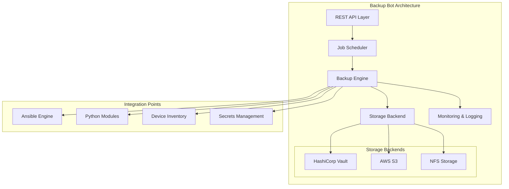
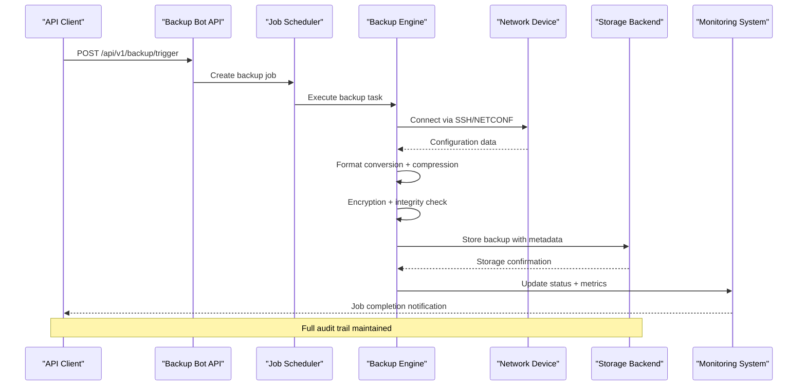
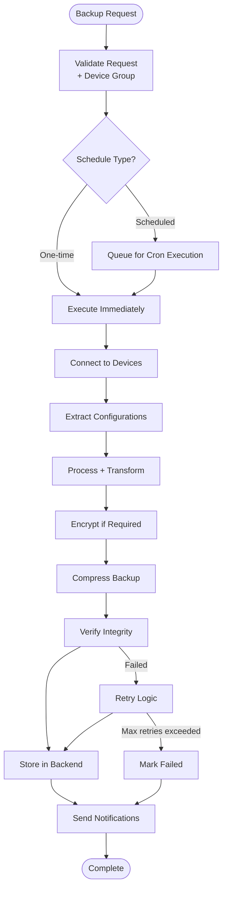
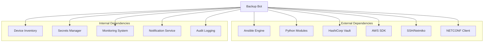

# Backup Bot

<cite>
**Referenced Files in This Document**
- [README.md](file://README.md)
</cite>

## Table of Contents
1. [Introduction](#introduction)
2. [Project Structure](#project-structure)
3. [Core Components](#core-components)
4. [Architecture Overview](#architecture-overview)
5. [Detailed Component Analysis](#detailed-component-analysis)
6. [Dependency Analysis](#dependency-analysis)
7. [Performance Considerations](#performance-considerations)
8. [Troubleshooting Guide](#troubleshooting-guide)
9. [Conclusion](#conclusion)
10. [Appendices](#appendices)

## Introduction

The Backup Bot is a critical component of the Enterprise Network Automation Platform that provides automated backup scheduling and management capabilities for network devices across multi-vendor environments. As part of the broader automation bot ecosystem, the Backup Bot exposes REST APIs for triggering backups, managing retention policies, and restoring configurations while integrating with multiple storage backends including HashiCorp Vault, AWS S3, and NFS.

This sub-feature is designed to handle enterprise-scale backup operations across thousands of network devices, supporting various backup formats, encryption options, incremental backups, and comprehensive disaster recovery procedures with testing capabilities.

## Project Structure

The Backup Bot is implemented as part of the automation bots architecture within the network automation platform. The system follows a modular design pattern where each bot provides specific API endpoints and ChatOps integrations.

**Diagram sources**
- [README.md:460-478](file://README.md#L460-L478)
- [README.md:438-457](file://README.md#L438-L457)

**Section sources**
- [README.md:460-478](file://README.md#L460-L478)
- [README.md:438-457](file://README.md#L438-L457)

## Core Components

The Backup Bot system consists of several core components that work together to provide comprehensive backup management capabilities:

### REST API Layer
The Backup Bot exposes REST API endpoints under `/api/v1/backup` for programmatic access to backup operations. These endpoints support one-time backups, scheduled jobs, bulk operations, and configuration restoration.

### Job Scheduler
A robust scheduling system manages backup jobs with support for cron expressions, device group targeting, and dependency resolution. The scheduler integrates with the CI/CD pipeline through GitHub Actions for automated execution.

### Backup Engine
The core engine handles device connectivity, configuration extraction, format conversion, compression, encryption, and storage operations. It leverages the existing Python modules for SSH connectivity and configuration parsing.

### Storage Backend Integration
Support for multiple storage backends including HashiCorp Vault (with versioning), AWS S3 (with lifecycle policies), and NFS (for on-premises storage). Each backend supports different retention policies and access controls.

### Monitoring and Verification
Comprehensive monitoring includes backup success/failure tracking, integrity verification, storage utilization metrics, and alerting for failed operations or policy violations.

**Section sources**
- [README.md:460-478](file://README.md#L460-L478)
- [README.md:438-457](file://README.md#L438-L457)
- [README.md:511-514](file://README.md#L511-L514)

## Architecture Overview

The Backup Bot architecture follows a microservices-inspired design with clear separation of concerns and extensive integration points with the broader automation platform.

**Diagram sources**
- [README.md:460-478](file://README.md#L460-L478)
- [README.md:438-457](file://README.md#L438-L457)

### Data Flow Architecture

**Diagram sources**
- [README.md:438-457](file://README.md#L438-L457)
- [README.md:511-514](file://README.md#L511-L514)

## Detailed Component Analysis

### REST API Endpoints

The Backup Bot provides comprehensive REST API endpoints for all backup operations:

#### One-Time Backup Operations
- `POST /api/v1/backup/trigger` - Trigger immediate backup for specified devices
- `POST /api/v1/backup/bulk` - Execute bulk backup operations across device groups
- `GET /api/v1/backup/status/{job_id}` - Check backup job status and progress

#### Scheduled Backup Management
- `POST /api/v1/backup/schedule` - Create new scheduled backup jobs
- `PUT /api/v1/backup/schedule/{schedule_id}` - Update existing schedules
- `DELETE /api/v1/backup/schedule/{schedule_id}` - Remove scheduled jobs
- `GET /api/v1/backup/schedules` - List all active backup schedules

#### Retention Policy Management
- `POST /api/v1/backup/policies` - Define retention policies
- `PUT /api/v1/backup/policies/{policy_id}` - Modify retention rules
- `DELETE /api/v1/backup/policies/{policy_id}` - Remove retention policies
- `GET /api/v1/backup/policies` - View all retention policies

#### Configuration Restoration
- `POST /api/v1/backup/restore` - Restore configuration from backup
- `GET /api/v1/backup/list/{device_id}` - List available backups for device
- `GET /api/v1/backup/details/{backup_id}` - Get backup metadata and integrity info

### Backup Formats and Processing

The system supports multiple backup formats optimized for different use cases:

#### Native Format Support
- **Vendor-Specific**: Cisco IOS/NX-OS, Juniper Junos, Arista EOS, Palo Alto PAN-OS
- **Standardized**: YAML structured configuration with vendor abstraction
- **Diff-Based**: Incremental changes between backup versions

#### Processing Pipeline
- **Compression**: gzip, zstd with configurable compression levels
- **Encryption**: AES-256-GCM with key rotation support
- **Integrity**: SHA-256 checksums with digital signatures
- **Metadata**: Rich metadata including device info, timestamps, operator context

### Storage Backend Integration

#### HashiCorp Vault Integration
- **Versioning**: Automatic version control with unlimited history
- **Access Control**: Fine-grained permissions per device group
- **Audit Trail**: Complete access logging and compliance reporting
- **Key Management**: Integration with Vault PKI for encryption keys

#### AWS S3 Integration
- **Lifecycle Policies**: Automated archival and deletion based on retention rules
- **Cross-Region Replication**: Disaster recovery across AWS regions
- **Access Patterns**: Intelligent tiering (Standard, IA, Glacier)
- **Security**: Server-side encryption with KMS integration

#### NFS Storage Support
- **On-Premises**: Traditional NFS mounts for air-gapped environments
- **Performance**: Direct filesystem access for high-throughput scenarios
- **Simplicity**: Minimal infrastructure requirements
- **Compliance**: File-level ACLs and audit logging

### Backup Verification and Integrity Checking

The system implements comprehensive verification processes:

#### Pre-Storage Verification
- **Configuration Parsing**: Validate syntax and structure
- **Completeness Check**: Ensure all required sections are present
- **Format Validation**: Verify backup format compatibility
- **Size Thresholds**: Flag unusually large or small backups

#### Post-Storage Verification
- **Checksum Validation**: SHA-256 integrity verification
- **Decryption Testing**: Confirm encryption/decryption works correctly
- **Restore Simulation**: Dry-run restore without applying changes
- **Metadata Consistency**: Verify backup metadata accuracy

#### Automated Testing Capabilities
- **Periodic Verification**: Scheduled integrity checks against stored backups
- **Restore Drills**: Automated test restores to isolated environments
- **Recovery Time Objectives**: Measure and report RTO compliance
- **Data Loss Prevention**: Detect and alert on potential data corruption

**Section sources**
- [README.md:460-478](file://README.md#L460-L478)
- [README.md:438-457](file://README.md#L438-L457)
- [README.md:339-368](file://README.md#L339-L368)

## Dependency Analysis

The Backup Bot has well-defined dependencies on other system components:

**Diagram sources**
- [README.md:438-457](file://README.md#L438-L457)
- [README.md:339-368](file://README.md#L339-L368)

### Key Dependency Relationships

#### Infrastructure Dependencies
- **Ansible Engine**: For device configuration management and rollback operations
- **Python Modules**: Reusable components for SSH connectivity, configuration parsing, and validation
- **Secrets Management**: Secure credential handling through HashiCorp Vault or cloud providers

#### Operational Dependencies
- **Monitoring System**: Prometheus metrics collection and Grafana dashboards
- **Notification Service**: Slack/Teams integration for operational alerts
- **Audit Logging**: Comprehensive audit trails for compliance and forensics

**Section sources**
- [README.md:438-457](file://README.md#L438-L457)
- [README.md:339-368](file://README.md#L339-L368)

## Performance Considerations

### Scalability Architecture
The Backup Bot is designed for enterprise-scale operations:

- **Parallel Processing**: Concurrent backup operations across device groups
- **Connection Pooling**: Efficient device connection management
- **Batch Operations**: Optimized bulk processing for large device fleets
- **Resource Limits**: Configurable concurrency limits to prevent resource exhaustion

### Optimization Strategies
- **Incremental Backups**: Only process changed configurations when possible
- **Compression Tuning**: Balance between storage efficiency and CPU usage
- **Caching**: Device capability caching to reduce discovery overhead
- **Staggered Scheduling**: Avoid peak hour backup operations

### Monitoring Metrics
- **Backup Success Rate**: Track overall reliability
- **Execution Time**: Monitor performance trends
- **Storage Utilization**: Track growth patterns and capacity planning
- **Error Rates**: Identify problematic devices or configurations

## Troubleshooting Guide

### Common Issues and Resolutions

#### Connection Problems
- **SSH Timeout**: Verify device reachability and credentials
- **Authentication Failure**: Check secrets manager integration
- **Protocol Mismatch**: Ensure correct protocol selection per vendor

#### Storage Issues
- **Vault Access Denied**: Review Vault policies and token permissions
- **S3 Permission Errors**: Validate IAM roles and bucket policies
- **NFS Mount Failures**: Check network connectivity and mount permissions

#### Performance Issues
- **Slow Backups**: Investigate device response times and network latency
- **High Memory Usage**: Adjust parallel processing limits
- **Storage Bloat**: Review retention policies and cleanup operations

#### Recovery Procedures
- **Partial Restores**: Target specific configuration sections
- **Bulk Rollbacks**: Coordinate across device groups
- **Emergency Recovery**: Bypass normal workflows for critical situations

**Section sources**
- [README.md:674-685](file://README.md#L674-L685)

## Conclusion

The Backup Bot represents a comprehensive solution for enterprise network configuration backup and recovery. Its modular architecture, extensive integration capabilities, and robust feature set make it suitable for managing backup operations across thousands of network devices in complex, multi-vendor environments.

The system's emphasis on security, compliance, and operational visibility ensures that organizations can maintain confidence in their backup strategies while meeting regulatory requirements. The flexible storage backend support allows adaptation to various infrastructure constraints and preferences.

Future enhancements should focus on AI-driven anomaly detection in configuration changes, improved incremental backup algorithms, and enhanced disaster recovery automation capabilities.

## Appendices

### API Reference Summary

#### Authentication
All API endpoints require authentication through the platform's unified authentication system, supporting OAuth2, JWT tokens, and API keys.

#### Rate Limiting
- **Default Limits**: 100 requests per minute per client
- **Burst Capacity**: 200 requests per second for short bursts
- **Backoff Strategy**: Exponential backoff with jitter

#### Error Response Format
Standardized error responses include:
- HTTP status codes
- Error codes and messages
- Request correlation IDs
- Timestamp information
- Suggested remediation steps

### Compliance and Security

#### Data Protection
- **Encryption at Rest**: AES-256 encryption for all stored backups
- **Encryption in Transit**: TLS 1.3 for all API communications
- **Key Rotation**: Automated key rotation with zero downtime
- **Access Controls**: Role-based access control with least privilege principle

#### Audit Requirements
- **Complete Audit Trail**: All backup operations logged with full context
- **Retention Policies**: Configurable log retention periods
- **Compliance Reporting**: Automated compliance reports for auditors
- **Forensic Support**: Detailed investigation capabilities for security incidents