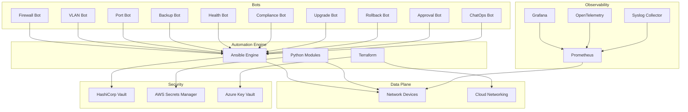
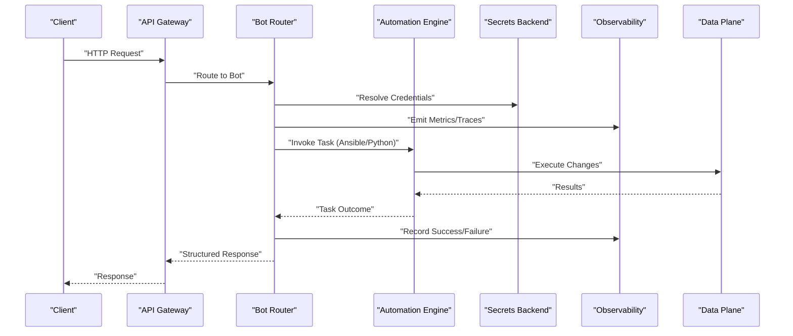
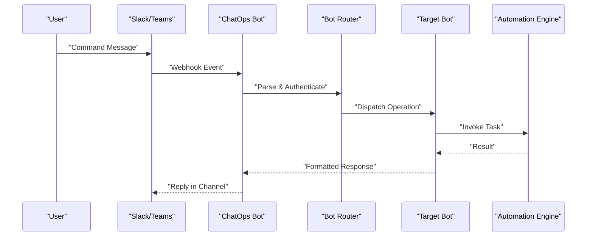
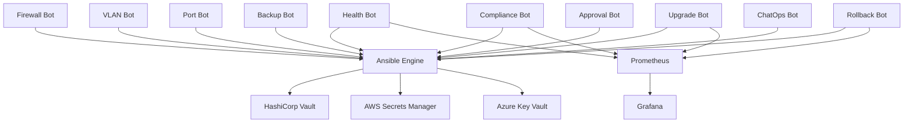

# Bot Architecture

<cite>
**Referenced Files in This Document**
- [README.md](file://README.md)
</cite>

## Table of Contents
1. [Introduction](#introduction)
2. [Project Structure](#project-structure)
3. [Core Components](#core-components)
4. [Architecture Overview](#architecture-overview)
5. [Detailed Component Analysis](#detailed-component-analysis)
6. [Dependency Analysis](#dependency-analysis)
7. [Performance Considerations](#performance-considerations)
8. [Troubleshooting Guide](#troubleshooting-guide)
9. [Conclusion](#conclusion)
10. [Appendices](#appendices)

## Introduction
This document describes the bot architecture component of the Enterprise Network Automation Platform. The platform provides a modular bot system that exposes REST APIs and ChatOps integrations for self-service network operations. Bots orchestrate automation tasks across devices and cloud networking components, integrating with CI/CD pipelines, observability systems, and secrets backends.

The repository defines a comprehensive set of bots including Firewall, VLAN, Port, Backup, Health, Compliance, Upgrade, Rollback, Approval, and a unified ChatOps router. These bots coordinate with Ansible, Python modules, and external services to perform safe, auditable, and compliant network changes at enterprise scale.

## Project Structure
The repository organizes automation assets into clear layers: inventories, playbooks, roles, templates, Python modules, tests, compliance policies, CI/CD workflows, monitoring, Terraform, and bots. The bots directory enumerates individual bot implementations and shared ChatOps integration code.

**Diagram sources**
- [README.md:54-99](file://README.md#L54-L99)

**Section sources**
- [README.md:103-180](file://README.md#L103-L180)

## Core Components
The bot system is composed of specialized bots that expose REST endpoints and optional ChatOps commands. Each bot encapsulates a specific operational domain and integrates with the automation engine (Ansible/Python) and supporting infrastructure (secrets, observability).

Key bots and responsibilities:
- Firewall Bot: Request, validate, and deploy firewall rules via REST and ChatOps.
- VLAN Bot: Provision VLANs with approval workflow support.
- Port Bot: Enable/disable/configure switch ports through API and ChatOps.
- Backup Bot: Trigger and schedule device backups; integrate with GitHub triggers.
- Health Bot: On-demand health checks across all devices.
- Compliance Bot: Run compliance scans and report violations; GitHub integration.
- Upgrade Bot: Orchestrate firmware upgrades with rollback capabilities.
- Rollback Bot: One-click rollback to last known good configuration.
- Approval Bot: Manage approval workflows for change requests.
- ChatOps Bot: Unified command router for all bot operations across Slack and Teams.

API surface overview:
- /api/v1/firewall/rules
- /api/v1/vlan
- /api/v1/port
- /api/v1/backup
- /api/v1/health
- /api/v1/compliance
- /api/v1/upgrade
- /api/v1/rollback
- /api/v1/chatops
- /api/v1/approvals

ChatOps channels:
- Slack and Microsoft Teams are supported by multiple bots.
- GitHub Actions serve as triggers for scheduled or manual operations (e.g., backup scheduling, compliance scans).

**Section sources**
- [README.md:460-476](file://README.md#L460-L476)

## Architecture Overview
The bot layer sits atop the automation engine and orchestrates tasks against data plane resources while leveraging security and observability subsystems. Requests flow from clients (REST or ChatOps) into the appropriate bot, which validates inputs, enforces policy, invokes Ansible/Python modules, and returns structured responses. Observability captures metrics and logs for dashboards and alerting.

[No sources needed since this diagram shows conceptual workflow, not actual code structure]

## Detailed Component Analysis

### Firewall Bot
Purpose:
- Accept firewall rule requests via REST and ChatOps.
- Validate rule schemas and policy constraints.
- Orchestrate deployment using Ansible/Python modules.
- Provide audit trails and status updates.

Operational characteristics:
- Supports Slack and Teams integrations.
- Integrates with secrets backends for credentials.
- Emits metrics for latency and error rates.

**Section sources**
- [README.md:460-476](file://README.md#L460-L476)

### VLAN Bot
Purpose:
- Provision VLANs with an approval workflow.
- Enforce naming and tagging standards.
- Coordinate multi-device changes safely.

Operational characteristics:
- Slack integration for approvals and notifications.
- Uses inventory and group/host variables for target scope.

**Section sources**
- [README.md:460-476](file://README.md#L460-L476)

### Port Bot
Purpose:
- Enable/disable/configure switch ports.
- Apply port-level policies (QoS, ACLs, LACP).
- Provide confirmation and rollback hooks.

Operational characteristics:
- Slack integration for quick actions.
- Validates port availability and conflicts.

**Section sources**
- [README.md:460-476](file://README.md#L460-L476)

### Backup Bot
Purpose:
- Trigger and schedule device backups.
- Integrate with GitHub Actions for automated runs.
- Store encrypted backups in secure backends.

Operational characteristics:
- Scheduled daily execution.
- Versioned backups with integrity checks.

**Section sources**
- [README.md:460-476](file://README.md#L460-L476)

### Health Bot
Purpose:
- Execute on-demand health checks across all devices.
- Aggregate results and highlight anomalies.
- Feed metrics to Prometheus/Grafana.

Operational characteristics:
- Slack/Teams integration for alerts and summaries.
- Uses SNMP/telemetry/syslog collectors.

**Section sources**
- [README.md:460-476](file://README.md#L460-L476)

### Compliance Bot
Purpose:
- Run compliance scans and report violations.
- Enforce SSH-only, NTP, AAA, SNMPv3, cipher standards.
- Integrate with OPA/Batfish for policy analysis.

Operational characteristics:
- GitHub integration for scheduled audits.
- Produces actionable reports and trends.

**Section sources**
- [README.md:460-476](file://README.md#L460-L476)

### Upgrade Bot
Purpose:
- Orchestrate firmware upgrades with pre/post checks.
- Automate rollback on failure.
- Track upgrade progress and outcomes.

Operational characteristics:
- Slack integration for user-initiated upgrades.
- Coordinates with secrets backends for credentials.

**Section sources**
- [README.md:460-476](file://README.md#L460-L476)

### Rollback Bot
Purpose:
- One-click rollback to last known good configuration.
- Diff current vs target state before applying.
- Verify post-rollback health.

Operational characteristics:
- Slack/Teams integration for rapid recovery.
- Integrates with backup storage and verification tools.

**Section sources**
- [README.md:460-476](file://README.md#L460-L476)

### Approval Bot
Purpose:
- Manage approval workflows for change requests.
- Route approvals to designated reviewers.
- Gate deployments based on approval status.

Operational characteristics:
- Slack/Teams integration for approvals and notifications.
- Integrates with CI/CD gates.

**Section sources**
- [README.md:460-476](file://README.md#L460-L476)

### ChatOps Bot
Purpose:
- Unified command router for all bot operations.
- Parse and dispatch commands from Slack and Teams.
- Normalize payloads and enforce authentication.

Operational characteristics:
- Centralized routing and logging.
- Supports multi-channel command processing.

**Section sources**
- [README.md:460-476](file://README.md#L460-L476)

#### Sequence Diagram: ChatOps Command Flow

[No sources needed since this diagram shows conceptual workflow, not actual code structure]

## Dependency Analysis
Bots depend on the automation engine (Ansible/Python), secrets backends, and observability systems. They also interact with CI/CD pipelines for scheduling and approvals.

**Diagram sources**
- [README.md:54-99](file://README.md#L54-L99)
- [README.md:460-476](file://README.md#L460-L476)

**Section sources**
- [README.md:54-99](file://README.md#L54-L99)
- [README.md:460-476](file://README.md#L460-L476)

## Performance Considerations
- Concurrency: Use parallel task execution where safe (e.g., non-conflicting port changes).
- Backoff and retries: Implement exponential backoff for transient failures.
- Batch operations: Group changes to reduce round-trips and lock contention.
- Caching: Cache device capability sets and approved firmware lists.
- Rate limiting: Protect upstream services and devices from overload.
- Observability: Emit detailed metrics and traces for latency, throughput, and error rates.

[No sources needed since this section provides general guidance]

## Troubleshooting Guide
Common issues and resolutions:
- Ansible connection timeout: Verify SSH reachability and credentials resolution.
- Template rendering errors: Check Jinja2 syntax and variable definitions.
- Compliance check failures: Review policy definitions and device running config diffs.
- CI pipeline failures: Inspect GitHub Actions logs for actionable messages.
- Vault authentication failures: Validate OIDC tokens or AppRole credentials and policies.
- Molecule test failures: Ensure Docker/Podman is running and configurations are valid.
- Batfish analysis errors: Validate snapshots and model coverage.

**Section sources**
- [README.md:674-685](file://README.md#L674-L685)

## Conclusion
The bot architecture provides a robust, extensible foundation for self-service network automation. By combining REST APIs, ChatOps integrations, and a strong automation engine, the platform enables safe, compliant, and observable operations at enterprise scale. The modular design supports custom bot development and seamless integration with existing toolchains.

[No sources needed since this section summarizes without analyzing specific files]

## Appendices

### API Endpoints Reference
- /api/v1/firewall/rules
- /api/v1/vlan
- /api/v1/port
- /api/v1/backup
- /api/v1/health
- /api/v1/compliance
- /api/v1/upgrade
- /api/v1/rollback
- /api/v1/chatops
- /api/v1/approvals

**Section sources**
- [README.md:460-476](file://README.md#L460-L476)

### ChatOps Integration Patterns
- Slack and Microsoft Teams are supported across multiple bots.
- Commands are routed through a unified ChatOps bot for consistent parsing and authentication.
- GitHub Actions provide scheduling and manual triggers for certain operations.

**Section sources**
- [README.md:460-476](file://README.md#L460-L476)

### Monitoring and Dashboards
- Prometheus collects metrics from bots and devices.
- Grafana hosts dashboards for network health, automation metrics, compliance overview, upgrade tracking, API performance, and inventory drift.
- OpenTelemetry and Syslog collectors feed observability pipelines.

**Section sources**
- [README.md:583-616](file://README.md#L583-L616)