# Bot Framework Core

<cite>
**Referenced Files in This Document**
- [README.md](file://README.md)
</cite>

## Table of Contents
1. [Introduction](#introduction)
2. [Project Structure](#project-structure)
3. [Core Components](#core-components)
4. [Architecture Overview](#architecture-overview)
5. [Detailed Component Analysis](#detailed-component-analysis)
6. [Dependency Analysis](#dependency-analysis)
7. [Performance Considerations](#performance-considerations)
8. [Troubleshooting Guide](#troubleshooting-guide)
9. [Conclusion](#conclusion)
10. [Appendices](#appendices)

## Introduction
This document describes the foundational architecture and operational model of the bot framework that powers automation bots across the Enterprise Network Automation Platform. It explains how requests are ingested, authenticated, validated, executed, and responded to, with emphasis on middleware processing, logging, metrics, monitoring, secrets management, retry logic, connection pooling, and audit trails. It also provides guidance for registering new bots, configuring them, extending behavior, scaling the system, optimizing performance, and debugging issues.

The platform’s repository layout and bot catalog are defined in the project documentation, which outlines the set of available bots, their endpoints, and ChatOps integrations. The Python modules under python/ provide shared capabilities such as SSH, NETCONF, RESTCONF, SNMP, telemetry, configuration generation, validation, backup, compliance, and utilities including retry and concurrency helpers. These components collectively form the backbone of the bot framework.

## Project Structure
At a high level, the repository organizes automation assets into inventories, playbooks, roles, templates, Python modules, bots, tests, compliance, pipelines, monitoring, and Terraform configurations. Bots are implemented under bots/, while shared networking and automation primitives live under python/. Monitoring is configured under monitoring/, and CI/CD workflows reside under .github/workflows/.

```mermaid
graph TB
subgraph "Bots"
FW["Firewall Bot"]
VLAN["VLAN Bot"]
PORT["Port Bot"]
BACKUP["Backup Bot"]
HEALTH["Health Bot"]
COMPLIANCE["Compliance Bot"]
UPGRADE["Upgrade Bot"]
ROLLBACK["Rollback Bot"]
CHATOPS["ChatOps Bot"]
APPROVAL["Approval Bot"]
end
subgraph "Python Modules"
INV["inventory"]
NC["netconf"]
RC["restconf"]
SSH["ssh"]
SNMP["snmp"]
TEL["telemetry"]
CG["config_gen"]
VAL["validation"]
BK["backup"]
COMP["compliance"]
UTILS["utils"]
end
subgraph "Observability"
PROM["Prometheus"]
GRAF["Grafana"]
OTEL["OpenTelemetry"]
SYSLOG["Syslog Collector"]
end
subgraph "Secrets"
VAULT["HashiCorp Vault"]
AWS_SM["AWS Secrets Manager"]
AZKV["Azure Key Vault"]
end
FW --> UTILS
VLAN --> UTILS
PORT --> UTILS
BACKUP --> UTILS
HEALTH --> UTILS
COMPLIANCE --> UTILS
UPGRADE --> UTILS
ROLLBACK --> UTILS
CHATOPS --> UTILS
APPROVAL --> UTILS
UTILS --> SSH
UTILS --> NC
UTILS --> RC
UTILS --> SNMP
UTILS --> TEL
UTILS --> CG
UTILS --> VAL
UTILS --> BK
UTILS --> COMP
FW --> PROM
VLAN --> PROM
PORT --> PROM
BACKUP --> PROM
HEALTH --> PROM
COMPLIANCE --> PROM
UPGRADE --> PROM
ROLLBACK --> PROM
CHATOPS --> PROM
APPROVAL --> PROM
PROM --> GRAF
OTEL --> PROM
SYSLOG --> PROM
FW --> VAULT
VLAN --> VAULT
PORT --> VAULT
BACKUP --> VAULT
HEALTH --> VAULT
COMPLIANCE --> VAULT
UPGRADE --> VAULT
ROLLBACK --> VAULT
CHATOPS --> VAULT
APPROVAL --> VAULT
FW --> AWS_SM
VLAN --> AWS_SM
PORT --> AWS_SM
BACKUP --> AWS_SM
HEALTH --> AWS_SM
COMPLIANCE --> AWS_SM
UPGRADE --> AWS_SM
ROLLBACK --> AWS_SM
CHATOPS --> AWS_SM
APPROVAL --> AWS_SM
FW --> AZKV
VLAN --> AZKV
PORT --> AZKV
BACKUP --> AZKV
HEALTH --> AZKV
COMPLIANCE --> AZKV
UPGRADE --> AZKV
ROLLBACK --> AZKV
CHATOPS --> AZKV
APPROVAL --> AZKV
```

**Diagram sources**
- [README.md:103-180](file://README.md#L103-L180)
- [README.md:460-476](file://README.md#L460-L476)
- [README.md:438-457](file://README.md#L438-L457)
- [README.md:583-604](file://README.md#L583-L604)
- [README.md:339-357](file://README.md#L339-L357)

**Section sources**
- [README.md:103-180](file://README.md#L103-L180)
- [README.md:438-457](file://README.md#L438-L457)
- [README.md:460-476](file://README.md#L460-L476)
- [README.md:583-604](file://README.md#L583-L604)
- [README.md:339-357](file://README.md#L339-L357)

## Core Components
The bot framework core comprises several cross-cutting concerns that every bot leverages:

- Authentication and Authorization
  - Integration with HashiCorp Vault, AWS Secrets Manager, Azure Key Vault, CyberArk PAM, and Ansible Vault via an adapter layer.
  - OIDC federation for ephemeral CI/CD tokens; short-lived SSH certificates via Vault SSH CA.
- Request Validation
  - Schema-driven validation using JSON/YAML schemas under schemas/.
  - Pre-deployment validation via python/validation/ and compliance checks via python/compliance/.
- Task Execution Pipeline
  - Orchestration through Ansible playbooks and Python modules (python/).
  - Concurrency and retry helpers from python/utils/.
- Response Formatting
  - Standardized API responses for REST endpoints exposed by each bot.
  - Optional ChatOps notifications via Slack, Microsoft Teams, or GitHub Actions.
- Error Handling Patterns
  - Centralized error classification, retries with backoff, and rollback where applicable.
  - Audit trail generation for all operations, persisted alongside backups and logs.
- Middleware Processing
  - Logging, metrics collection, tracing, and request correlation.
  - Rate limiting, throttling, and approval gating for sensitive operations.
- Shared Infrastructure
  - Connection pooling for SSH, NETCONF, RESTCONF, and SNMP sessions.
  - Retry logic with exponential backoff and jitter.
  - Secrets management integration via the adapter layer.
  - Audit trail generation capturing who, what, when, and outcome.

These components ensure consistent behavior across all bots, enabling safe, auditable, and observable automation at enterprise scale.

**Section sources**
- [README.md:339-357](file://README.md#L339-L357)
- [README.md:438-457](file://README.md#L438-L457)
- [README.md:460-476](file://README.md#L460-L476)
- [README.md:583-604](file://README.md#L583-L604)

## Architecture Overview
The bot framework exposes REST APIs and optional ChatOps channels. Requests flow through authentication, validation, middleware, execution, and response formatting. Observability is provided by Prometheus, Grafana, OpenTelemetry, and Syslog collectors. Secrets are retrieved from multiple backends via an adapter layer.

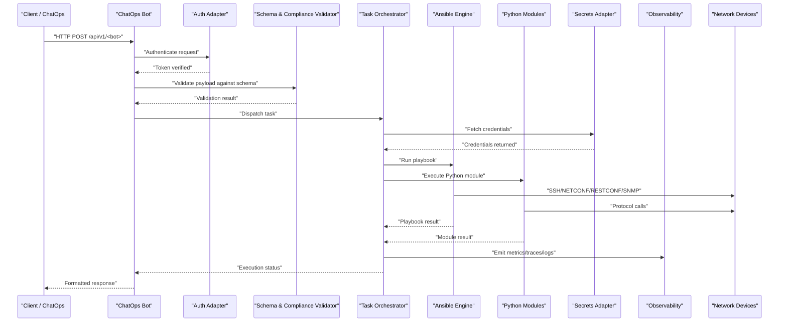

**Diagram sources**
- [README.md:460-476](file://README.md#L460-L476)
- [README.md:438-457](file://README.md#L438-L457)
- [README.md:583-604](file://README.md#L583-L604)
- [README.md:339-357](file://README.md#L339-L357)

## Detailed Component Analysis

### Authentication Mechanisms
- Multi-backend support: HashiCorp Vault, AWS Secrets Manager, Azure Key Vault, CyberArk PAM, Ansible Vault.
- OIDC federation for ephemeral tokens in CI/CD.
- Short-lived SSH certificates via Vault SSH CA.
- Secret rotation policies enforced per secret type.

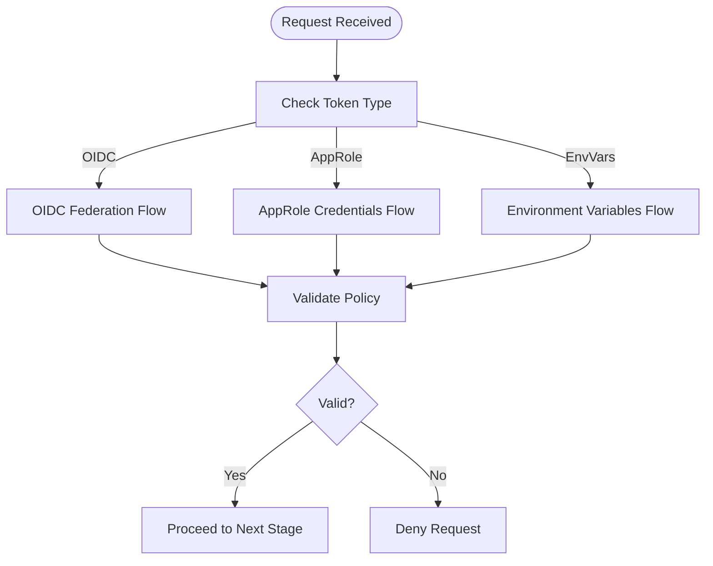

**Diagram sources**
- [README.md:339-357](file://README.md#L339-L357)

**Section sources**
- [README.md:339-357](file://README.md#L339-L357)

### Request Validation
- Schema-driven validation using JSON/YAML schemas under schemas/.
- Pre-deployment validation via python/validation/.
- Compliance checks via python/compliance/ before execution.

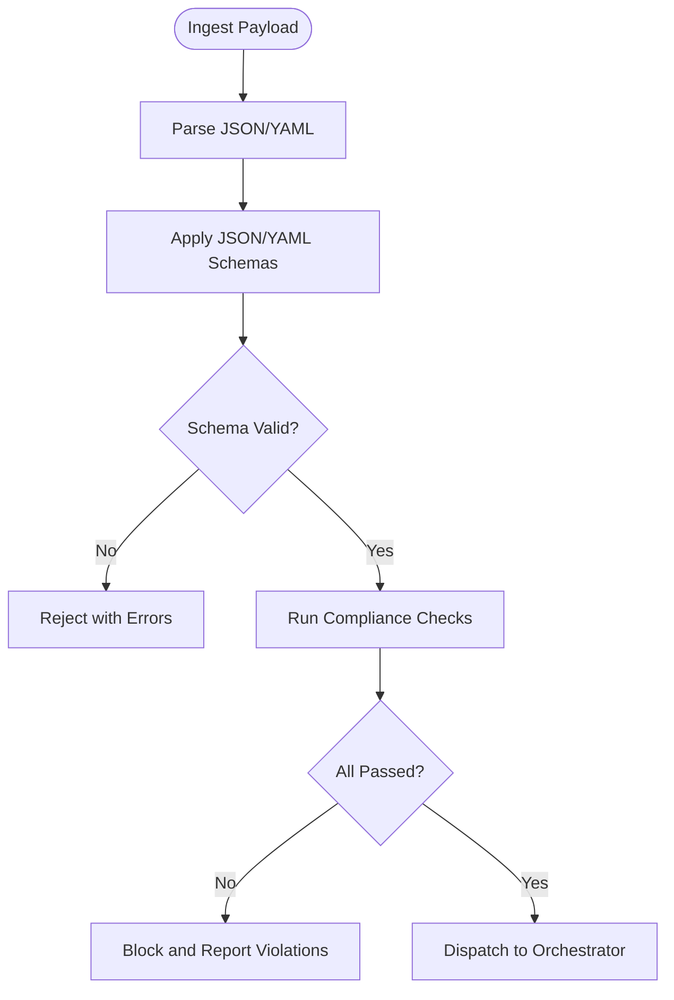

**Diagram sources**
- [README.md:438-457](file://README.md#L438-L457)

**Section sources**
- [README.md:438-457](file://README.md#L438-L457)

### Task Execution Pipeline
- Orchestrates Ansible playbooks and Python modules.
- Uses python/utils/ for retry, concurrency, diff, and bulk operations.
- Integrates with inventory parsing and device enrichment.

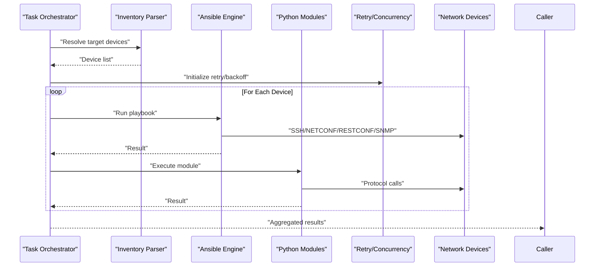

**Diagram sources**
- [README.md:438-457](file://README.md#L438-L457)

**Section sources**
- [README.md:438-457](file://README.md#L438-L457)

### Response Formatting
- Standardized HTTP responses for REST endpoints.
- Optional ChatOps notifications via Slack, Microsoft Teams, or GitHub Actions.
- Includes structured metadata: request ID, timestamps, status, and summary.

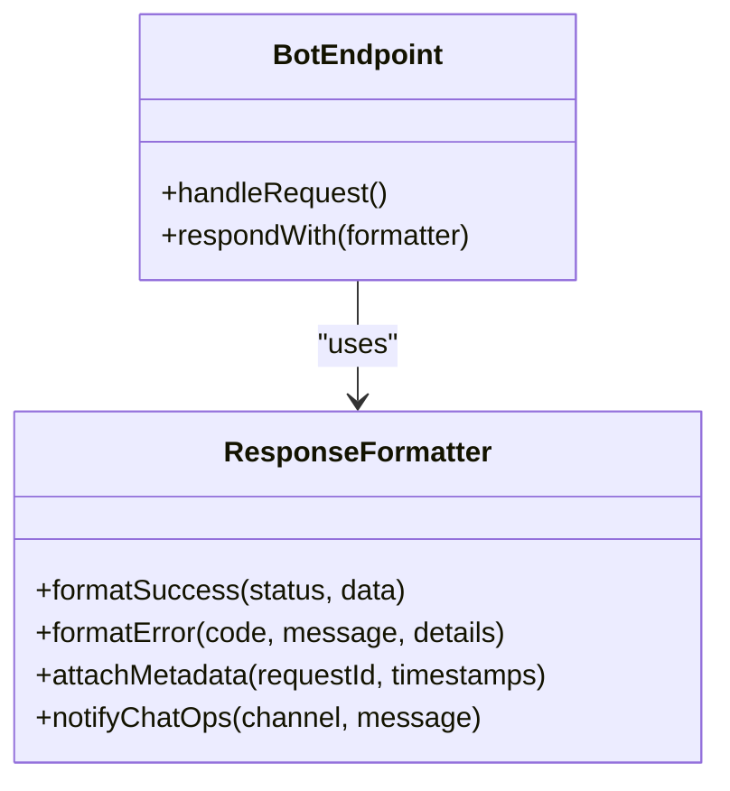

[No diagram sources needed since this diagram shows conceptual structure not tied to specific source files]

**Section sources**
- [README.md:460-476](file://README.md#L460-L476)

### Error Handling Patterns
- Centralized error classification and retry with exponential backoff and jitter.
- Rollback mechanisms for risky operations (e.g., firmware upgrades).
- Audit trail generation capturing outcomes and deviations.

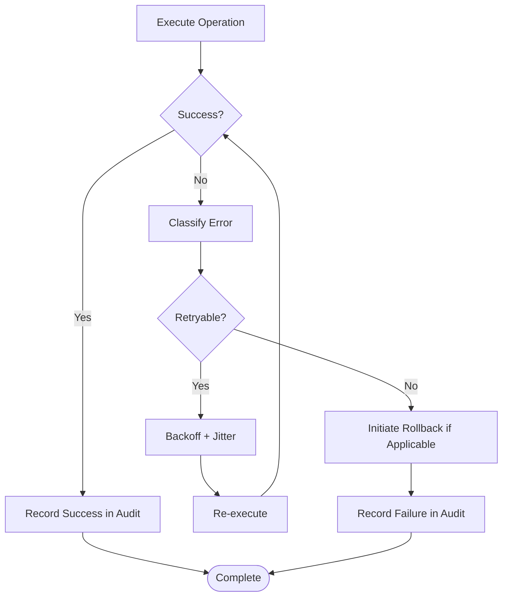

**Diagram sources**
- [README.md:642-671](file://README.md#L642-L671)

**Section sources**
- [README.md:642-671](file://README.md#L642-L671)

### Middleware Processing, Logging, Metrics, and Monitoring
- Middleware applies logging, metrics emission, tracing, and request correlation.
- Prometheus scrapes metrics; Grafana visualizes dashboards; OpenTelemetry collects traces; Syslog collector aggregates logs.
- Alertmanager routes alerts to Slack, PagerDuty, and Teams.

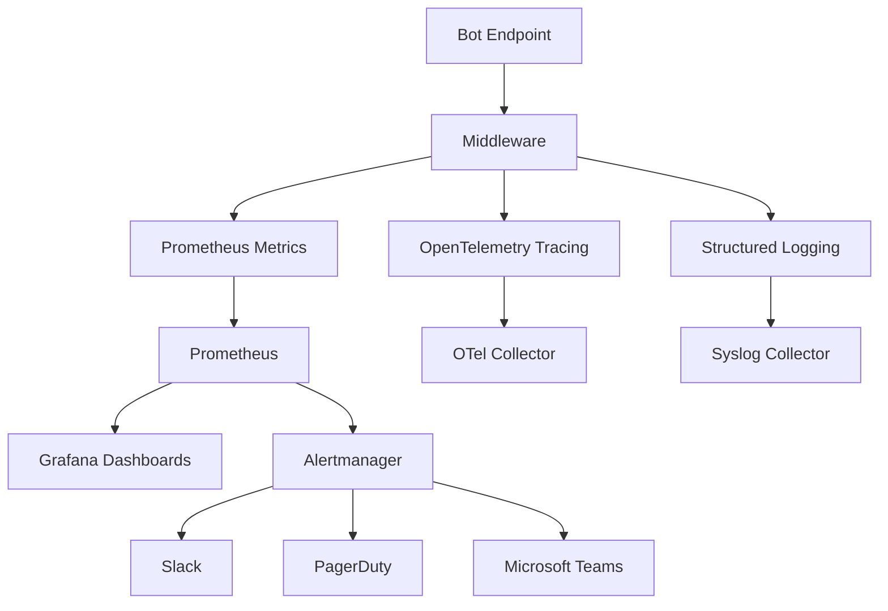

**Diagram sources**
- [README.md:583-604](file://README.md#L583-L604)

**Section sources**
- [README.md:583-604](file://README.md#L583-L604)

### Shared Components
- Connection Pooling: Persistent connections for SSH, NETCONF, RESTCONF, and SNMP to reduce overhead.
- Retry Logic: Exponential backoff with jitter for transient failures.
- Secrets Management: Adapter layer abstracting Vault, AWS Secrets Manager, Azure Key Vault, CyberArk PAM, Ansible Vault.
- Audit Trail: Immutable records of actions, decisions, and outcomes.

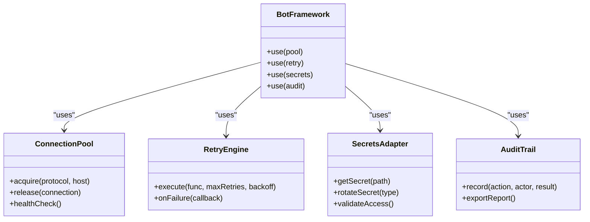

[No diagram sources needed since this diagram shows conceptual structure not tied to specific source files]

**Section sources**
- [README.md:438-457](file://README.md#L438-L457)
- [README.md:339-357](file://README.md#L339-L357)

### Bot Registration and Configuration Patterns
- Register new bots by defining endpoints and routing rules under bots/.
- Configure via YAML/JSON schemas under schemas/ and environment variables.
- Integrate ChatOps channels by specifying channel identifiers and webhook URLs.
- Use existing bot patterns (e.g., Firewall Bot, VLAN Bot) as reference implementations.

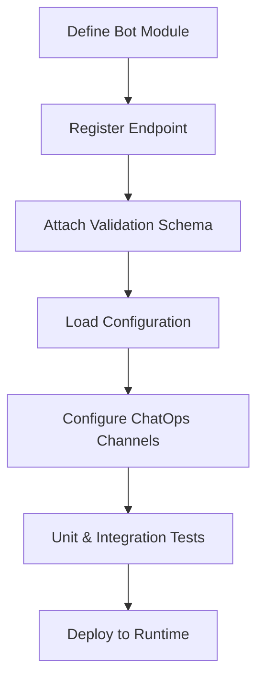

[No diagram sources needed since this diagram shows conceptual workflow not tied to specific source files]

**Section sources**
- [README.md:460-476](file://README.md#L460-L476)
- [README.md:103-180](file://README.md#L103-L180)

### Extension Points for Custom Bot Development
- Implement protocol clients using python/netconf/, python/restconf/, python/ssh/, python/snmp/.
- Leverage python/config_gen/ for Jinja2-based configuration generation.
- Use python/validation/ and python/compliance/ for pre-deployment checks.
- Emit metrics and logs via python/utils/ and integrate with monitoring stack.

**Section sources**
- [README.md:438-457](file://README.md#L438-L457)

## Dependency Analysis
The bot framework depends on shared Python modules for networking, configuration generation, validation, backup, and compliance. It integrates with observability tools and secrets backends.

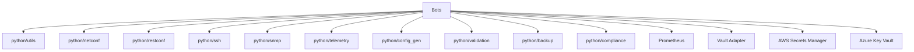

**Diagram sources**
- [README.md:438-457](file://README.md#L438-L457)
- [README.md:583-604](file://README.md#L583-L604)
- [README.md:339-357](file://README.md#L339-L357)

**Section sources**
- [README.md:438-457](file://README.md#L438-L457)
- [README.md:583-604](file://README.md#L583-L604)
- [README.md:339-357](file://README.md#L339-L357)

## Performance Considerations
- Connection Pooling: Maintain persistent connections to reduce handshake overhead.
- Concurrency: Use parallel execution with bounded worker pools to avoid overwhelming devices.
- Retry Strategy: Apply exponential backoff with jitter to mitigate transient network errors.
- Caching: Cache device capability sets and inventory enrichments where appropriate.
- Batch Operations: Group small changes to minimize round trips.
- Resource Limits: Enforce rate limits and timeouts per endpoint and per device group.
- Observability: Track latency percentiles and error rates to identify bottlenecks.

[No sources needed since this section provides general guidance]

## Troubleshooting Guide
Common issues and resolutions include:
- Ansible connection timeout: Verify SSH reachability using ping commands against inventories.
- Template rendering errors: Use debug flags to inspect Jinja2 rendering paths.
- Compliance check failures: Review policy definitions and running config diffs.
- CI pipeline failures: Inspect GitHub Actions logs for actionable messages.
- Vault authentication failures: Validate OIDC tokens or AppRole credentials and policies.
- Molecule test failures: Ensure Docker/Podman is running and check molecule configuration.
- Batfish analysis errors: Validate snapshots and configuration inputs.

**Section sources**
- [README.md:674-685](file://README.md#L674-L685)

## Conclusion
The bot framework core provides a robust foundation for secure, observable, and scalable network automation. By standardizing authentication, validation, execution, response formatting, and error handling, it enables consistent operation across diverse bots and protocols. Shared components like connection pooling, retry logic, secrets management, and audit trails enhance reliability and compliance. With clear extension points and comprehensive observability, teams can develop custom bots efficiently while maintaining enterprise-grade standards.

[No sources needed since this section summarizes without analyzing specific files]

## Appendices

### Bot Catalog Reference
- Firewall Bot: /api/v1/firewall/rules
- VLAN Bot: /api/v1/vlan
- Port Bot: /api/v1/port
- Backup Bot: /api/v1/backup
- Health Bot: /api/v1/health
- Compliance Bot: /api/v1/compliance
- Upgrade Bot: /api/v1/upgrade
- Rollback Bot: /api/v1/rollback
- ChatOps Bot: /api/v1/chatops
- Approval Bot: /api/v1/approvals

**Section sources**
- [README.md:460-476](file://README.md#L460-L476)