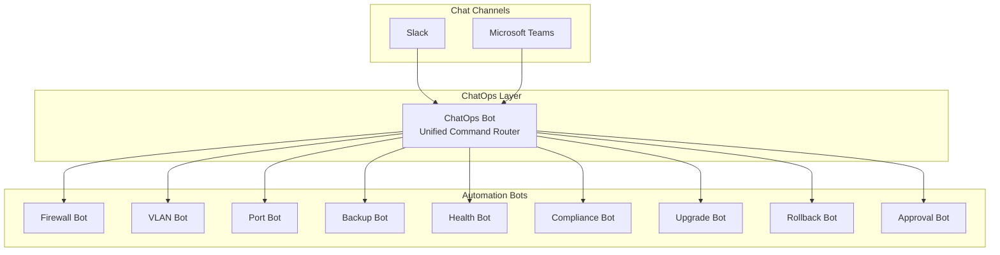
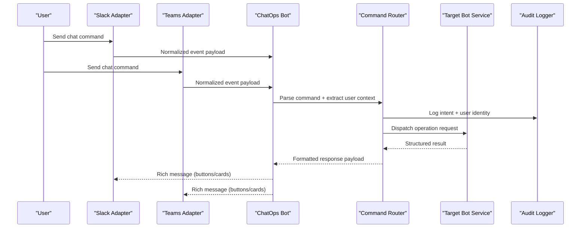
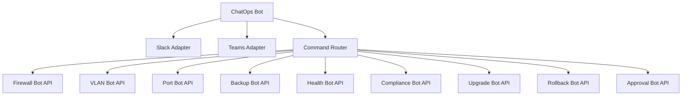

# ChatOps Integration

<cite>
**Referenced Files in This Document**
- [README.md](file://README.md)
</cite>

## Table of Contents
1. [Introduction](#introduction)
2. [Project Structure](#project-structure)
3. [Core Components](#core-components)
4. [Architecture Overview](#architecture-overview)
5. [Detailed Component Analysis](#detailed-component-analysis)
6. [Dependency Analysis](#dependency-analysis)
7. [Performance Considerations](#performance-considerations)
8. [Troubleshooting Guide](#troubleshooting-guide)
9. [Conclusion](#conclusion)

## Introduction
This section documents the ChatOps Integration sub-feature for the Enterprise Network Automation Platform. It explains how Slack and Microsoft Teams integrations are unified under a single command processing system, covering message parsing, command routing, response formatting, permissions and authentication, interactive dialogs, rich message formatting, conversation threading, context preservation, multi-step workflows, security considerations, audit logging, identity provider integration, deployment and scaling, and troubleshooting.

The platform exposes multiple automation bots with optional ChatOps support and includes a dedicated ChatOps Bot that acts as a unified command router across all bot operations.

**Section sources**
- [README.md:460-478](file://README.md#L460-L478)

## Project Structure
ChatOps is part of the broader automation ecosystem. The repository organizes automation capabilities into “bots,” each exposing REST APIs and optional ChatOps channels (Slack/Teams). A central ChatOps Bot provides a unified entry point to route commands to specific bot services.

**Diagram sources**
- [README.md:460-478](file://README.md#L460-L478)

**Section sources**
- [README.md:460-478](file://README.md#L460-L478)

## Core Components
- Unified Command Router (ChatOps Bot): Accepts messages from Slack and Teams, parses commands, enforces permissions, preserves conversation context, and routes requests to the appropriate bot service.
- Bot Services: Specialized endpoints for firewall rules, VLAN provisioning, port configuration, backups, health checks, compliance scans, firmware upgrades, rollbacks, and approvals.
- Channel Adapters: Slack and Microsoft Teams adapters that normalize incoming events and outgoing responses into a common format consumed by the ChatOps Bot.
- Response Formatter: Converts structured results into rich messages (cards, buttons, tables) supported by Slack and Teams.

Key responsibilities:
- Message parsing and normalization
- Command routing and dispatch
- Authentication and authorization
- Conversation threading and context management
- Rich response rendering
- Audit logging and observability

**Section sources**
- [README.md:460-478](file://README.md#L460-L478)

## Architecture Overview
The ChatOps architecture integrates channel-specific adapters with a centralized command router that delegates to domain-specific bot services. Responses are formatted consistently for both Slack and Teams.

**Diagram sources**
- [README.md:460-478](file://README.md#L460-L478)

## Detailed Component Analysis

### Unified Command Processing System
- Message Parsing:
  - Normalize channel-specific payloads into a canonical structure.
  - Extract command verb, parameters, target device/service, and optional flags.
  - Detect interactive actions (button clicks, card selections) and map them back to commands.
- Command Routing:
  - Resolve the target bot service based on the command namespace.
  - Validate parameters against schemas before dispatch.
  - Support aliases and help introspection.
- Response Formatting:
  - Render consistent rich messages with buttons and cards.
  - Provide inline feedback, progress indicators, and error summaries.
  - Include actionable elements (approve/reject, retry, view details).

Example command categories (descriptive):
- Firewall: Request rule creation/modification/deletion with approval workflow.
- VLAN: Provision or modify VLANs with scope and tagging options.
- Port: Enable/disable/configure switch ports with safety checks.
- Backup: Trigger backups and list recent snapshots.
- Health: Run on-demand health checks and summarize results.
- Compliance: Execute compliance scans and report violations.
- Upgrade: Orchestrate firmware upgrades with pre/post validations.
- Rollback: Revert to last known good configuration.
- Approvals: Review and approve change requests.

Note: These examples reflect the bot capabilities documented in the repository; exact syntax and parameters should be validated via the bot’s help endpoint or documentation.

**Section sources**
- [README.md:460-478](file://README.md#L460-L478)

### Permission Models and Authentication
- Identity Sources:
  - Integrate with existing identity providers (e.g., SSO/OIDC) to authenticate users originating from Slack/Teams.
  - Map channel identities to enterprise user accounts and groups.
- Authorization:
  - Enforce role-based access control (RBAC) per command and resource scope.
  - Restrict sensitive operations (e.g., firewall changes, upgrades) to authorized roles.
- Session and Context:
  - Preserve conversation context within threads to support multi-step workflows.
  - Maintain temporary state for approvals and confirmations.

Security considerations:
- Validate and sanitize all inputs.
- Use short-lived tokens where applicable.
- Apply least privilege principles to bot service accounts.
- Encrypt secrets at rest and in transit using supported backends.

**Section sources**
- [README.md:460-478](file://README.md#L460-L478)

### Interactive Dialogs and Rich Message Formatting
- Buttons and Cards:
  - Present confirmation prompts, approval flows, and quick actions.
  - Display structured data (tables, lists) for status and results.
- Multi-step Workflows:
  - Chain follow-up prompts to collect missing parameters.
  - Persist intermediate state in conversation context.
- Error Handling:
  - Provide clear, actionable error messages.
  - Offer retry or escalation paths.

**Section sources**
- [README.md:460-478](file://README.md#L460-L478)

### Conversation Threading and Context Preservation
- Threaded Conversations:
  - Keep related interactions grouped in threads for clarity.
  - Route follow-ups to the same handler instance.
- Context Management:
  - Store minimal, scoped context (e.g., pending approvals, selected targets).
  - Expire stale contexts after timeouts.
- State Persistence:
  - Use secure storage for transient state and audit trails.

**Section sources**
- [README.md:460-478](file://README.md#L460-L478)

### Security Considerations, Audit Logging, and Identity Provider Integration
- Security:
  - Enforce authentication and authorization at the ChatOps layer.
  - Validate and rate-limit incoming events.
  - Avoid logging sensitive data; redact secrets.
- Audit Logging:
  - Record user identity, command, parameters, outcome, and timestamp.
  - Correlate logs with CI/CD and bot execution records.
- Identity Providers:
  - Federate with enterprise SSO/OIDC.
  - Sync group memberships for RBAC mapping.

**Section sources**
- [README.md:460-478](file://README.md#L460-L478)

### Bot Deployment, Scaling, and Observability
- Deployment:
  - Deploy ChatOps Bot and adapters as scalable services.
  - Configure environment variables for secrets and endpoints.
- Scaling:
  - Horizontal scaling behind load balancers.
  - Stateless design for worker nodes; externalize session/state.
- Observability:
  - Expose metrics for throughput, latency, and error rates.
  - Integrate with monitoring dashboards and alerting.

**Section sources**
- [README.md:460-478](file://README.md#L460-L478)

## Dependency Analysis
The ChatOps Bot depends on channel adapters (Slack, Teams), a command router, and multiple bot services. Each bot service exposes REST endpoints and may integrate with automation engines and secrets managers.

**Diagram sources**
- [README.md:460-478](file://README.md#L460-L478)

**Section sources**
- [README.md:460-478](file://README.md#L460-L478)

## Performance Considerations
- Asynchronous Processing:
  - Queue long-running operations (upgrades, compliance scans) and provide status updates.
- Caching:
  - Cache read-only metadata (device inventories, templates) to reduce latency.
- Concurrency:
  - Parallelize non-conflicting operations while respecting rate limits.
- Backpressure:
  - Implement throttling and circuit breakers for downstream dependencies.

[No sources needed since this section provides general guidance]

## Troubleshooting Guide
Common issues and resolutions:
- Commands not recognized:
  - Verify command syntax and available namespaces.
  - Check bot permissions and user roles.
- Slow or failed operations:
  - Inspect bot service logs and downstream connectivity.
  - Confirm secrets availability and identity provider reachability.
- Rich messages not rendering:
  - Ensure channel-specific formatting is supported and payloads conform to schema.
- Context loss in threads:
  - Validate thread IDs and context TTL settings.
- Audit gaps:
  - Confirm logging pipelines and correlation IDs are present.

**Section sources**
- [README.md:460-478](file://README.md#L460-L478)

## Conclusion
The ChatOps Integration provides a unified, secure, and scalable interface for network automation through Slack and Microsoft Teams. By normalizing messages, enforcing permissions, preserving context, and rendering rich responses, it enables efficient self-service operations while maintaining strong security and observability. The modular bot architecture allows teams to extend capabilities without compromising consistency or reliability.

[No sources needed since this section summarizes without analyzing specific files]