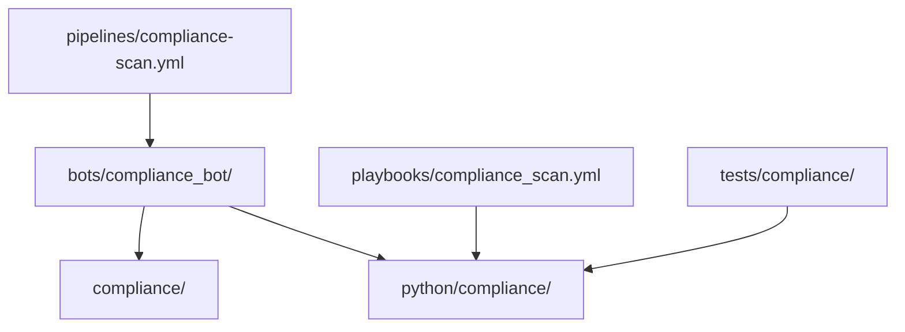
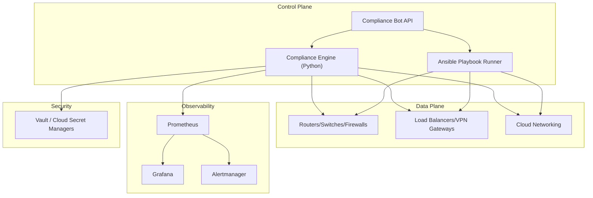
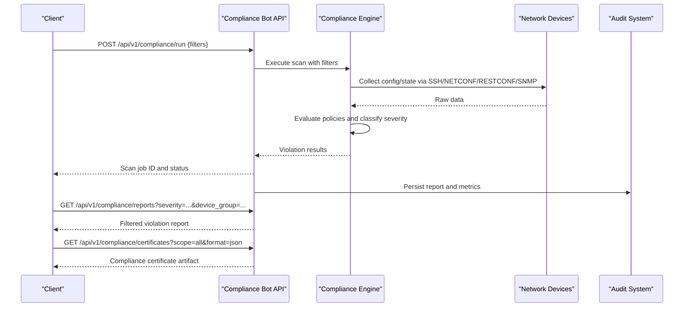
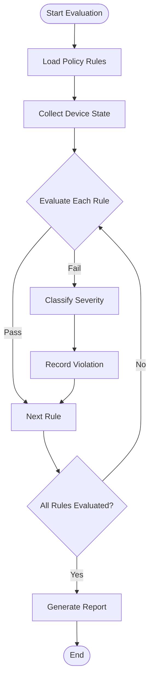
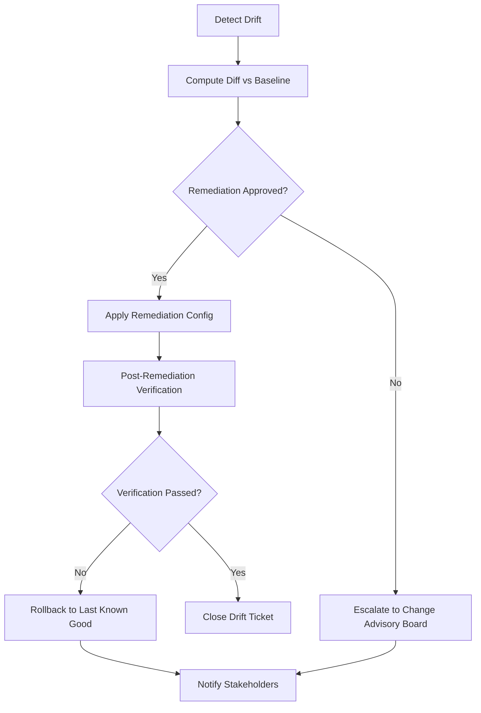
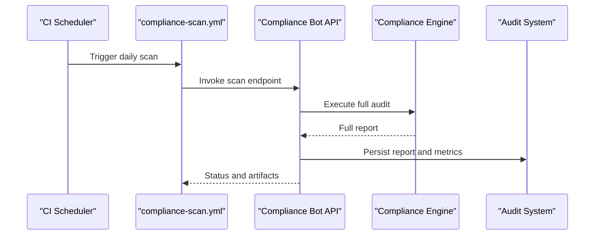
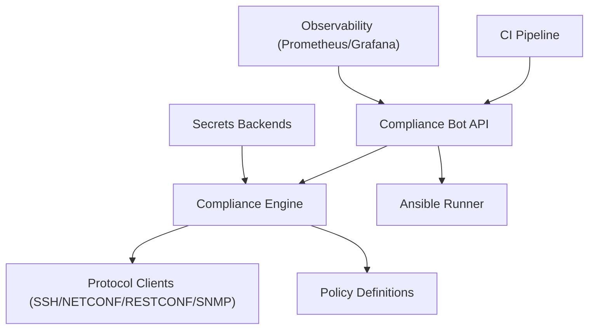

# Compliance Bot

<cite>
**Referenced Files in This Document**
- [README.md](file://README.md)
</cite>

## Table of Contents
1. [Introduction](#introduction)
2. [Project Structure](#project-structure)
3. [Core Components](#core-components)
4. [Architecture Overview](#architecture-overview)
5. [Detailed Component Analysis](#detailed-component-analysis)
6. [Dependency Analysis](#dependency-analysis)
7. [Performance Considerations](#performance-considerations)
8. [Troubleshooting Guide](#troubleshooting-guide)
9. [Conclusion](#conclusion)
10. [Appendices](#appendices)

## Introduction
This section documents the Compliance Bot sub-feature, which provides automated compliance scanning and enforcement across a multi-vendor network automation platform. It covers:
- REST API endpoints for triggering scans, viewing violations, and managing policies
- The compliance rule engine, policy definitions, and severity classification
- Drift detection, automated remediation workflows, and audit integrations
- Custom policy development, compliance baselines, and continuous monitoring
- Concrete examples of API requests for running checks, filtering by severity or device group, and generating compliance certificates

The Compliance Bot is part of the broader Automation Bots layer that exposes self-service APIs and optional ChatOps integrations.

**Section sources**
- [README.md:460-478](file://README.md#L460-L478)

## Project Structure
Compliance-related capabilities are organized under dedicated directories and modules as described in the repository layout:
- bots/compliance_bot/ — Compliance Bot implementation (REST API and orchestration)
- python/compliance/ — Pluggable compliance engine with rule sets
- compliance/ — Policy definitions and checks
- playbooks/compliance_scan.yml — Playbook to run compliance checks
- tests/compliance/ — Compliance test suite
- pipelines/compliance-scan.yml — Scheduled CI workflow for full audits

[No sources needed since this diagram shows conceptual structure]

**Section sources**
- [README.md:103-180](file://README.md#L103-L180)
- [README.md:438-456](file://README.md#L438-L456)
- [README.md:470-476](file://README.md#L470-L476)
- [README.md:509-513](file://README.md#L509-L513)
- [README.md:537-544](file://README.md#L537-L544)

## Core Components
- Compliance Bot API: Exposes /api/v1/compliance endpoints to trigger scans and report violations.
- Compliance Engine: Python module providing pluggable rule sets and execution logic.
- Policies and Checks: Declarative policy definitions and custom checks.
- Playbook Integration: Ansible playbook to execute compliance scans against inventory targets.
- CI/CD Integration: Scheduled compliance scan workflow for continuous auditing.
- Testing Suite: Unit and integration tests for compliance rules and bot behavior.

Key responsibilities:
- Orchestrate collection of device state and configuration
- Evaluate configurations against policy rules
- Generate violation reports and compliance artifacts
- Integrate with audit systems and dashboards

**Section sources**
- [README.md:438-456](file://README.md#L438-L456)
- [README.md:470-476](file://README.md#L470-L476)
- [README.md:509-513](file://README.md#L509-L513)
- [README.md:537-544](file://README.md#L537-L544)

## Architecture Overview
The Compliance Bot integrates with the control plane and data plane to enforce compliance continuously:
- Control Plane: Python modules, Ansible engine, and bots orchestrate operations.
- Data Plane: Network devices provide configuration and telemetry via SSH, NETCONF, RESTCONF, SNMPv3, and telemetry streams.
- Observability: Metrics and logs feed into Prometheus/Grafana and alerting channels.
- Security: Secrets are managed through Vault and cloud secret managers.

[No sources needed since this diagram shows conceptual architecture]

## Detailed Component Analysis

### Compliance Bot API
- Purpose: Provide REST endpoints to trigger compliance scans, retrieve violation reports, and manage policies.
- Endpoints:
  - POST /api/v1/compliance/run — Trigger a compliance scan with filters (severity, device group).
  - GET /api/v1/compliance/reports — Retrieve violation reports with query parameters (severity, device group, time range).
  - GET /api/v1/compliance/certificates — Generate compliance certificates for auditable evidence.
  - PUT /api/v1/compliance/policies — Update or create policy definitions.
  - DELETE /api/v1/compliance/policies/{id} — Remove a policy definition.
- Request examples:
  - Run scan filtered by severity and device group:
    - Method: POST
    - Path: /api/v1/compliance/run
    - Body: { "filters": { "severity": ["critical","high"], "device_group": "core_routers" } }
  - Get violations filtered by severity and device group:
    - Method: GET
    - Path: /api/v1/compliance/reports?severity=critical&device_group=firewalls
  - Generate compliance certificate:
    - Method: GET
    - Path: /api/v1/compliance/certificates?scope=all&format=json

[No sources needed since this diagram shows conceptual flow]

**Section sources**
- [README.md:470-476](file://README.md#L470-L476)

### Compliance Rule Engine
- Purpose: Evaluate device configurations against policy rules and produce violation records with severity classifications.
- Key behaviors:
  - Pluggable rule sets allow adding new checks without changing core logic.
  - Severity classification supports Critical, High, Medium, Low.
  - Supports batch evaluation across device groups and environments.
- Example policies and severities:
  - SSH Only — Critical
  - NTP Configured — High
  - AAA Enabled — Critical
  - SNMPv3 — High
  - Logging Enabled — Medium
  - Approved Ciphers — High
  - Approved Firmware — High
  - Password Policy — Critical
  - ACL Standards — High
  - Firewall Rules — Critical
  - Unused Objects — Low

[No sources needed since this diagram shows conceptual algorithm]

**Section sources**
- [README.md:552-566](file://README.md#L552-L566)

### Policy Definitions and Management
- Location: compliance/ directory contains policy definitions and checks.
- Management:
  - Create/Update policies via PUT /api/v1/compliance/policies
  - Delete policies via DELETE /api/v1/compliance/policies/{id}
- Best practices:
  - Version policies alongside code changes
  - Use structured schemas for validation
  - Tag policies with scope (vendor/platform/device_group)

**Section sources**
- [README.md:158-160](file://README.md#L158-L160)
- [README.md:470-476](file://README.md#L470-L476)

### Drift Detection and Automated Remediation
- Drift detection compares current device state against approved baselines and generates diffs.
- Automated remediation can apply corrective configurations when drift is detected, subject to approval gates.
- Integration points:
  - Golden config baseline application
  - Configuration rollback workflows
  - Post-deploy verification

[No sources needed since this diagram shows conceptual workflow]

**Section sources**
- [README.md:427-430](file://README.md#L427-L430)

### Continuous Compliance Monitoring
- Scheduled compliance scans run daily via CI pipeline.
- Results feed into observability dashboards and alerting channels.
- Integration with audit systems ensures traceability and reporting.

[No sources needed since this diagram shows conceptual workflow]

**Section sources**
- [README.md:509-513](file://README.md#L509-L513)

### Integration with Audit Systems
- Reports and certificates are persisted for audit trails.
- Dashboards visualize compliance trends and violations by severity and device group.
- Alerting notifies teams of critical/high violations.

**Section sources**
- [README.md:606-616](file://README.md#L606-L616)

### Custom Policy Development
- Add new checks under python/compliance/ using pluggable rule sets.
- Define policy metadata (scope, severity, description) and validation logic.
- Test policies with pytest and Molecule where applicable.
- Validate schema and linting before merging.

**Section sources**
- [README.md:438-456](file://README.md#L438-L456)
- [README.md:537-544](file://README.md#L537-L544)

### Compliance Baselines and Certificates
- Baselines define approved configurations per vendor/platform/device_group.
- Certificates summarize compliance posture for a given scope and time window.
- Generation endpoint: GET /api/v1/compliance/certificates with parameters such as scope and format.

**Section sources**
- [README.md:427-430](file://README.md#L427-L430)
- [README.md:470-476](file://README.md#L470-L476)

## Dependency Analysis
- External dependencies include:
  - Protocols: SSH, NETCONF, RESTCONF, SNMPv3, Telemetry Streaming
  - Tools: Ansible, Python modules, OPA, Batfish
  - Secrets backends: HashiCorp Vault, AWS Secrets Manager, Azure Key Vault
- Internal dependencies:
  - Compliance Bot depends on Compliance Engine and Ansible runner
  - Engine depends on protocol clients and policy definitions
  - CI pipeline orchestrates scheduled scans and artifact publishing

[No sources needed since this diagram shows conceptual dependencies]

**Section sources**
- [README.md:184-199](file://README.md#L184-L199)
- [README.md:339-368](file://README.md#L339-L368)
- [README.md:470-476](file://README.md#L470-L476)

## Performance Considerations
- Batch evaluations: Group devices by vendor/platform to optimize protocol connections.
- Concurrency: Use parallelism within the engine while respecting device rate limits.
- Caching: Cache device capability lists and approved firmware versions.
- Filtering: Support server-side filtering by severity and device group to reduce payload sizes.
- Scheduling: Stagger scans across regions to avoid overloading networks.

[No sources needed since this section provides general guidance]

## Troubleshooting Guide
Common issues and resolutions:
- Compliance check failure: Review compliance policies and device running config diff.
- Connection timeouts: Verify SSH reachability and credentials.
- Template rendering errors: Check Jinja2 syntax and variables.
- CI pipeline failures: Inspect GitHub Actions logs for actionable error messages.
- Vault authentication failures: Verify OIDC token or AppRole credentials and Vault policies.

**Section sources**
- [README.md:674-685](file://README.md#L674-L685)

## Conclusion
The Compliance Bot provides a comprehensive, automated approach to enforcing network compliance across diverse environments. By combining pluggable rule sets, robust API endpoints, drift detection, and continuous monitoring, it enables enterprises to maintain secure, standardized configurations at scale. Integrating with audit systems and dashboards ensures transparency and accountability, while CI/CD pipelines embed compliance into every change lifecycle.

[No sources needed since this section summarizes without analyzing specific files]

## Appendices

### API Reference Summary
- POST /api/v1/compliance/run
  - Purpose: Trigger a compliance scan
  - Filters: severity, device_group
- GET /api/v1/compliance/reports
  - Purpose: Retrieve violation reports
  - Query params: severity, device_group, time_range
- GET /api/v1/compliance/certificates
  - Purpose: Generate compliance certificates
  - Query params: scope, format
- PUT /api/v1/compliance/policies
  - Purpose: Create/update policy definitions
- DELETE /api/v1/compliance/policies/{id}
  - Purpose: Remove a policy definition

**Section sources**
- [README.md:470-476](file://README.md#L470-L476)

### Severity Classification Reference
- Critical: Immediate risk requiring urgent remediation
- High: Significant risk requiring prompt action
- Medium: Moderate risk requiring planned remediation
- Low: Minor risk suitable for backlog tracking

**Section sources**
- [README.md:552-566](file://README.md#L552-L566)