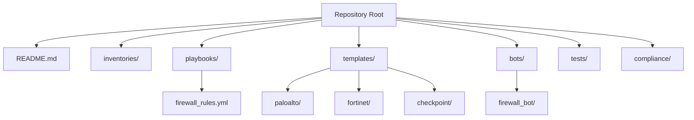
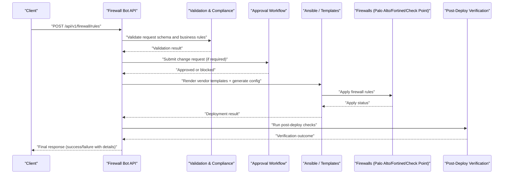
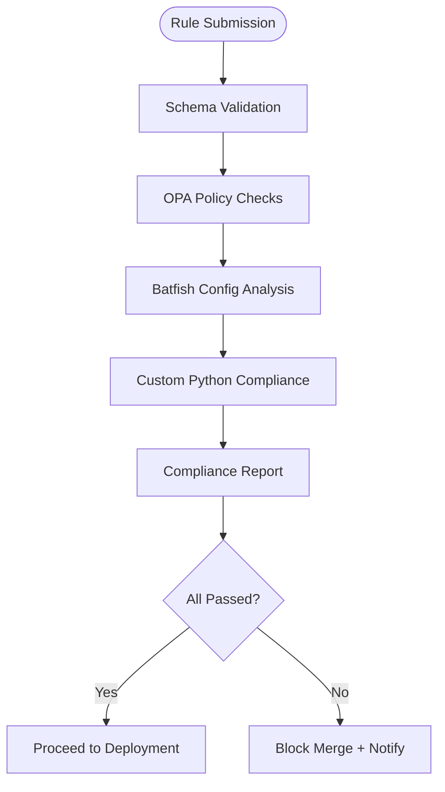
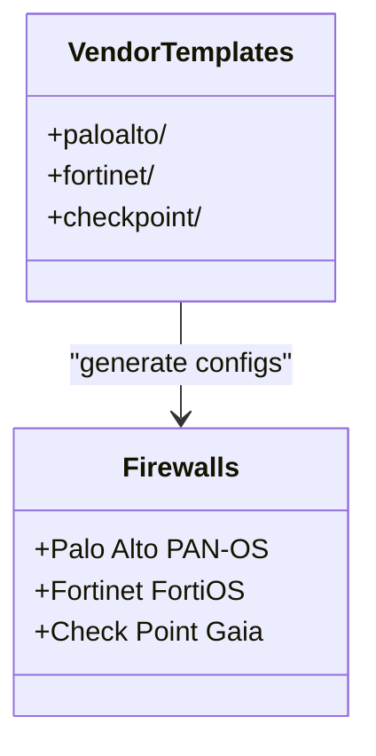
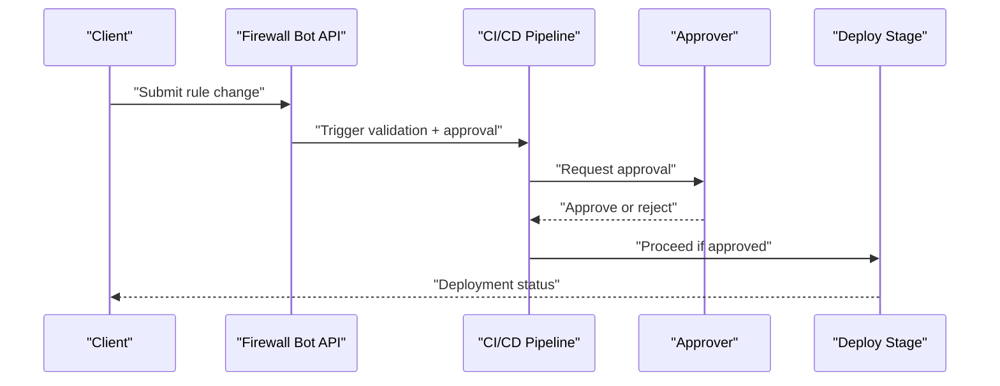
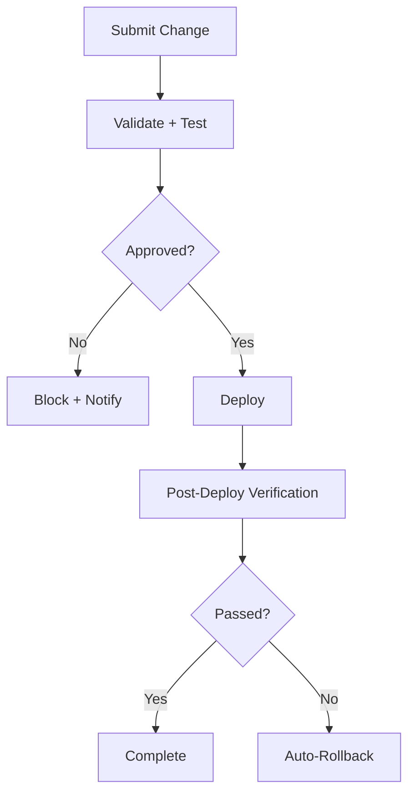
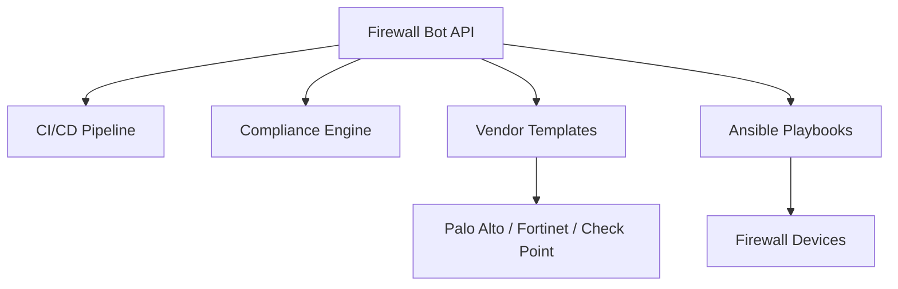

# Firewall Bot

<cite>
**Referenced Files in This Document**
- [README.md](file://README.md)
</cite>

## Table of Contents
1. [Introduction](#introduction)
2. [Project Structure](#project-structure)
3. [Core Components](#core-components)
4. [Architecture Overview](#architecture-overview)
5. [Detailed Component Analysis](#detailed-component-analysis)
6. [Dependency Analysis](#dependency-analysis)
7. [Performance Considerations](#performance-considerations)
8. [Troubleshooting Guide](#troubleshooting-guide)
9. [Conclusion](#conclusion)
10. [Appendices](#appendices)

## Introduction
This document describes the Firewall Bot sub-feature within the Enterprise Network Automation Platform. It explains how firewall rule management is exposed via REST APIs, how rules are validated against security best practices and organizational policies, and how changes flow through approval, deployment, and rollback processes. The platform supports multiple vendors (Palo Alto, Fortinet, Check Point) and integrates with a broader GitOps and compliance pipeline.

The content here synthesizes information from the repository’s documentation to provide an accessible yet comprehensive guide for both technical and non-technical readers.

## Project Structure
The repository organizes automation assets by environment, vendor templates, playbooks, bots, tests, and compliance checks. The Firewall Bot is one of several automation bots that expose REST endpoints for self-service operations. Vendor-specific configuration templates exist for Palo Alto, Fortinet, and Check Point, enabling consistent rule generation across platforms.

**Diagram sources**
- [README.md:103-180](file://README.md#L103-L180)

**Section sources**
- [README.md:103-180](file://README.md#L103-L180)

## Core Components
- Firewall Bot API: Exposes endpoints for requesting, validating, and deploying firewall rules.
- Vendor Templates: Jinja2-based templates per vendor (Palo Alto, Fortinet, Check Point).
- Playbooks: Ansible playbook to deploy firewall rule sets.
- Compliance Engine: Policy checks including shadow/duplicate detection and “no any-any” enforcement.
- CI/CD Pipeline: Automated validation, dry-run, approval gate, deployment, and post-deploy verification.

Key capabilities referenced in the repository:
- REST endpoint for firewall rules: `/api/v1/firewall/rules`
- Playbook for deploying firewall rule sets: `firewall_rules.yml`
- Vendor template directories: `templates/paloalto`, `templates/fortinet`, `templates/checkpoint`
- Compliance checks: “Firewall Rules — No any-any, shadow/duplicate detection”

**Section sources**
- [README.md:460-476](file://README.md#L460-L476)
- [README.md:388-399](file://README.md#L388-L399)
- [README.md:116-128](file://README.md#L116-L128)
- [README.md:552-566](file://README.md#L552-L566)

## Architecture Overview
The Firewall Bot integrates with the broader automation engine and compliance pipeline. Requests to the bot trigger validation, policy checks, and optional approval workflows before deployment via Ansible playbooks and vendor templates. Post-deploy verification ensures correctness and enables automated rollback on failure.

[No sources needed since this diagram shows conceptual workflow, not actual code structure]

## Detailed Component Analysis

### Firewall Bot API Endpoints
- Endpoint: `/api/v1/firewall/rules`
  - Purpose: Request, validate, and deploy firewall rules.
  - Integration: Slack/Teams ChatOps available.
  - Typical operations: Create, modify, delete rules; manage source/destination objects; specify ports; define actions; control ordering.

Operational notes:
- The endpoint participates in the CI/CD pipeline stages (validation, approval, deployment, verification).
- Changes are tracked via GitOps workflows and can be rolled back automatically if verification fails.

**Section sources**
- [README.md:460-476](file://README.md#L460-L476)
- [README.md:479-514](file://README.md#L479-L514)

### Rule Validation Engine
The validation engine enforces security best practices and organizational policies, including:
- No any-any rules
- Shadow rule detection
- Duplicate rule detection
- ACL standards (default deny, explicit allow only)
- Unused object detection

These checks run during PR validation and pre-deployment phases, integrating with OPA policy checks and Batfish analysis.

**Diagram sources**
- [README.md:552-579](file://README.md#L552-L579)

**Section sources**
- [README.md:552-579](file://README.md#L552-L579)

### Vendor-Specific Implementations
Vendor support includes Palo Alto, Fortinet, and Check Point. Configuration templates are organized under vendor-specific directories, enabling consistent rule generation and deployment.

- Supported vendors: Palo Alto (PAN-OS), Fortinet (FortiOS), Check Point (Gaia)
- Template directories: `templates/paloalto`, `templates/fortinet`, `templates/checkpoint`
- Protocols: SSH and API access for each vendor

**Diagram sources**
- [README.md:116-128](file://README.md#L116-L128)
- [README.md:203-217](file://README.md#L203-L217)

**Section sources**
- [README.md:116-128](file://README.md#L116-L128)
- [README.md:203-217](file://README.md#L203-L217)

### Rule Ordering and Actions
- Rule ordering is managed through structured data and templates, ensuring deterministic placement and evaluation order.
- Actions (allow/deny) and port specifications are defined in the request payload and rendered into vendor-specific configurations.

Operational guidance:
- Use the API to submit ordered rule sets.
- Ensure actions and ports are explicitly specified to avoid ambiguity.
- Leverage compliance checks to catch misordered or overly broad rules early.

**Section sources**
- [README.md:388-399](file://README.md#L388-L399)
- [README.md:552-566](file://README.md#L552-L566)

### Approval Workflow Integration
- The CI/CD pipeline includes an approval gate before production deployment.
- Change requests submitted via the Firewall Bot participate in this workflow.
- Slack/Teams integrations enable notifications and approvals.

**Diagram sources**
- [README.md:479-514](file://README.md#L479-L514)
- [README.md:460-476](file://README.md#L460-L476)

**Section sources**
- [README.md:479-514](file://README.md#L479-L514)
- [README.md:460-476](file://README.md#L460-L476)

### Change Tracking and Rollback Capabilities
- All changes follow GitOps: pull requests trigger validation, approval, deployment, and verification.
- Automated rollback occurs if post-deploy verification fails.
- Configuration backups and rollbacks are supported via dedicated playbooks.

**Diagram sources**
- [README.md:619-638](file://README.md#L619-L638)
- [README.md:420-434](file://README.md#L420-L434)

**Section sources**
- [README.md:619-638](file://README.md#L619-L638)
- [README.md:420-434](file://README.md#L420-L434)

### Concrete API Usage Examples
While specific JSON payloads are not included in the repository documentation, typical operations include:
- Adding source/destination objects
- Specifying ports (single, ranges, services)
- Defining actions (allow/deny)
- Controlling rule ordering (insert at position, append, reorder)
- Managing rule lifecycle (create, update, delete)

Recommended approach:
- Use the `/api/v1/firewall/rules` endpoint to submit structured rule definitions.
- Include metadata such as change ID, approver, and justification for auditability.
- Rely on the validation engine to enforce best practices and detect issues early.

**Section sources**
- [README.md:460-476](file://README.md#L460-L476)
- [README.md:552-566](file://README.md#L552-L566)

### Rule Migration Between Platforms
- Vendor templates under `templates/paloalto`, `templates/fortinet`, and `templates/checkpoint` facilitate cross-platform rule generation.
- Structured data inputs are transformed into vendor-specific configurations using Jinja2 templates.
- Consistent naming and scoping conventions improve migration accuracy.

Migration considerations:
- Map logical constructs (zones, addresses, services) to vendor equivalents.
- Validate generated configurations with Batfish and custom compliance checks.
- Perform staged deployments with verification and rollback safeguards.

**Section sources**
- [README.md:116-128](file://README.md#L116-L128)
- [README.md:552-579](file://README.md#L552-L579)

## Dependency Analysis
The Firewall Bot depends on:
- CI/CD pipeline components for validation, approval, and deployment
- Compliance engine for policy checks
- Vendor templates for configuration generation
- Ansible playbooks for execution

[No sources needed since this diagram shows conceptual relationships, not direct code mappings]

## Performance Considerations
- Large rule sets benefit from batched submissions and incremental updates.
- Pre-deployment validation and dry runs reduce risk and time spent on failed deployments.
- Monitoring dashboards track API performance metrics (latency, error rates, throughput).

Recommendations:
- Group related rules to minimize churn.
- Use structured data to leverage efficient template rendering.
- Monitor compliance reports and adjust rule granularity accordingly.

[No sources needed since this section provides general guidance]

## Troubleshooting Guide
Common issues and resolutions:
- Template rendering errors: Inspect Jinja2 syntax and structured data inputs.
- Compliance check failures: Review policy violations and adjust rule definitions.
- CI pipeline failures: Check logs for actionable error messages.
- Vault authentication failures: Verify OIDC tokens or AppRole credentials.
- Molecule test failures: Ensure Docker/Podman is running and configuration is correct.
- Batfish analysis errors: Validate snapshots and network models.

**Section sources**
- [README.md:674-684](file://README.md#L674-L684)

## Conclusion
The Firewall Bot provides a robust, vendor-agnostic interface for managing firewall rules across Palo Alto, Fortinet, and Check Point devices. Integrated validation, compliance, approval, and rollback mechanisms ensure secure and reliable operations. By leveraging structured data, vendor templates, and a comprehensive CI/CD pipeline, organizations can automate complex firewall changes while maintaining strong governance and observability.

## Appendices

### API Reference Summary
- Endpoint: `/api/v1/firewall/rules`
  - Methods: Create, Modify, Delete
  - Features: Source/destination objects, port specifications, actions, ordering
  - Integrations: Slack/Teams ChatOps, Approval Workflow, Compliance Engine

**Section sources**
- [README.md:460-476](file://README.md#L460-L476)

### Compliance Policies Summary
- No any-any rules
- Shadow/duplicate detection
- ACL standards (default deny, explicit allow only)
- Unused object detection

**Section sources**
- [README.md:552-566](file://README.md#L552-L566)