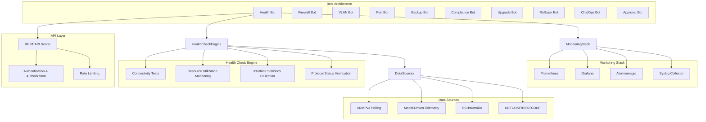
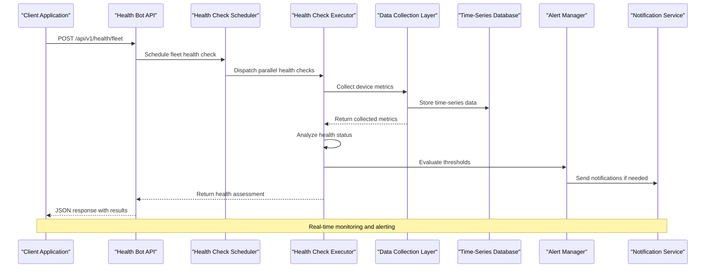
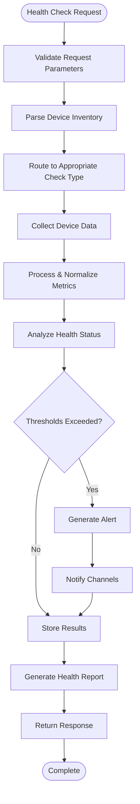
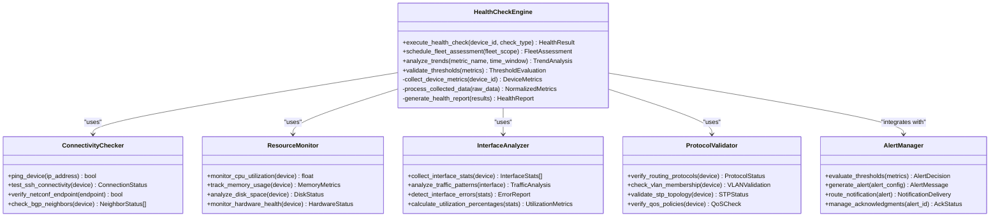
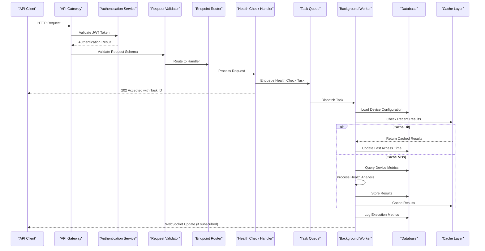
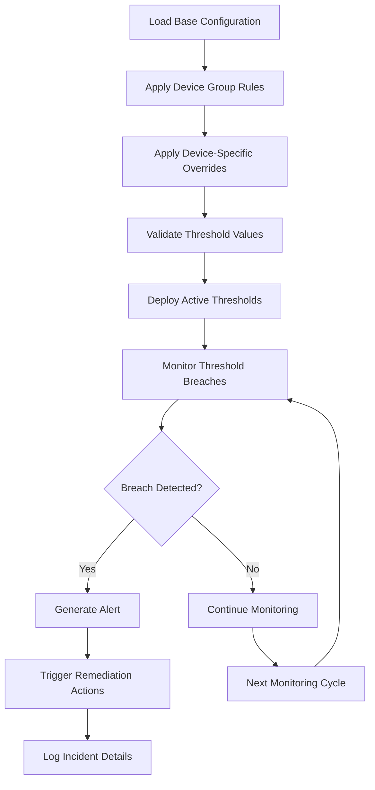
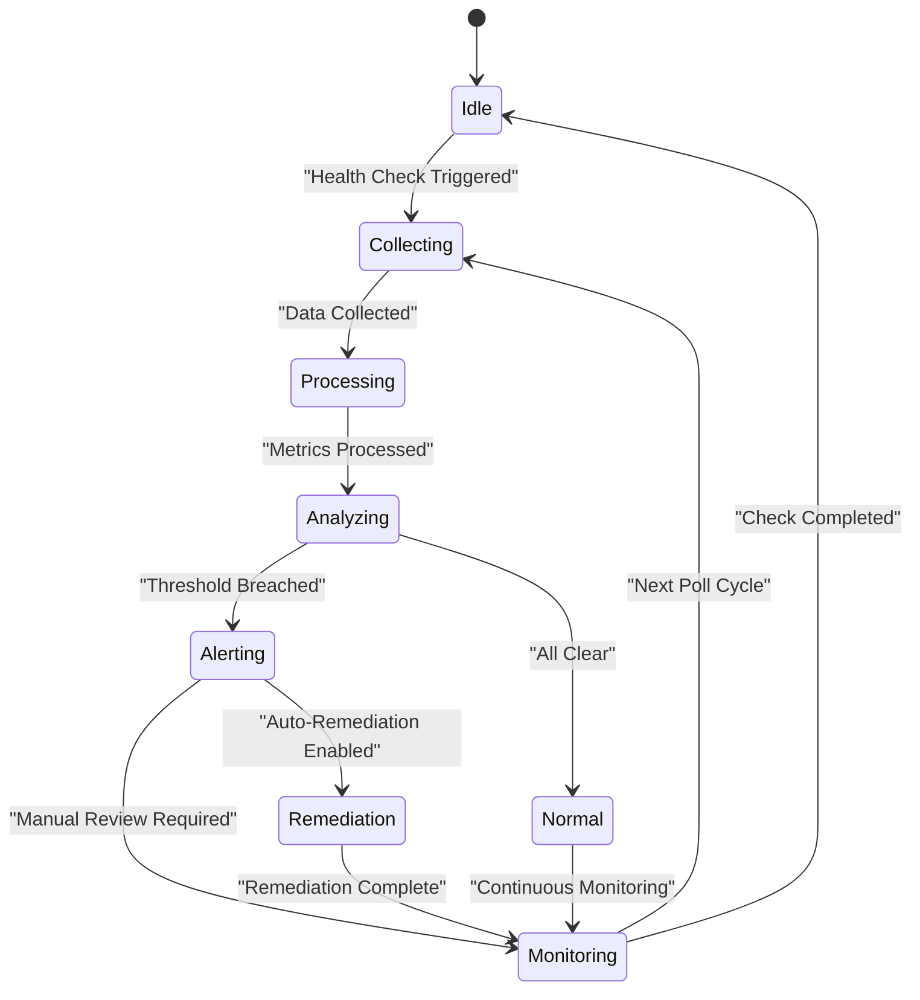

# Health Bot

<cite>
**Referenced Files in This Document**
- [README.md](file://README.md)
</cite>

## Table of Contents
1. [Introduction](#introduction)
2. [Project Structure](#project-structure)
3. [Core Components](#core-components)
4. [Architecture Overview](#architecture-overview)
5. [Detailed Component Analysis](#detailed-component-analysis)
6. [Dependency Analysis](#dependency-analysis)
7. [Performance Considerations](#performance-considerations)
8. [Troubleshooting Guide](#troubleshooting-guide)
9. [Conclusion](#conclusion)

## Introduction

The Health Bot is a critical sub-feature within the Enterprise Network Automation Platform that provides comprehensive device health monitoring and diagnostics capabilities. As part of the broader automation bot ecosystem, the Health Bot exposes REST API endpoints for running health checks, collecting device metrics, and generating diagnostic reports across thousands of network devices in multi-vendor, multi-region environments.

The Health Bot serves as the central interface for proactive network health management, enabling operators to perform targeted health assessments, fleet-wide evaluations, and trend analysis queries. It integrates seamlessly with the platform's monitoring stack (Prometheus, Grafana, OpenTelemetry) and alerting systems (Alertmanager, Slack, PagerDuty, Microsoft Teams) to provide real-time visibility into network device health status.

## Project Structure

The Health Bot is implemented as part of the bots directory structure within the platform architecture:



**Diagram sources**
- [README.md:460-476](file://README.md#L460-L476)
- [README.md:583-604](file://README.md#L583-L604)

**Section sources**
- [README.md:103-180](file://README.md#L103-L180)
- [README.md:460-476](file://README.md#L460-L476)

## Core Components

The Health Bot system comprises several interconnected components that work together to provide comprehensive device health monitoring:

### Health Check Categories

The Health Bot implements four primary categories of health checks:

#### 1. Connectivity Tests
- Device reachability verification via ICMP ping and protocol-specific connectivity tests
- SSH session establishment validation
- NETCONF/RESTCONF endpoint availability checks
- BGP/OSPF neighbor adjacency verification
- VPN tunnel status monitoring

#### 2. Resource Utilization Monitoring
- CPU utilization tracking with threshold-based alerting
- Memory usage monitoring including swap space utilization
- Disk space consumption analysis for configuration storage
- Process table size monitoring for service health assessment
- Temperature and fan speed monitoring for hardware health

#### 3. Interface Statistics Collection
- Interface up/down status monitoring
- Traffic throughput analysis (input/output bandwidth utilization)
- Error rate tracking (CRC errors, collisions, drops)
- Queue depth monitoring for congestion detection
- Interface utilization trending and capacity planning

#### 4. Protocol Status Verification
- Routing protocol neighbor state validation (BGP, OSPF, IS-IS)
- VLAN membership verification
- STP topology consistency checks
- LACP/port-channel member status validation
- QoS policy application verification

### API Endpoints

The Health Bot exposes the following REST API endpoints:

| Endpoint | Method | Purpose | Parameters | Response Format |
|----------|--------|---------|------------|-----------------|
| `/api/v1/health` | GET | Execute comprehensive health check | `device_id`, `check_type`, `severity_level` | JSON health report |
| `/api/v1/health/connectivity` | POST | Run connectivity tests | `target_devices`, `protocol`, `timeout` | Connectivity matrix |
| `/api/v1/health/resources` | GET | Collect resource utilization metrics | `device_group`, `metrics_list`, `time_range` | Time-series metrics |
| `/api/v1/health/interfaces` | GET | Retrieve interface statistics | `interface_filter`, `stat_types`, `aggregation` | Interface performance data |
| `/api/v1/health/protocols` | GET | Verify protocol status | `protocol_type`, `neighbor_filter`, `status_only` | Protocol health status |
| `/api/v1/health/fleet` | POST | Execute fleet-wide health assessment | `fleet_scope`, `priority_devices`, `parallelism` | Fleet health summary |
| `/api/v1/health/trends` | GET | Analyze health trends over time | `metric_name`, `time_window`, `granularity` | Trend analysis report |
| `/api/v1/health/alerts` | GET | Retrieve active health alerts | `severity`, `device_group`, `acknowledged` | Alert list with details |

### Health Check Configuration

The Health Bot supports flexible configuration through YAML-based settings:

```yaml
health_bot:
  polling_interval: 300  # seconds
  max_concurrent_checks: 50
  timeout_per_device: 30
  retry_attempts: 3
  
  thresholds:
    cpu_utilization: 85
    memory_utilization: 90
    interface_errors: 10
    bgp_neighbors_down: 1
    ospf_adjacency_down: 1
    
  notification_channels:
    slack:
      enabled: true
      channel: "#network-alerts"
    pagerduty:
      enabled: true
      service_key: "${PAGERDUTY_SERVICE_KEY}"
    teams:
      enabled: true
      webhook_url: "${TEAMS_WEBHOOK_URL}"
    
  remediation_triggers:
    auto_reboot: false
    config_rollback: true
    failover_activation: true
```

**Section sources**
- [README.md:460-476](file://README.md#L460-L476)
- [README.md:583-616](file://README.md#L583-L616)

## Architecture Overview

The Health Bot follows a microservices architecture pattern with clear separation of concerns:



**Diagram sources**
- [README.md:460-476](file://README.md#L460-L476)
- [README.md:583-604](file://README.md#L583-L604)

### Data Flow Architecture



**Diagram sources**
- [README.md:460-476](file://README.md#L460-L476)
- [README.md:583-616](file://README.md#L583-L616)

## Detailed Component Analysis

### Health Check Execution Engine

The core health check execution engine manages the lifecycle of health assessments across the device fleet:



**Diagram sources**
- [README.md:460-476](file://README.md#L460-L476)
- [README.md:583-616](file://README.md#L583-L616)

### API Request Processing Flow

The Health Bot API processes requests through a well-defined pipeline:



**Diagram sources**
- [README.md:460-476](file://README.md#L460-L476)

### Threshold Configuration Management

The Health Bot implements dynamic threshold configuration with support for device-specific overrides:



**Diagram sources**
- [README.md:583-616](file://README.md#L583-L616)

## Dependency Analysis

The Health Bot has well-defined dependencies on various platform components:

```mermaid
graph TB
subgraph "External Dependencies"
Ansible[Ansible Engine]
PythonLibs[Python Libraries]
NetworkProtocols[Network Protocols]
SecretsMgr[Secrets Manager]
end
subgraph "Internal Dependencies"
Inventory[Device Inventory]
ConfigGen[Configuration Generator]
Validation[Config Validation]
Backup[Backup System]
Compliance[Compliance Engine]
end
subgraph "Monitoring Dependencies"
Prometheus[Prometheus]
Grafana[Grafana]
Alertmanager[Alertmanager]
Syslog[Syslog Collector]
OTel[OpenTelemetry]
end
subgraph "Communication Channels"
Slack[Slack Integration]
Teams[Microsoft Teams]
PagerDuty[PagerDuty]
Email[Email Notifications]
end
HealthBot[Health Bot] --> Ansible
HealthBot --> PythonLibs
HealthBot --> NetworkProtocols
HealthBot --> SecretsMgr
HealthBot --> Inventory
HealthBot --> ConfigGen
HealthBot --> Validation
HealthBot --> Backup
HealthBot --> Compliance
HealthBot --> Prometheus
HealthBot --> Grafana
HealthBot --> Alertmanager
HealthBot --> Syslog
HealthBot --> OTel
HealthBot --> Slack
HealthBot --> Teams
HealthBot --> PagerDuty
HealthBot --> Email
```



**Diagram sources**
- [README.md:460-476](file://README.md#L460-L476)
- [README.md:583-604](file://README.md#L583-L604)

### Critical Dependency Relationships

| Dependency | Purpose | Failure Impact | Mitigation Strategy |
|------------|---------|----------------|-------------------|
| Ansible Engine | Device configuration operations | Cannot execute remediation actions | Fallback to direct CLI commands |
| Secrets Manager | Credential access | Cannot authenticate to devices | Local credential cache with rotation |
| Prometheus | Metric storage | Loss of historical data | Local caching with periodic sync |
| Alertmanager | Alert routing | Missed critical alerts | Direct notification fallback |
| Device Inventory | Target device discovery | Cannot identify devices to monitor | Static device list fallback |

**Section sources**
- [README.md:460-476](file://README.md#L460-L476)
- [README.md:583-604](file://README.md#L583-L604)

## Performance Considerations

### Scalability Architecture

The Health Bot is designed for large-scale deployments with the following performance optimizations:

#### Parallel Processing
- **Concurrent Health Checks**: Supports up to 50 simultaneous device assessments
- **Batch Operations**: Groups similar health checks for efficient processing
- **Asynchronous Processing**: Non-blocking API responses with background task execution

#### Caching Strategies
- **Result Caching**: Stores recent health check results with configurable TTL
- **Metric Aggregation**: Pre-aggregates common metrics to reduce database load
- **Connection Pooling**: Maintains persistent connections to frequently accessed devices

#### Resource Optimization
- **Adaptive Polling**: Dynamically adjusts polling frequency based on device criticality
- **Selective Data Collection**: Only collects relevant metrics for specific health checks
- **Compression**: Compresses large metric datasets before transmission

### Real-Time Monitoring Capabilities



**Diagram sources**
- [README.md:583-616](file://README.md#L583-L616)

### Performance Benchmarks

| Metric | Target Value | Measurement Method |
|--------|--------------|-------------------|
| API Response Time | < 2 seconds (cached), < 30 seconds (live) | HTTP request timing |
| Concurrent Devices | Up to 10,000 devices | Load testing with simulated devices |
| Memory Usage | < 2GB per instance | Process monitoring |
| CPU Utilization | < 80% under normal load | System resource monitoring |
| Database Queries | < 100ms average | Query performance monitoring |
| Alert Processing | < 5 seconds from breach to notification | End-to-end latency measurement |

## Troubleshooting Guide

### Common Issues and Resolutions

| Issue Category | Symptoms | Diagnostic Steps | Resolution |
|----------------|----------|------------------|------------|
| **Connectivity Failures** | Health checks timeout, devices unreachable | Check device reachability, verify credentials, test network paths | Restore network connectivity, update device credentials |
| **High Resource Usage** | Health Bot consuming excessive CPU/memory | Monitor process resources, analyze query performance | Optimize polling intervals, implement result caching |
| **Alert Storms** | Excessive notifications during incidents | Review alert thresholds, check for cascading failures | Implement alert suppression, adjust threshold sensitivity |
| **Data Collection Delays** | Stale metrics, delayed health reports | Check data collection pipelines, monitor queue depths | Scale workers, optimize collection strategies |
| **API Performance Issues** | Slow response times, timeouts | Monitor API metrics, check backend dependencies | Implement caching, optimize database queries |

### Diagnostic Commands

```bash
# Check Health Bot service status
systemctl status health-bot

# View recent health check logs
journalctl -u health-bot --since "1 hour ago"

# Test API endpoint connectivity
curl -X GET https://health-bot/api/v1/health/status

# Check active health checks
curl -X GET https://health-bot/api/v1/health/active-checks

# Monitor system resources
htop -p $(pgrep -f health-bot)

# Check database connection pool
curl -X GET https://health-bot/api/v1/metrics/db-pool
```

### Log Analysis Patterns

Key log patterns to monitor for health issues:

- **Connection Errors**: `ERROR.*connection.*timeout`
- **Authentication Failures**: `WARN.*authentication.*failed`
- **Threshold Breaches**: `ALERT.*threshold.*exceeded`
- **Performance Warnings**: `WARN.*slow.*query`
- **Resource Limits**: `CRITICAL.*memory.*usage`

**Section sources**
- [README.md:674-685](file://README.md#L674-L685)

## Conclusion

The Health Bot represents a comprehensive solution for enterprise-scale network device health monitoring and diagnostics. Its modular architecture, extensive API surface, and integration with the broader automation platform enable proactive network management at scale.

Key strengths include:

- **Comprehensive Coverage**: Four distinct health check categories covering connectivity, resources, interfaces, and protocols
- **Scalable Design**: Built to handle thousands of devices with parallel processing and intelligent caching
- **Flexible Configuration**: Dynamic threshold management with device-specific overrides
- **Robust Alerting**: Multi-channel notification with automated remediation triggers
- **Performance Optimized**: Designed for real-time monitoring with minimal resource overhead

The Health Bot successfully addresses the critical need for continuous network health visibility while maintaining operational efficiency and providing actionable insights for network administrators. Its integration with the existing automation ecosystem ensures seamless operation within the broader network management workflow.