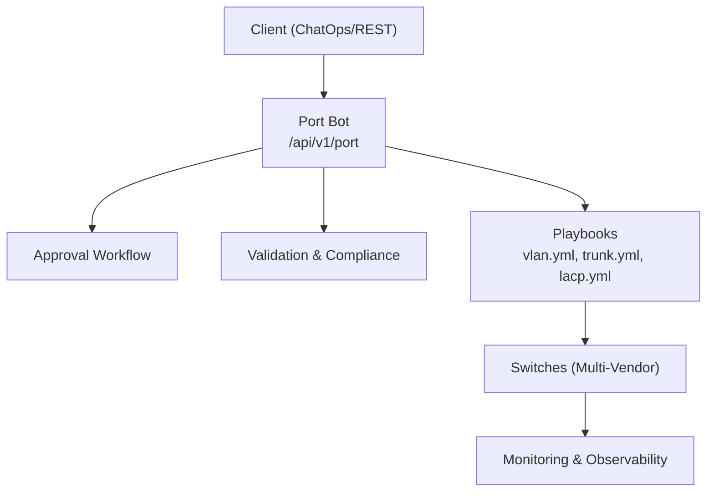
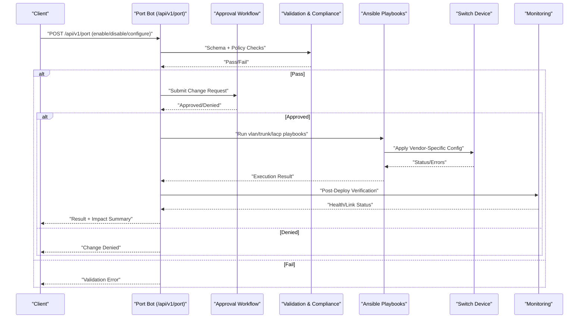
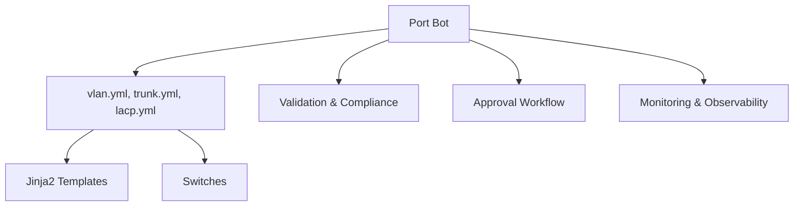

# Port Bot

<cite>
**Referenced Files in This Document**
- [README.md](file://README.md)
</cite>

## Table of Contents
1. [Introduction](#introduction)
2. [Project Structure](#project-structure)
3. [Core Components](#core-components)
4. [Architecture Overview](#architecture-overview)
5. [Detailed Component Analysis](#detailed-component-analysis)
6. [Dependency Analysis](#dependency-analysis)
7. [Performance Considerations](#performance-considerations)
8. [Troubleshooting Guide](#troubleshooting-guide)
9. [Conclusion](#conclusion)
10. [Appendices](#appendices)

## Introduction
This section documents the Port Bot sub-feature, which provides a self-service REST API for switch port management across multi-vendor environments. The Port Bot enables operators to enable or disable ports, configure access and trunk modes, assign VLANs, set port speeds, manage LACP port channels, and integrate with broader automation workflows including approvals, validation, and monitoring. It is designed to operate consistently across vendors by leveraging shared playbooks and templates while abstracting vendor-specific differences.

The Port Bot integrates with:
- Automation Bots framework exposing /api/v1/port endpoints
- Playbooks for VLAN, trunk, and LACP configuration
- Validation and compliance checks prior to deployment
- Monitoring and observability for link status and errors

## Project Structure
Within the repository, the Port Bot is part of the Automation Bots layer and coordinates with network service playbooks and Python modules for device communication and validation.

**Diagram sources**
- [README.md:460-478](file://README.md#L460-L478)
- [README.md:371-399](file://README.md#L371-L399)

**Section sources**
- [README.md:103-180](file://README.md#L103-L180)
- [README.md:460-478](file://README.md#L460-L478)
- [README.md:371-399](file://README.md#L371-L399)

## Core Components
- Port Bot API: Exposes /api/v1/port for enabling/disabling ports, configuring access/trunk modes, VLAN assignments, speed settings, and LACP port channel operations.
- Playbook Integration: Uses vlan.yml, trunk.yml, and lacp.yml to generate and apply vendor-specific configurations via Ansible.
- Validation and Compliance: Pre-deployment checks ensure schema correctness, policy adherence, and safe changes before execution.
- Monitoring and Observability: Post-deploy verification and ongoing telemetry/alerting for link status and error detection.

Key capabilities:
- Enable/disable switch ports
- Configure access mode and assign single VLAN
- Configure trunk mode and allowed VLAN lists
- Set port speed/duplex where supported
- Create and manage LACP port channels
- Integrate with approval workflow for change control
- Provide impact assessment and rollback support

**Section sources**
- [README.md:460-478](file://README.md#L460-L478)
- [README.md:371-399](file://README.md#L371-L399)

## Architecture Overview
The Port Bot follows a GitOps-driven flow: requests are validated, approved, rendered into vendor-specific configurations, deployed, verified, and monitored.

**Diagram sources**
- [README.md:460-478](file://README.md#L460-L478)
- [README.md:371-399](file://README.md#L371-L399)
- [README.md:479-501](file://README.md#L479-L501)

## Detailed Component Analysis

### Port Bot API Endpoints
- Base path: /api/v1/port
- Operations:
  - Enable/disable ports
  - Configure access mode and VLAN assignment
  - Configure trunk mode and allowed VLAN list
  - Set port speed/duplex (vendor-dependent)
  - Manage LACP port channels (create, add/remove member ports)
- ChatOps integration: Slack notifications for request lifecycle and outcomes

Example usage patterns (descriptive):
- Basic port configuration: POST /api/v1/port with fields for device, interface, mode=access, vlan_id
- Trunk setup: POST /api/v1/port with mode=trunk, allowed_vlans=[...], native_vlan
- Speed setting: POST /api/v1/port with speed=1000, duplex=full (if supported)
- LACP port channel: POST /api/v1/port with port_channel_id, member_ports=[...], lacp_mode=active/passive

Note: Exact payload schemas and response formats are defined by the bot’s internal implementation; this document describes functional behavior based on the repository’s documented capabilities.

**Section sources**
- [README.md:460-478](file://README.md#L460-L478)

### Playbook Integration for Port Management
- vlan.yml: Creates/modifies VLANs referenced by port configurations
- trunk.yml: Applies trunk interface settings and VLAN allowlists
- lacp.yml: Configures LACP port channels and member interfaces

These playbooks render vendor-specific configurations using Jinja2 templates and execute against target devices through Ansible.

**Section sources**
- [README.md:371-399](file://README.md#L371-L399)

### Port State Validation and Link Status Monitoring
- Pre-deployment validation ensures correct syntax and policy compliance
- Post-deploy verification checks link state and operational parameters
- Monitoring dashboards track device health, interface status, and automation metrics

Operational indicators:
- Interface up/down status
- Error counters and link flaps
- LACP negotiation state
- VLAN membership consistency

**Section sources**
- [README.md:583-616](file://README.md#L583-L616)

### Change Approval Process and Impact Assessment
- All changes pass through an approval gate before deployment
- Impact assessment includes:
  - Affected devices and interfaces
  - Potential downtime windows
  - Rollback plan if verification fails
- Automated rollback triggers when post-deploy verification fails

**Section sources**
- [README.md:479-501](file://README.md#L479-L501)
- [README.md:619-638](file://README.md#L619-L638)

### Security Features: Port Security and 802.1X Authentication
- Port security policies can be enforced via compliance checks and playbooks
- 802.1X authentication integration is supported through AAA and device templates
- Policies include:
  - Default deny unless explicitly allowed
  - Approved cipher suites and protocols
  - Enforced authentication methods

**Section sources**
- [README.md:548-579](file://README.md#L548-L579)

### Vendor-Specific Differences and Bulk Operations
- Multi-vendor support abstracts differences via templates and playbooks
- Bulk operations are facilitated by inventory grouping and parallel execution
- Supported platforms include Cisco IOS/IOS-XE/NX-OS, Juniper SRX/MX, Arista EOS, and others

**Section sources**
- [README.md:203-226](file://README.md#L203-L226)
- [README.md:103-180](file://README.md#L103-L180)

### Cable Management Integration
- The platform supports SSoT integrations such as NetBox/Nautobot for cable management
- Port configuration changes can be synchronized with cable records and topology data

**Section sources**
- [README.md:688-698](file://README.md#L688-L698)

## Dependency Analysis
The Port Bot depends on:
- Automation Bots framework for API exposure and ChatOps
- Ansible playbooks for configuration generation and application
- Validation and compliance modules for pre-deployment checks
- Monitoring stack for post-deploy verification and alerting

**Diagram sources**
- [README.md:460-478](file://README.md#L460-L478)
- [README.md:371-399](file://README.md#L371-L399)
- [README.md:583-616](file://README.md#L583-L616)

**Section sources**
- [README.md:460-478](file://README.md#L460-L478)
- [README.md:371-399](file://README.md#L371-L399)
- [README.md:583-616](file://README.md#L583-L616)

## Performance Considerations
- Use bulk operations and parallel execution for large-scale deployments
- Leverage inventory grouping to target specific device sets efficiently
- Monitor API latency and throughput via built-in dashboards
- Apply rate limiting and batching for high-volume requests

[No sources needed since this section provides general guidance]

## Troubleshooting Guide
Common issues and resolutions:
- Connection timeouts: Verify SSH reachability and credentials
- Template rendering errors: Check Jinja2 syntax and variables
- Compliance failures: Review policy violations and adjust configurations
- CI pipeline failures: Inspect GitHub Actions logs for actionable messages
- Vault authentication failures: Validate OIDC tokens or AppRole credentials

**Section sources**
- [README.md:674-685](file://README.md#L674-L685)

## Conclusion
The Port Bot provides a robust, vendor-agnostic interface for managing switch ports at scale. By integrating with playbooks, validation, approvals, and monitoring, it ensures safe and auditable changes across diverse environments. Operators can confidently perform basic port configuration, trunk setups, PoE-related settings (where supported), and advanced features like LACP and 802.1X authentication, with comprehensive oversight and rollback capabilities.

[No sources needed since this section summarizes without analyzing specific files]

## Appendices

### Example Workflows (Descriptive)
- Basic port configuration:
  - Request: Enable port Gi0/1 on switch SW-A, set mode=access, vlan_id=100
  - Flow: Validate → Approve → Apply via vlan.yml → Verify → Monitor
- Trunk setup:
  - Request: Configure Gi0/2 as trunk with allowed VLANs 10,20,30 and native VLAN 10
  - Flow: Validate → Approve → Apply via trunk.yml → Verify → Monitor
- LACP port channel:
  - Request: Create port-channel 10 with members Gi0/3 and Gi0/4, LACP active
  - Flow: Validate → Approve → Apply via lacp.yml → Verify → Monitor

[No sources needed since this section provides conceptual examples]