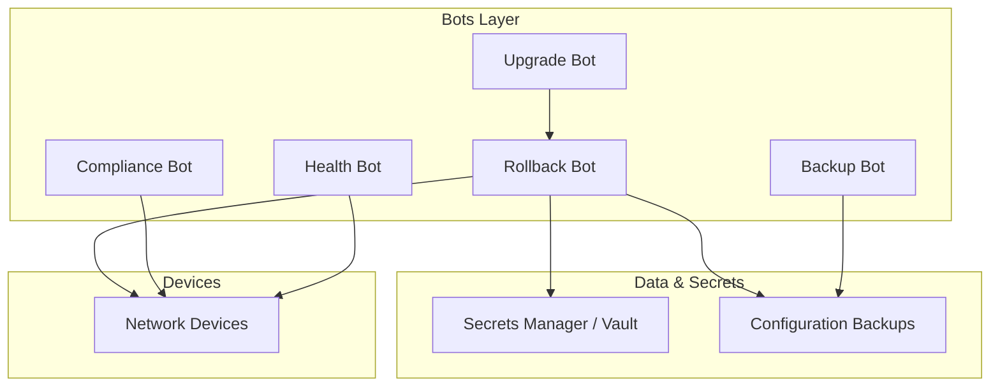
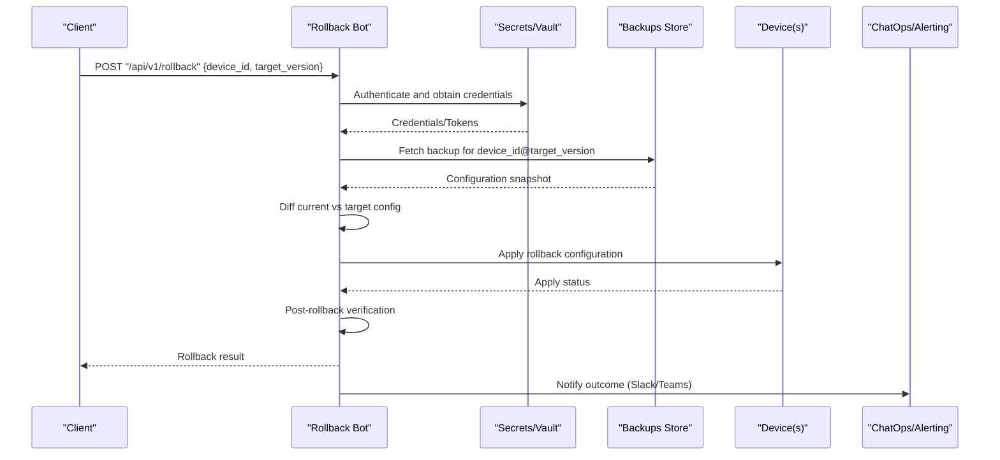
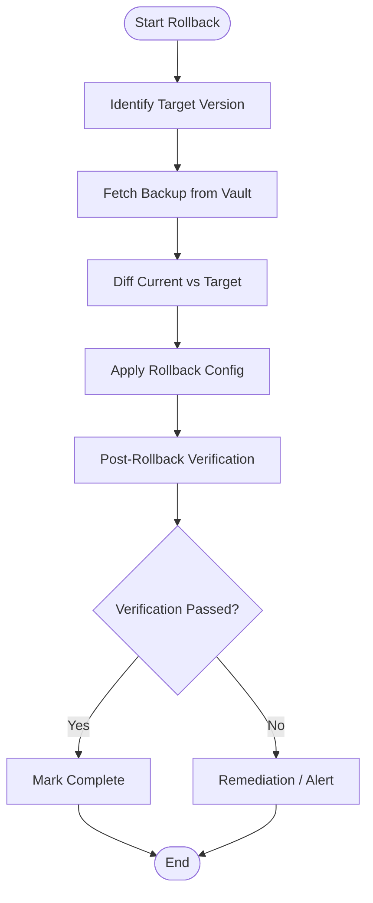
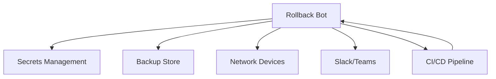

# Rollback Bot

<cite>
**Referenced Files in This Document**
- [README.md](file://README.md)
</cite>

## Table of Contents
1. [Introduction](#introduction)
2. [Project Structure](#project-structure)
3. [Core Components](#core-components)
4. [Architecture Overview](#architecture-overview)
5. [Detailed Component Analysis](#detailed-component-analysis)
6. [Dependency Analysis](#dependency-analysis)
7. [Performance Considerations](#performance-considerations)
8. [Troubleshooting Guide](#troubleshooting-guide)
9. [Conclusion](#conclusion)

## Introduction
This section documents the Rollback Bot sub-feature within the Enterprise Network Automation Platform. The Rollback Bot provides a REST API for initiating configuration rollbacks, selecting target versions, and managing rollback procedures across network devices. It integrates with the platform’s backup system and secrets management to retrieve last-known-good configurations, apply them safely, and verify outcomes. The bot also participates in automated recovery workflows triggered by CI/CD verification failures and can coordinate with other operational bots during emergency recovery scenarios.

## Project Structure
The repository organizes automation capabilities into modular components. The Rollback Bot is part of the broader “Automation Bots” layer and is listed under the bots directory alongside other specialized bots (e.g., firewall_bot, upgrade_bot). The platform’s GitOps workflow includes automatic rollback when post-deploy verification fails, which leverages the Rollback Bot’s capabilities.

**Diagram sources**
- [README.md:103-180](file://README.md#L103-L180)
- [README.md:460-478](file://README.md#L460-L478)

**Section sources**
- [README.md:103-180](file://README.md#L103-L180)
- [README.md:460-478](file://README.md#L460-L478)

## Core Components
- Rollback Bot API endpoint: Exposes a single primary endpoint for rollback operations.
  - Endpoint: `/api/v1/rollback`
  - Purpose: One-click rollback to last known good configuration; supports Slack/Teams ChatOps integration.
- Integration points:
  - Backup system: Retrieves device configuration backups from secure storage.
  - Secrets management: Uses HashiCorp Vault or equivalent backends for credentials and tokens.
  - Device connectivity: Applies rollback configurations via supported protocols (SSH, NETCONF, RESTCONF).
- Coordination:
  - Upgrade Bot: Can trigger rollback on upgrade failure.
  - Health Bot and Compliance Bot: Provide pre/post validation signals that influence rollback decisions.

**Section sources**
- [README.md:460-478](file://README.md#L460-L478)
- [README.md:339-368](file://README.md#L339-L368)

## Architecture Overview
The Rollback Bot orchestrates configuration recovery through a controlled sequence: identify target version, fetch backup, compute diff, apply changes, verify results, and notify stakeholders. It participates in both manual and automated triggers (e.g., CI/CD pipeline failures).

**Diagram sources**
- [README.md:460-478](file://README.md#L460-L478)
- [README.md:660-670](file://README.md#L660-L670)

## Detailed Component Analysis

### Rollback Workflow
The configuration rollback follows a deterministic flow:
- Trigger: Manual API call or automated CI/CD failure.
- Target selection: Identify desired version (last known good or specific timestamped backup).
- Retrieval: Securely fetch backup using secrets backend.
- Validation: Compute diff between current and target configurations.
- Application: Apply rollback configuration to targeted devices.
- Verification: Run post-rollback checks (connectivity, compliance, health).
- Notification: Report success/failure via ChatOps channels.

**Diagram sources**
- [README.md:660-670](file://README.md#L660-L670)

**Section sources**
- [README.md:660-670](file://README.md#L660-L670)

### API Endpoints and Usage
- Primary endpoint:
  - Path: `/api/v1/rollback`
  - Method: POST
  - Purpose: Initiate rollback to a specified version or last known good configuration.
  - ChatOps: Slack/Teams integration available for triggering and notifications.
- Request payload fields (conceptual):
  - device_id: Identifier of the target device.
  - target_version: Specific backup version or “latest_good”.
  - scope: Optional filter for partial rollback (e.g., VLANs, ACLs).
  - dry_run: Boolean flag to simulate rollback without applying changes.
- Response:
  - Status: success/failure
  - Details: Applied changes summary, verification results, audit trail reference.

Example request patterns (descriptive):
- Full rollback to last known good:
  - POST /api/v1/rollback with device_id and target_version set to “latest_good”.
- Partial rollback (selective):
  - POST /api/v1/rollback with device_id, target_version, and scope limited to specific configuration segments.
- Emergency recovery:
  - POST /api/v1/rollback with immediate apply and high-priority notification flags.

Note: These examples describe request semantics; actual payloads are defined by the Rollback Bot implementation.

**Section sources**
- [README.md:460-478](file://README.md#L460-L478)

### Version Selection Interface
- Source of truth: Configuration backups stored securely and indexed by device and timestamp/version.
- Selection criteria:
  - Last known good: Automatically selected based on successful post-deploy verifications.
  - Specific version: Choose a precise backup identified by version tag or timestamp.
- Impact assessment:
  - Diff analysis between current running config and target backup.
  - Pre-checks against compliance policies and dependency constraints.

**Section sources**
- [README.md:660-670](file://README.md#L660-L670)

### Rollback Planning Tools
- Dry-run capability:
  - Simulate rollback to evaluate impact without applying changes.
- Dependency management:
  - Ensure dependent services (ACLs, routing, VLANs) remain consistent after rollback.
- Change tracking:
  - Record applied changes and verification outcomes for audit trails.

**Section sources**
- [README.md:660-670](file://README.md#L660-L670)

### Automated Verification After Rollback
- Post-rollback checks include:
  - Connectivity and reachability tests.
  - Compliance scans to ensure policy adherence.
  - Health checks to validate service availability.
- Outcomes:
  - If verification passes, mark rollback complete and notify stakeholders.
  - If verification fails, trigger remediation or alert escalation.

**Section sources**
- [README.md:660-670](file://README.md#L660-L670)

### Selective Rollback Scenarios
- Scope-based rollbacks:
  - Limit rollback to specific configuration domains (e.g., VLANs, ACLs, QoS).
- Use cases:
  - Revert a recent ACL change while preserving other updates.
  - Restore VLAN definitions without affecting routing policies.

**Section sources**
- [README.md:460-478](file://README.md#L460-L478)

### Coordination With Other Operational Bots
- Upgrade Bot:
  - Triggers rollback automatically if post-upgrade validation fails.
- Health Bot:
  - Provides real-time health metrics to inform rollback decisions.
- Compliance Bot:
  - Enforces policy checks before and after rollback to maintain security posture.

**Section sources**
- [README.md:460-478](file://README.md#L460-L478)

## Dependency Analysis
The Rollback Bot depends on several subsystems:
- Secrets management for authentication and access control.
- Backup store for retrieving versioned configurations.
- Device connectivity layer for applying configurations.
- ChatOps integrations for notifications and user interactions.
- CI/CD pipelines for automated rollback triggers upon verification failures.

**Diagram sources**
- [README.md:339-368](file://README.md#L339-L368)
- [README.md:460-478](file://README.md#L460-L478)
- [README.md:619-638](file://README.md#L619-L638)

**Section sources**
- [README.md:339-368](file://README.md#L339-L368)
- [README.md:460-478](file://README.md#L460-L478)
- [README.md:619-638](file://README.md#L619-L638)

## Performance Considerations
- Concurrency:
  - Parallelize rollback operations across device groups where dependencies allow.
- Efficiency:
  - Use incremental diffs to minimize configuration changes.
- Reliability:
  - Implement retries and timeouts for device communication.
- Observability:
  - Track rollback duration, success rates, and error frequencies for continuous improvement.

[No sources needed since this section provides general guidance]

## Troubleshooting Guide
Common issues and resolutions related to rollback operations:
- Connection timeouts:
  - Verify SSH reachability and device accessibility.
- Template rendering errors:
  - Check Jinja2 syntax and data consistency.
- Compliance check failures:
  - Review compliance policies and device running config differences.
- CI pipeline failures:
  - Inspect GitHub Actions logs for actionable error messages.
- Vault authentication failures:
  - Validate OIDC token or AppRole credentials; review Vault policies.
- Molecule test failures:
  - Ensure Docker/Podman is running; inspect molecule configuration.
- Batfish analysis errors:
  - Validate snapshots and network models used for analysis.

**Section sources**
- [README.md:674-685](file://README.md#L674-L685)

## Conclusion
The Rollback Bot provides a robust, API-driven mechanism for recovering network configurations to safe, verified states. It integrates seamlessly with the platform’s backup and secrets systems, supports selective rollbacks, and coordinates with other bots to ensure comprehensive recovery. Through automated verification and audit trails, it enhances reliability and accountability in production environments.

[No sources needed since this section summarizes without analyzing specific files]