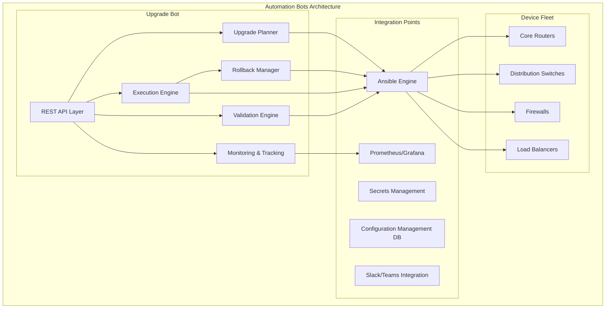
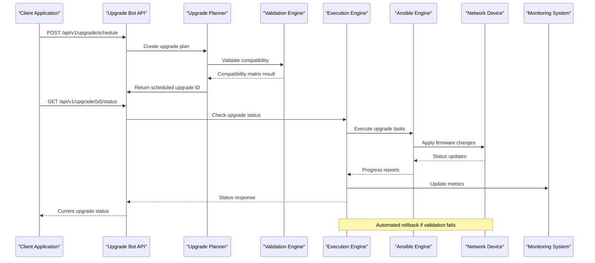
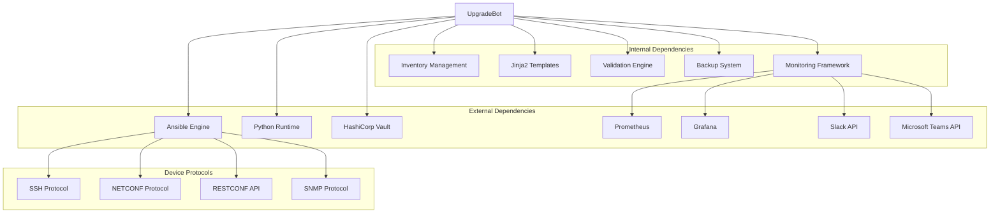

# Upgrade Bot

<cite>
**Referenced Files in This Document**
- [README.md](file://README.md)
</cite>

## Table of Contents
1. [Introduction](#introduction)
2. [Project Structure](#project-structure)
3. [Core Components](#core-components)
4. [Architecture Overview](#architecture-overview)
5. [Detailed Component Analysis](#detailed-component-analysis)
6. [Dependency Analysis](#dependency-analysis)
7. [Performance Considerations](#performance-considerations)
8. [Troubleshooting Guide](#troubleshooting-guide)
9. [Conclusion](#conclusion)

## Introduction

The Upgrade Bot is a sophisticated firmware upgrade orchestration system within the Enterprise Network Automation Platform. It provides automated, safe, and compliant firmware upgrades across device fleets with comprehensive pre-upgrade validation, rollback capabilities, and monitoring. The bot exposes REST API endpoints for planning, executing, and monitoring firmware upgrades while integrating with change advisory boards for production deployments.

## Project Structure

The Upgrade Bot is part of the broader automation bots ecosystem within the network automation platform. According to the project structure, the upgrade functionality is organized under the `bots/upgrade_bot/` directory, following the same modular pattern as other automation bots like firewall_bot, vlan_bot, and health_bot.



**Diagram sources**
- [README.md:141-150](file://README.md#L141-L150)
- [README.md:460-476](file://README.md#L460-L476)

**Section sources**
- [README.md:141-150](file://README.md#L141-L150)
- [README.md:460-476](file://README.md#L460-L476)

## Core Components

The Upgrade Bot system consists of several interconnected components that work together to provide comprehensive firmware upgrade orchestration:

### REST API Layer
The primary interface for interacting with the upgrade system through `/api/v1/upgrade` endpoints. This layer handles request validation, authentication, and response formatting.

### Upgrade Planner
Responsible for creating upgrade plans, managing compatibility matrices, scheduling maintenance windows, and coordinating batch execution strategies.

### Execution Engine
Manages the actual firmware deployment process, including download verification, installation, reboot coordination, and progress tracking.

### Validation Engine
Performs pre-upgrade health checks, post-upgrade validation, and compliance verification to ensure upgrade success and device stability.

### Rollback Manager
Handles automated rollback procedures when upgrades fail or post-upgrade validation doesn't pass, ensuring minimal disruption.

### Monitoring & Tracking
Provides real-time visibility into upgrade progress, status reporting, and integration with observability platforms.

**Section sources**
- [README.md:460-476](file://README.md#L460-L476)

## Architecture Overview

The Upgrade Bot follows a microservices-inspired architecture with clear separation of concerns and robust error handling. The system integrates with existing infrastructure components including Ansible for device communication, Vault for secrets management, and various monitoring tools.



**Diagram sources**
- [README.md:471](file://README.md#L471)
- [README.md:642-670](file://README.md#L642-L670)

## Detailed Component Analysis

### REST API Endpoints

The Upgrade Bot exposes comprehensive REST API endpoints for complete upgrade lifecycle management:

#### Upgrade Planning Endpoints
- **POST /api/v1/upgrade/schedule**: Schedule new firmware upgrades with batch definitions
- **GET /api/v1/upgrade/plans**: Retrieve existing upgrade plans
- **PUT /api/v1/upgrade/plans/{id}**: Modify scheduled upgrade plans
- **DELETE /api/v1/upgrade/plans/{id}**: Cancel scheduled upgrades

#### Execution Control Endpoints
- **POST /api/v1/upgrade/execute/{planId}**: Trigger immediate execution of upgrade plans
- **POST /api/v1/upgrade/pause/{planId}**: Pause active upgrade batches
- **POST /api/v1/upgrade/resume/{planId}**: Resume paused upgrade batches
- **POST /api/v1/upgrade/cancel/{planId}**: Cancel active upgrade operations

#### Monitoring & Reporting Endpoints
- **GET /api/v1/upgrade/status/{planId}**: Get detailed upgrade status
- **GET /api/v1/upgrade/devices/{deviceId}**: Track individual device upgrade progress
- **GET /api/v1/upgrade/reports/{planId}**: Generate upgrade completion reports
- **GET /api/v1/upgrade/metrics**: Access upgrade performance metrics

#### Compatibility & Validation Endpoints
- **GET /api/v1/upgrade/compatibility**: Check firmware compatibility matrix
- **POST /api/v1/upgrade/validate/{planId}**: Run pre-upgrade validation checks
- **GET /api/v1/upgrade/batch-status/{batchId}**: Monitor specific batch progress

### Upgrade Planning Tools

The planning system supports sophisticated upgrade orchestration with multiple strategies:

#### Batch Management
- **Rolling Updates**: Gradual rollout across device groups with health checks between batches
- **Canary Deployments**: Test upgrades on small device subsets before full deployment
- **Maintenance Window Scheduling**: Time-based execution with automatic retry logic
- **Dependency Resolution**: Automatic ordering based on network topology and service dependencies

#### Compatibility Matrix Management
- **Vendor-Specific Compatibility**: Version mapping for Cisco IOS, Juniper JUNOS, Arista EOS, etc.
- **Feature Compatibility**: Ensures firmware versions support required features
- **Hardware Requirements**: Validates hardware compatibility for target firmware versions
- **Known Issues Database**: Tracks known problems with specific firmware combinations

#### Pre-Upgrade Validation Checks
- **Health Assessment**: Comprehensive device health check before upgrade initiation
- **Resource Verification**: Confirms sufficient storage, memory, and processing capacity
- **Backup Validation**: Ensures current configuration backups are available and valid
- **Network Impact Analysis**: Evaluates potential connectivity impacts during upgrade

### Concrete API Examples

#### Scheduling Firmware Upgrades
```json
{
  "plan_name": "Q4_2024_Core_Router_Upgrade",
  "target_firmware": "cisco_iosxe_17.12.4a",
  "maintenance_window": {
    "start_time": "2024-12-15T02:00:00Z",
    "end_time": "2024-12-15T06:00:00Z",
    "timezone": "UTC"
  },
  "batch_strategy": "rolling",
  "batch_size": 3,
  "health_check_interval": 300,
  "rollback_on_failure": true,
  "notification_channels": ["slack", "email"],
  "approval_required": true,
  "devices": {
    "groups": ["core_routers_us_east", "core_routers_us_west"],
    "exclusions": ["maintenance_devices"]
  }
}
```

#### Defining Upgrade Batches
```json
{
  "batch_definition": {
    "strategy": "geographic_rollout",
    "priority_order": ["us_east", "us_west", "eu_west", "apac"],
    "max_concurrent_batches": 2,
    "inter_batch_delay": 1800,
    "success_threshold": 95,
    "failure_action": "pause_and_notify"
  }
}
```

#### Monitoring Upgrade Progress
```json
{
  "monitoring_config": {
    "real_time_updates": true,
    "metrics_collection": ["cpu_usage", "memory_usage", "interface_status", "routing_protocol_state"],
    "alert_thresholds": {
      "cpu_warning": 80,
      "memory_warning": 85,
      "uptime_minimum": 300
    },
    "reporting_format": "json",
    "export_destinations": ["prometheus", "grafana", "siem"]
  }
}
```

### Automated Rollback Procedures

The system implements comprehensive rollback mechanisms to ensure service continuity:

#### Automatic Rollback Triggers
- **Post-Upgrade Health Check Failure**: Devices failing health validation after upgrade
- **Service Degradation**: Network services showing abnormal behavior
- **Timeout Exceeded**: Upgrade operations exceeding maximum allowed duration
- **Manual Intervention**: Operator-initiated rollback requests
- **Compliance Violations**: Post-upgrade configuration drift from approved baselines

#### Rollback Strategies
- **Configuration Rollback**: Restore previous configuration from verified backups
- **Firmware Rollback**: Revert to previous firmware version when supported
- **Partial Rollback**: Selective rollback of failed devices while maintaining successful ones
- **Graceful Degradation**: Maintain partial functionality during rollback processes

### Post-Upgrade Validation

Comprehensive validation ensures upgrade success and system stability:

#### Functional Validation
- **Connectivity Tests**: Verify device reachability and management access
- **Protocol Validation**: Confirm routing protocols, VPN tunnels, and network services
- **Performance Baseline**: Compare performance metrics against pre-upgrade baseline
- **Feature Verification**: Ensure all required features are operational

#### Compliance Validation
- **Security Policy Enforcement**: Verify security configurations meet organizational standards
- **Audit Trail Generation**: Complete audit logs for compliance requirements
- **Documentation Updates**: Automatic update of device documentation and inventory

### Zero-Downtime Upgrade Strategies

The system supports advanced zero-downtime upgrade techniques:

#### High Availability Integration
- **Active-Standby Failover**: Coordinate upgrades with HA pair state transitions
- **Load Balancer Integration**: Remove devices from load pools during upgrade
- **BGP Graceful Restart**: Maintain routing sessions during device restarts
- **VRRP/HSRP Coordination**: Manage virtual router failover during upgrades

#### Traffic Engineering
- **Traffic Shaping**: Gradually reduce traffic during upgrade windows
- **Path Redirection**: Use alternative routes to maintain connectivity
- **Connection Draining**: Gracefully terminate existing connections before reboot

### Maintenance Window Management

Sophisticated maintenance window coordination ensures minimal business impact:

#### Window Definition
- **Time-Based Windows**: Fixed time periods with automatic start/stop
- **Event-Triggered Windows**: Windows initiated by external events or triggers
- **Dynamic Adjustment**: Automatic extension or compression based on upgrade progress
- **Conflict Resolution**: Prevent overlapping maintenance activities

#### CAB Integration
- **Change Advisory Board Approval**: Automated approval workflows for production changes
- **Risk Assessment**: Automated risk scoring based on device criticality and upgrade complexity
- **Stakeholder Notification**: Multi-channel notification to affected stakeholders
- **Compliance Documentation**: Automatic generation of change documentation for audit purposes

**Section sources**
- [README.md:471](file://README.md#L471)
- [README.md:642-670](file://README.md#L642-L670)

## Dependency Analysis

The Upgrade Bot system has well-defined dependencies on core platform components:



**Diagram sources**
- [README.md:184-199](file://README.md#L184-L199)
- [README.md:438-456](file://README.md#L438-L456)

### Component Coupling Analysis

The Upgrade Bot maintains loose coupling with other system components through well-defined interfaces:

- **Ansible Integration**: Uses standard Ansible modules and playbooks for device communication
- **Secrets Management**: Integrates with Vault through adapter layer for credential management
- **Monitoring**: Exposes metrics through Prometheus-compatible endpoints
- **Notification**: Supports multiple channels through unified notification framework

### Potential Circular Dependencies

The architecture avoids circular dependencies through careful component separation:
- Upgrade Bot depends on but is not depended upon by device-specific modules
- Validation engine is independent and can be used by other bots
- Monitoring is decoupled through event-driven architecture

**Section sources**
- [README.md:184-199](file://README.md#L184-L199)
- [README.md:438-456](file://README.md#L438-L456)

## Performance Considerations

The Upgrade Bot is designed for high-performance operation across large device fleets:

### Concurrency and Scaling
- **Parallel Execution**: Multiple upgrade batches can execute concurrently with configurable limits
- **Resource Pooling**: Connection pooling for device management protocols
- **Memory Management**: Efficient memory usage for large-scale operations
- **Caching Strategy**: Intelligent caching of device information and compatibility data

### Optimization Techniques
- **Lazy Loading**: Device information loaded on-demand rather than upfront
- **Batch Processing**: Grouped operations to minimize protocol overhead
- **Retry Logic**: Intelligent retry with exponential backoff for transient failures
- **Progressive Enhancement**: Graceful degradation under resource constraints

### Monitoring and Metrics
- **Performance Metrics**: CPU, memory, and network utilization tracking
- **Operational Metrics**: Upgrade success rates, duration, and failure analysis
- **Business Metrics**: Impact assessment and service availability tracking

## Troubleshooting Guide

Common issues and their resolutions for the Upgrade Bot system:

### Upgrade Planning Issues
- **Compatibility Matrix Errors**: Verify firmware version mappings and hardware compatibility
- **Scheduling Conflicts**: Check maintenance window overlaps and resource availability
- **Approval Workflow Delays**: Review CAB queue and notification delivery status

### Execution Problems
- **Device Connectivity**: Verify SSH/NETCONF reachability and credential validity
- **Firmware Download Failures**: Check storage space and network connectivity to firmware repositories
- **Installation Timeouts**: Review device performance and adjust timeout thresholds

### Rollback Scenarios
- **Rollback Trigger Conditions**: Monitor health check results and service availability metrics
- **Backup Restoration Issues**: Verify backup integrity and restoration permissions
- **Partial Rollback Conflicts**: Resolve dependency conflicts during selective rollback

### Monitoring and Alerting
- **Metric Collection Gaps**: Verify monitoring agent connectivity and metric export configuration
- **Alert Noise Reduction**: Tune alert thresholds and grouping rules
- **Dashboard Performance**: Optimize query performance and data retention policies

**Section sources**
- [README.md:674-685](file://README.md#L674-L685)

## Conclusion

The Upgrade Bot represents a comprehensive solution for enterprise-grade firmware upgrade orchestration. Its design emphasizes safety, reliability, and operational excellence through automated validation, rollback capabilities, and extensive monitoring. The system's integration with existing infrastructure components and support for zero-downtime strategies makes it suitable for production environments requiring high availability and strict compliance requirements.

The modular architecture allows for easy extension and customization while maintaining robust error handling and recovery mechanisms. With comprehensive API coverage and integration points, the Upgrade Bot provides a foundation for automated, compliant, and reliable firmware management across diverse network device fleets.