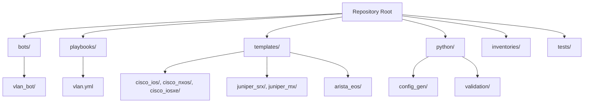
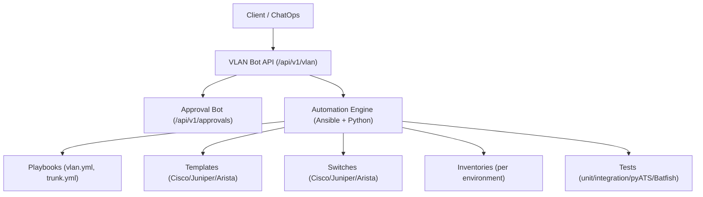
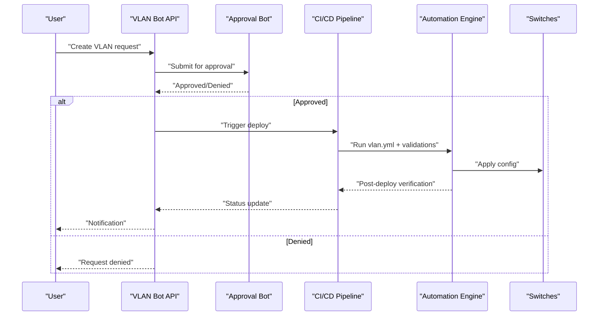
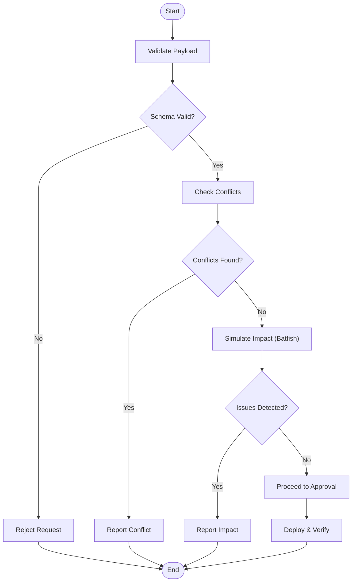
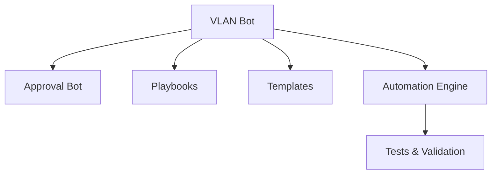

# VLAN Bot

<cite>
**Referenced Files in This Document**
- [README.md](file://README.md)
</cite>

## Table of Contents
1. [Introduction](#introduction)
2. [Project Structure](#project-structure)
3. [Core Components](#core-components)
4. [Architecture Overview](#architecture-overview)
5. [Detailed Component Analysis](#detailed-component-analysis)
6. [Dependency Analysis](#dependency-analysis)
7. [Performance Considerations](#performance-considerations)
8. [Troubleshooting Guide](#troubleshooting-guide)
9. [Conclusion](#conclusion)

## Introduction
This section documents the VLAN Bot sub-feature within the Enterprise Network Automation Platform. The VLAN Bot exposes a REST API for self-service VLAN provisioning and integrates with an approval workflow. It supports multi-vendor switches (Cisco, Juniper, Arista) through the platform’s automation engine and templates. The feature is designed to operate consistently across environments using GitOps practices, CI/CD validation, and post-deploy verification.

## Project Structure
The repository organizes automation assets by environment, roles, templates, bots, tests, and pipelines. The VLAN Bot resides under the bots directory and interacts with playbooks, templates, and the automation engine.

**Diagram sources**
- [README.md:103-180](file://README.md#L103-L180)
- [README.md:390-399](file://README.md#L390-L399)

**Section sources**
- [README.md:103-180](file://README.md#L103-L180)

## Core Components
- VLAN Bot API: Exposes endpoints for VLAN operations and integrates with ChatOps.
- Approval Workflow: Manages change approvals before deployment.
- Playbooks: Reusable Ansible playbooks for VLAN creation/modification.
- Templates: Vendor-specific Jinja2 templates for generating device configurations.
- Automation Engine: Orchestrates execution via Ansible and Python modules.

Key responsibilities:
- Accept VLAN requests via REST API.
- Validate inputs against schemas and policies.
- Trigger approval workflow when required.
- Render vendor-specific configurations using templates.
- Deploy changes through CI/CD with dry-run and verification.
- Update inventory and CMDB records as part of lifecycle management.

**Section sources**
- [README.md:460-478](file://README.md#L460-L478)
- [README.md:390-399](file://README.md#L390-L399)
- [README.md:103-180](file://README.md#L103-L180)

## Architecture Overview
The VLAN Bot operates within the broader automation architecture, leveraging the control plane (Ansible, Python, Bots) and data plane (switches). It uses CI/CD gates for validation and approval, then deploys configurations to target devices.

**Diagram sources**
- [README.md:460-478](file://README.md#L460-L478)
- [README.md:390-399](file://README.md#L390-L399)
- [README.md:103-180](file://README.md#L103-L180)

## Detailed Component Analysis

### VLAN Bot API Endpoints
- Base path: /api/v1/vlan
- Operations: Create, Modify, Decommission VLANs
- Integration: Slack ChatOps for request submission and status updates
- Approval: Integrates with /api/v1/approvals for change gating

Typical request patterns:
- Create VLAN: POST /api/v1/vlan with payload including VLAN ID, name, scope, and optional trunk/access/VRF bindings.
- Modify VLAN: PATCH /api/v1/vlan/{id} to update attributes or port associations.
- Decommission VLAN: DELETE /api/v1/vlan/{id} to remove VLAN and associated bindings.

Response semantics:
- 201 Created on successful creation
- 200 OK on successful modification
- 204 No Content on successful decommission
- 400 Bad Request for invalid payloads
- 403 Forbidden if approval not granted
- 409 Conflict if VLAN ID/name collision detected
- 500 Internal Server Error on backend failures

**Section sources**
- [README.md:460-478](file://README.md#L460-L478)

### VLAN Naming Conventions and Numbering Schemes
- Naming: Use descriptive names that reflect purpose, tenant, and site (e.g., dc1-app-web-tier).
- Numbering: Follow enterprise ranges per function (e.g., access VLANs in specific blocks, management VLANs reserved).
- Scope: Ensure uniqueness across regions/environments; use prefixes to disambiguate.
- Documentation: Maintain a registry in Git (inventory or schema) to enforce conventions.

Note: Specific naming rules and number ranges are defined in organizational policy and enforced via schema validation and compliance checks.

[No sources needed since this section provides general guidance]

### Allocation Strategies
- Centralized allocation: A single source of truth tracks available VLAN IDs and prevents conflicts.
- Reservation pools: Pre-allocate blocks for teams/projects to reduce contention.
- Dynamic assignment: Automated selection from available pools based on naming and scope constraints.
- Auditability: All allocations recorded in version control and synchronized with CMDB.

[No sources needed since this section provides general guidance]

### Trunk Configuration and Access Port Assignments
- Trunks: Define allowed VLAN lists and native VLAN settings per interface group.
- Access ports: Bind access interfaces to a single VLAN with appropriate tagging behavior.
- Multi-VLAN trunks: Configure permitted VLAN sets aligned with service requirements.
- Vendor differences: Template-driven generation ensures correct syntax for Cisco IOS/NX-OS, Juniper MX/SRX, and Arista EOS.

Operational flow:
- Request includes interface groups and desired VLAN membership.
- Templates render vendor-specific configuration snippets.
- Playbooks apply changes with pre/post checks.

**Section sources**
- [README.md:390-399](file://README.md#L390-L399)
- [README.md:103-180](file://README.md#L103-L180)

### VRF Bindings
- VRF association: Attach VLANs to VRF instances where applicable.
- Routing implications: Ensure route redistribution and inter-VRF policies are considered.
- Validation: Run network simulation (Batfish) to detect routing issues prior to deployment.

**Section sources**
- [README.md:517-545](file://README.md#L517-L545)

### Approval Workflow Integration
- Change request: Submitted via API or ChatOps.
- Policy check: Schema validation and compliance scan run automatically.
- Approval gate: Manual approval required before deployment.
- Execution: On approval, CI/CD triggers playbook execution and verification.

**Diagram sources**
- [README.md:460-478](file://README.md#L460-L478)
- [README.md:479-514](file://README.md#L479-L514)

### Conflict Detection and Impact Analysis
- Conflict detection: Check for duplicate VLAN IDs/names and overlapping assignments.
- Impact analysis: Use Batfish to simulate ACL/routing impacts and validate reachability.
- Compliance checks: Enforce security and operational policies before deployment.

**Diagram sources**
- [README.md:517-545](file://README.md#L517-L545)

### VLAN Lifecycle Management
- Creation: Submit request, pass validation and approval, deploy configuration.
- Modification: Update VLAN attributes or port bindings; re-validate and re-approve if necessary.
- Decommission: Remove VLAN and associated bindings; verify no dependencies remain.
- Cleanup: Ensure orphaned references are removed; update inventory and CMDB.

**Section sources**
- [README.md:390-399](file://README.md#L390-L399)
- [README.md:460-478](file://README.md#L460-L478)

### CMDB Integration and Inventory Synchronization
- Inventory model: Devices grouped by environment, role, region, vendor.
- Synchronization: After deployment, update inventories and CMDB records to reflect current state.
- Drift detection: Compare running configs against baseline; alert on deviations.

**Section sources**
- [README.md:284-336](file://README.md#L284-L336)
- [README.md:420-435](file://README.md#L420-L435)

## Dependency Analysis
The VLAN Bot depends on:
- Approval Bot for change gating
- Playbooks for operational tasks
- Templates for vendor-specific configuration generation
- Automation Engine for orchestration
- Tests and validation tools for safety and quality

**Diagram sources**
- [README.md:460-478](file://README.md#L460-L478)
- [README.md:390-399](file://README.md#L390-L399)
- [README.md:103-180](file://README.md#L103-L180)

**Section sources**
- [README.md:460-478](file://README.md#L460-L478)
- [README.md:390-399](file://README.md#L390-L399)
- [README.md:103-180](file://README.md#L103-L180)

## Performance Considerations
- Batch operations: Group multiple VLAN changes to minimize round trips.
- Parallelism: Leverage concurrency in Python modules and Ansible for large fleets.
- Caching: Cache template renders and device capabilities where safe.
- Monitoring: Track API latency, error rates, and deployment durations.

[No sources needed since this section provides general guidance]

## Troubleshooting Guide
Common issues and resolutions:
- Connection timeouts: Verify SSH reachability and credentials.
- Template rendering errors: Inspect Jinja2 syntax and variables.
- Compliance failures: Review policy violations and adjust requests.
- CI pipeline failures: Check logs for actionable messages.
- Vault authentication failures: Validate OIDC tokens or AppRole credentials.
- Molecule test failures: Ensure Docker/Podman is running.
- Batfish analysis errors: Validate snapshots and topology.

**Section sources**
- [README.md:674-685](file://README.md#L674-L685)

## Conclusion
The VLAN Bot provides a secure, automated, and compliant pathway for VLAN provisioning across multi-vendor environments. By integrating with approval workflows, CI/CD, and validation tools, it ensures safe deployments while maintaining accurate inventory and CMDB records. Adhering to naming conventions, allocation strategies, and lifecycle procedures helps maintain consistency and reduces risk across the network fabric.