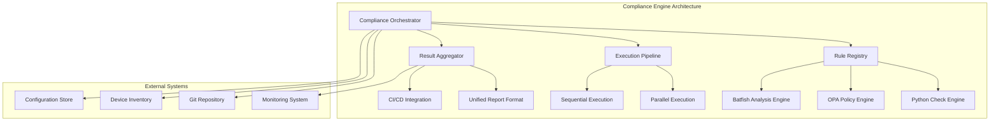
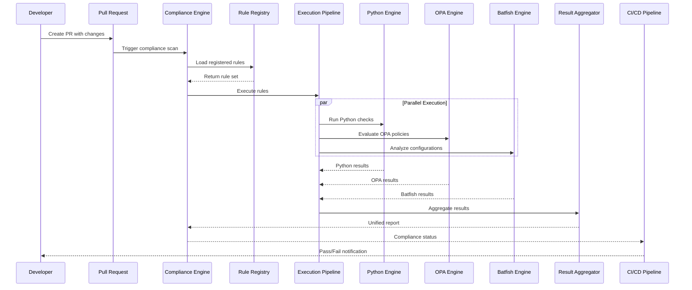
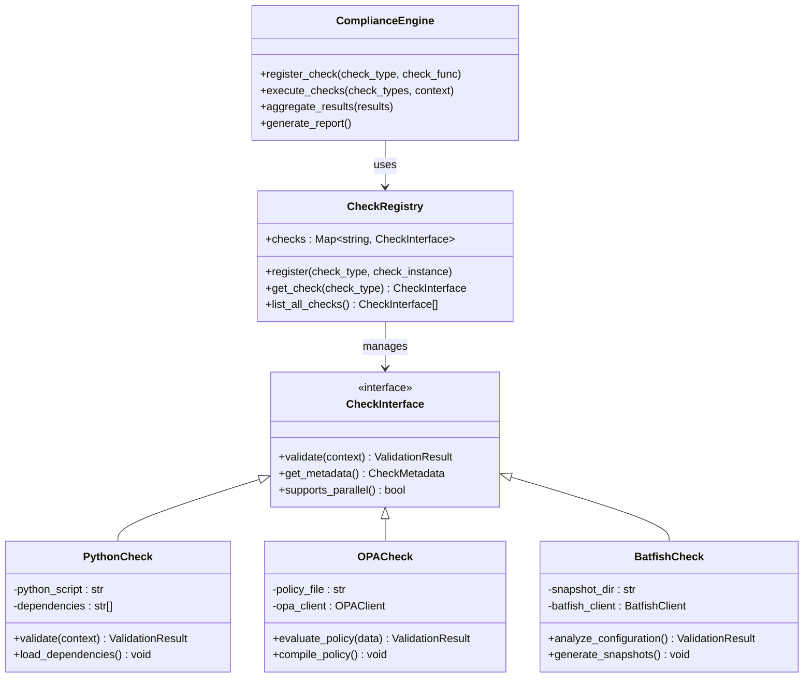
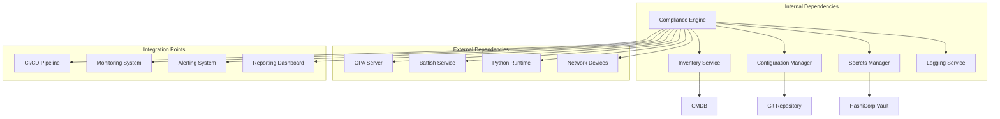

# Compliance Engine Architecture

<cite>
**Referenced Files in This Document**
- [README.md](file://README.md)
</cite>

## Table of Contents
1. [Introduction](#introduction)
2. [Project Structure](#project-structure)
3. [Core Components](#core-components)
4. [Architecture Overview](#architecture-overview)
5. [Detailed Component Analysis](#detailed-component-analysis)
6. [Dependency Analysis](#dependency-analysis)
7. [Performance Considerations](#performance-considerations)
8. [Troubleshooting Guide](#troubleshooting-guide)
9. [Conclusion](#conclusion)
10. [Appendices](#appendices)

## Introduction

The Enterprise Network Automation Platform features a sophisticated compliance engine designed to enforce security policies and configuration standards across multi-vendor, multi-region network environments. This pluggable policy enforcement system integrates multiple validation engines including custom Python checks, OPA (Open Policy Agent) policies, and Batfish configuration analysis to provide comprehensive compliance monitoring throughout the entire infrastructure lifecycle.

The compliance engine operates as a critical component within the GitOps workflow, ensuring that all network configurations meet organizational security standards before deployment while maintaining continuous compliance monitoring in production environments.

## Project Structure

The compliance engine is organized within a modular architecture that supports multiple validation engines and extensible check types:

**Diagram sources**
- [README.md:130-180](file://README.md#L130-L180)
- [README.md:438-456](file://README.md#L438-L456)

**Section sources**
- [README.md:103-180](file://README.md#L103-L180)
- [README.md:438-456](file://README.md#L438-L456)

## Core Components

The compliance engine consists of several key components that work together to provide comprehensive policy enforcement:

### Rule Registration System
The rule registration system provides a centralized registry for all compliance checks, supporting multiple check types and execution strategies. Each check type implements a standardized interface allowing for seamless integration and execution.

### Execution Pipeline
The execution pipeline manages the orchestration of different validation engines, supporting both parallel and sequential execution patterns based on dependency requirements and performance considerations.

### Result Aggregation
The result aggregation component normalizes outputs from different validation engines into a unified compliance report format, enabling consistent reporting and analysis across all check types.

### Extensibility Framework
The framework provides clear extension points for adding new check types, integrating additional validation engines, and customizing execution behavior without modifying core engine logic.

**Section sources**
- [README.md:438-456](file://README.md#L438-L456)
- [README.md:548-580](file://README.md#L548-L580)

## Architecture Overview

The compliance engine follows a modular architecture pattern that separates concerns between policy definition, execution orchestration, and result processing:

**Diagram sources**
- [README.md:568-579](file://README.md#L568-L579)
- [README.md:478-514](file://README.md#L478-L514)

## Detailed Component Analysis

### Pluggable Policy Enforcement System

The compliance engine implements a pluggable architecture that supports multiple validation engines through a common interface:

#### Custom Python Checks
Custom Python checks provide flexible programmatic validation capabilities for complex business logic and device-specific compliance requirements. These checks can access device configurations, inventory data, and external APIs to perform comprehensive validation.

#### OPA Policy Engine Integration
Open Policy Agent integration enables declarative policy definition using Rego language, providing powerful policy evaluation capabilities for configuration validation, access control, and governance rules.

#### Batfish Configuration Analysis
Batfish integration performs deep network configuration analysis including ACL reachability, routing loop detection, firewall rule optimization, and network-wide policy compliance verification.

**Diagram sources**
- [README.md:438-456](file://README.md#L438-L456)
- [README.md:548-580](file://README.md#L438-L456)

### Rule Registration and Management

The rule registration system provides a centralized mechanism for managing compliance checks across different engines and execution contexts:

#### Check Type Registration
Each check type implements a standardized interface that defines validation logic, metadata, and execution characteristics. The registry maintains mappings between check identifiers and their implementations.

#### Context-Aware Validation
Checks receive contextual information including device inventory, current configurations, change sets, and environment variables to enable intelligent validation decisions.

#### Dependency Management
The system handles dependencies between checks, ensuring proper execution order when checks depend on outputs from other checks or external systems.

### Execution Pipeline Orchestration

The execution pipeline manages the orchestration of different validation engines with support for both parallel and sequential execution patterns:

#### Parallel Execution Strategy
Independent checks execute concurrently to minimize total execution time, with resource limits and timeout management to prevent resource exhaustion.

#### Sequential Execution Strategy
Dependent checks execute in specified order, with output from one check available as input to subsequent checks in the chain.

#### Error Handling and Recovery
The pipeline implements robust error handling with retry logic, circuit breakers, and graceful degradation when individual checks fail.

### Result Normalization and Reporting

All validation results are normalized into a unified compliance report format that provides consistent structure and semantics across different check types:

#### Standardized Result Format
Results include check metadata, pass/fail status, severity levels, detailed descriptions, remediation guidance, and evidence collection for audit purposes.

#### Aggregation and Correlation
Multiple results are aggregated to provide overall compliance status, trend analysis, and correlation between related violations.

#### Multi-format Output
Reports are generated in multiple formats including JSON for machine processing, HTML for human review, and integration with monitoring and alerting systems.

**Section sources**
- [README.md:548-580](file://README.md#L548-L580)
- [README.md:438-456](file://README.md#L438-L456)

## Dependency Analysis

The compliance engine has well-defined dependencies on external systems and internal components:

**Diagram sources**
- [README.md:130-180](file://README.md#L130-L180)
- [README.md:438-456](file://README.md#L438-L456)

### Component Coupling Analysis

The compliance engine demonstrates low coupling with high cohesion, where each component has a single responsibility and communicates through well-defined interfaces. The pluggable architecture ensures minimal impact when adding new check types or replacing existing ones.

### External Integration Patterns

The engine follows established integration patterns for external systems including REST API consumption, message queue communication, and event-driven architectures for real-time compliance monitoring.

**Section sources**
- [README.md:130-180](file://README.md#L130-L180)
- [README.md:438-456](file://README.md#L438-L456)

## Performance Considerations

The compliance engine is designed for enterprise-scale operations with thousands of devices and frequent policy updates:

### Scalability Strategies
- Horizontal scaling of check execution workers
- Distributed rule evaluation across multiple nodes
- Caching mechanisms for frequently accessed configurations and policy results
- Batch processing for large-scale compliance audits

### Resource Optimization
- Intelligent check scheduling based on device availability and network conditions
- Memory-efficient processing of large configuration files
- Connection pooling for external service interactions
- Lazy loading of check dependencies

### Monitoring and Observability
- Comprehensive metrics collection for check execution times and success rates
- Distributed tracing for cross-service request flows
- Alerting on performance degradation and resource exhaustion
- Audit logging for compliance and troubleshooting purposes

## Troubleshooting Guide

Common issues and resolution strategies for the compliance engine:

### Check Execution Failures
- Verify check dependencies and environment setup
- Review check logs for specific error details
- Validate input data and configuration formats
- Test check isolation by running individual checks

### Performance Issues
- Monitor resource utilization during check execution
- Adjust parallel execution limits based on system capacity
- Optimize check logic for large datasets
- Implement caching strategies for repeated evaluations

### Integration Problems
- Validate external service connectivity and authentication
- Check API rate limits and throttling policies
- Verify data format compatibility between services
- Review network policies and firewall rules

### Policy Evaluation Errors
- Debug OPA policy syntax and logic
- Validate Batfish snapshot generation and analysis
- Review Python check code for runtime errors
- Test policy changes in isolated environments

**Section sources**
- [README.md:674-685](file://README.md#L674-L685)

## Conclusion

The compliance engine architecture provides a robust, scalable, and extensible foundation for enforcing network security policies across enterprise environments. The pluggable design supports multiple validation engines while maintaining consistent interfaces and reporting formats. The integration with CI/CD pipelines ensures continuous compliance monitoring throughout the infrastructure lifecycle, from development through production.

Key strengths of the architecture include its modular design, comprehensive coverage of validation approaches, and strong integration with existing DevOps toolchains. The extensibility points allow organizations to adapt the engine to their specific compliance requirements while leveraging proven validation technologies like OPA and Batfish.

## Appendices

### Compliance Check Categories

The platform supports various categories of compliance checks:

| Category | Description | Examples |
|----------|-------------|----------|
| Security Policies | Authentication, authorization, encryption standards | SSH-only access, approved ciphers, password policies |
| Configuration Standards | Device configuration baselines and best practices | NTP configuration, logging settings, banner messages |
| Network Design | Routing, switching, and firewall rule compliance | ACL standards, routing protocol policies, VLAN assignments |
| Operational Requirements | Monitoring, backup, and maintenance procedures | SNMP configuration, syslog setup, backup schedules |
| Regulatory Compliance | Industry-specific regulatory requirements | PCI-DSS, SOX, HIPAA compliance checks |

### Integration Patterns

The compliance engine supports multiple integration patterns for different use cases:

- **Pull-based**: Scheduled compliance scans triggered by CI/CD pipelines
- **Push-based**: Real-time compliance events published to monitoring systems
- **On-demand**: API-driven compliance checks triggered by operational workflows
- **Event-driven**: Compliance evaluation triggered by configuration changes