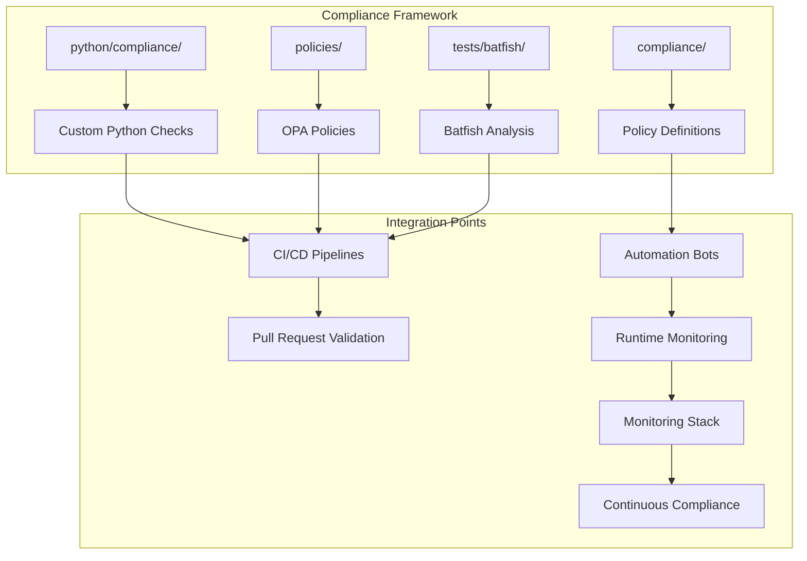
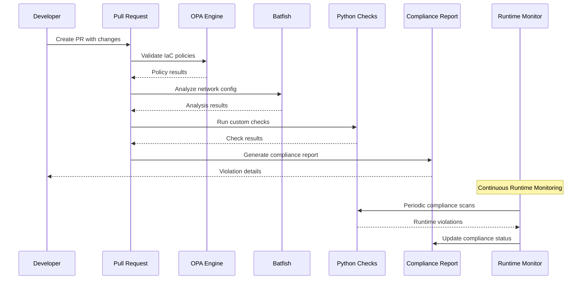
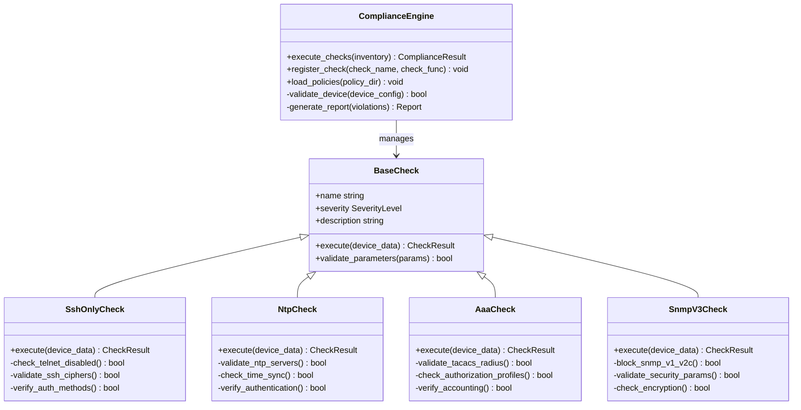
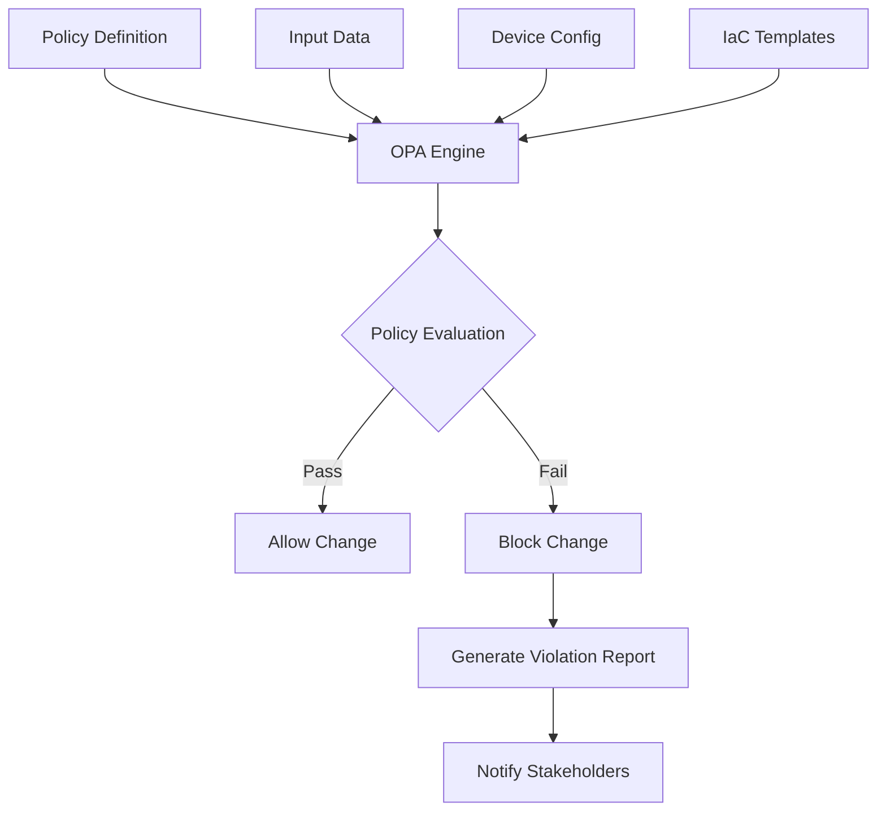
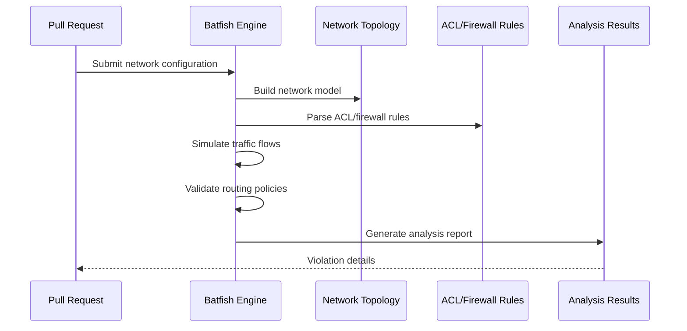
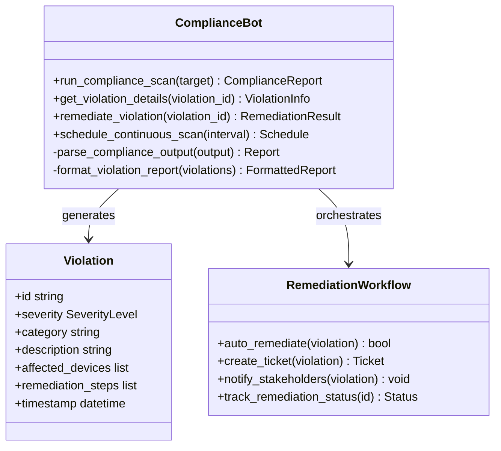
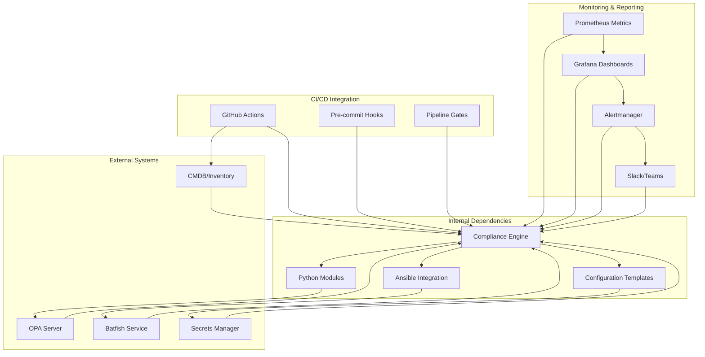

# Compliance Framework

<cite>
**Referenced Files in This Document**
- [README.md](file://README.md)
</cite>

## Table of Contents
1. [Introduction](#introduction)
2. [Project Structure](#project-structure)
3. [Core Components](#core-components)
4. [Architecture Overview](#architecture-overview)
5. [Detailed Component Analysis](#detailed-component-analysis)
6. [Dependency Analysis](#dependency-analysis)
7. [Performance Considerations](#performance-considerations)
8. [Troubleshooting Guide](#troubleshooting-guide)
9. [Conclusion](#conclusion)
10. [Appendices](#appendices)

## Introduction

The Enterprise Network Automation Platform implements a comprehensive compliance framework designed to enforce security policies, configuration standards, and operational best practices across multi-vendor network environments. This framework operates at every stage of the software development lifecycle, from pull request validation through production runtime monitoring, ensuring continuous compliance enforcement.

The compliance system is built around three core pillars: pluggable policy enforcement with custom Python checks, Open Policy Agent (OPA) integration for declarative policy management, and Batfish configuration analysis for deep network state validation. This multi-layered approach ensures comprehensive coverage of security requirements while maintaining flexibility for organization-specific compliance needs.

## Project Structure

The compliance framework is organized within a modular architecture that supports multiple enforcement mechanisms and integrates seamlessly with the broader automation platform. The key directories and components include:



**Diagram sources**
- [README.md:159-179](file://README.md#L159-L179)

The compliance framework follows a layered architecture where each layer provides specific functionality while maintaining clear separation of concerns. Custom Python checks handle device-specific validations, OPA policies manage infrastructure-as-code compliance, and Batfish performs deep network topology analysis.

**Section sources**
- [README.md:159-179](file://README.md#L159-L179)

## Core Components

### Pluggable Policy Enforcement Engine

The compliance engine supports multiple policy enforcement mechanisms through a unified interface:

| Component | Purpose | Technology | Integration Point |
|-----------|---------|------------|-------------------|
| Custom Python Checks | Device-specific compliance rules | Python 3.11+ | python/compliance/ |
| OPA Policies | Infrastructure-as-code validation | Open Policy Agent | policies/ |
| Batfish Analysis | Network state and ACL validation | Batfish | tests/batfish/ |
| Compliance Bot | API-driven compliance operations | REST API | bots/compliance_bot/ |

The pluggable architecture allows organizations to extend compliance capabilities without modifying core engine logic. Each check type implements a common interface, enabling seamless addition of new compliance validators.

### Compliance Check Categories

The framework implements comprehensive compliance checks across multiple security domains:

#### SSH-Only Policies
- Enforces SSH-only access by disabling Telnet services
- Validates SSH cipher suites against approved lists
- Ensures proper authentication methods (public key, TACACS+)
- Blocks insecure SSH configurations

#### NTP Configuration
- Mandates NTP server configuration on all devices
- Validates time synchronization accuracy
- Ensures secure NTP authentication
- Monitors time drift and alerts on deviations

#### AAA Setup
- Requires centralized authentication (TACACS+/RADIUS)
- Validates authorization profiles and accounting
- Ensures proper privilege escalation controls
- Monitors authentication failures and lockouts

#### SNMPv3 Enforcement
- Prohibits SNMPv1/v2c usage
- Validates SNMPv3 security parameters
- Ensures proper encryption and authentication
- Monitors SNMP trap destinations

#### Cipher Standards
- Enforces approved cryptographic algorithms
- Validates TLS/SSL certificate configurations
- Ensures minimum key lengths and protocols
- Monitors certificate expiration dates

#### Firmware Approval
- Maintains approved firmware version lists
- Validates device OS versions against baselines
- Tracks firmware upgrade compliance
- Alerts on unauthorized firmware changes

#### Password Policies
- Enforces password complexity requirements
- Validates password rotation schedules
- Ensures proper account lockout policies
- Monitors credential usage patterns

#### ACL Standards
- Validates default deny policies
- Ensures explicit allow statements only
- Detects overly permissive rules
- Identifies unused or shadowed rules

#### Firewall Rule Validation
- Prevents any-any rule creation
- Detects duplicate and conflicting rules
- Validates rule ordering and specificity
- Ensures proper logging on critical rules

**Section sources**
- [README.md:554-566](file://README.md#L554-L566)

## Architecture Overview

The compliance framework employs a multi-stage enforcement model that integrates with CI/CD pipelines and runtime monitoring systems:



**Diagram sources**
- [README.md:570-579](file://README.md#L570-L579)

### Compliance Flow Stages

The compliance enforcement occurs at multiple stages throughout the change lifecycle:

1. **Pre-commit Stage**: Local validation using pre-commit hooks
2. **Pull Request Stage**: Automated compliance scanning in CI/CD
3. **Approval Gate**: Manual review of compliance violations
4. **Deployment Stage**: Pre-deployment validation
5. **Post-deployment**: Verification and drift detection
6. **Runtime Monitoring**: Continuous compliance assessment

Each stage provides increasingly sophisticated analysis, from simple syntax validation to complex network behavior simulation.

**Section sources**
- [README.md:568-579](file://README.md#L568-L579)

## Detailed Component Analysis

### Custom Python Compliance Engine

The Python-based compliance engine provides flexible, extensible compliance checking capabilities:



**Diagram sources**
- [README.md:453-456](file://README.md#L453-L456)

The compliance engine supports dynamic check registration, allowing organizations to add custom compliance rules without modifying core code. Each check implements a standardized interface and includes metadata for reporting and severity classification.

### Open Policy Agent Integration

OPA policies provide declarative compliance enforcement for infrastructure-as-code artifacts:



OPA policies are written in Rego language and evaluate infrastructure configurations against organizational security requirements. The system supports both positive and negative testing approaches, ensuring comprehensive policy coverage.

### Batfish Configuration Analysis

Batfish provides deep network state analysis and protocol correctness validation:



Batfish analyzes network configurations for reachability issues, routing loops, firewall misconfigurations, and other network-level problems that traditional text-based checks might miss.

**Section sources**
- [README.md:525-527](file://README.md#L525-L527)

### Compliance Bot Integration

The compliance bot provides API-driven compliance operations and ChatOps integration:



The compliance bot exposes REST APIs for programmatic compliance operations and integrates with chat platforms for real-time compliance notifications and manual intervention capabilities.

**Section sources**
- [README.md:471-475](file://README.md#L471-L475)

## Dependency Analysis

The compliance framework maintains clear dependency boundaries while integrating with multiple external systems:



Key dependency characteristics:
- **Loose Coupling**: External systems accessed through well-defined interfaces
- **Retry Logic**: Built-in retry mechanisms for transient failures
- **Timeout Handling**: Configurable timeouts for external service calls
- **Fallback Modes**: Graceful degradation when external services are unavailable

**Diagram sources**
- [README.md:184-199](file://README.md#L184-L199)

## Performance Considerations

The compliance framework is designed for enterprise-scale deployments with thousands of network devices:

### Scalability Features
- **Parallel Processing**: Concurrent execution of compliance checks across device groups
- **Incremental Scanning**: Only affected devices re-scanned after configuration changes
- **Caching Layer**: Cached results for unchanged configurations and policies
- **Resource Limits**: Configurable resource constraints to prevent pipeline overload

### Optimization Strategies
- **Check Prioritization**: Critical checks execute first to fail fast
- **Batch Operations**: Grouped device queries reduce connection overhead
- **Lazy Loading**: Policies and checks loaded on-demand
- **Memory Management**: Efficient data structures for large configuration sets

### Monitoring Metrics
The framework exposes comprehensive metrics for performance monitoring:
- Check execution times and success rates
- Resource utilization during compliance scans
- Queue depths and processing latency
- Cache hit ratios and invalidation rates

## Troubleshooting Guide

Common compliance framework issues and their resolutions:

### Pipeline Failures
| Issue | Symptoms | Resolution |
|-------|----------|------------|
| OPA Policy Failure | Policy evaluation errors in CI logs | Review Rego policy syntax and input data structure |
| Batfish Analysis Error | Network model build failures | Validate configuration syntax and topology definitions |
| Python Check Timeout | Check execution exceeding limits | Optimize check logic or increase timeout thresholds |
| Connection Issues | Device connectivity failures | Verify credentials and network reachability |

### Runtime Monitoring Issues
| Issue | Symptoms | Resolution |
|-------|----------|------------|
| Drift Detection False Positives | Excessive non-compliant device reports | Tune drift detection thresholds and exclusion rules |
| Alert Storms | Excessive compliance violation notifications | Implement alert aggregation and suppression rules |
| Performance Degradation | Slow compliance scan completion | Review parallelization settings and resource allocation |

### Debugging Tools
- **Verbose Logging**: Enable debug logging for compliance check execution
- **Policy Testing**: Test OPA policies against sample configurations
- **Check Isolation**: Run individual compliance checks for troubleshooting
- **Report Generation**: Export detailed compliance reports for analysis

**Section sources**
- [README.md:674-685](file://README.md#L674-L685)

## Conclusion

The Enterprise Network Automation Platform's compliance framework provides a comprehensive, multi-layered approach to network security and operational compliance. By combining custom Python checks, OPA policy enforcement, and Batfish configuration analysis, the system ensures robust compliance validation throughout the entire change lifecycle.

The framework's modular architecture enables easy extension and customization while maintaining high performance and reliability at enterprise scale. Integration with CI/CD pipelines, monitoring systems, and ChatOps tools creates a cohesive compliance ecosystem that adapts to evolving organizational requirements.

Key strengths of the compliance framework include its pluggable design, comprehensive coverage of security domains, automated remediation capabilities, and continuous monitoring features. This approach ensures that network configurations remain compliant with organizational policies while supporting rapid innovation and deployment cycles.

## Appendices

### Compliance Severity Levels

| Severity Level | Description | Action Required |
|---------------|-------------|-----------------|
| Critical | Immediate security risk or regulatory violation | Block deployment, immediate remediation required |
| High | Significant security weakness or policy violation | Require approval before deployment, prompt remediation |
| Medium | Moderate policy deviation or best practice violation | Allow with documented exception, scheduled remediation |
| Low | Minor policy deviation or informational finding | Log for awareness, optional remediation |

### Integration Examples

#### GitHub Actions Workflow Integration
```yaml
# Example workflow step for compliance checking
- name: Run Compliance Checks
  run: |
    python -m python.compliance \
      --inventory inventories/staging/hosts.yml \
      --policy-dir policies/ \
      --output compliance-report.json
```

#### Custom Compliance Check Template
```python
# Example custom compliance check structure
class CustomSecurityCheck(BaseCheck):
    def __init__(self):
        super().__init__(
            name="custom_security_check",
            severity=SeverityLevel.HIGH,
            description="Validates custom security requirements"
        )
    
    def execute(self, device_data):
        # Implementation of custom security validation
        pass
```

### Best Practices

1. **Policy Development**: Start with broad policies and refine based on operational feedback
2. **Testing Strategy**: Comprehensive test coverage for all compliance checks
3. **Documentation**: Maintain detailed documentation for all compliance requirements
4. **Review Process**: Regular review and update of compliance policies
5. **Training**: Ensure team understanding of compliance requirements and processes