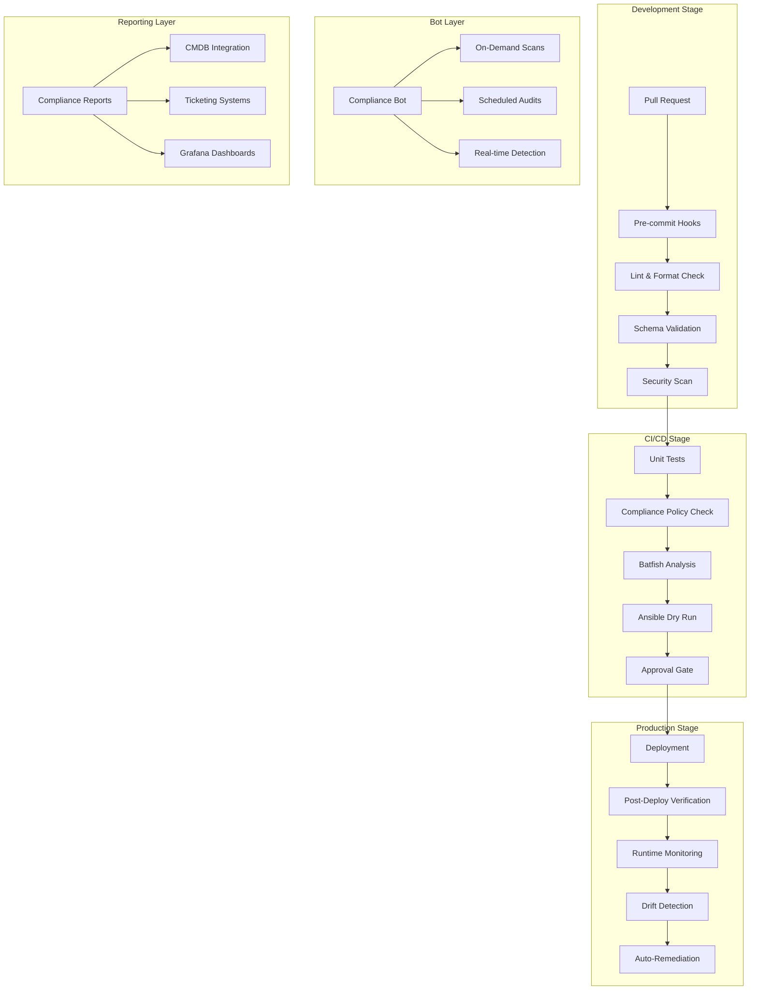
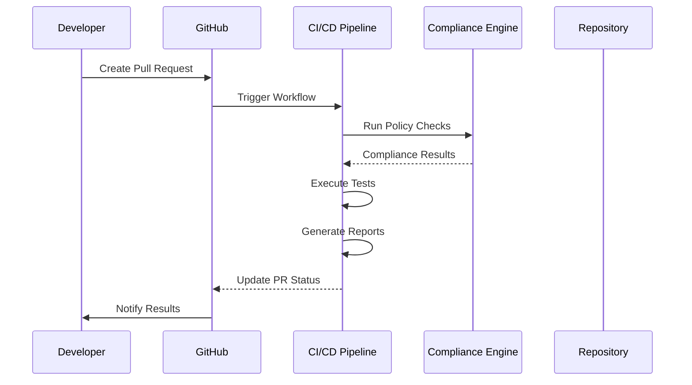

# Compliance Workflows and Integration

<cite>
**Referenced Files in This Document**
- [README.md](file://README.md)
</cite>

## Table of Contents
1. [Introduction](#introduction)
2. [Compliance Architecture Overview](#compliance-architecture-overview)
3. [Multi-Stage Compliance Enforcement Flow](#multi-stage-compliance-enforcement-flow)
4. [GitHub Actions Integration](#github-actions-integration)
5. [Pre-commit Hooks Integration](#pre-commit-hooks-integration)
6. [Deployment Pipeline Integration](#deployment-pipeline-integration)
7. [Compliance Bot Functionality](#compliance-bot-functionality)
8. [Workflow Configuration Examples](#workflow-configuration-examples)
9. [Notification Strategies](#notification-strategies)
10. [Escalation Procedures](#escalation-procedures)
11. [Compliance Reporting Formats](#compliance-reporting-formats)
12. [Audit Trail Generation](#audit-trail-generation)
13. [External System Integration](#external-system-integration)
14. [Deployment Gates and Approval Workflows](#deployment-gates-and-approval-workflows)
15. [Rollback Triggers](#rollback-triggers)
16. [Performance Considerations](#performance-considerations)
17. [Troubleshooting Guide](#troubleshooting-guide)
18. [Conclusion](#conclusion)

## Introduction

This document provides comprehensive coverage of compliance workflows and their integration throughout the automation lifecycle for the Enterprise Network Automation Platform. The platform implements a robust, multi-layered compliance enforcement strategy that spans from pull request validation through production runtime monitoring, ensuring network configurations maintain security standards, operational policies, and regulatory requirements at every stage of the deployment pipeline.

The compliance system is built around several key principles:
- **Compliance as Code**: All policies are version-controlled and auditable
- **Shift-Left Security**: Early detection of compliance violations in development
- **Continuous Monitoring**: Real-time drift detection in production environments
- **Automated Remediation**: Self-healing capabilities for common compliance issues
- **Comprehensive Audit Trails**: Complete visibility into all compliance activities

## Compliance Architecture Overview

The compliance architecture follows a defense-in-depth approach with multiple layers of enforcement:

**Diagram sources**
- [README.md:36-50](file://README.md#L36-L50)
- [README.md:570-579](file://README.md#L570-L579)

## Multi-Stage Compliance Enforcement Flow

The platform implements a comprehensive multi-stage compliance enforcement flow that ensures policy adherence throughout the entire automation lifecycle:

### Stage 1: Pull Request Validation
- **Policy-as-Code**: OPA (Open Policy Agent) policies validate infrastructure changes
- **Configuration Analysis**: Batfish performs deep packet inspection simulation
- **Custom Python Checks**: Vendor-specific compliance rules execution
- **Secrets Detection**: Automated scanning for hardcoded credentials

### Stage 2: CI/CD Pipeline Integration
- **Automated Testing**: Comprehensive test suite execution
- **Template Rendering**: Jinja2 template validation and dry-run execution
- **Compliance Scanning**: Full policy enforcement across all targets
- **Approval Gates**: Manual intervention points for high-risk changes

### Stage 3: Production Runtime Monitoring
- **Continuous Compliance**: Real-time configuration drift detection
- **Automated Remediation**: Self-healing for common violations
- **Alerting**: Multi-channel notification for critical issues
- **Audit Logging**: Complete change history and compliance status tracking

**Section sources**
- [README.md:548-581](file://README.md#L548-L581)

## GitHub Actions Integration

The compliance system integrates deeply with GitHub Actions to provide automated enforcement at every code change:

### Workflow Orchestration
The platform defines multiple GitHub Actions workflows that handle different aspects of compliance:

| Workflow | Trigger | Purpose | Compliance Focus |
|----------|---------|---------|------------------|
| `ci-validate.yml` | PR opened/updated | Complete validation pipeline | Policy checks, secrets scan, compliance validation |
| `cd-deploy-staging.yml` | Merge to staging | Staging deployment | Environment-specific compliance verification |
| `cd-deploy-production.yml` | Merge to main + approval | Production deployment | Enhanced security checks, CAB approval |
| `compliance-scan.yml` | Scheduled (daily) | Full fleet compliance audit | Runtime compliance, drift detection |
| `backup-schedule.yml` | Scheduled (daily 02:00 UTC) | Configuration backup | Backup integrity verification |

### Key Integration Points
- **Branch Protection Rules**: Enforce required workflow completion before merging
- **Status Checks**: Block merges when compliance checks fail
- **Artifact Storage**: Store compliance reports and audit trails
- **Slack Integration**: Real-time notifications for compliance events

**Section sources**
- [README.md:479-514](file://README.md#L479-L514)

## Pre-commit Hooks Integration

Pre-commit hooks provide immediate feedback during development, catching compliance issues before they reach the repository:

### Hook Categories
- **Code Quality**: Linting, formatting, and style enforcement
- **Security Scanning**: Secrets detection, vulnerability scanning
- **Policy Validation**: Infrastructure-as-Code policy checks
- **Configuration Validation**: YAML schema validation and syntax checking

### Implementation Strategy
The pre-commit framework executes hooks in parallel where possible, providing fast feedback while maintaining comprehensive coverage. Each hook is designed to be idempotent and fail-fast, preventing non-compliant changes from being committed.

**Section sources**
- [README.md:257-262](file://README.md#L257-L262)

## Deployment Pipeline Integration

The deployment pipeline incorporates compliance checks at multiple stages to ensure only compliant configurations reach production:

### Pipeline Stages
1. **Build & Test**: Unit tests, linting, and basic validation
2. **Security Scan**: Vulnerability assessment and secrets detection
3. **Compliance Validation**: Policy enforcement against target environment
4. **Dry Run**: Ansible playbook execution without changes
5. **Approval Gate**: Manual review for high-risk changes
6. **Deployment**: Automated rollout with rollback capabilities
7. **Verification**: Post-deployment health and compliance checks

### Rollback Triggers
Automatic rollback is triggered when:
- Post-deployment compliance checks fail
- Health verification fails
- Critical errors detected during deployment
- Manual rollback requested via API or ChatOps

**Section sources**
- [README.md:483-501](file://README.md#L483-L501)

## Compliance Bot Functionality

The compliance bot provides flexible, on-demand compliance scanning capabilities through REST APIs and ChatOps integrations:

### Core Capabilities
- **On-Demand Scanning**: Execute compliance checks against specific devices or device groups
- **Scheduled Audits**: Automated periodic compliance assessments
- **Real-time Drift Detection**: Continuous monitoring for configuration changes
- **Integration APIs**: Programmatic access for external systems
- **ChatOps Support**: Slack and Microsoft Teams integration

### Bot Endpoints
The compliance bot exposes REST endpoints for various operations:

| Endpoint | Method | Purpose | Authentication |
|----------|--------|---------|----------------|
| `/api/v1/compliance` | POST | Trigger compliance scan | API Key / OAuth |
| `/api/v1/compliance/status` | GET | Check scan status | API Key / OAuth |
| `/api/v1/compliance/reports` | GET | Retrieve compliance reports | API Key / OAuth |
| `/api/v1/compliance/configure` | PUT | Update compliance policies | Admin API Key |

### Scheduling Framework
The bot supports flexible scheduling using cron expressions and event-driven triggers:
- Daily full fleet audits
- Hourly critical policy checks
- Event-triggered scans (e.g., after deployments)
- Custom schedules per device group

**Section sources**
- [README.md:460-476](file://README.md#L460-L476)

## Workflow Configuration Examples

### Basic Compliance Workflow
A typical compliance workflow includes multiple validation stages:

### Advanced Compliance Patterns
The platform supports sophisticated compliance patterns including:
- **Conditional Enforcement**: Different policies based on environment or device type
- **Exception Management**: Temporary compliance exceptions with expiration
- **Risk-Based Assessment**: Dynamic severity scoring based on context
- **Multi-tenant Policies**: Tenant-specific compliance rules

## Notification Strategies

The compliance system implements comprehensive notification strategies across multiple channels:

### Notification Channels
- **Slack**: Real-time alerts and compliance dashboards
- **Microsoft Teams**: Enterprise chat integration
- **Email**: Detailed compliance reports and audit summaries
- **PagerDuty**: Critical alert escalation
- **Webhooks**: Integration with external systems

### Alert Severity Levels
| Severity | Response Time | Escalation Path |
|----------|---------------|-----------------|
| Critical | Immediate | PagerDuty + Slack + Email |
| High | 1 hour | Slack + Email |
| Medium | 4 hours | Email |
| Low | Next business day | Dashboard update |

### Smart Notifications
- **Context-aware Alerts**: Include relevant device information and remediation steps
- **Noise Reduction**: Group related alerts and suppress duplicates
- **Trend Analysis**: Alert on compliance degradation trends
- **Managerial Summaries**: Executive-level compliance posture reports

## Escalation Procedures

The platform implements structured escalation procedures for compliance violations:

### Escalation Matrix
| Violation Type | Initial Response | Escalation Timeline | Final Authority |
|----------------|------------------|---------------------|-----------------|
| Critical Security | Immediate block + pager | 15 minutes | Security Team Lead |
| High Risk | Slack alert + email | 1 hour | Change Advisory Board |
| Medium Risk | Email notification | 4 hours | Team Manager |
| Low Risk | Dashboard update | Next business day | Process Owner |

### Automated Escalation Triggers
- **SLA Breach**: Automatic escalation when response times exceed thresholds
- **Repeat Violations**: Escalation for recurring compliance issues
- **Critical Device Impact**: Immediate escalation for core infrastructure violations
- **Regulatory Requirements**: Mandatory reporting for compliance-critical systems

## Compliance Reporting Formats

The platform generates comprehensive compliance reports in multiple formats:

### Report Types
- **Executive Summary**: High-level compliance posture and trends
- **Detailed Findings**: Specific violations with remediation guidance
- **Audit Trail**: Complete change history and compliance decisions
- **Regulatory Reports**: Format-specific outputs for compliance frameworks
- **API Responses**: Machine-readable JSON for system integration

### Report Formats
- **PDF**: Human-readable documents for management and auditors
- **JSON**: Structured data for system integration and analysis
- **HTML**: Interactive web-based reports with drill-down capabilities
- **CSV**: Spreadsheet-compatible format for custom analysis
- **XML**: Standardized format for enterprise system integration

### Report Content Structure
Each report includes:
- **Executive Summary**: Overall compliance score and key findings
- **Policy Coverage**: Which policies were evaluated and results
- **Device Inventory**: Scope of compliance assessment
- **Violation Details**: Specific issues with severity and impact
- **Remediation Guidance**: Step-by-step resolution instructions
- **Historical Trends**: Comparison with previous assessments

## Audit Trail Generation

The platform maintains comprehensive audit trails for all compliance activities:

### Audit Data Collection
- **Change Events**: All configuration modifications with timestamps
- **Compliance Decisions**: Policy evaluation results and reasoning
- **User Actions**: Who performed what actions and when
- **System Events**: Automated processes and their outcomes
- **External Integrations**: Interactions with third-party systems

### Audit Trail Features
- **Immutable Records**: Tamper-proof audit logs with cryptographic signing
- **Searchable Interface**: Query historical compliance data
- **Export Capabilities**: Download audit trails for external analysis
- **Retention Policies**: Configurable data retention and archival
- **Access Controls**: Role-based access to audit information

### Compliance Metrics
The audit trail enables comprehensive metrics collection:
- **Mean Time to Detect (MTTD)**: Average time to identify violations
- **Mean Time to Remediate (MTTR)**: Average time to resolve issues
- **Compliance Score**: Overall platform compliance percentage
- **Trend Analysis**: Compliance improvement or degradation over time
- **Risk Scoring**: Quantified risk exposure based on violations

## External System Integration

The compliance system integrates with various external platforms to extend functionality:

### CMDB Integration
- **Asset Synchronization**: Automatic inventory updates from CMDB
- **Relationship Mapping**: Device dependencies and impact analysis
- **Change Tracking**: Correlation between changes and asset records
- **Compliance Context**: Business context for compliance decisions

### Ticketing Platform Integration
- **Automated Ticket Creation**: Compliance violations generate tickets
- **Status Synchronization**: Ticket status reflects compliance state
- **Workflow Integration**: Compliance checks within change management workflows
- **Reporting Integration**: Compliance metrics in ticketing dashboards

### SIEM Integration
- **Log Forwarding**: Compliance events sent to SIEM platforms
- **Correlation Rules**: Cross-platform event correlation
- **Threat Detection**: Compliance violations as potential security indicators
- **Forensic Analysis**: Detailed event data for incident investigation

### Other Integrations
- **Vulnerability Scanners**: Integration with Nessus, Qualys, etc.
- **Configuration Management**: Ansible Tower, Puppet, Chef integration
- **Cloud Platforms**: AWS, Azure, GCP native compliance services
- **Identity Providers**: LDAP, Active Directory, Okta integration

## Deployment Gates and Approval Workflows

The platform implements sophisticated deployment gates and approval workflows:

### Automated Gates
- **Code Quality Gates**: Linting, testing, and security scan results
- **Compliance Gates**: Policy enforcement and violation checks
- **Risk Assessment Gates**: Dynamic risk scoring based on change scope
- **Environment Gates**: Target environment readiness and compatibility

### Manual Approval Workflows
- **Peer Review**: Required code review for all changes
- **Change Advisory Board**: Formal approval for high-risk changes
- **Security Review**: Security team approval for sensitive changes
- **Business Approval**: Stakeholder sign-off for business-critical changes

### Approval Matrix
| Change Type | Required Approvals | SLA | Conditions |
|-------------|-------------------|-----|------------|
| Low Risk | Peer Review | 4 hours | Non-production, standard changes |
| Medium Risk | Peer + Team Lead | 8 hours | Production, moderate impact |
| High Risk | CAB + Security | 24 hours | Critical systems, major changes |
| Emergency | Security + Ops Lead | 1 hour | Service restoration, security fixes |

## Rollback Triggers

The platform implements automatic rollback mechanisms for failed deployments:

### Automatic Rollback Triggers
- **Health Check Failures**: Post-deployment health verification failures
- **Compliance Violations**: New compliance issues introduced by deployment
- **Error Rate Thresholds**: Application error rates exceeding defined limits
- **Performance Degradation**: Significant performance regression detected
- **Manual Override**: Explicit rollback command via API or ChatOps

### Rollback Strategies
- **Full Rollback**: Revert entire deployment to previous known-good state
- **Partial Rollback**: Selective rollback of affected components
- **Canary Rollback**: Gradual rollback with monitoring at each step
- **Feature Flag Rollback**: Disable new features without full rollback

### Rollback Safety Measures
- **Pre-Rollback Validation**: Ensure rollback target is available and compatible
- **Data Migration Handling**: Safe handling of database schema changes
- **Dependency Management**: Coordinate rollback across dependent systems
- **Communication**: Automatic stakeholder notification during rollback

## Performance Considerations

The compliance system is designed for high-performance operation at enterprise scale:

### Scalability Architecture
- **Horizontal Scaling**: Stateless compliance engines can scale horizontally
- **Parallel Processing**: Concurrent policy evaluation and device scanning
- **Caching Strategy**: Intelligent caching of policy results and device states
- **Resource Optimization**: Efficient memory and CPU usage patterns

### Performance Optimizations
- **Incremental Scanning**: Only evaluate changed policies and devices
- **Batch Processing**: Group similar operations for efficiency
- **Asynchronous Execution**: Non-blocking operations for long-running tasks
- **Load Balancing**: Distribute workload across multiple workers

### Monitoring and Tuning
- **Performance Metrics**: Comprehensive monitoring of compliance engine performance
- **Bottleneck Identification**: Tools for identifying performance bottlenecks
- **Capacity Planning**: Guidelines for scaling based on fleet size and complexity
- **Resource Allocation**: Dynamic resource allocation based on workload

## Troubleshooting Guide

Common compliance workflow issues and their resolutions:

### Development Issues
- **Pre-commit Hook Failures**: Verify local environment setup and hook installation
- **Policy Evaluation Errors**: Check policy syntax and device compatibility
- **Template Rendering Issues**: Validate Jinja2 templates and variable definitions

### CI/CD Pipeline Issues
- **Workflow Timeout**: Increase timeout values or optimize slow operations
- **Resource Constraints**: Adjust runner resources or optimize job execution
- **Authentication Failures**: Verify secrets configuration and service account permissions

### Production Issues
- **Compliance Bot Connectivity**: Check network connectivity and authentication
- **Drift Detection Delays**: Investigate polling intervals and device responsiveness
- **Report Generation Failures**: Verify storage permissions and disk space

### Performance Issues
- **Slow Policy Evaluation**: Optimize policy logic and reduce unnecessary checks
- **High Memory Usage**: Tune worker processes and garbage collection settings
- **Database Bottlenecks**: Optimize queries and add appropriate indexes

## Conclusion

The Enterprise Network Automation Platform implements a comprehensive, multi-layered compliance enforcement strategy that ensures security, operational stability, and regulatory compliance throughout the entire automation lifecycle. By integrating compliance checks at every stage—from development through production—the platform provides robust protection against configuration drift, security vulnerabilities, and policy violations.

Key strengths of the compliance system include:
- **Comprehensive Coverage**: Multiple enforcement points across the development and deployment lifecycle
- **Flexible Architecture**: Pluggable compliance engine supporting diverse policy types and vendors
- **Operational Excellence**: Automated remediation, comprehensive auditing, and intelligent alerting
- **Enterprise Integration**: Seamless connectivity with existing enterprise systems and workflows

The platform's approach to compliance as code, combined with its extensive automation capabilities, provides a solid foundation for maintaining secure and compliant network infrastructure at enterprise scale.