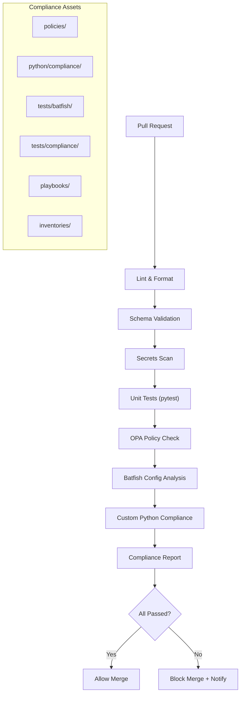
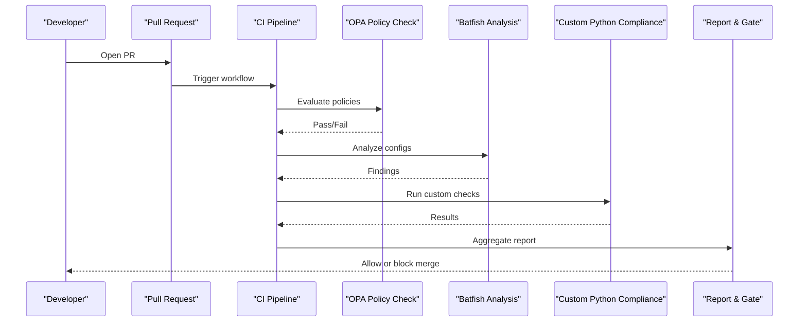
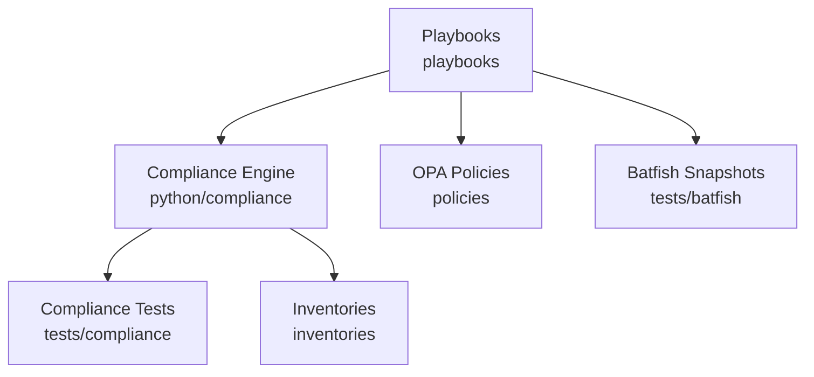

# Custom Compliance Rule Development

<cite>
**Referenced Files in This Document**
- [README.md](file://README.md)
</cite>

## Table of Contents
1. [Introduction](#introduction)
2. [Project Structure](#project-structure)
3. [Core Components](#core-components)
4. [Architecture Overview](#architecture-overview)
5. [Detailed Component Analysis](#detailed-component-analysis)
6. [Dependency Analysis](#dependency-analysis)
7. [Performance Considerations](#performance-considerations)
8. [Troubleshooting Guide](#troubleshooting-guide)
9. [Conclusion](#conclusion)
10. [Appendices](#appendices)

## Introduction
This document explains how to develop custom compliance rules and extend the compliance framework within the Enterprise Network Automation Platform. It covers the rule development lifecycle, including rule definition syntax, validation logic implementation, test case creation, and integration testing. It also documents rule registration, parameter passing, context access to device state and inventory data, result formatting, and best practices for performance, error handling, logging, documentation, versioning, deprecation, and migration.

The platform enforces compliance at every stage—from pull request to production runtime—using a combination of OPA policy checks, Batfish configuration analysis, and custom Python compliance checks. The compliance engine is pluggable and integrates with the broader automation pipeline.

## Project Structure
The repository organizes compliance-related assets across multiple directories:
- python/compliance: Pluggable compliance engine and custom Python checks
- policies: OPA/Sentinel policies
- tests/batfish: Batfish snapshots and network simulation tests
- tests/compliance: Compliance-specific pytest suites
- playbooks: Ansible playbooks orchestrating compliance scans
- inventories: Device inventories used by compliance runs

**Diagram sources**
- [README.md:36-50](file://README.md#L36-L50)
- [README.md:568-579](file://README.md#L568-L579)

**Section sources**
- [README.md:103-180](file://README.md#L103-L180)
- [README.md:438-456](file://README.md#L438-L456)
- [README.md:517-544](file://README.md#L517-L544)
- [README.md:568-579](file://README.md#L568-L579)

## Core Components
- Compliance Engine (python/compliance): Pluggable rule sets executed against device state and inventory data.
- OPA Policies (policies): Declarative policies evaluated during CI/CD.
- Batfish Integration (tests/batfish): Network simulation and ACL/routing analysis.
- Test Framework (tests/compliance, tests/unit): pytest-based unit and compliance tests.
- Orchestration (playbooks): Ansible playbooks that trigger compliance scans and integrate with CI/CD.

Key responsibilities:
- Rule discovery and registration
- Context assembly (device state, inventory, parameters)
- Execution and aggregation of results
- Reporting and gating decisions

**Section sources**
- [README.md:438-456](file://README.md#L438-L456)
- [README.md:517-544](file://README.md#L517-L544)
- [README.md:568-579](file://README.md#L568-L579)

## Architecture Overview
The compliance architecture integrates three layers:
- Policy-as-Code (OPA): Enforce structural and semantic constraints on configurations and changes.
- Simulation-as-Code (Batfish): Validate reachability, ACL correctness, and routing behavior.
- Custom Checks (Python): Implement vendor-specific or business-specific compliance logic.

**Diagram sources**
- [README.md:36-50](file://README.md#L36-L50)
- [README.md:568-579](file://README.md#L568-L579)

## Detailed Component Analysis

### Rule Definition Syntax and Registration
- Rule registry: The compliance engine discovers and registers rules from the python/compliance module. Rules are typically implemented as Python modules/classes following a consistent interface.
- Metadata: Each rule should declare metadata such as id, title, description, severity, tags, and applicable platforms/vendors.
- Registration mechanism: Rules are auto-discovered via package structure or explicitly registered through a central registry function. Ensure new rules are importable and discoverable by the engine.

Best practices:
- Use descriptive IDs and titles for traceability.
- Tag rules by domain (e.g., security, operations) and target devices.
- Keep rule files small and focused; split complex logic into helper functions.

**Section sources**
- [README.md:438-456](file://README.md#L438-L456)

### Parameter Passing and Context Access
- Parameters: Rules accept parameters via structured inputs (e.g., YAML/JSON) passed by the orchestration layer. Parameters can include thresholds, allowed lists, and scope filters.
- Context: The engine provides access to:
  - Device state (running config, interfaces, protocols, etc.)
  - Inventory data (vendor, platform, role, region, site)
  - External references (approved firmware lists, cipher suites)
- Context assembly: Ensure context objects are immutable within rule execution to avoid side effects.

Guidelines:
- Validate parameters early and fail fast with clear errors.
- Use typed contexts and schema validation where possible.
- Avoid direct I/O in rules; rely on provided context and utilities.

**Section sources**
- [README.md:438-456](file://README.md#L438-L456)

### Validation Logic Implementation
- Implement deterministic checks over the provided context.
- Prefer pure functions for core logic to simplify testing and reproducibility.
- Return standardized results with fields like status, severity, message, and remediation hints.

Error handling:
- Catch exceptions and convert them into actionable violations or warnings.
- Log detailed diagnostics without exposing sensitive information.

**Section sources**
- [README.md:438-456](file://README.md#L438-L456)

### Result Formatting and Aggregation
- Standardize output format across all rules for consistent reporting.
- Include identifiers (rule_id, device_id), severity, category, and remediation guidance.
- Aggregate results per device and globally for the compliance report.

Integration points:
- Feed aggregated results into CI gates and dashboards.
- Support filtering by severity and environment.

**Section sources**
- [README.md:568-579](file://README.md#L568-L579)

### Example: Building Custom Python Compliance Checks
- Create a new rule module under python/compliance with a unique ID and metadata.
- Implement a check function that consumes context and returns a result object.
- Register the rule so it is discovered by the engine.
- Add unit tests under tests/compliance to validate pass/fail scenarios.

Testing strategies:
- Mock device state and inventory using fixtures.
- Assert expected violations and messages.
- Cover edge cases (missing fields, unexpected types).

**Section sources**
- [README.md:438-456](file://README.md#L438-L456)
- [README.md:517-544](file://README.md#L517-L544)

### Example: OPA Policy Development
- Author Rego policies under policies to enforce structural and semantic constraints.
- Integrate OPA evaluation in CI before running custom checks.
- Use input schemas to validate configuration shapes and required fields.

Policy examples:
- Disallow insecure protocols (e.g., Telnet).
- Require approved ciphers and TLS versions.
- Enforce naming conventions and tagging standards.

**Section sources**
- [README.md:568-579](file://README.md#L568-L579)

### Example: Batfish Query Customization
- Place snapshots under tests/batfish/snapshots for deterministic analysis.
- Customize queries to detect ACL misconfigurations, routing anomalies, and firewall rule issues.
- Fail CI if critical findings are detected.

Integration:
- Combine Batfish findings with custom Python checks for comprehensive coverage.
- Surface actionable insights in reports.

**Section sources**
- [README.md:517-544](file://README.md#L517-L544)
- [README.md:683](file://README.md#L683)

### Testing Strategies Using pytest
- Unit tests: Validate individual rule logic with mocked contexts.
- Compliance tests: End-to-end checks against sample device states and inventories.
- Golden config tests: Diff generated outputs against approved baselines.

Mocking device configurations:
- Provide fixture data representing realistic device states.
- Simulate missing or malformed data to ensure robustness.

Running tests:
- Use pytest to execute unit and compliance tests locally and in CI.

**Section sources**
- [README.md:517-544](file://README.md#L517-L544)

### Integration Testing and Playbook Orchestration
- Use playbooks/compliance_scan.yml to run compliance checks against lab devices.
- Leverage inventories/lab/hosts.yml for targeted testing.
- Integrate compliance scanning into CI workflows for automated gating.

**Section sources**
- [README.md:267-280](file://README.md#L267-L280)
- [README.md:428-434](file://README.md#L428-L434)

### Best Practices for Performance Optimization
- Minimize I/O and external calls within rules; use cached context where appropriate.
- Parallelize rule execution across devices when supported by the engine.
- Profile slow rules and refactor hot paths.

Error Handling and Logging
- Centralize error handling to produce consistent violation records.
- Use structured logging with correlation IDs for traceability.
- Avoid logging secrets or sensitive data.

Documentation Standards
- Include docstrings describing purpose, parameters, and return values.
- Maintain rule metadata and README entries for each rule family.

Versioning, Deprecation, and Migration
- Version rules alongside the compliance engine.
- Mark deprecated rules with warnings and provide migration guides.
- Ensure backward compatibility during transitions.

**Section sources**
- [README.md:438-456](file://README.md#L438-L456)
- [README.md:517-544](file://README.md#L517-L544)

## Dependency Analysis
The compliance subsystem depends on:
- python/compliance: Core engine and rule implementations
- policies: OPA policy definitions
- tests/batfish: Network simulation artifacts
- tests/compliance: Test harnesses
- playbooks: Orchestration scripts
- inventories: Target device definitions

**Diagram sources**
- [README.md:103-180](file://README.md#L103-L180)
- [README.md:438-456](file://README.md#L438-L456)
- [README.md:517-544](file://README.md#L517-L544)

**Section sources**
- [README.md:103-180](file://README.md#L103-L180)
- [README.md:438-456](file://README.md#L438-L456)
- [README.md:517-544](file://README.md#L517-L544)

## Performance Considerations
- Batch operations: Group similar checks to reduce overhead.
- Early exits: Short-circuit expensive computations when prerequisites fail.
- Resource limits: Enforce timeouts and memory caps for long-running checks.
- Caching: Cache repeated lookups (e.g., approved firmware lists) within a run.

[No sources needed since this section provides general guidance]

## Troubleshooting Guide
Common issues and resolutions:
- Template rendering errors: Debug with verbose flags and inspect Jinja2 templates.
- Compliance check failures: Review policy definitions and device running config diffs.
- CI pipeline failures: Inspect GitHub Actions logs for actionable error messages.
- Vault authentication failures: Verify OIDC tokens or AppRole credentials and Vault policies.
- Molecule test failures: Ensure Docker/Podman is running and molecule configuration is valid.
- Batfish analysis errors: Validate snapshots under tests/batfish/snapshots.

**Section sources**
- [README.md:674-685](file://README.md#L674-L685)

## Conclusion
Extending the compliance framework involves implementing well-structured Python rules, authoring OPA policies, and leveraging Batfish for network simulation. Follow the lifecycle outlined here—definition, validation, testing, and integration—to maintain high-quality, performant, and maintainable compliance checks. Adopt best practices for error handling, logging, documentation, and versioning to ensure smooth evolution of the compliance suite.

[No sources needed since this section summarizes without analyzing specific files]

## Appendices

### Quick Start Commands
- Run compliance scan locally against lab devices.
- Execute unit and compliance tests.
- Bootstrap environment and install dependencies.

**Section sources**
- [README.md:267-280](file://README.md#L267-L280)
- [README.md:531-544](file://README.md#L531-L544)