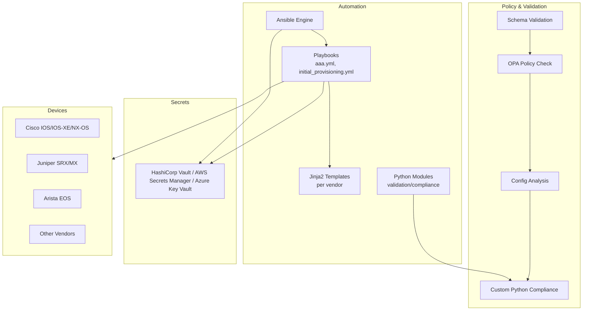
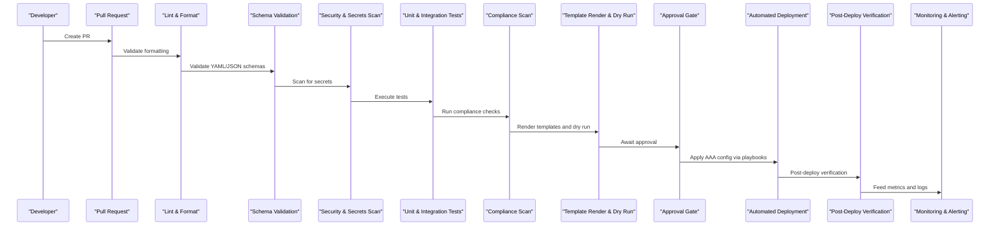
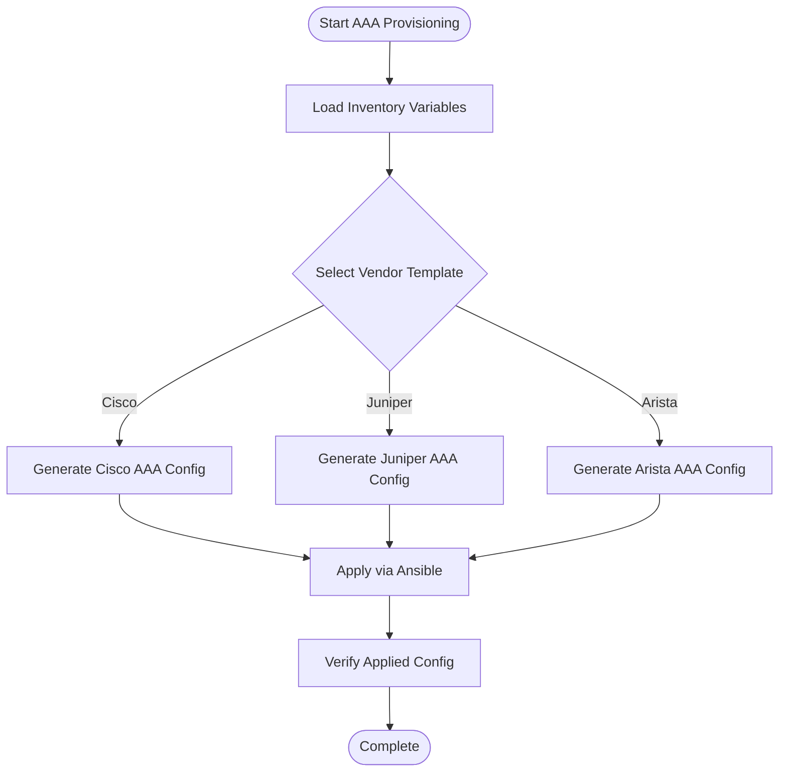
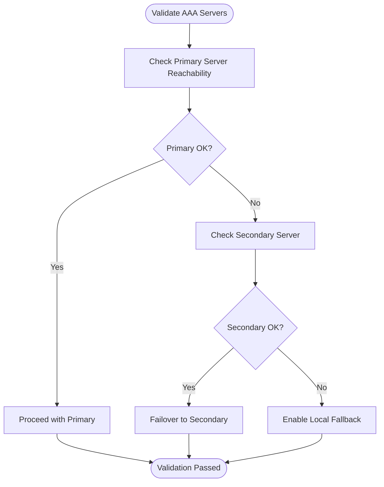
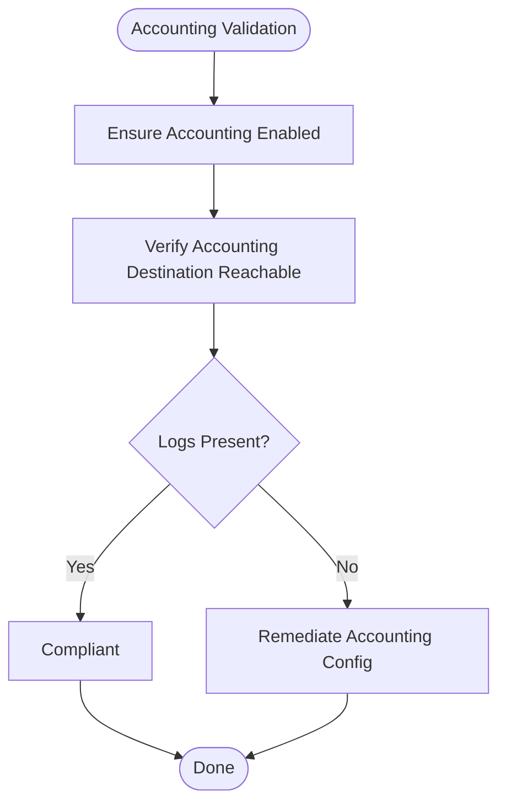
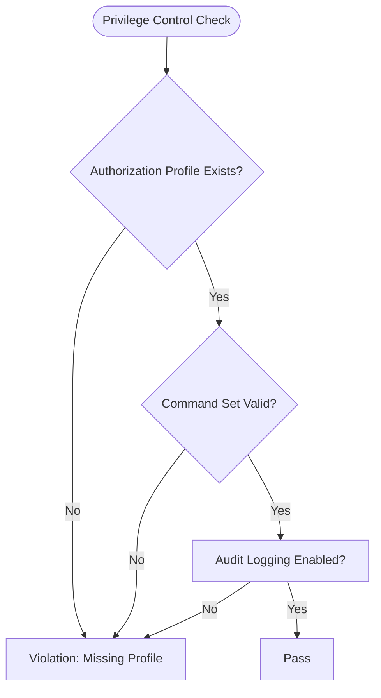
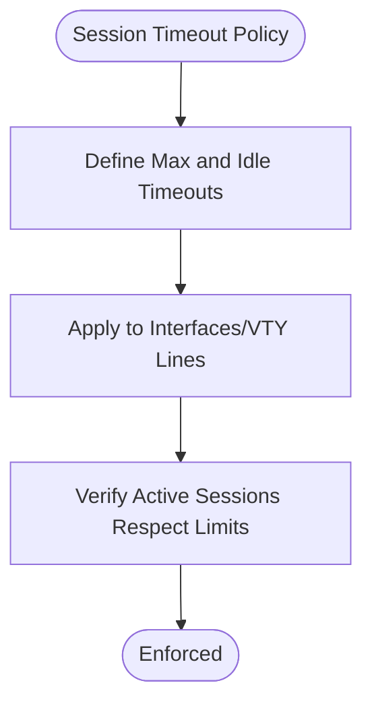
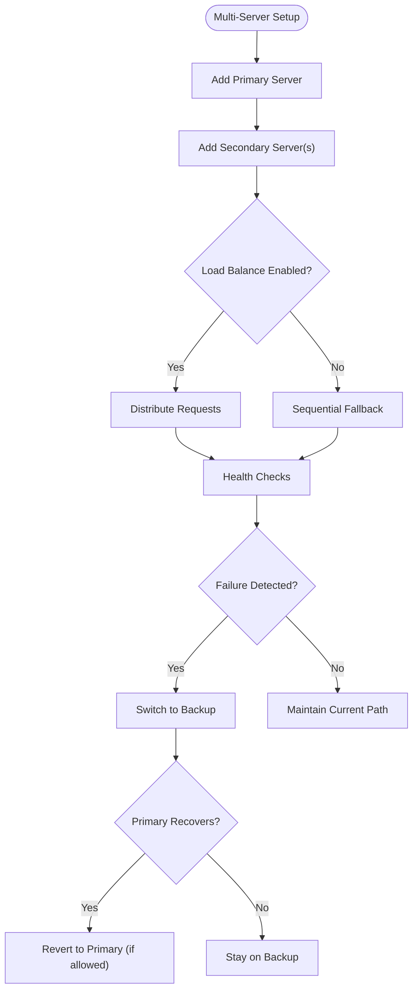
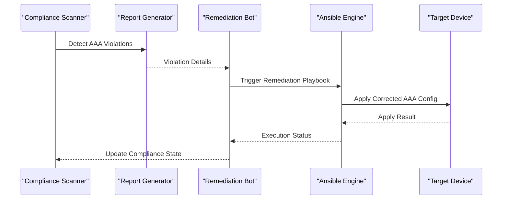
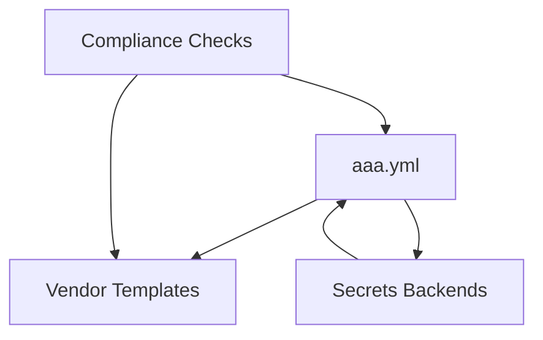

# AAA Setup Enforcement

<cite>
**Referenced Files in This Document**
- [README.md](file://README.md)
</cite>

## Table of Contents
1. [Introduction](#introduction)
2. [Project Structure](#project-structure)
3. [Core Components](#core-components)
4. [Architecture Overview](#architecture-overview)
5. [Detailed Component Analysis](#detailed-component-analysis)
6. [Dependency Analysis](#dependency-analysis)
7. [Performance Considerations](#performance-considerations)
8. [Troubleshooting Guide](#troubleshooting-guide)
9. [Conclusion](#conclusion)
10. [Appendices](#appendices)

## Introduction
This document defines the enforcement policies for AAA (Authentication, Authorization, Accounting) setup across multi-vendor network devices. It explains how the platform validates TACACS+ or RADIUS server configurations, enforces fallback mechanisms, verifies local user accounts and authorization profiles, and ensures compliance with security baselines. The guidance covers connectivity validation, accounting logging checks, privilege escalation controls, session timeout policies, multi-server redundancy, load balancing, failover behavior, violation scenarios, severity levels, and automated remediation workflows.

The repository’s automation and compliance framework integrates AAA configuration management into its GitOps pipeline, ensuring that changes are validated before deployment and continuously monitored afterward.

## Project Structure
The repository is a modular, Git-driven automation platform. AAA-related capabilities are implemented through:
- Playbooks for device lifecycle operations including AAA provisioning
- Compliance checks enforced during CI/CD
- Templates per vendor to generate device-specific AAA configurations
- Python modules for validation and compliance scanning
- Secrets integration for secure handling of shared secrets and credentials

[No sources needed since this diagram shows conceptual workflow, not actual code structure]

## Core Components
- AAA Playbook: Orchestrates AAA configuration on target devices using structured variables and vendor templates.
- Compliance Checks: Enforce mandatory AAA enablement, password policy, and other security requirements as part of CI/CD.
- Secrets Integration: Ensures AAA shared secrets and credentials are sourced from secure backends rather than committed to Git.
- Vendor Templates: Generate correct AAA syntax for each supported platform.
- Validation Pipeline: Applies schema validation, policy checks, and custom compliance rules prior to deployment.

Key references:
- AAA playbook entry point and purpose
- Compliance policy requiring AAA enabled
- Secrets architecture supporting AAA credentials

**Section sources**
- [README.md:371-386](file://README.md#L371-L386)
- [README.md:552-566](file://README.md#L552-L566)
- [README.md:339-367](file://README.md#L339-L367)

## Architecture Overview
The AAA enforcement architecture integrates configuration generation, policy validation, and runtime compliance monitoring.

**Diagram sources**
- [README.md:36-50](file://README.md#L36-L50)
- [README.md:479-501](file://README.md#L479-L501)

## Detailed Component Analysis

### AAA Configuration Management
- Purpose: Configure authentication, authorization, and accounting using TACACS+ or RADIUS servers; enforce fallback to local accounts when required by policy.
- Inputs: Structured inventory and group/host variables containing server addresses, shared secrets, protocol selection, and fallback settings.
- Outputs: Vendor-specific AAA configuration generated from Jinja2 templates and applied via Ansible playbooks.
- Secrets: Shared secrets and credentials are retrieved from configured secrets backends.

[No sources needed since this diagram shows conceptual workflow, not actual code structure]

**Section sources**
- [README.md:371-386](file://README.md#L371-L386)
- [README.md:339-367](file://README.md#L339-L367)

### AAA Server Connectivity Validation
- Objective: Ensure AAA servers are reachable and responsive before enabling them on devices.
- Methods:
  - Pre-deployment: Use ping/TCP reachability checks against AAA server endpoints.
  - Runtime: Periodic health probes and telemetry collection to detect outages.
- Fallback Behavior: If primary server fails, route requests to secondary servers or local fallback as defined by policy.

[No sources needed since this diagram shows conceptual workflow, not actual code structure]

### Accounting Logging Verification
- Objective: Confirm accounting is enabled and logging destinations are correctly configured.
- Checks:
  - Accounting server presence and protocol (TACACS+/RADIUS).
  - Destination reachability and logging success indicators.
  - Audit trails for administrative actions and user sessions.

[No sources needed since this diagram shows conceptual workflow, not actual code structure]

### Privilege Escalation Controls
- Objective: Enforce strict privilege escalation controls aligned with least-privilege principles.
- Policies:
  - Require explicit authorization profiles for elevated commands.
  - Restrict command sets based on role-based access control (RBAC).
  - Log all privilege escalations for auditability.

[No sources needed since this diagram shows conceptual workflow, not actual code structure]

### Session Timeout Policies
- Objective: Prevent idle sessions from remaining open indefinitely.
- Requirements:
  - Define maximum session duration and idle timeouts.
  - Enforce re-authentication after timeout thresholds.
  - Ensure consistent application across all AAA-enabled interfaces.

[No sources needed since this diagram shows conceptual workflow, not actual code structure]

### Multi-Server Redundancy, Load Balancing, and Failover
- Redundancy: Configure multiple AAA servers with primary and secondary roles.
- Load Balancing: Distribute authentication requests across available servers where supported.
- Failover: Automatically switch to backup servers upon failure detection; revert when primary recovers if policy allows.

[No sources needed since this diagram shows conceptual workflow, not actual code structure]

### Automated Remediation Workflows
- Trigger: Compliance scan detects AAA violations.
- Actions:
  - Generate corrected configuration snippets.
  - Apply via Ansible playbooks with pre/post checks.
  - Notify stakeholders and update compliance reports.

[No sources needed since this diagram shows conceptual workflow, not actual code structure]

## Dependency Analysis
AAA enforcement depends on several components within the automation platform:
- Playbooks orchestrate configuration delivery.
- Templates render vendor-specific AAA syntax.
- Compliance checks enforce policy adherence.
- Secrets backends provide secure credential sourcing.

**Diagram sources**
- [README.md:371-386](file://README.md#L371-L386)
- [README.md:339-367](file://README.md#L339-L367)
- [README.md:552-566](file://README.md#L552-L566)

**Section sources**
- [README.md:371-386](file://README.md#L371-L386)
- [README.md:339-367](file://README.md#L339-L367)
- [README.md:552-566](file://README.md#L552-L566)

## Performance Considerations
- Minimize AAA server latency by placing servers close to devices and using redundant paths.
- Avoid excessive polling intervals for health checks to reduce overhead.
- Batch configuration updates during maintenance windows to limit disruption.
- Use connection pooling and keep-alive settings where supported by AAA clients.

[No sources needed since this section provides general guidance]

## Troubleshooting Guide
Common issues and resolutions related to AAA enforcement:
- Connection timeouts to AAA servers: Verify network reachability and firewall rules.
- Template rendering errors: Inspect Jinja2 syntax and variable definitions.
- Compliance check failures: Review policy definitions and running configuration diffs.
- Secrets retrieval failures: Validate OIDC tokens or AppRole credentials and backend policies.

**Section sources**
- [README.md:674-685](file://README.md#L674-L685)

## Conclusion
AAA setup enforcement in this platform integrates configuration management, policy validation, and continuous compliance monitoring. By enforcing mandatory AAA enablement, securing credentials via centralized secrets backends, and automating remediation workflows, the system maintains strong authentication, authorization, and accounting practices across multi-vendor environments.

[No sources needed since this section summarizes without analyzing specific files]

## Appendices

### Example Compliant AAA Configurations by Vendor
- Cisco IOS/IOS-XE/NX-OS:
  - Define TACACS+ or RADIUS servers with shared secrets.
  - Enable AAA globally and apply authentication/authorization methods.
  - Configure accounting to log sessions and administrative actions.
- Juniper SRX/MX:
  - Configure RADIUS/TACACS+ servers and authentication order.
  - Apply authorization profiles and accounting options.
- Arista EOS:
  - Define AAA servers and method lists.
  - Enable accounting and ensure proper logging destinations.

Note: Refer to vendor documentation and platform-specific templates for exact syntax.

[No sources needed since this section provides general guidance]

### Violation Scenarios and Severity Levels
- Missing AAA servers: Critical
- Weak local passwords: Critical
- No accounting logging: High
- Unauthorized privilege escalation: Critical
- Excessive session timeouts: Medium

These align with the repository’s compliance policy table indicating critical severity for AAA enablement and password policy.

**Section sources**
- [README.md:552-566](file://README.md#L552-L566)