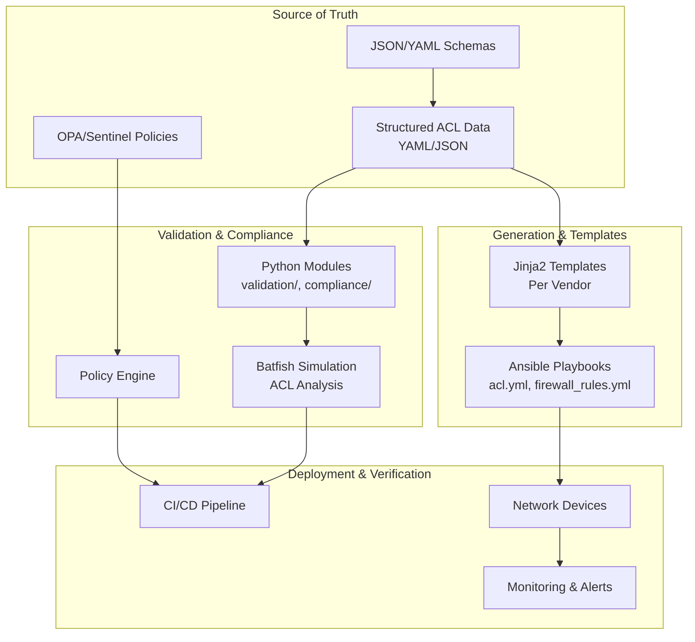
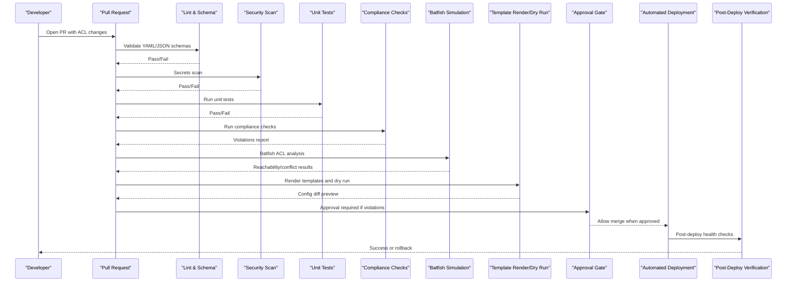
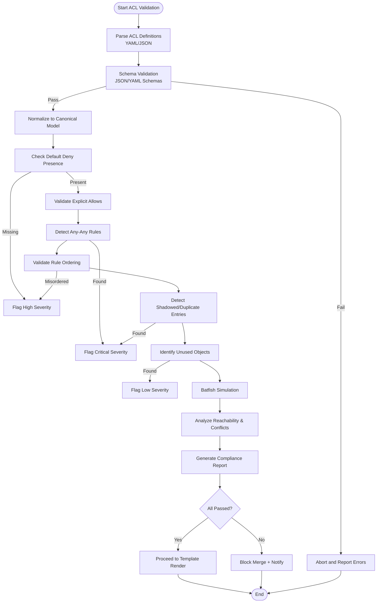
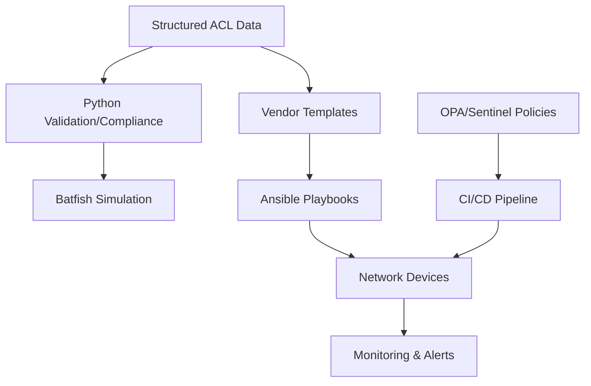

# ACL Standards Enforcement

<cite>
**Referenced Files in This Document**
- [README.md](file://README.md)
</cite>

## Table of Contents
1. [Introduction](#introduction)
2. [Project Structure](#project-structure)
3. [Core Components](#core-components)
4. [Architecture Overview](#architecture-overview)
5. [Detailed Component Analysis](#detailed-component-analysis)
6. [Dependency Analysis](#dependency-analysis)
7. [Performance Considerations](#performance-considerations)
8. [Troubleshooting Guide](#troubleshooting-guide)
9. [Conclusion](#conclusion)

## Introduction

This document describes how the Enterprise Network Automation Platform enforces Access Control List (ACL) standards across multi-vendor environments. It explains the compliance framework that validates ACL configurations against organizational security standards, detects overly permissive rules, ensures proper traffic filtering, and provides automated remediation through standardized templates. The approach integrates policy-as-code, simulation-based validation, and vendor-agnostic rule modeling to maintain consistent security posture at scale.

## Project Structure

The platform organizes ACL-related assets across multiple layers: structured data for ACL definitions, Jinja2 templates per vendor, playbooks for management, Python modules for validation and compliance, and tests including Batfish simulations. The repository layout highlights where ACL configuration generation, validation, and compliance checks occur.

**Diagram sources**
- [README.md:103-180](file://README.md#L103-L180)
- [README.md:371-436](file://README.md#L371-L436)
- [README.md:517-544](file://README.md#L517-L544)
- [README.md:548-582](file://README.md#L548-L582)

**Section sources**
- [README.md:103-180](file://README.md#L103-L180)
- [README.md:371-436](file://README.md#L371-L436)
- [README.md:517-544](file://README.md#L517-L544)
- [README.md:548-582](file://README.md#L548-L582)

## Core Components

- Structured ACL Data Model: Centralized representation of ACLs, rules, objects, and actions used by templates and validators.
- Vendor Templates: Jinja2 templates per vendor (Cisco IOS/IOS-XE/NX-OS, Juniper SRX/MX, Arista EOS, Palo Alto PAN-OS, Fortinet FortiOS, Check Point Gaia, F5 BIG-IP, pfSense/OPNsense).
- Management Playbooks: Ansible playbooks for ACL lifecycle operations, including creation, modification, and deployment.
- Validation Engine: Python modules performing pre-deployment syntax and semantic validation, including schema checks and custom logic.
- Compliance Engine: Pluggable rule sets enforcing organizational standards such as default deny, explicit allow only, no any-any, shadow/duplicate detection, and unused object flagging.
- Simulation-Based Analysis: Batfish integration for ACL reachability and conflict analysis prior to deployment.
- Policy-as-Code: OPA/Sentinel policies gating PR merges based on compliance outcomes.

Key responsibilities:
- Ensure all ACLs follow default-deny semantics with explicit allows.
- Detect overly permissive rules (any-any, broad host/port ranges).
- Validate rule ordering and detect shadowed or duplicate entries.
- Provide standardized templates for compliant ACL structures.
- Integrate with CI/CD to block non-compliant changes.

**Section sources**
- [README.md:103-180](file://README.md#L103-L180)
- [README.md:371-436](file://README.md#L371-L436)
- [README.md:438-456](file://README.md#L438-L456)
- [README.md:517-544](file://README.md#L517-L544)
- [README.md:548-582](file://README.md#L548-L582)

## Architecture Overview

The ACL compliance pipeline integrates multiple stages from pull request to production verification.

**Diagram sources**
- [README.md:34-50](file://README.md#L34-L50)
- [README.md:479-514](file://README.md#L479-L514)
- [README.md:517-544](file://README.md#L517-L544)
- [README.md:548-582](file://README.md#L548-L582)

## Detailed Component Analysis

### ACL Compliance Rules and Severity

Organizational standards define mandatory checks for ACLs and firewall rules. The severity levels guide prioritization and gating behavior.

- Default Deny Policy: All ACLs must enforce an implicit or explicit default deny at the end.
- Explicit Allow Only: Permits must be specific; broad allowances are prohibited.
- No Any-Any Rules: Overly permissive any-to-any matches are flagged as critical.
- Rule Ordering Validation: Ensures correct precedence and prevents misordered rules.
- Shadowed/Duplicate Detection: Identifies unreachable or redundant entries.
- Unused Objects Flagging: Highlights ACLs, rules, or objects not referenced by active traffic flows.

Severity mapping:
- High: ACL standards violations (e.g., missing default deny, overly broad permits).
- Critical: Firewall rule violations (e.g., any-any, shadow/duplicate issues).
- Low: Unused objects and minor hygiene issues.

Operational impact:
- High-severity violations block merges unless explicitly approved.
- Critical-severity violations require immediate remediation and cannot proceed without approval.
- Low-severity items are reported for cleanup but do not block deployment.

**Section sources**
- [README.md:552-566](file://README.md#L552-L566)

### Validation Logic and Processing Flow

The validation engine performs both static and simulation-based checks before deployment.

**Diagram sources**
- [README.md:517-544](file://README.md#L517-L544)
- [README.md:548-582](file://README.md#L548-L582)

**Section sources**
- [README.md:517-544](file://README.md#L517-L544)
- [README.md:548-582](file://README.md#L548-L582)

### Vendor-Specific ACL Syntax Differences

Templates abstract vendor differences while preserving canonical semantics. The following vendors are supported with dedicated template directories:

- Cisco: IOS, IOS-XE, NX-OS
- Juniper: SRX, MX
- Arista: EOS
- Palo Alto: PAN-OS
- Fortinet: FortiOS
- Check Point: Gaia
- F5: BIG-IP
- pfSense/OPNsense: FreeBSD-based firewalls

Template strategy:
- Maintain a single canonical ACL model in structured data.
- Generate vendor-specific CLI/API payloads via Jinja2 templates.
- Enforce consistent naming conventions and rule semantics across vendors.
- Use playbooks to apply generated configurations consistently.

**Section sources**
- [README.md:103-180](file://README.md#L103-L180)
- [README.md:371-436](file://README.md#L371-L436)

### Automated Remediation Through Standardized Templates

Remediation leverages standardized templates and playbooks to convert non-compliant ACLs into compliant structures:

- Default Deny Injection: Append a final deny-all rule if missing.
- Rule Narrowing: Replace overly broad permits with precise source/destination/port combinations.
- Reordering: Adjust rule order to ensure intended precedence.
- Deduplication: Remove duplicate entries and consolidate overlapping rules.
- Object Cleanup: Flag and optionally remove unused ACLs and objects.

Playbook integration:
- acl.yml manages ACL lifecycle operations.
- firewall_rules.yml deploys firewall rule sets with compliance checks.
- Golden config baseline comparisons ensure drift control.

**Section sources**
- [README.md:371-436](file://README.md#L371-L436)
- [README.md:517-544](file://README.md#L517-L544)

### Example Scenarios

Compliant ACL structure characteristics:
- Explicit allow rules scoped to necessary hosts, networks, and ports.
- A final default deny entry ensuring no unintended access.
- Clear naming and grouping for maintainability.
- Consistent ordering aligned with business intent.

Violation scenarios:
- Missing default deny leading to implicit permit behavior.
- Any-any rules allowing unrestricted traffic.
- Misordered rules causing earlier denies to shadow later allows.
- Duplicate entries increasing complexity without adding value.
- Unused objects inflating ACL size and reducing performance.

Severity levels:
- High: ACL standards violations requiring prompt remediation.
- Critical: Firewall rule violations blocking deployment until resolved.
- Low: Hygiene issues suitable for scheduled cleanup.

[No sources needed since this section summarizes conceptual examples]

## Dependency Analysis

The ACL compliance system depends on several components and tools:

- Structured data models drive template rendering and validation.
- Python modules implement custom checks and orchestrate Batfish analysis.
- OPA/Sentinel policies gate PR merges based on compliance outcomes.
- Ansible playbooks manage device configuration lifecycles.
- Batfish provides simulation-based reachability and conflict analysis.

**Diagram sources**
- [README.md:103-180](file://README.md#L103-L180)
- [README.md:438-456](file://README.md#L438-L456)
- [README.md:517-544](file://README.md#L517-L544)
- [README.md:548-582](file://README.md#L548-L582)

**Section sources**
- [README.md:103-180](file://README.md#L103-L180)
- [README.md:438-456](file://README.md#L438-L456)
- [README.md:517-544](file://README.md#L517-L544)
- [README.md:548-582](file://README.md#L548-L582)

## Performance Considerations

- Rule Minimization: Avoid overly broad permits to reduce matching overhead.
- Ordering Optimization: Place most frequently matched rules earlier to improve throughput.
- Deduplication: Remove duplicates and consolidate overlapping rules to simplify processing.
- Object Reuse: Leverage named objects and groups to reduce duplication and improve readability.
- Simulation Efficiency: Batch ACL changes and limit scope of Batfish runs to affected segments.
- Template Rendering: Cache rendered outputs and reuse common fragments to speed up deployments.

[No sources needed since this section provides general guidance]

## Troubleshooting Guide

Common issues and resolutions related to ACL compliance and deployment:

- Compliance check failure: Review compliance policies and device running config diffs to identify violations.
- Template rendering error: Inspect Jinja2 syntax and variable mappings; use debug flags to trace rendering.
- Batfish analysis error: Validate snapshots and input configurations; ensure canonical model consistency.
- CI pipeline failure: Examine GitHub Actions logs; most failures include actionable messages.
- Vault authentication failure: Verify OIDC token or AppRole credentials; check Vault policies.
- Molecule test failure: Ensure Docker/Podman is running; review molecule configuration.

Operational tips:
- Use golden config baselines to detect drift and regressions.
- Run targeted compliance scans on changed devices rather than full fleet audits.
- Maintain clear naming conventions and comments in ACL definitions to aid troubleshooting.

**Section sources**
- [README.md:674-685](file://README.md#L674-L685)

## Conclusion

The platform’s ACL standards enforcement combines structured data, vendor-agnostic templates, robust validation, and simulation-based analysis to ensure secure and maintainable access controls. By enforcing default deny, explicit allow-only semantics, detecting overly permissive and problematic rules, and integrating compliance into CI/CD, the system maintains a strong security posture across diverse vendor environments. Automated remediation through standardized templates and playbooks accelerates correction and reduces manual effort, while monitoring and alerting provide ongoing assurance.

[No sources needed since this section summarizes without analyzing specific files]