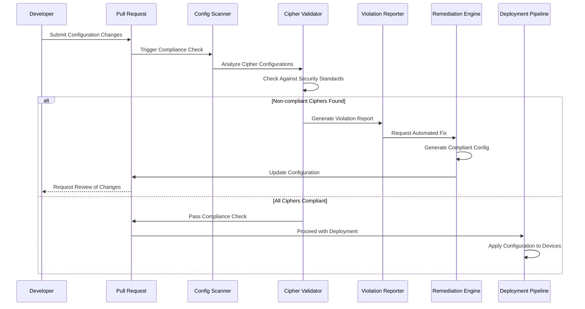
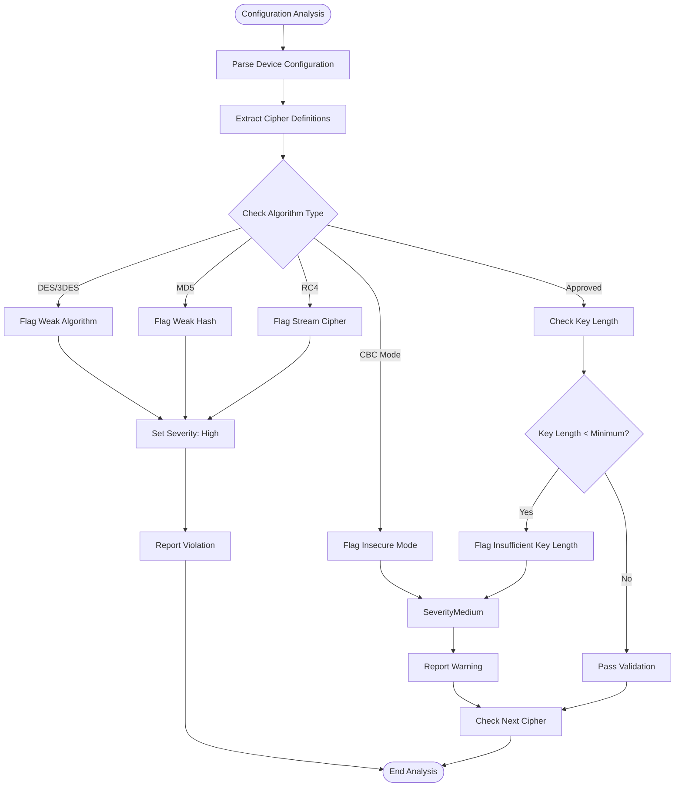
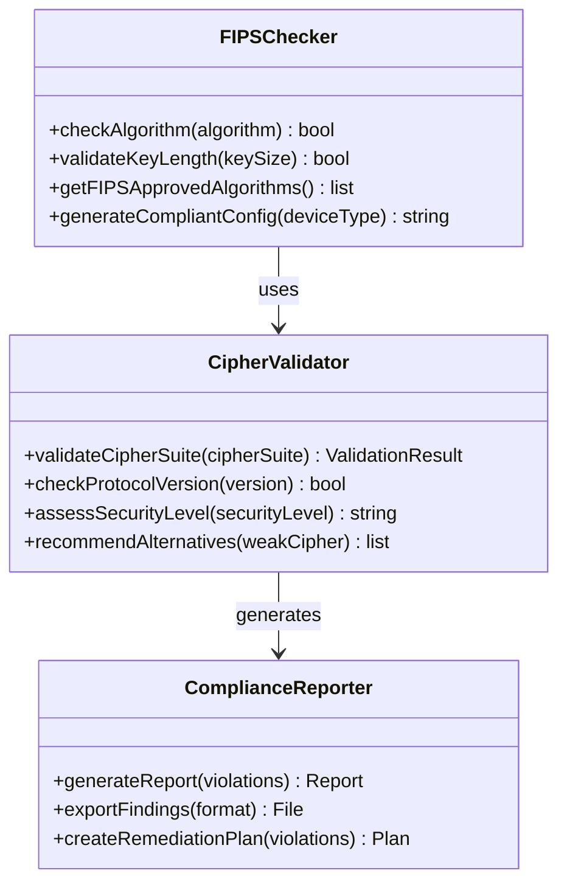
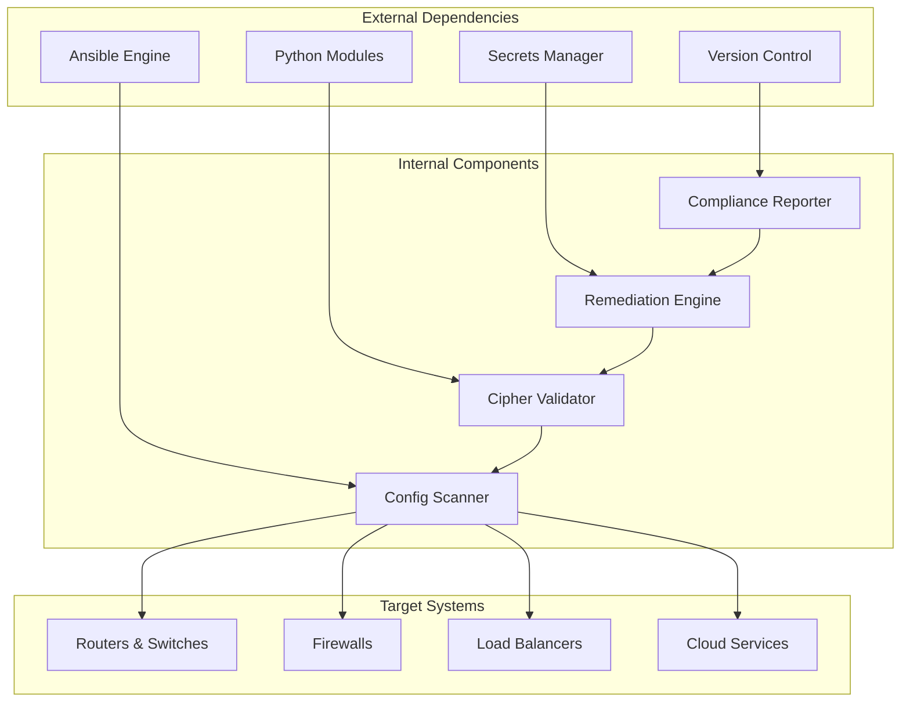

# Approved Cipher Suites Enforcement

<cite>
**Referenced Files in This Document**
- [README.md](file://README.md)
</cite>

## Table of Contents
1. [Introduction](#introduction)
2. [Project Structure](#project-structure)
3. [Core Components](#core-components)
4. [Architecture Overview](#architecture-overview)
5. [Detailed Component Analysis](#detailed-component-analysis)
6. [Dependency Analysis](#dependency-analysis)
7. [Performance Considerations](#performance-considerations)
8. [Troubleshooting Guide](#troubleshooting-guide)
9. [Conclusion](#conclusion)
10. [Appendices](#appendices)

## Introduction

This document provides comprehensive documentation for approved cipher suites enforcement policies within the Enterprise Network Automation Platform. The platform implements automated security compliance checks to ensure all network devices use only approved cryptographic algorithms for SSH and TLS connections, protecting against weak or deprecated ciphers while maintaining operational performance.

The cipher suite enforcement system is a critical component of the platform's DevSecOps approach, integrating seamlessly into the GitOps workflow to prevent deployment of configurations containing non-compliant cryptographic settings.

## Project Structure

The cipher suite enforcement functionality is implemented across multiple components within the platform architecture:

```mermaid
graph TB
subgraph "Compliance Engine"
PolicyEngine[Policy Engine]
Scanner[Configuration Scanner]
Validator[Cipher Validator]
Reporter[Violation Reporter]
end
subgraph "Device Management"
Inventory[Device Inventory]
Templates[Vendor Templates]
Playbooks[Ansible Playbooks]
end
subgraph "Security Standards"
FIPS[FIPS Compliance]
Standards[Security Standards]
Policies[Organizational Policies]
end
subgraph "Automation Pipeline"
CI_CD[CI/CD Pipeline]
Validation[Pre-deployment Validation]
Remediation[Automated Remediation]
end
PolicyEngine --> Scanner
Scanner --> Validator
Validator --> Reporter
Scanner --> Inventory
Validator --> Templates
Reporter --> CI_CD
PolicyEngine --> FIPS
PolicyEngine --> Standards
PolicyEngine --> Policies
CI_CD --> Validation
Validation --> Remediation
```

**Diagram sources**
- [README.md:548-580](file://README.md#L548-L580)

**Section sources**
- [README.md:103-180](file://README.md#L103-L180)

## Core Components

The cipher suite enforcement system consists of several key components that work together to validate and enforce cryptographic standards across the network infrastructure.

### Policy Definition Layer
The policy layer defines organizational security standards including:
- Approved cipher suite lists for SSH and TLS
- Minimum key length requirements
- FIPS compliance mandates
- Vendor-specific cipher naming conventions
- Deprecated algorithm detection rules

### Configuration Scanning Engine
The scanning engine performs comprehensive analysis of device configurations:
- Parses vendor-specific configuration formats
- Extracts cipher suite definitions from SSH and TLS configurations
- Identifies key exchange algorithms and authentication methods
- Validates cryptographic parameters against policy requirements

### Validation Framework
The validation framework implements multi-layered security checks:
- Algorithm strength assessment
- Key length verification
- Protocol version validation
- FIPS compliance checking
- Performance impact analysis

### Automated Remediation System
The remediation system provides intelligent configuration correction:
- Generates compliant configuration snippets
- Applies vendor-specific syntax corrections
- Maintains operational continuity during updates
- Provides rollback capabilities for failed changes

**Section sources**
- [README.md:548-580](file://README.md#L548-L580)
- [README.md:438-456](file://README.md#L438-L456)

## Architecture Overview

The cipher suite enforcement architecture follows a layered approach with clear separation of concerns:

**Diagram sources**
- [README.md:479-501](file://README.md#L479-L501)
- [README.md:568-579](file://README.md#L568-L579)

## Detailed Component Analysis

### Cipher Suite Policy Management

The policy management system maintains centralized control over cryptographic standards:

#### Approved Cipher Suites by Protocol

| Protocol | Approved Ciphers | Minimum Key Length | Status |
|----------|------------------|-------------------|---------|
| SSH v2 | AES-256-GCM, AES-128-GCM, ChaCha20-Poly1305 | 256-bit (AES), 256-bit (ChaCha20) | Active |
| TLS 1.3 | TLS_AES_256_GCM_SHA384, TLS_CHACHA20_POLY1305_SHA256 | 256-bit | Active |
| TLS 1.2 | ECDHE-RSA-AES256-GCM-SHA384, ECDHE-RSA-AES128-GCM-SHA256 | 256-bit | Legacy Support |
| IKEv2 | aes256-gcm, chacha20-poly1305 | 256-bit | Active |

#### Deprecated Algorithms Detection

The system actively detects and flags deprecated cryptographic algorithms:

**Diagram sources**
- [README.md:554-566](file://README.md#L554-L566)

### Vendor-Specific Implementation

The system handles vendor-specific cipher naming conventions and configuration syntax:

#### Cisco IOS/IOS-XE/NX-OS
- SSH cipher mapping: `aes256-ctr`, `aes192-ctr`, `aes128-ctr`
- TLS cipher groups: `TLSv1.2`, `TLSv1.3`
- IKEv2 proposals: `proposal esp-aes-256`

#### Juniper SRX/MX
- SSH algorithms: `diffie-hellman-group-exchange-sha256`
- SSL profiles: `cipher-list` statements
- IPsec proposals: `esp-aes-256`

#### Arista EOS
- SSH ciphers: `aes256-ctr`, `aes128-ctr`
- TLS policies: `crypto tls profile`
- VPN ciphers: `ipsec transform-set`

#### Palo Alto PAN-OS
- SSH cipher groups: `ssh-cipher` statements
- SSL/TLS profiles: `cipher-suite` configurations
- IPsec policies: `encryption-algorithm`

### FIPS Compliance Integration

The platform integrates with FIPS compliance requirements:

**Diagram sources**
- [README.md:548-580](file://README.md#L548-L580)

### Automated Remediation Process

The remediation system automatically corrects non-compliant configurations:

#### Remediation Workflow

1. **Detection Phase**: Identify non-compliant cipher configurations
2. **Analysis Phase**: Determine appropriate replacement algorithms
3. **Generation Phase**: Create vendor-specific compliant configurations
4. **Validation Phase**: Verify generated configurations meet standards
5. **Deployment Phase**: Apply changes with rollback capability
6. **Verification Phase**: Confirm successful remediation

#### Example Remediation Scenarios

**Scenario 1: DES Cipher Removal**
- **Violation**: `des-cbc-md5` found in SSH configuration
- **Severity**: High
- **Remediation**: Replace with `aes256-ctr`
- **Impact**: Minimal performance degradation

**Scenario 2: MD5 Hash Replacement**
- **Violation**: `hmac-md5` used for integrity checking
- **Severity**: High  
- **Remediation**: Upgrade to `hmac-sha2-256`
- **Impact**: Slight CPU overhead increase

**Scenario 3: TLS Version Upgrade**
- **Violation**: TLS 1.0/1.1 enabled
- **Severity**: Critical
- **Remediation**: Disable legacy protocols, enable TLS 1.2+
- **Impact**: Potential compatibility issues with legacy systems

**Section sources**
- [README.md:554-566](file://README.md#L554-L566)
- [README.md:438-456](file://README.md#L438-L456)

## Dependency Analysis

The cipher suite enforcement system has well-defined dependencies and integration points:

**Diagram sources**
- [README.md:52-99](file://README.md#L52-L99)

### Integration Points

| Component | Integration Method | Purpose |
|-----------|-------------------|---------|
| Ansible Playbooks | Role-based execution | Configuration deployment and validation |
| Python Modules | API calls | Custom validation logic and reporting |
| Secrets Manager | Secure credential access | Certificate and key management |
| Git Repository | Version control | Configuration tracking and rollback |
| CI/CD Pipeline | Automated triggers | Continuous compliance monitoring |

**Section sources**
- [README.md:52-99](file://README.md#L52-L99)
- [README.md:438-456](file://README.md#L438-L456)

## Performance Considerations

The cipher suite enforcement system is designed with performance optimization in mind:

### Scanning Optimization
- **Parallel Processing**: Concurrent device scanning using async I/O
- **Incremental Analysis**: Only scan changed configurations in CI/CD
- **Caching**: Maintain cache of known-good configurations
- **Filtering**: Early exit on obvious violations to reduce processing time

### Validation Efficiency
- **Algorithm Pre-checks**: Quick rejection of obviously weak algorithms
- **Batch Processing**: Group similar validations for efficiency
- **Lazy Loading**: Load vendor-specific rules only when needed
- **Memory Management**: Stream large configuration files instead of loading entirely

### Remediation Performance
- **Configuration Diffing**: Minimize changes to existing configurations
- **Rollback Optimization**: Fast revert mechanisms for failed deployments
- **Staged Rollouts**: Gradual deployment to minimize risk
- **Monitoring Integration**: Real-time performance impact assessment

## Troubleshooting Guide

Common issues and resolutions for cipher suite enforcement:

### Configuration Parsing Errors
- **Issue**: Vendor-specific syntax not recognized
- **Resolution**: Update vendor template mappings and test locally
- **Prevention**: Include vendor-specific unit tests in CI/CD pipeline

### False Positive Violations
- **Issue**: Legitimate configurations flagged as non-compliant
- **Resolution**: Review policy exceptions and update validation rules
- **Prevention**: Implement allowlist mechanism for approved exceptions

### Remediation Failures
- **Issue**: Automated fixes cause service disruption
- **Resolution**: Use maintenance windows and implement gradual rollouts
- **Prevention**: Enhanced testing in staging environment before production

### Performance Degradation
- **Issue**: Cipher changes impact device performance
- **Resolution**: Monitor metrics and adjust cipher selection based on hardware capabilities
- **Prevention**: Hardware capability assessment during policy definition

**Section sources**
- [README.md:674-685](file://README.md#L674-L685)

## Conclusion

The approved cipher suites enforcement system provides comprehensive cryptographic security across the enterprise network infrastructure. By integrating automated compliance checks into the GitOps workflow, the platform ensures that only secure cryptographic configurations are deployed while maintaining operational efficiency and providing automated remediation capabilities.

The system successfully addresses the core objectives of validating SSH and TLS cipher configurations, detecting weak or deprecated algorithms, enforcing modern cryptographic standards, and providing automated remediation through intelligent configuration updates. With support for multiple vendors and comprehensive FIPS compliance, the platform delivers enterprise-grade security enforcement suitable for Fortune 100 environments.

## Appendices

### Migration Strategy from Legacy Ciphers

#### Phase 1: Assessment and Planning
- Inventory current cipher implementations across all devices
- Identify legacy systems requiring special handling
- Develop migration timeline with minimal business impact

#### Phase 2: Pilot Deployment
- Test new cipher suites in lab environment
- Validate application compatibility
- Establish baseline performance metrics

#### Phase 3: Staged Rollout
- Deploy to non-critical systems first
- Monitor performance and error rates
- Gather feedback and adjust policies as needed

#### Phase 4: Full Deployment
- Complete migration across all systems
- Remove legacy cipher support where possible
- Establish ongoing monitoring and compliance processes

### Security Best Practices

1. **Regular Updates**: Keep cipher suite policies current with latest security standards
2. **Continuous Monitoring**: Implement real-time compliance monitoring
3. **Incident Response**: Establish procedures for responding to cipher-related vulnerabilities
4. **Training**: Ensure team members understand cryptographic security principles
5. **Documentation**: Maintain comprehensive records of all cipher-related changes