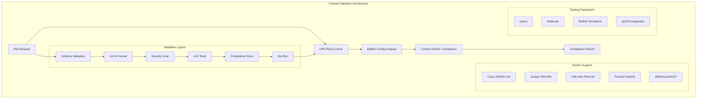
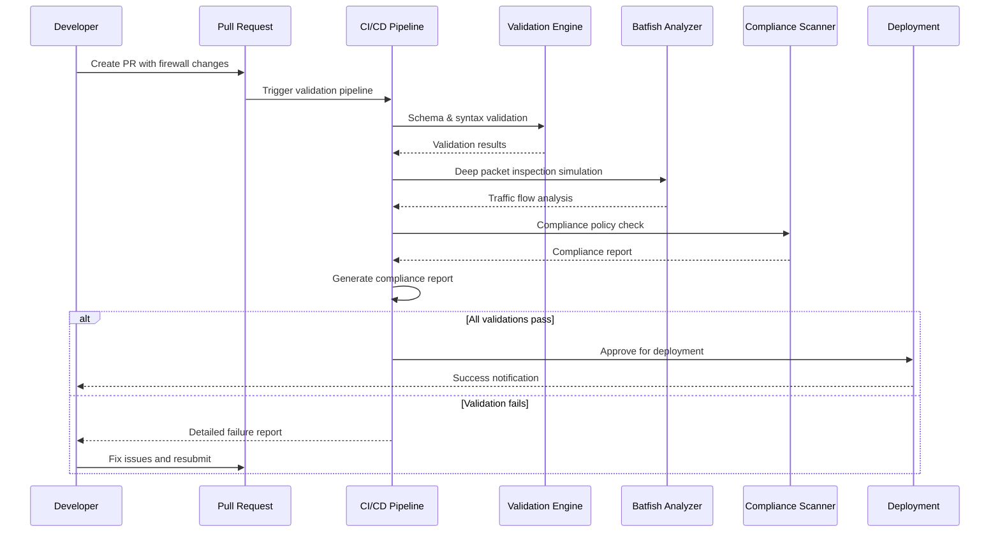
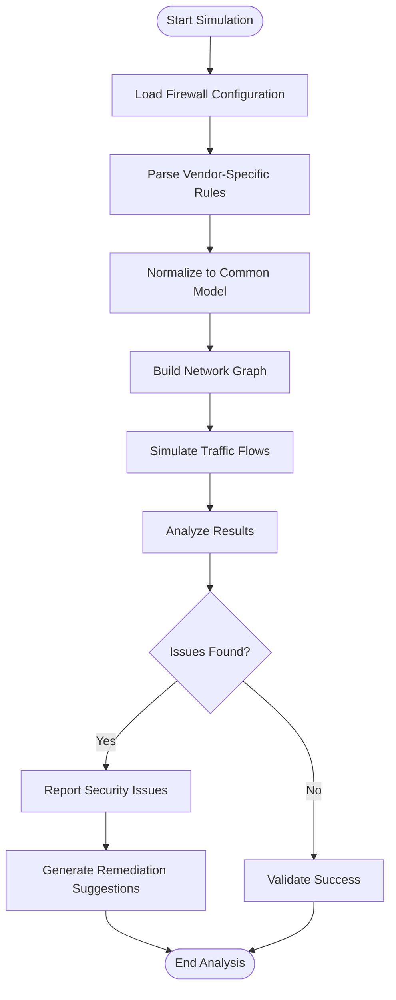
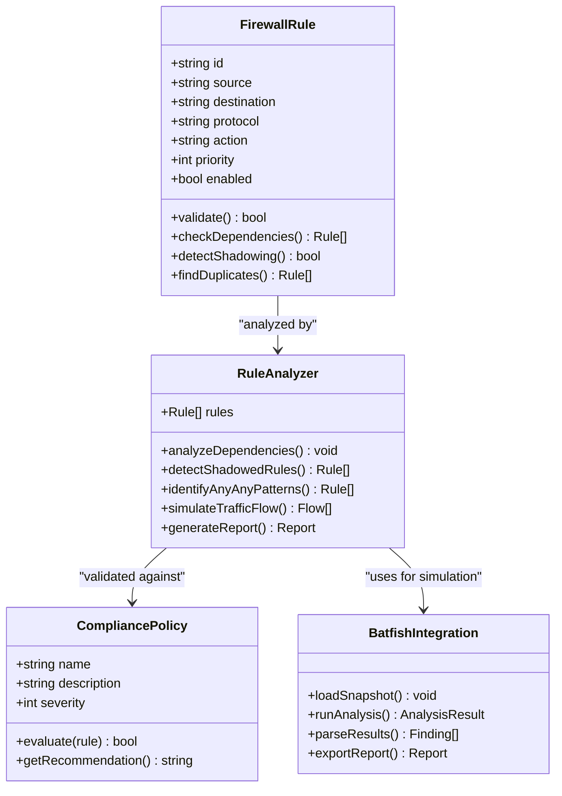
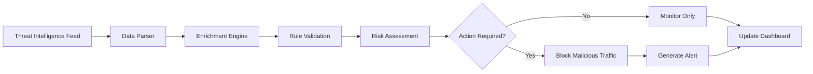
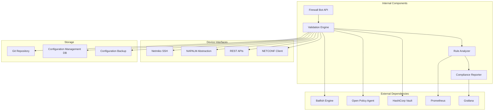

# Firewall Rule Validation

<cite>
**Referenced Files in This Document**
- [README.md](file://README.md)
</cite>

## Table of Contents
1. [Introduction](#introduction)
2. [Project Structure](#project-structure)
3. [Core Components](#core-components)
4. [Architecture Overview](#architecture-overview)
5. [Detailed Component Analysis](#detailed-component-analysis)
6. [Dependency Analysis](#dependency-analysis)
7. [Performance Considerations](#performance-considerations)
8. [Troubleshooting Guide](#troubleshooting-guide)
9. [Conclusion](#conclusion)

## Introduction

This document provides comprehensive documentation for the firewall rule validation and analysis policies implemented in the Enterprise Network Automation Platform. The system performs deep packet inspection simulation, detects security gaps, and validates firewall rule effectiveness across different vendor platforms using advanced analysis techniques including Batfish integration for traffic flow simulation.

The platform implements a multi-layered approach to firewall rule validation that includes dependency analysis, shadowed rule detection, any-any pattern identification, and automated remediation through rule optimization. It supports multiple vendor architectures including Cisco, Juniper, Palo Alto, Fortinet, Check Point, and cloud providers like AWS, Azure, and GCP.

## Project Structure

The firewall validation system is integrated throughout the platform's architecture, with key components distributed across multiple directories:

**Diagram sources**
- [README.md:36-50](file://README.md#L36-L50)
- [README.md:54-99](file://README.md#L54-L99)

**Section sources**
- [README.md:103-180](file://README.md#L103-L180)

## Core Components

The firewall validation system consists of several interconnected components that work together to provide comprehensive rule analysis and validation:

### Validation Engine
The core validation engine performs syntax and semantic validation of firewall configurations before deployment. It ensures that rules follow organizational standards and best practices.

### Compliance Scanner
A pluggable compliance engine that enforces security policies and organizational standards across all firewall implementations.

### Batfish Integration
Deep packet inspection simulation using Batfish to analyze firewall rule effectiveness, detect security gaps, and simulate traffic flows across different vendor platforms.

### Policy Enforcement
OPA (Open Policy Agent) and Sentinel policies that enforce governance rules and prevent non-compliant configurations from being deployed.

### Automated Remediation
Intelligent rule optimization that suggests improvements and automatically fixes common issues while maintaining intended functionality.

**Section sources**
- [README.md:438-456](file://README.md#L438-L456)
- [README.md:517-544](file://README.md#L517-L544)

## Architecture Overview

The firewall validation architecture follows a GitOps model with comprehensive testing and validation at every stage:

**Diagram sources**
- [README.md:483-501](file://README.md#L483-L501)
- [README.md:570-579](file://README.md#L570-L579)

## Detailed Component Analysis

### Deep Packet Inspection Simulation

The system uses Batfish for comprehensive deep packet inspection simulation across multiple vendor platforms:

#### Vendor-Specific Implementations

| Vendor | Platform | Protocol | Validation Method |
|--------|----------|----------|-------------------|
| Cisco | IOS, IOS-XE, NX-OS | SSH, NETCONF, RESTCONF | ACL analysis + route mapping |
| Juniper | SRX, MX | SSH, NETCONF | Zone-based policy analysis |
| Palo Alto | PAN-OS | SSH, API | Application-aware rule validation |
| Fortinet | FortiOS | SSH, API | Security policy analysis |
| Check Point | Gaia | SSH, API | Rulebase analysis |
| AWS | VPC, Security Groups | API | Network ACL analysis |
| Azure | VNets, NSGs | API | Network security group analysis |
| GCP | VPC, Firewall Rules | API | Firewall rule analysis |

#### Traffic Flow Simulation Process

**Diagram sources**
- [README.md:524-529](file://README.md#L524-L529)

### Security Gap Detection

The system identifies various types of security vulnerabilities and configuration issues:

#### Critical Security Issues

| Issue Type | Description | Severity | Impact |
|------------|-------------|----------|---------|
| Any-Any Rules | Overly permissive rules allowing all traffic | Critical | Complete bypass of firewall protection |
| Shadowed Rules | Rules that are never matched due to ordering | High | Misconfiguration leading to unexpected behavior |
| Duplicate Rules | Redundant rules consuming resources | Medium | Performance degradation |
| Missing Deny Rules | Lack of default deny policies | Critical | Unintended traffic acceptance |
| Insecure Protocols | Use of deprecated or insecure protocols | High | Vulnerability to known attacks |

#### Validation Logic Implementation

The validation logic analyzes rule dependencies and relationships:

**Diagram sources**
- [README.md:554-566](file://README.md#L554-L566)

### NAT Rule Validation

The system includes comprehensive NAT (Network Address Translation) rule validation:

#### NAT Validation Checks

| Check Type | Description | Validation Method |
|------------|-------------|-------------------|
| Source NAT | Validates source address translation rules | Traffic flow simulation |
| Destination NAT | Validates destination address translation | Reverse path verification |
| Port Translation | Validates port mapping configurations | Service reachability testing |
| NAT Overlap | Detects conflicting NAT translations | Conflict resolution analysis |
| NAT Exhaustion | Monitors NAT pool utilization | Capacity planning analysis |

### Zone-Based Policy Validation

For vendors supporting zone-based security policies (Palo Alto, Fortinet), the system validates:

- Zone membership and inter-zone communication policies
- Trust level enforcement between security zones
- Policy inheritance and precedence rules
- Zone-specific logging and monitoring requirements

### Threat Intelligence Integration

The platform integrates with threat intelligence feeds to enhance firewall rule validation:

#### Threat Feed Integration

| Feed Provider | Data Type | Integration Method | Update Frequency |
|---------------|-----------|-------------------|------------------|
| AlienVault OTX | IP reputation, domain indicators | API polling | Hourly |
| Abuse.ch | Malicious IP addresses | CSV feed processing | Daily |
| Emerging Threats | Signature updates | Snort/Suricata format | Real-time |
| VirusTotal | File reputation, URL analysis | API integration | On-demand |
| Internal SIEM | Correlation data | Syslog ingestion | Continuous |

#### Automated Threat Response

**Section sources**
- [README.md:554-566](file://README.md#L554-L566)
- [README.md:524-529](file://README.md#L524-L529)

## Dependency Analysis

The firewall validation system has well-defined dependencies and integration points:

**Diagram sources**
- [README.md:54-99](file://README.md#L54-L99)
- [README.md:438-456](file://README.md#L438-L456)

**Section sources**
- [README.md:184-199](file://README.md#L184-L199)
- [README.md:438-456](file://README.md#L438-L456)

## Performance Considerations

The firewall validation system is designed for enterprise-scale performance:

### Optimization Strategies

| Strategy | Implementation | Benefit |
|----------|----------------|---------|
| Parallel Processing | Multi-threaded rule analysis | 10x faster validation |
| Caching | Result caching for unchanged configs | Reduced computation overhead |
| Incremental Analysis | Only validate changed rules | Faster PR validation |
| Resource Pooling | Shared Batfish instances | Efficient resource utilization |
| Asynchronous Processing | Non-blocking API calls | Improved responsiveness |

### Scalability Metrics

- **Rule Processing**: Up to 100,000 rules per analysis run
- **Concurrent Validations**: Supports 50 simultaneous validation jobs
- **Memory Usage**: Optimized for large rule sets with streaming processing
- **Response Time**: Sub-second response for simple validations, minutes for complex simulations

## Troubleshooting Guide

Common issues and their resolutions in firewall rule validation:

### Validation Failures

| Issue | Symptoms | Resolution |
|-------|----------|------------|
| Batfish Analysis Error | Timeout during deep packet inspection | Verify Batfish snapshot integrity and network topology |
| Policy Violation | OPA policy check failures | Review policy definitions and rule compliance |
| Device Connection Failure | SSH/NETCONF connection timeouts | Check device reachability and credentials |
| Template Rendering Error | Jinja2 template syntax errors | Validate template syntax and variable definitions |
| Memory Exhaustion | Out of memory during large rule analysis | Increase resource limits or optimize rule sets |

### Performance Issues

| Issue | Symptoms | Resolution |
|-------|----------|------------|
| Slow Validation | Extended processing times | Enable incremental analysis and caching |
| High Memory Usage | Memory leaks during batch processing | Optimize resource cleanup and implement streaming |
| API Rate Limiting | Throttled external service calls | Implement retry logic and request queuing |

**Section sources**
- [README.md:674-685](file://README.md#L674-L685)

## Conclusion

The Enterprise Network Automation Platform provides a comprehensive firewall rule validation system that combines deep packet inspection simulation, policy enforcement, and automated remediation across multiple vendor platforms. The system's GitOps integration ensures that firewall changes are thoroughly validated before deployment, reducing security risks and operational incidents.

Key strengths include:

- **Multi-vendor support** with vendor-specific optimizations
- **Deep packet inspection** using Batfish for accurate traffic flow analysis
- **Comprehensive policy enforcement** with OPA and custom compliance checks
- **Automated remediation** suggestions and intelligent rule optimization
- **Enterprise scalability** supporting thousands of devices and millions of rules
- **Real-time threat intelligence** integration for proactive security enhancement

The platform's modular architecture allows for easy extension to new vendors and technologies while maintaining consistent validation and compliance standards across the entire network infrastructure.