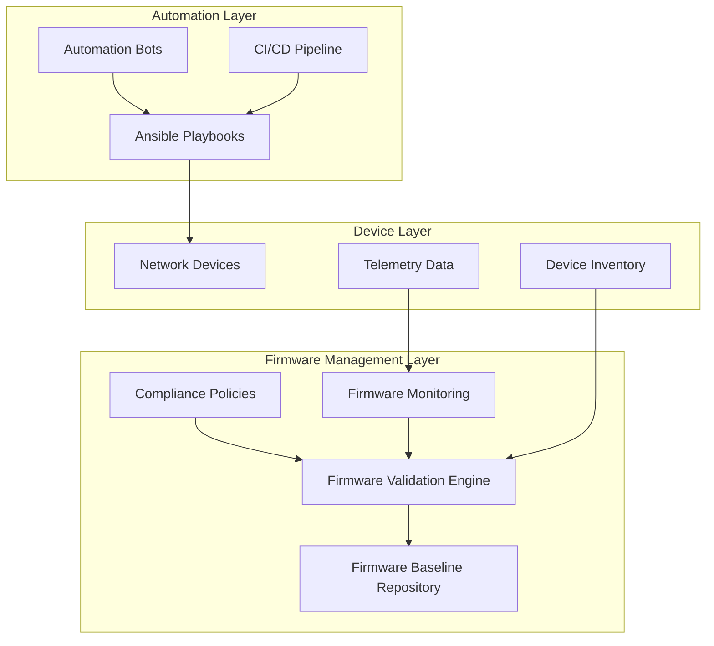
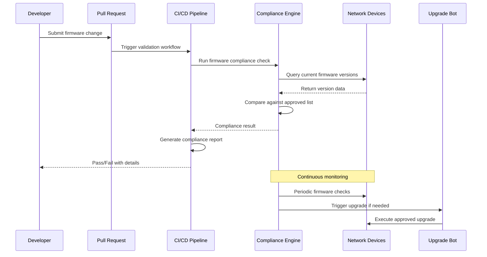
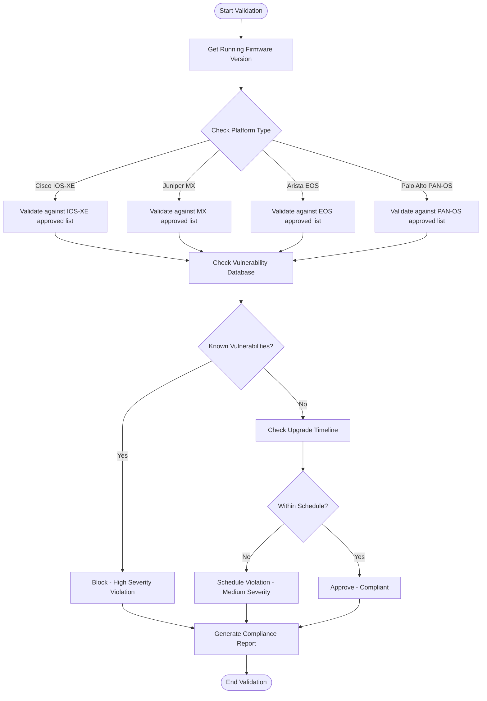
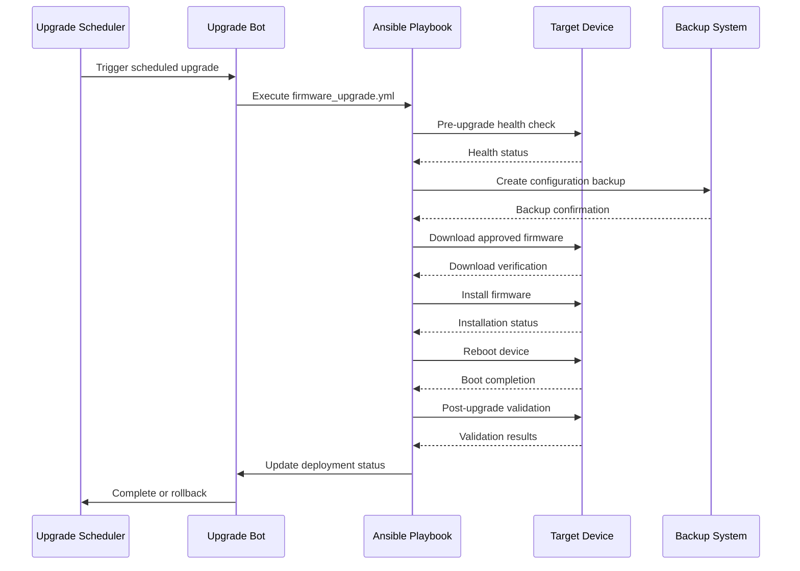
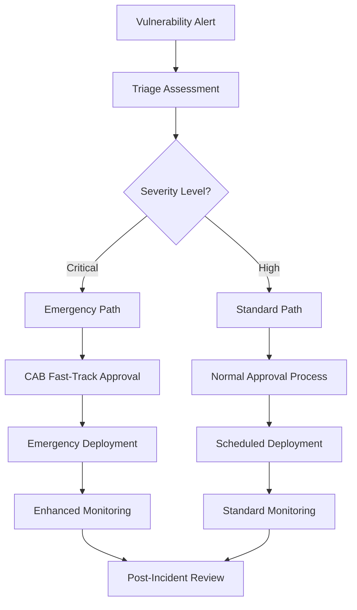
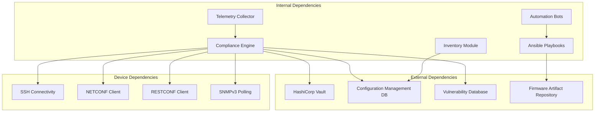

# Firmware Version Approval

<cite>
**Referenced Files in This Document**
- [README.md](file://README.md)
</cite>

## Table of Contents
1. [Introduction](#introduction)
2. [Project Structure](#project-structure)
3. [Core Components](#core-components)
4. [Architecture Overview](#architecture-overview)
5. [Detailed Component Analysis](#detailed-component-analysis)
6. [Dependency Analysis](#dependency-analysis)
7. [Performance Considerations](#performance-considerations)
8. [Troubleshooting Guide](#troubleshooting-guide)
9. [Conclusion](#conclusion)

## Introduction

This document provides comprehensive documentation for firmware version approval and enforcement policies within the Enterprise Network Automation Platform. The platform implements a robust compliance framework that maintains approved firmware baselines, detects unauthorized firmware versions, and enforces upgrade schedules across multi-vendor, multi-region network environments.

The system ensures that all network devices operate on approved firmware versions through automated validation, continuous monitoring, and orchestrated upgrade processes. This approach maintains security posture, operational stability, and regulatory compliance across thousands of network devices.

## Project Structure

The firmware management system is integrated throughout the platform's architecture, leveraging multiple components:

**Diagram sources**
- [README.md:103-180](file://README.md#L103-L180)
- [README.md:438-456](file://README.md#L438-L456)

**Section sources**
- [README.md:103-180](file://README.md#L103-L180)

## Core Components

### Compliance Framework

The compliance framework serves as the foundation for firmware version enforcement, implementing multiple layers of validation and policy checking:

| Component | Purpose | Implementation |
|-----------|---------|----------------|
| **Approved Firmware List** | Maintains authorized firmware versions per platform | Stored in compliance policies and validated during scans |
| **Version Comparison Engine** | Compares running firmware against approved lists | Python compliance module with pluggable rule sets |
| **Vulnerability Scanner** | Checks current versions against known vulnerabilities | Integrated with external vulnerability databases |
| **Upgrade Timeline Monitor** | Tracks upgrade schedules and compliance deadlines | Scheduled compliance scans with reporting |
| **Automated Enforcement** | Blocks non-compliant changes and triggers upgrades | CI/CD pipeline integration with manual approval gates |

### Key Playbooks and Workflows

The platform provides specialized playbooks for firmware lifecycle management:

| Playbook | Function | Integration Points |
|----------|----------|-------------------|
| `firmware_upgrade.yml` | Orchestrates firmware upgrades with pre/post checks | Pre-upgrade health checks, backup creation, post-validation |
| `firmware_rollback.yml` | Handles firmware rollback scenarios | Automatic rollback on failure, manual intervention support |
| `compliance_scan.yml` | Runs comprehensive compliance checks including firmware validation | Daily scheduled execution, PR validation |
| `inventory_collection.yml` | Collects device inventory including firmware versions | Serial numbers, versions, modules collection |
| `golden_config.yml` | Applies golden configuration baseline | Ensures consistent firmware across platforms |

**Section sources**
- [README.md:418-435](file://README.md#L418-L435)
- [README.md:548-580](file://README.md#L548-L580)

## Architecture Overview

The firmware approval and enforcement system follows a GitOps model with continuous compliance monitoring:

**Diagram sources**
- [README.md:479-514](file://README.md#L479-L514)
- [README.md:548-580](file://README.md#L548-L580)

## Detailed Component Analysis

### Firmware Validation Logic

The validation engine performs comprehensive checks to ensure firmware compliance:

**Diagram sources**
- [README.md:548-580](file://README.md#L548-L580)

### Approved Firmware Matrix

The platform maintains approved firmware matrices organized by vendor and platform:

| Vendor | Platform | Approved Versions | Minimum Version | End-of-Life Status |
|--------|----------|------------------|-----------------|-------------------|
| Cisco | IOS-XE | 17.6.x, 17.9.x, 17.12.x | 17.6.1 | Active Support |
| Cisco | NX-OS | 9.3.x, 9.4.x | 9.3.12 | Active Support |
| Juniper | MX Series | 22.3.x, 23.1.x | 22.3R3 | Active Support |
| Arista | EOS | 4.28.x, 4.31.x | 4.28.1-F | Active Support |
| Palo Alto | PAN-OS | 10.2.x, 11.0.x | 10.2.7-h1 | Active Support |
| Fortinet | FortiOS | 7.4.x, 7.2.x | 7.4.4 | Active Support |

### Violation Scenarios and Severity Levels

The compliance system categorizes violations by severity:

| Severity Level | Scenario | Action Required | Response Time |
|---------------|----------|----------------|---------------|
| **Critical** | Unapproved firmware version deployed | Immediate rollback required | < 1 hour |
| **High** | Known vulnerabilities in current firmware | Emergency upgrade within 24 hours | < 24 hours |
| **Medium** | Outdated but still supported firmware | Scheduled upgrade within 30 days | < 30 days |
| **Low** | Minor version drift from baseline | Next maintenance window | < 90 days |

### Automated Upgrade Orchestration

The upgrade bot orchestrates firmware deployments through playbooks:

**Diagram sources**
- [README.md:642-658](file://README.md#L642-L658)

### Testing Procedures

The platform implements comprehensive testing for firmware changes:

| Test Type | Scope | Tools | Frequency |
|-----------|-------|-------|-----------|
| **Unit Tests** | Firmware validation logic | pytest | Every PR |
| **Integration Tests** | Firmware download and installation | pyATS, NAPALM | Staging deployment |
| **Golden Config Tests** | Diff against approved baseline | Custom Python | Every PR, scheduled |
| **Regression Tests** | Ensure no unintended changes | pytest + snapshots | Every PR |
| **Performance Tests** | Upgrade process performance | locust, custom | Release candidate |

### Rollback Strategies

Multiple rollback mechanisms ensure operational continuity:

| Strategy | Trigger | Recovery Time | Data Loss Risk |
|----------|---------|---------------|----------------|
| **Automatic Rollback** | Post-upgrade validation failure | < 15 minutes | None (config backup) |
| **Manual Rollback** | Operator intervention | < 30 minutes | Minimal (config backup) |
| **Emergency Rollback** | Critical post-deployment issues | < 5 minutes | None (snapshot-based) |

### Emergency Upgrade Processes

For critical security vulnerabilities, the platform supports emergency upgrade workflows:

**Section sources**
- [README.md:418-435](file://README.md#L418-L435)
- [README.md:548-580](file://README.md#L548-L580)
- [README.md:642-658](file://README.md#L642-L658)

## Dependency Analysis

The firmware management system has well-defined dependencies between components:

**Diagram sources**
- [README.md:339-368](file://README.md#L339-L368)
- [README.md:438-456](file://README.md#L438-L456)

**Section sources**
- [README.md:339-368](file://README.md#L339-L368)
- [README.md:438-456](file://README.md#L438-L456)

## Performance Considerations

The firmware management system is designed for enterprise-scale operations:

- **Concurrent Processing**: Supports parallel firmware validation across thousands of devices
- **Efficient Caching**: Maintains cached firmware version data to reduce API calls
- **Batch Operations**: Groups similar firmware updates for efficient deployment
- **Resource Optimization**: Implements retry logic and connection pooling for reliability
- **Scalable Architecture**: Horizontal scaling through distributed compliance scanning

## Troubleshooting Guide

Common issues and resolutions for firmware management:

| Issue | Symptoms | Resolution |
|-------|----------|------------|
| **Connection Timeout** | Firmware validation fails with timeout errors | Verify SSH reachability: `ansible all -m ping -i inventories/lab/hosts.yml` |
| **Template Rendering Error** | Configuration generation fails | Check Jinja2 syntax: `python -m python.config_gen --debug --device <name>` |
| **Compliance Check Failure** | Non-compliant firmware detected | Review `compliance/` policies and device running config diff |
| **Vault Authentication Failure** | Cannot access firmware artifacts | Verify OIDC token or AppRole credentials; check Vault policies |
| **Upgrade Rollback Failure** | Automatic rollback doesn't complete | Check backup integrity and manual rollback procedures |

**Section sources**
- [README.md:674-685](file://README.md#L674-L685)

## Conclusion

The Enterprise Network Automation Platform provides a comprehensive firmware version approval and enforcement system that ensures security, compliance, and operational stability across large-scale network environments. Through automated validation, continuous monitoring, and orchestrated upgrade processes, the platform maintains approved firmware baselines while providing flexibility for emergency situations and routine maintenance.

The system's modular architecture, extensive testing coverage, and robust rollback mechanisms make it suitable for production environments requiring high availability and strict compliance requirements. The GitOps approach ensures full auditability and reproducibility of all firmware management operations.