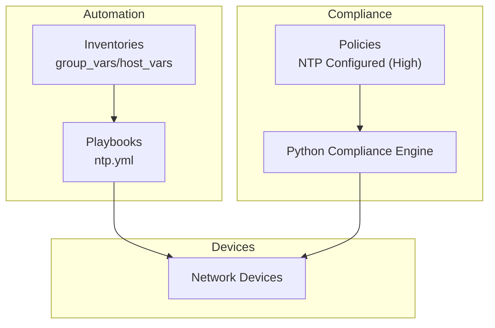
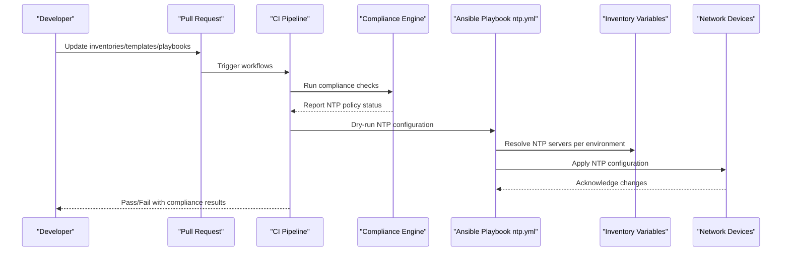
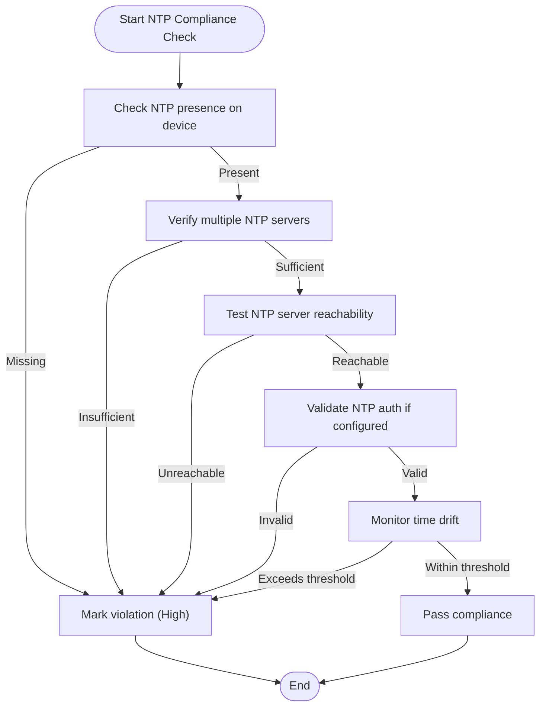
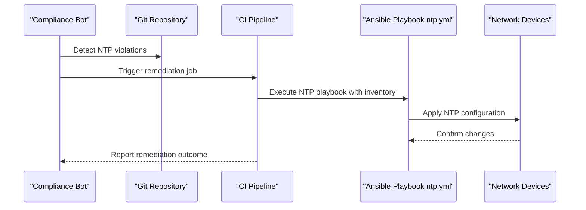
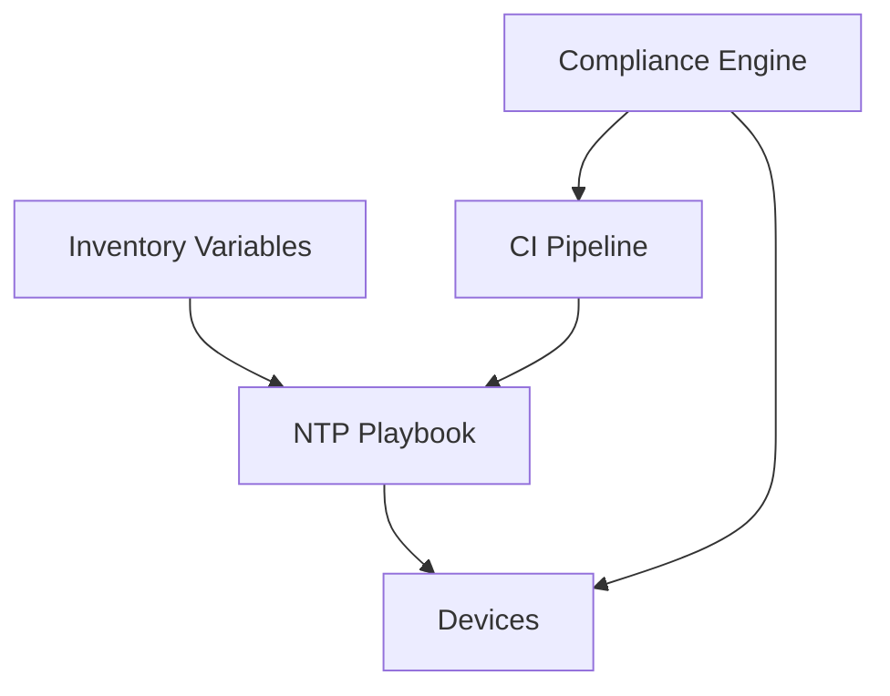

# NTP Configuration Requirements

<cite>
**Referenced Files in This Document**
- [README.md](file://README.md)
</cite>

## Table of Contents
1. [Introduction](#introduction)
2. [Project Structure](#project-structure)
3. [Core Components](#core-components)
4. [Architecture Overview](#architecture-overview)
5. [Detailed Component Analysis](#detailed-component-analysis)
6. [Dependency Analysis](#dependency-analysis)
7. [Performance Considerations](#performance-considerations)
8. [Troubleshooting Guide](#troubleshooting-guide)
9. [Conclusion](#conclusion)
10. [Appendices](#appendices)

## Introduction
This document defines the NTP configuration requirements and enforcement policies for the enterprise network automation platform. It explains how compliance is enforced to ensure all devices have proper NTP servers configured, validates time synchronization status, enforces timezone consistency, verifies server reachability, checks redundancy, validates authentication when configured, and monitors time drift. It also provides examples of compliant configurations, violation scenarios, severity levels, automated remediation via Ansible playbooks, and environment-specific assignments with failover.

## Project Structure
The repository is a Git-driven automation platform that includes:
- Playbooks for device lifecycle and services (including NTP)
- Compliance policies and checks integrated into CI/CD
- Python modules for validation and compliance
- Inventories and variables for environment-specific settings

[No sources needed since this diagram shows conceptual workflow, not actual code structure]

**Section sources**
- [README.md:103-180](file://README.md#L103-L180)
- [README.md:371-436](file://README.md#L371-L436)

## Core Components
- NTP Playbook: A dedicated playbook configures NTP servers across devices.
- Compliance Policy: “NTP Configured” policy requires every device to have NTP enabled; violations are marked High severity.
- Inventory Variables: Environment-specific NTP server lists and failover definitions are provided through group_vars and host_vars.
- Automation Bots: The compliance bot can trigger scans and report violations.

Key references:
- Playbook catalog entry for NTP configuration
- Compliance policy table including NTP requirement and severity
- Compliance flow integrating custom Python checks

**Section sources**
- [README.md:371-436](file://README.md#L371-L436)
- [README.md:552-567](file://README.md#L552-L567)
- [README.md:568-579](file://README.md#L568-L579)

## Architecture Overview
The NTP compliance architecture integrates inventory-driven configuration, automated provisioning, and continuous compliance checks.

**Diagram sources**
- [README.md:479-514](file://README.md#L479-L514)
- [README.md:568-579](file://README.md#L568-L579)
- [README.md:371-436](file://README.md#L371-L436)

## Detailed Component Analysis

### NTP Configuration Requirements
- All devices must be configured with NTP servers.
- At least two NTP servers should be defined for redundancy.
- Timezone must be consistently set per site or region.
- If NTP authentication is required by policy, it must be enabled and validated.
- Reachability of NTP servers must be verified during compliance checks.
- Time drift must be monitored and alerted if thresholds are exceeded.

These requirements align with the “NTP Configured” policy and the platform’s compliance-as-code approach.

**Section sources**
- [README.md:552-567](file://README.md#L552-L567)

### Validation Logic
The compliance engine performs the following validations:
- Presence check: Ensure NTP is configured on each device.
- Redundancy check: Verify multiple NTP servers are defined.
- Reachability check: Confirm NTP servers are reachable from the device.
- Authentication check: Validate NTP authentication parameters if configured.
- Drift monitoring: Track time offset against authoritative sources and alert on drift beyond thresholds.

[No sources needed since this diagram shows conceptual workflow, not actual code structure]

### Enforcement and Remediation
- Enforcement: The compliance scan blocks merges when violations are detected and notifies stakeholders.
- Remediation: Automated remediation uses the NTP playbook to apply correct configuration based on inventory variables.

**Diagram sources**
- [README.md:460-476](file://README.md#L460-L476)
- [README.md:371-436](file://README.md#L371-L436)

### Compliant NTP Configuration Examples
- Minimum two NTP servers per device for redundancy.
- Primary and secondary servers assigned per environment (e.g., production vs lab).
- Consistent timezone setting aligned with regional policy.
- Optional NTP authentication keys configured where required.

These patterns are driven by inventory variables and applied via the NTP playbook.

**Section sources**
- [README.md:371-436](file://README.md#L371-L436)

### Violation Scenarios
- Missing NTP: Device has no NTP configuration. Severity: High.
- Unreachable NTP servers: One or more configured NTP servers cannot be reached. Severity: High.
- Insufficient redundancy: Only one NTP server defined. Severity: High.
- Invalid NTP authentication: Misconfigured keys or algorithms. Severity: High.
- Excessive time drift: Device clock deviates beyond acceptable threshold. Severity: High.

**Section sources**
- [README.md:552-567](file://README.md#L552-L567)

### Environment-Specific Assignments and Failover
- Use group_vars and host_vars to define environment-specific NTP servers.
- Define primary and secondary NTP servers per region/site for failover.
- Ensure timezone values are consistent within environments.

**Section sources**
- [README.md:103-180](file://README.md#L103-L180)
- [README.md:371-436](file://README.md#L371-L436)

## Dependency Analysis
The NTP compliance and remediation depend on:
- Inventory data (group_vars/host_vars) for server lists and timezone settings.
- Ansible playbooks for applying configuration.
- Compliance engine for checking and reporting.
- CI/CD pipelines for enforcing checks and triggering remediation.

**Diagram sources**
- [README.md:371-436](file://README.md#L371-L436)
- [README.md:479-514](file://README.md#L479-L514)
- [README.md:568-579](file://README.md#L568-L579)

**Section sources**
- [README.md:371-436](file://README.md#L371-L436)
- [README.md:479-514](file://README.md#L479-L514)
- [README.md:568-579](file://README.md#L568-L579)

## Performance Considerations
- Batch compliance scans across device groups to reduce load.
- Use dry-run mode in CI to avoid unnecessary changes.
- Limit drift polling frequency to balance accuracy and overhead.
- Prefer local NTP servers close to devices to minimize latency.

[No sources needed since this section provides general guidance]

## Troubleshooting Guide
Common issues and resolutions:
- Connection timeouts: Verify SSH reachability using ping tests against device inventory.
- Template rendering errors: Debug Jinja2 templates with debug flags.
- Compliance failures: Review compliance policies and running config diffs.
- Vault authentication failures: Check OIDC tokens or AppRole credentials.
- Molecule test failures: Ensure container runtime is available and inspect molecule configuration.
- Batfish analysis errors: Validate snapshots and configuration inputs.

**Section sources**
- [README.md:674-685](file://README.md#L674-L685)

## Conclusion
The platform enforces strict NTP configuration requirements through compliance-as-code and automated remediation. By leveraging inventory-driven variables, dedicated playbooks, and continuous scanning, the system ensures all devices maintain accurate time synchronization, redundant NTP sources, and consistent timezones. Violations are flagged at High severity, and automated workflows remediate issues while maintaining auditability and safety.

[No sources needed since this section summarizes without analyzing specific files]

## Appendices

### Quick Commands
- Dry-run compliance scan: ansible-playbook playbooks/compliance_scan.yml -i inventories/lab/hosts.yml --check --diff
- Generate device configuration: python -m python.config_gen --device core-rtr-01 --output ./output/
- Run unit tests: pytest tests/unit/ -v
- Run compliance checks locally: python -m python.compliance --inventory inventories/lab/hosts.yml

**Section sources**
- [README.md:264-281](file://README.md#L264-L281)