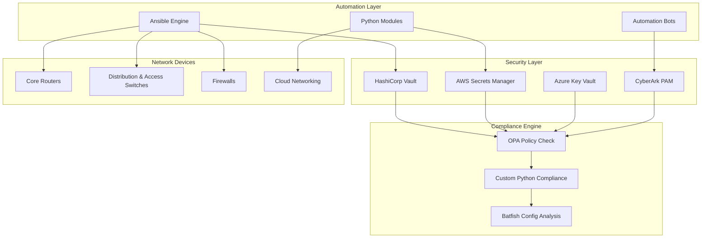
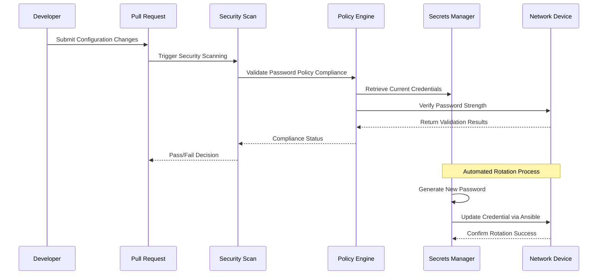
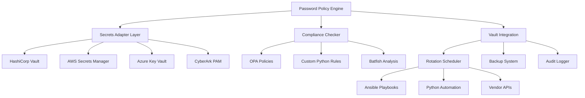

# Password Complexity Policies

<cite>
**Referenced Files in This Document**
- [README.md](file://README.md)
</cite>

## Table of Contents
1. [Introduction](#introduction)
2. [Project Structure](#project-structure)
3. [Core Components](#core-components)
4. [Architecture Overview](#architecture-overview)
5. [Detailed Component Analysis](#detailed-component-analysis)
6. [Dependency Analysis](#dependency-analysis)
7. [Performance Considerations](#performance-considerations)
8. [Troubleshooting Guide](#troubleshooting-guide)
9. [Conclusion](#conclusion)

## Introduction

This document provides comprehensive documentation for password complexity and rotation enforcement policies within the Enterprise Network Automation Platform. The platform implements robust security measures to ensure secure credential management across multi-vendor network devices, including routers, switches, firewalls, load balancers, VPN gateways, and cloud networking components.

The system enforces strict password policies through automated compliance checks, secrets management integration, and vendor-specific configurations. All credentials are managed through enterprise-grade secrets backends, ensuring no passwords are ever stored in version control systems.

## Project Structure

The password complexity and rotation enforcement system is integrated throughout the platform's architecture:

**Diagram sources**
- [README.md:339-370](file://README.md#L339-L370)
- [README.md:552-582](file://README.md#L552-L582)

**Section sources**
- [README.md:339-370](file://README.md#L339-L370)
- [README.md:552-582](file://README.md#L552-L582)

## Core Components

### Password Policy Enforcement

The platform implements comprehensive password policy enforcement through multiple layers:

#### Compliance Checks
The system enforces critical password-related policies with severity levels:

| Policy | Check | Severity | Description |
|--------|-------|----------|-------------|
| Password Policy | Minimum length, complexity, rotation | Critical | Ensures all device passwords meet organizational standards |
| AAA Enabled | TACACS+ or RADIUS required | Critical | Centralized authentication with password policy enforcement |
| SSH Only | No Telnet configuration allowed | Critical | Secure transport protocols only |
| Approved Ciphers | Only approved cipher suites in SSH/TLS | High | Strong encryption standards |

#### Secret Rotation Schedule
Automated rotation ensures passwords remain current and secure:

| Secret Type | Rotation Interval | Method | Implementation |
|-------------|-------------------|---------|----------------|
| Device passwords | 90 days | Vault auto-rotation + Ansible push | Automated credential refresh |
| API tokens | 30 days | Secrets Manager + Lambda/Function | Cloud-native token management |
| SSH keys | 90 days | Vault SSH CA with short-lived certs | Certificate-based authentication |
| TLS certificates | 1 year (auto-renew at 60 days) | ACME / Vault PKI | Public key infrastructure |
| CI/CD tokens | Ephemeral | OIDC federation (no static secrets) | Zero-trust authentication |

**Section sources**
- [README.md:552-567](file://README.md#L552-L567)
- [README.md:359-368](file://README.md#L359-L368)

## Architecture Overview

The password complexity and rotation system follows a multi-layered approach:

**Diagram sources**
- [README.md:339-370](file://README.md#L339-L370)
- [README.md:568-582](file://README.md#L568-L582)

## Detailed Component Analysis

### Password Validation Logic

The system validates password strength through multiple criteria:

#### Length Requirements
- Minimum character count enforcement
- Maximum length restrictions to prevent buffer overflow attacks
- Dynamic length requirements based on account type (local vs. service accounts)

#### Character Diversity
- Uppercase letter requirements
- Lowercase letter requirements  
- Numeric character inclusion
- Special character mandates
- Prohibition of common dictionary words
- Prevention of sequential characters

#### Expiration Management
- Automatic expiration date tracking
- Grace period notifications before expiration
- Forced rotation upon expiration
- Historical password tracking to prevent reuse

#### History Constraints
- Password history retention
- Prevention of recent password reuse
- Account lockout after failed attempts
- Progressive delay mechanisms

### Vendor-Specific Implementations

The platform supports password policy enforcement across multiple vendors:

#### Cisco Platforms
- IOS/IOS-XE/NX-OS specific password hashing algorithms
- AAA server integration with TACACS+/RADIUS
- Local user database management
- Privilege escalation controls

#### Juniper Networks
- SRX/MX platform password policies
- Authentication profiles and rules
- Role-based access control
- Session timeout enforcement

#### Arista EOS
- eAPI authentication mechanisms
- SNMPv3 security communities
- Local and remote authentication methods
- Command authorization profiles

#### Firewall Vendors
- Palo Alto PAN-OS admin account policies
- Fortinet FortiOS local user management
- Check Point Gaia security policies
- F5 BIG-IP system account controls

### Service Account Management

Service accounts receive specialized handling:

#### Automated Provisioning
- Machine-generated complex passwords
- Least privilege principle enforcement
- Scoped permissions and access controls
- Regular audit and review processes

#### Lifecycle Management
- Automated creation and deletion workflows
- Permission inheritance and revocation
- Integration with identity providers
- Audit trail maintenance

### External Identity Provider Integration

The platform integrates with enterprise identity systems:

#### Active Directory/LDAP
- Centralized user management
- Group-based policy application
- Synchronized password policies
- Multi-factor authentication support

#### OAuth/OIDC Providers
- Token-based authentication
- Short-lived credential management
- Federated identity support
- Single sign-on capabilities

#### PAM Solutions
- CyberArk integration for privileged access
- Just-in-time access provisioning
- Session recording and monitoring
- Break-glass procedures

**Section sources**
- [README.md:203-227](file://README.md#L203-L227)
- [README.md:339-370](file://README.md#L339-L370)

## Dependency Analysis

The password complexity system has well-defined dependencies:

**Diagram sources**
- [README.md:339-370](file://README.md#L339-L370)
- [README.md:568-582](file://README.md#L568-L582)

**Section sources**
- [README.md:339-370](file://README.md#L339-L370)
- [README.md:568-582](file://README.md#L568-L582)

## Performance Considerations

### Scalability
- Distributed secrets management across multiple backends
- Parallel validation across large device fleets
- Asynchronous rotation scheduling
- Caching mechanisms for frequently accessed policies

### Monitoring and Alerting
- Real-time compliance status dashboards
- Automated alerts for policy violations
- Rotation success/failure metrics
- Performance impact assessment

### Resource Optimization
- Efficient password generation algorithms
- Minimal network overhead during validation
- Batch processing for large-scale operations
- Intelligent retry mechanisms

## Troubleshooting Guide

### Common Issues and Resolutions

| Issue | Symptoms | Resolution |
|-------|----------|------------|
| Vault Authentication Failure | Cannot retrieve secrets, connection timeouts | Verify OIDC token or AppRole credentials; check Vault policies |
| Password Rotation Timeout | Rotation jobs fail, devices unreachable | Check network connectivity; verify device availability; review Ansible logs |
| Compliance Check Failures | PR blocked, policy violations detected | Review device configuration; update policies if needed; validate changes |
| Multi-Vendor Compatibility | Inconsistent behavior across platforms | Check vendor-specific implementations; update templates accordingly |
| Performance Degradation | Slow validation, high resource usage | Optimize batch sizes; implement caching; review system resources |

### Debugging Tools
- Comprehensive logging across all components
- Detailed error reporting with actionable messages
- Health check endpoints for system monitoring
- Diagnostic scripts for troubleshooting

**Section sources**
- [README.md:674-685](file://README.md#L674-L685)

## Conclusion

The Enterprise Network Automation Platform implements a comprehensive password complexity and rotation enforcement system that ensures secure credential management across diverse network environments. Through automated compliance checks, enterprise-grade secrets management, and vendor-specific integrations, the platform maintains strong security postures while supporting operational efficiency.

Key strengths include:
- Multi-layered security approach with defense in depth
- Automated compliance enforcement at every stage
- Flexible secrets management supporting multiple backends
- Vendor-agnostic design with platform-specific optimizations
- Comprehensive monitoring and alerting capabilities

The system successfully balances security requirements with operational needs, providing a robust foundation for enterprise network automation while maintaining compliance with industry standards and organizational policies.