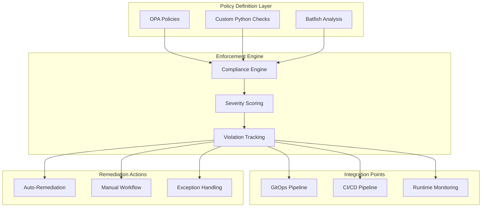
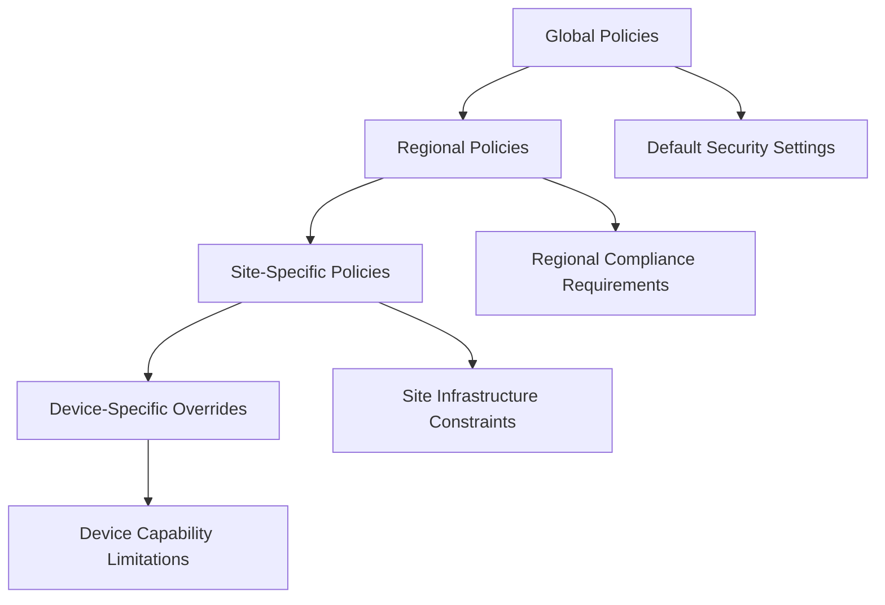
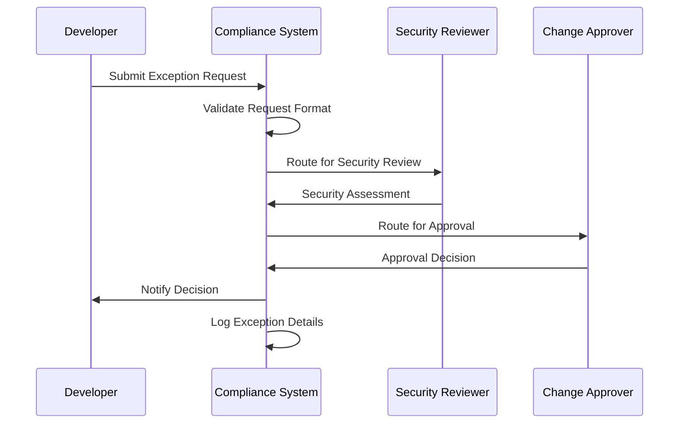
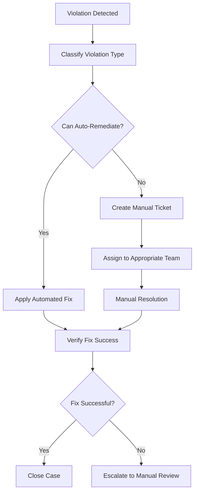

# Policy Types and Enforcement Rules

<cite>
**Referenced Files in This Document**
- [README.md](file://README.md)
</cite>

## Table of Contents
1. [Introduction](#introduction)
2. [Compliance Framework Architecture](#compliance-framework-architecture)
3. [Policy Categories and Enforcement Rules](#policy-categories-and-enforcement-rules)
4. [Severity Levels and Risk Assessment](#severity-levels-and-risk-assessment)
5. [Violation Detection Mechanisms](#violation-detection-mechanisms)
6. [Automated Remediation Capabilities](#automated-remediation-capabilities)
7. [Policy Inheritance and Environment Overrides](#policy-inheritance-and-environment-overrides)
8. [Exception Handling Processes](#exception-handling-processes)
9. [Implementation Examples](#implementation-examples)
10. [Troubleshooting and Resolution Workflows](#troubleshooting-and-resolution-workflows)
11. [Conclusion](#conclusion)

## Introduction

This document provides comprehensive coverage of the policy types and enforcement rules supported by the enterprise network automation platform's compliance framework. The platform implements a robust "Compliance as Code" approach, ensuring that all network configurations adhere to organizational security standards and best practices across multi-vendor, multi-region environments.

The compliance system operates at every stage of the development lifecycle, from pull request validation through production deployment, providing continuous enforcement of security policies and configuration standards.

## Compliance Framework Architecture

The compliance framework integrates multiple layers of validation and enforcement mechanisms:

**Diagram sources**
- [README.md:548-582](file://README.md#L548-L582)

**Section sources**
- [README.md:548-582](file://README.md#L548-L582)

## Policy Categories and Enforcement Rules

### SSH-Only Policies (Blocking Telnet)

**Policy Description**: Ensures that Telnet is disabled across all network devices and SSH is the only allowed remote access protocol.

**Validation Logic**:
- Scans device configurations for Telnet server enablement commands
- Verifies SSH service is enabled and properly configured
- Checks for any legacy Telnet client configurations
- Validates SSH version 2 enforcement

**Severity Level**: Critical

**Violation Detection Mechanisms**:
- Configuration parsing and pattern matching
- Protocol capability verification
- Service status monitoring

**Automated Remediation**:
- Automatic Telnet disablement via playbooks
- SSH hardening application
- Service restart and verification

### NTP Configuration Requirements

**Policy Description**: Mandates proper Network Time Protocol configuration for accurate logging, certificate validation, and coordinated operations.

**Validation Logic**:
- Verifies NTP server entries exist and are reachable
- Checks NTP authentication configuration
- Validates time source hierarchy and fallback servers
- Confirms NTP synchronization status

**Severity Level**: High

**Violation Detection Mechanisms**:
- NTP daemon status checking
- Time synchronization verification
- Server reachability testing

**Automated Remediation**:
- NTP configuration generation and deployment
- Server failover configuration
- Synchronization status monitoring

### AAA Setup Enforcement

**Policy Description**: Enforces centralized authentication, authorization, and accounting using TACACS+ or RADIUS protocols.

**Validation Logic**:
- Verifies AAA server configurations
- Checks authentication method lists
- Validates authorization profiles
- Confirms accounting settings

**Severity Level**: Critical

**Violation Detection Mechanisms**:
- AAA server connectivity testing
- Authentication flow validation
- Authorization rule verification

**Automated Remediation**:
- AAA configuration templates
- Server failover setup
- Authentication testing automation

### SNMPv3 Mandatory Usage

**Policy Description**: Requires SNMPv3 for all Simple Network Management Protocol communications, eliminating insecure SNMPv1/v2c usage.

**Validation Logic**:
- Scans for SNMPv1/v2c community strings
- Verifies SNMPv3 user configurations
- Checks authentication and encryption settings
- Validates SNMP engine IDs

**Severity Level**: High

**Violation Detection Mechanisms**:
- SNMP version detection
- Security parameter validation
- Community string scanning

**Automated Remediation**:
- SNMPv3 migration scripts
- Legacy configuration cleanup
- Security parameter generation

### Approved Cipher Suites

**Policy Description**: Enforces use of approved cryptographic cipher suites for SSH and TLS communications.

**Validation Logic**:
- Validates SSH cipher suite configurations
- Checks TLS cipher preferences
- Verifies key exchange algorithms
- Confirms MAC algorithm approvals

**Severity Level**: High

**Violation Detection Mechanisms**:
- Cryptographic configuration analysis
- Cipher suite enumeration
- Algorithm strength assessment

**Automated Remediation**:
- Cipher suite template deployment
- Legacy algorithm removal
- Security parameter updates

### Firmware Version Approval

**Policy Description**: Ensures all devices run approved firmware versions from the organization's baseline.

**Validation Logic**:
- Compares running firmware against approved list
- Checks for known vulnerabilities in current versions
- Validates upgrade path compatibility
- Monitors for unauthorized firmware changes

**Severity Level**: High

**Violation Detection Mechanisms**:
- Firmware version inventory collection
- Vulnerability database integration
- Change detection monitoring

**Automated Remediation**:
- Firmware upgrade orchestration
- Rollback procedures
- Compatibility validation

### Password Complexity Policies

**Policy Description**: Enforces strong password requirements including minimum length, complexity, and rotation policies.

**Validation Logic**:
- Checks password length requirements
- Validates complexity rules (uppercase, lowercase, numbers, special characters)
- Verifies password expiration settings
- Confirms account lockout policies

**Severity Level**: Critical

**Violation Detection Mechanisms**:
- Password policy configuration analysis
- Account security setting verification
- Weak password detection

**Automated Remediation**:
- Password policy template deployment
- Account security hardening
- Rotation schedule automation

### ACL Standards Enforcement

**Policy Description**: Ensures Access Control Lists follow organizational standards with default deny and explicit allow rules.

**Validation Logic**:
- Verifies default deny statements exist
- Checks for overly permissive rules (any-any)
- Validates rule ordering and logic
- Confirms comment and naming standards

**Severity Level**: High

**Violation Detection Mechanisms**:
- ACL rule analysis and pattern matching
- Rule effectiveness testing
- Shadow rule detection

**Automated Remediation**:
- ACL template generation
- Rule optimization suggestions
- Standard-compliant configuration deployment

### Firewall Rule Validation

**Policy Description**: Validates firewall rules for security compliance, efficiency, and maintainability.

**Validation Logic**:
- Detects any-any rules and overly broad permissions
- Identifies shadowed or duplicate rules
- Validates rule dependencies and order
- Checks for rule conflicts

**Severity Level**: Critical

**Violation Detection Mechanisms**:
- Rule dependency analysis
- Conflict detection algorithms
- Security posture assessment

**Automated Remediation**:
- Rule optimization recommendations
- Automated cleanup of unused rules
- Security policy enforcement

### Unused Object Detection

**Policy Description**: Identifies and flags unused ACLs, firewall rules, and other network objects to maintain configuration hygiene.

**Validation Logic**:
- Analyzes traffic patterns and rule utilization
- Identifies objects referenced but never matched
- Tracks object creation and modification dates
- Correlates with change management records

**Severity Level**: Low

**Violation Detection Mechanisms**:
- Traffic analysis and correlation
- Object usage statistics collection
- Change history analysis

**Automated Remediation**:
- Unused object reporting
- Safe removal recommendations
- Cleanup workflow automation

**Section sources**
- [README.md:552-566](file://README.md#L552-L566)

## Severity Levels and Risk Assessment

The compliance framework uses a four-tier severity classification system to prioritize remediation efforts:

| Severity | Impact | Response Time | Escalation Path |
|----------|--------|---------------|-----------------|
| **Critical** | Immediate security risk, potential data breach | Immediate | Security team + Management |
| **High** | Significant security weakness, compliance violation | Within 24 hours | Security team + Engineering |
| **Medium** | Moderate risk, best practice deviation | Within 1 week | Engineering team |
| **Low** | Minor issue, housekeeping improvement | Within 1 month | Operations team |

**Risk Assessment Criteria**:
- **Critical**: Direct security vulnerability, regulatory non-compliance, immediate exploit potential
- **High**: Significant security weakness, audit finding, operational risk
- **Medium**: Best practice deviation, minor security gap, maintenance concern
- **Low**: Housekeeping item, optimization opportunity, documentation gap

**Section sources**
- [README.md:552-566](file://README.md#L552-L566)

## Violation Detection Mechanisms

The compliance framework employs multiple detection mechanisms to identify policy violations:

### Configuration Analysis
- **Static Analysis**: Parses configuration files for policy violations
- **Pattern Matching**: Uses regular expressions and semantic analysis
- **Schema Validation**: Ensures configurations match expected formats

### Runtime Verification
- **Live Device Checking**: Queries running configurations from active devices
- **Service Status Monitoring**: Verifies security services are enabled and functioning
- **Protocol Testing**: Actively tests security protocols and authentication flows

### Network Simulation
- **Batfish Integration**: Simulates network behavior to detect routing and ACL issues
- **Traffic Flow Analysis**: Models packet traversal through network topology
- **Dependency Mapping**: Identifies rule dependencies and potential conflicts

### Continuous Monitoring
- **Drift Detection**: Compares running configurations against approved baselines
- **Change Monitoring**: Tracks configuration changes in real-time
- **Alerting**: Generates notifications for new violations

**Section sources**
- [README.md:548-582](file://README.md#L548-L582)

## Automated Remediation Capabilities

The platform provides comprehensive automated remediation capabilities:

### Self-Healing Playbooks
- **SSH Hardening**: Automatically disables Telnet and configures secure SSH settings
- **NTP Synchronization**: Configures and validates NTP server connections
- **AAA Migration**: Converts local authentication to centralized AAA
- **SNMP Upgrade**: Migrates from SNMPv1/v2c to SNMPv3 with proper security

### Template-Based Remediation
- **Configuration Templates**: Jinja2 templates for standard-compliant configurations
- **Parameterized Deployment**: Environment-specific variable injection
- **Rollback Procedures**: Automatic rollback on remediation failure

### Approval Workflows
- **Change Requests**: Automated change request generation for manual approval
- **Risk Assessment**: Pre-remediation risk scoring and impact analysis
- **Audit Trail**: Complete logging of all remediation actions

**Section sources**
- [README.md:371-435](file://README.md#L371-L435)

## Policy Inheritance and Environment Overrides

### Hierarchical Policy Structure
Policies follow a hierarchical inheritance model:

### Override Mechanisms
- **Environment Variables**: Environment-specific policy parameters
- **Device Groups**: Group-based policy inheritance
- **Vendor-Specific Rules**: Platform-specific policy adaptations
- **Exception Registry**: Documented exceptions with approval workflows

### Policy Resolution Order
1. **Global Baseline**: Organization-wide security requirements
2. **Regional Adaptations**: Geographic or business unit requirements
3. **Site Constraints**: Physical infrastructure limitations
4. **Device Capabilities**: Hardware/software capability constraints
5. **Approved Exceptions**: Documented and approved deviations

**Section sources**
- [README.md:284-335](file://README.md#L284-L335)

## Exception Handling Processes

### Exception Request Workflow

### Exception Categories
- **Technical Limitations**: Hardware/software constraints preventing compliance
- **Legacy Systems**: Unsupported equipment requiring temporary exceptions
- **Business Requirements**: Operational needs overriding security policies
- **Regulatory Variations**: Jurisdiction-specific compliance differences

### Exception Lifecycle Management
- **Temporary Exceptions**: Time-limited with automatic expiration
- **Permanent Exceptions**: Require annual review and re-approval
- **Conditional Exceptions**: Valid only under specific circumstances
- **Revocation Process**: Automated notification when exceptions expire

**Section sources**
- [README.md:460-476](file://README.md#L460-L476)

## Implementation Examples

### SSH-Only Policy Example
A typical SSH-only policy definition would include:

**Policy Definition Structure**:
- **Scope**: All devices except exempted legacy systems
- **Check**: Verify `no ip telnet-server` and `ip ssh version 2`
- **Remediation**: Apply SSH hardening playbook
- **Severity**: Critical
- **Override**: Requires CISO approval

### NTP Configuration Example
NTP policy enforcement includes:

**Configuration Requirements**:
- Minimum two NTP servers from different sources
- NTP authentication enabled with shared secrets
- Fallback configuration for primary server unavailability
- Timezone and daylight saving time settings

**Validation Commands**:
- Check NTP peer status and synchronization
- Verify authentication configuration
- Test server reachability and latency

### AAA Setup Enforcement Example
AAA policy implementation covers:

**Authentication Methods**:
- Primary TACACS+ server with RADIUS fallback
- Local authentication as last resort
- Privilege escalation controls
- Session timeout and idle disconnect

**Authorization Profiles**:
- Role-based access control
- Command filtering per role
- Interface and VLAN access restrictions

**Section sources**
- [README.md:371-435](file://README.md#L371-L435)

## Troubleshooting and Resolution Workflows

### Common Violation Scenarios

#### SSH/Telnet Issues
**Problem**: Devices still have Telnet enabled despite policy enforcement
**Resolution Steps**:
1. Check device vendor/platform compatibility
2. Verify SSH service availability and port accessibility
3. Review exception registry for approved deviations
4. Apply vendor-specific SSH hardening templates

#### NTP Synchronization Failures
**Problem**: Devices cannot synchronize time with configured NTP servers
**Resolution Steps**:
1. Verify network connectivity to NTP servers
2. Check firewall rules allowing UDP port 123
3. Validate NTP authentication configuration
4. Review server load and availability

#### AAA Authentication Problems
**Problem**: Users unable to authenticate via centralized AAA
**Resolution Steps**:
1. Test AAA server connectivity and credentials
2. Verify shared secret configuration matches
3. Check radius/tacacs+ server group membership
4. Review authentication method lists and fallback configuration

### Automated Resolution Workflows

The platform provides automated resolution workflows for common violations:

**Section sources**
- [README.md:674-685](file://README.md#L674-L685)

## Conclusion

The enterprise network automation platform's compliance framework provides comprehensive policy enforcement across all aspects of network security and configuration management. By implementing automated validation, continuous monitoring, and intelligent remediation capabilities, the platform ensures consistent adherence to organizational security standards while maintaining operational flexibility.

The framework's modular design allows for easy extension with new policy types, while its integration with GitOps and CI/CD pipelines ensures that compliance is enforced throughout the entire development and deployment lifecycle. The combination of automated remediation, exception handling, and comprehensive reporting creates a robust foundation for maintaining security posture across large-scale, multi-vendor network environments.

Key benefits of this approach include:
- **Consistent Security Posture**: Uniform policy enforcement across all devices and environments
- **Reduced Manual Effort**: Automated compliance checking and remediation
- **Improved Audit Readiness**: Comprehensive logging and reporting capabilities
- **Operational Efficiency**: Faster resolution of compliance violations
- **Risk Mitigation**: Proactive identification and remediation of security gaps