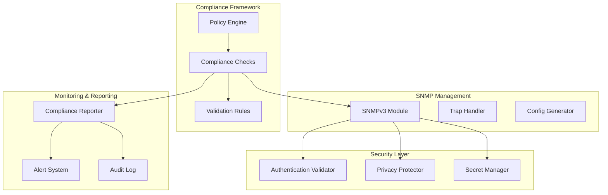
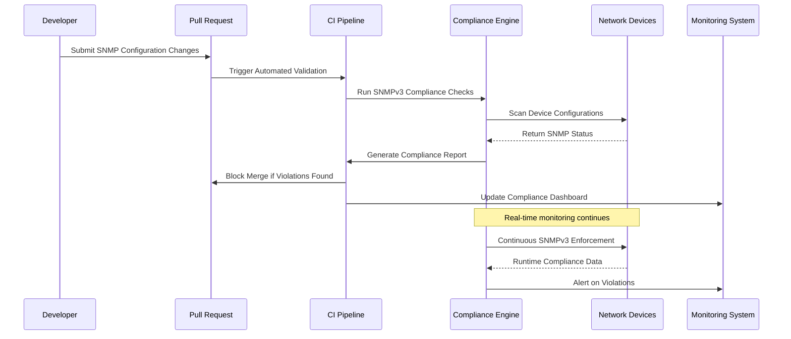
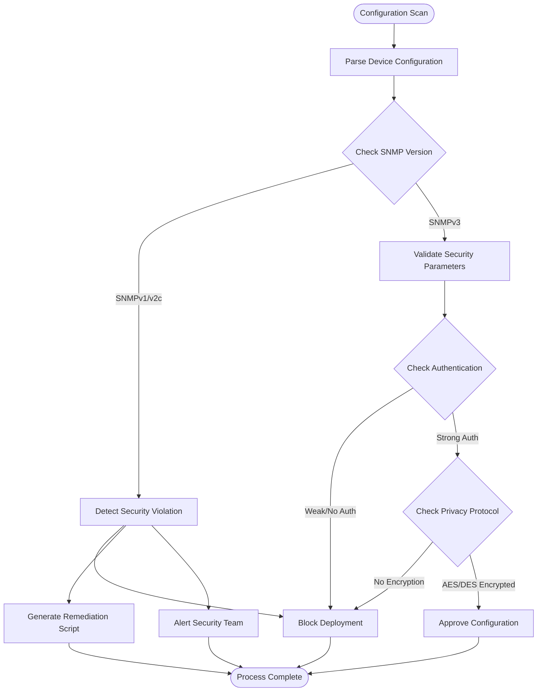
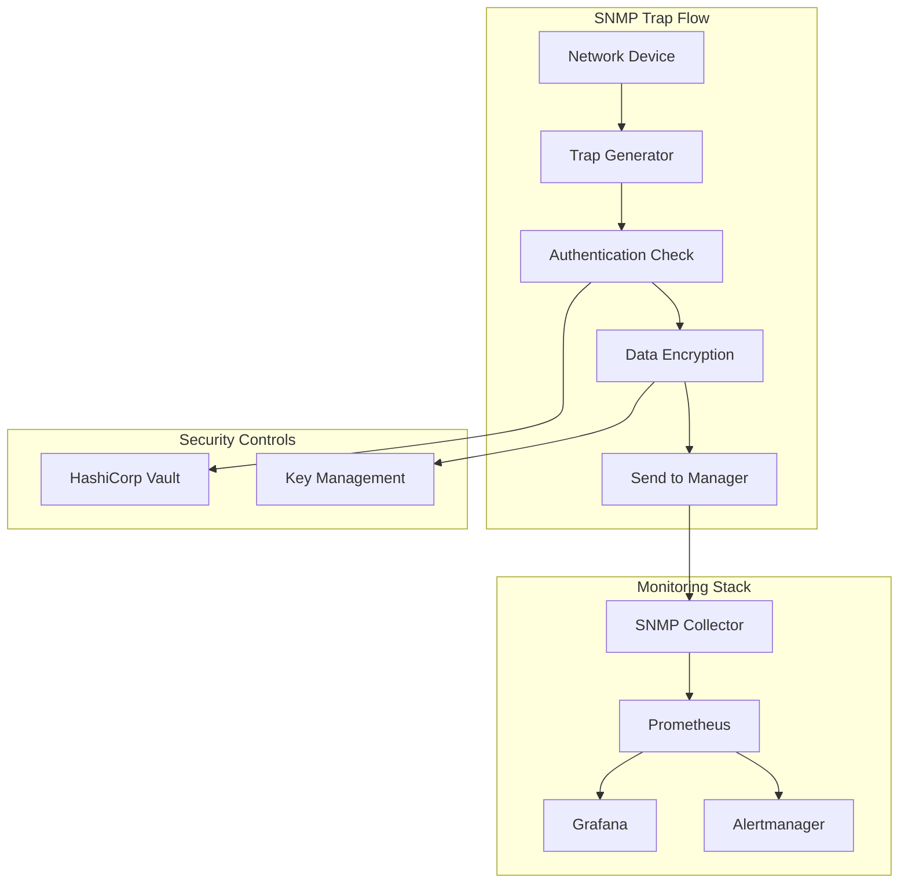
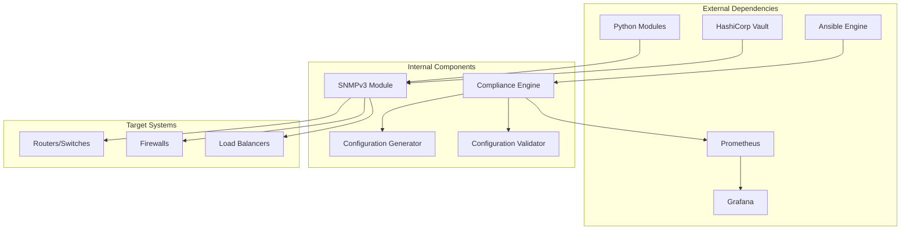

# SNMPv3 Mandatory Usage

<cite>
**Referenced Files in This Document**
- [README.md](file://README.md)
</cite>

## Table of Contents
1. [Introduction](#introduction)
2. [Project Structure](#project-structure)
3. [Core Components](#core-components)
4. [Architecture Overview](#architecture-overview)
5. [Detailed Component Analysis](#detailed-component-analysis)
6. [Dependency Analysis](#dependency-analysis)
7. [Performance Considerations](#performance-considerations)
8. [Troubleshooting Guide](#troubleshooting-guide)
9. [Conclusion](#conclusion)

## Introduction

This document provides comprehensive guidance for enforcing SNMPv3 mandatory usage policies within the Enterprise Network Automation Platform. The platform implements strict compliance frameworks to detect and block insecure SNMP configurations while ensuring robust security through authentication and encryption protocols.

The compliance framework enforces SNMPv3 as the mandatory protocol version, blocking deprecated SNMPv1/v2c configurations and validating proper authentication and privacy settings. This approach aligns with enterprise security standards and protects against unauthorized network device access through weak or unencrypted SNMP communications.

## Project Structure

The network automation platform follows a modular architecture with dedicated components for SNMP management and compliance enforcement:

**Diagram sources**
- [README.md:103-180](file://README.md#L103-L180)
- [README.md:438-456](file://README.md#L438-L456)

**Section sources**
- [README.md:103-180](file://README.md#L103-L180)
- [README.md:438-456](file://README.md#L438-L456)

## Core Components

The SNMPv3 enforcement system consists of several key components working together to ensure compliance:

### Compliance Check Engine
The compliance engine performs automated checks across all network devices to verify SNMP configuration adherence to security policies. It operates at multiple stages including pull request validation, pre-deployment verification, and runtime monitoring.

### SNMP Configuration Validator
This component validates SNMP configurations against defined security standards, checking for deprecated versions, weak authentication methods, and missing encryption protocols.

### Authentication and Privacy Protocol Enforcer
Ensures that SNMPv3 users have proper authentication (SHA/MD5) and privacy (AES/DES) protocols configured with appropriate key lengths and complexity requirements.

### Community String Deprecation Scanner
Scans configurations for deprecated community strings used in SNMPv1/v2c and ensures they are replaced with secure SNMPv3 user-based authentication.

**Section sources**
- [README.md:552-566](file://README.md#L552-L566)
- [README.md:438-456](file://README.md#L438-L456)

## Architecture Overview

The SNMPv3 enforcement architecture integrates seamlessly with the existing GitOps workflow and compliance pipeline:

**Diagram sources**
- [README.md:36-50](file://README.md#L36-L50)
- [README.md:568-579](file://README.md#L568-L579)

## Detailed Component Analysis

### SNMP Version Detection and Blocking

The compliance framework implements multi-layered detection mechanisms to identify and block deprecated SNMP versions:

#### Configuration Scanning Logic
The system scans device configurations for SNMP-related commands and parameters, specifically targeting:
- `snmp-server` commands with version 1 or 2c specifications
- Community string configurations without SNMPv3 user definitions
- Legacy SNMP trap configurations using community-based authentication

#### Automated Remediation Process
When violations are detected, the system automatically generates remediation scripts that:
- Remove deprecated SNMPv1/v2c configurations
- Generate compliant SNMPv3 user configurations
- Apply proper authentication and privacy protocols
- Validate the new configuration before deployment

**Diagram sources**
- [README.md:552-566](file://README.md#L552-L566)
- [README.md:568-579](file://README.md#L568-L579)

### SNMPv3 User Credential Validation

The system validates SNMPv3 user credentials against enterprise security standards:

#### Authentication Protocol Requirements
- **Supported Protocols**: SHA-1, SHA-256, MD5 (deprecated)
- **Minimum Key Length**: 8 characters for authentication keys
- **Password Complexity**: Must include uppercase, lowercase, numbers, and special characters
- **Key Rotation**: Automatic rotation every 90 days

#### Privacy Protocol Enforcement
- **Supported Protocols**: AES-128, AES-192, AES-256, DES (deprecated)
- **Encryption Strength**: Minimum AES-128 required
- **Key Management**: Integration with HashiCorp Vault for secure key storage
- **Algorithm Validation**: Ensures only approved cipher suites are used

### Community String Deprecation Strategy

The platform implements a phased approach to eliminate community string usage:

#### Detection and Classification
- **Active Scanning**: Continuous monitoring for community string usage
- **Risk Assessment**: Classify violations by severity and impact
- **Migration Planning**: Automated migration from community strings to SNMPv3 users

#### Remediation Workflow
1. **Identification**: Detect devices still using community strings
2. **Planning**: Generate migration schedule based on device criticality
3. **Execution**: Automated replacement with SNMPv3 configurations
4. **Verification**: Post-migration validation and testing
5. **Documentation**: Update configuration baselines and audit logs

**Section sources**
- [README.md:552-566](file://README.md#L552-L566)
- [README.md:339-368](file://README.md#L339-L368)

### SNMP Trap Configuration and Monitoring

The compliance framework extends to SNMP trap configurations to ensure secure event reporting:

#### Trap Security Requirements
- **Authentication**: All traps must use SNMPv3 with authentication
- **Encryption**: Trap data must be encrypted using AES protocols
- **Source Validation**: Only authorized SNMP managers can receive traps
- **Destination Whitelisting**: Trap destinations must be explicitly configured

#### Monitoring Integration
The system integrates with the existing monitoring infrastructure:
- **Prometheus Integration**: SNMP metrics collection via SNMPv3
- **Grafana Dashboards**: Real-time visibility into SNMP compliance status
- **Alertmanager**: Automated alerts for compliance violations
- **Syslog Integration**: Centralized logging of SNMP events

**Diagram sources**
- [README.md:583-604](file://README.md#L583-L604)
- [README.md:339-368](file://README.md#L339-L368)

## Dependency Analysis

The SNMPv3 enforcement system has well-defined dependencies and integration points:

**Diagram sources**
- [README.md:52-99](file://README.md#L52-L99)
- [README.md:438-456](file://README.md#L438-L456)

**Section sources**
- [README.md:52-99](file://README.md#L52-L99)
- [README.md:438-456](file://README.md#L438-L456)

## Performance Considerations

The SNMPv3 enforcement system is designed for high-performance operation across large-scale deployments:

### Scalability Features
- **Parallel Processing**: Concurrent scanning of multiple devices
- **Incremental Updates**: Only affected configurations are revalidated
- **Caching**: Results cached to reduce redundant checks
- **Resource Optimization**: Memory-efficient processing for large configuration sets

### Monitoring Metrics
The system tracks key performance indicators:
- **Scan Duration**: Time taken to complete compliance scans
- **Device Coverage**: Percentage of devices scanned successfully
- **Violation Rate**: Number of compliance violations detected
- **Remediation Success**: Percentage of automated fixes applied successfully

## Troubleshooting Guide

Common issues and their resolutions when implementing SNMPv3 enforcement:

### Configuration Validation Failures
- **Issue**: SNMPv3 user creation fails due to invalid parameters
- **Resolution**: Verify authentication and privacy protocol compatibility with target device OS
- **Prevention**: Use validated configuration templates and pre-deployment testing

### Authentication Errors
- **Issue**: SNMPv3 authentication failures between manager and agents
- **Resolution**: Ensure consistent username, authentication protocol, and key configuration
- **Debugging**: Enable detailed logging and verify key synchronization

### Privacy Protocol Issues
- **Issue**: Encryption failures or performance degradation
- **Resolution**: Verify AES algorithm support and optimize key length selection
- **Optimization**: Balance security requirements with performance needs

### Compliance Scan Failures
- **Issue**: Compliance checks timeout or fail on large device fleets
- **Resolution**: Implement distributed scanning and adjust timeout parameters
- **Monitoring**: Set up alerts for scan performance degradation

**Section sources**
- [README.md:674-685](file://README.md#L674-L685)

## Conclusion

The SNMPv3 mandatory usage enforcement framework provides comprehensive protection against insecure network management protocols. By implementing automated detection, validation, and remediation processes, the platform ensures consistent security posture across all managed devices while maintaining operational efficiency.

The system's integration with existing GitOps workflows, compliance pipelines, and monitoring infrastructure creates a robust security foundation that scales with organizational growth. Through continuous monitoring and automated enforcement, the platform maintains compliance with enterprise security standards while minimizing manual intervention and reducing security risks associated with legacy SNMP configurations.

The phased approach to community string deprecation and the comprehensive validation logic ensure a smooth transition to secure SNMPv3 configurations while providing clear visibility into compliance status and remediation progress.