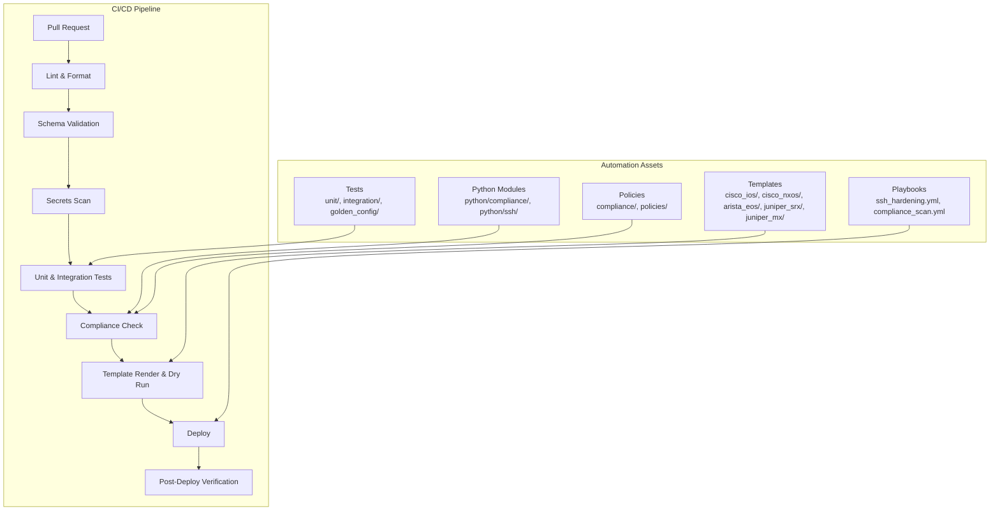
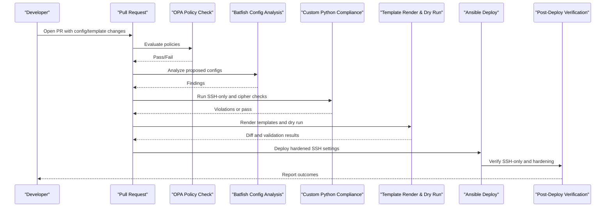
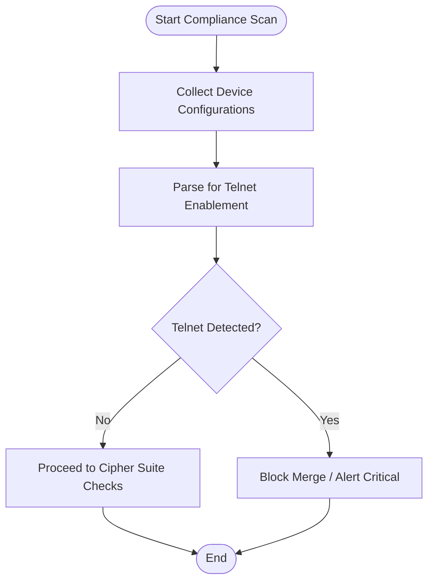
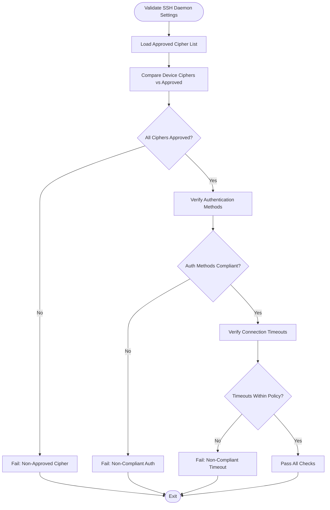
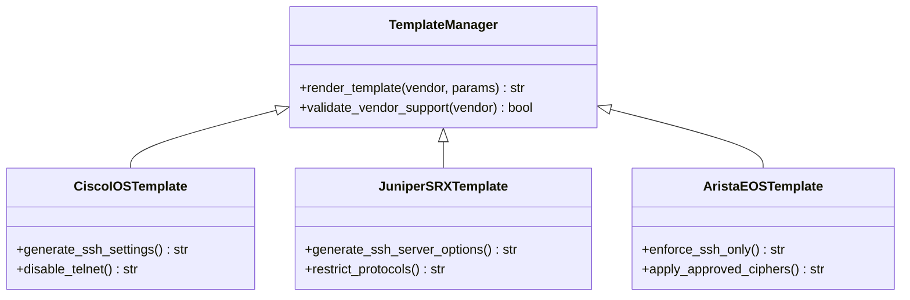
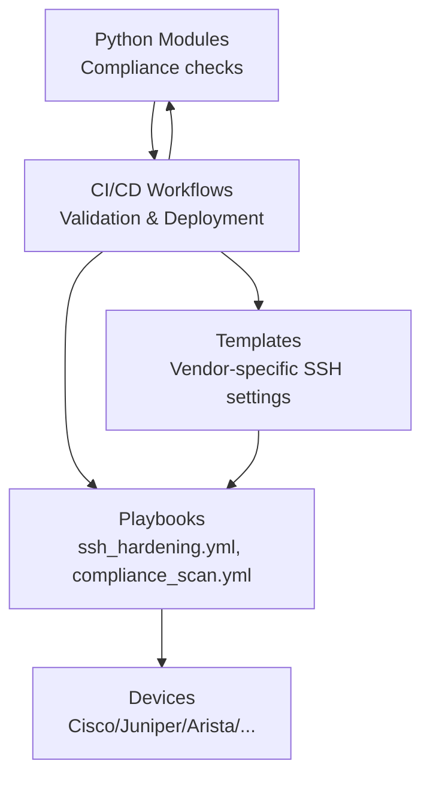

# SSH-Only Policy Enforcement

<cite>
**Referenced Files in This Document**
- [README.md](file://README.md)
</cite>

## Table of Contents
1. [Introduction](#introduction)
2. [Project Structure](#project-structure)
3. [Core Components](#core-components)
4. [Architecture Overview](#architecture-overview)
5. [Detailed Component Analysis](#detailed-component-analysis)
6. [Dependency Analysis](#dependency-analysis)
7. [Performance Considerations](#performance-considerations)
8. [Troubleshooting Guide](#troubleshooting-guide)
9. [Conclusion](#conclusion)
10. [Appendices](#appendices)

## Introduction
This document explains how the platform enforces an SSH-only policy across supported network devices. It covers detection and blocking of Telnet enablement, enforcement of SSH hardening standards, validation of SSH daemon settings, and secure remote access protocols. The guidance includes vendor-specific considerations for Cisco IOS, Juniper, Arista, and other platforms referenced by the repository.

The compliance framework integrates into CI/CD and runtime operations to ensure that only approved SSH configurations are deployed and maintained.

## Project Structure
The repository organizes automation assets (playbooks, roles, templates, Python modules, tests, and compliance policies) under well-defined directories. Key areas relevant to SSH-only enforcement include:
- Playbooks for SSH hardening and compliance scanning
- Templates per vendor for generating device configurations
- Python modules for SSH connectivity and compliance checks
- Tests and golden configuration baselines
- Compliance policies and OPA/Sentinel rules

**Diagram sources**
- [README.md:103-180](file://README.md#L103-L180)
- [README.md:371-435](file://README.md#L371-L435)
- [README.md:479-514](file://README.md#L479-L514)

**Section sources**
- [README.md:103-180](file://README.md#L103-L180)
- [README.md:371-435](file://README.md#L371-L435)
- [README.md:479-514](file://README.md#L479-L514)

## Core Components
- SSH Hardening Playbook: A dedicated playbook applies SSH hardening configurations across devices.
- Compliance Scanning: Automated scans enforce the “SSH Only” policy and validate cipher suites, authentication methods, and timeouts.
- Vendor Templates: Jinja2 templates generate platform-specific SSH daemon settings and disable insecure services like Telnet.
- Python Compliance Engine: Pluggable checks validate running configurations against approved policies.
- Golden Config Baseline: Ensures drift from approved SSH settings is detected and remediated.

Key references:
- Playbook for SSH hardening
- Playbook for compliance scanning
- Repository layout indicating templates and Python modules
- Supported vendors and platforms

**Section sources**
- [README.md:371-435](file://README.md#L371-L435)
- [README.md:103-180](file://README.md#L103-L180)
- [README.md:203-226](file://README.md#L203-L226)

## Architecture Overview
The SSH-only policy enforcement spans multiple layers:
- Pull Request Gate: OPA policy checks and Batfish analysis prevent non-compliant changes.
- Custom Compliance Checks: Python-based validations enforce SSH-only and cipher suite policies.
- Template Rendering: Jinja2 templates produce vendor-specific SSH configurations.
- Deployment and Verification: Ansible applies hardened SSH settings; post-deploy verification ensures compliance.

**Diagram sources**
- [README.md:548-582](file://README.md#L548-L582)
- [README.md:479-514](file://README.md#L479-L514)
- [README.md:371-435](file://README.md#L371-L435)

## Detailed Component Analysis

### SSH-Only Detection and Blocking
- Policy Definition: The “SSH Only” policy forbids Telnet configuration on all devices and is marked Critical severity.
- Detection Mechanisms:
  - OPA policy checks evaluate proposed changes to block Telnet enablement.
  - Batfish analyzes configurations to detect insecure management protocols.
  - Custom Python compliance checks scan device configurations for Telnet enablement patterns.
- Enforcement:
  - CI/CD blocks merges when violations are found.
  - Runtime scans continuously verify compliance and alert on drift.

**Diagram sources**
- [README.md:548-582](file://README.md#L548-L582)

**Section sources**
- [README.md:548-582](file://README.md#L548-L582)

### SSH Hardening Standards and Daemon Settings
- Approved Ciphers: Only approved cipher suites are allowed for SSH/TLS connections.
- Authentication Methods: Strong authentication mechanisms must be enforced (e.g., key-based over password).
- Connection Timeouts: Secure timeout values must be configured to mitigate idle session risks.
- Validation Logic:
  - Python compliance engine validates SSH daemon settings against approved lists.
  - Golden configuration baseline ensures consistent hardening across devices.

**Diagram sources**
- [README.md:548-582](file://README.md#L548-L582)

**Section sources**
- [README.md:548-582](file://README.md#L548-L582)

### Vendor-Specific Implementations
Supported platforms include Cisco IOS, NX-OS, IOS-XE; Juniper SRX, MX; Arista EOS; Palo Alto PAN-OS; Fortinet FortiOS; Check Point Gaia; F5 BIG-IP; pfSense; OPNsense. Templates under vendor-specific directories generate appropriate SSH daemon settings and disable insecure services.

- Cisco IOS/NX-OS/IOS-XE: Templates configure SSH version, ciphers, and disable Telnet.
- Juniper SRX/MX: Templates set SSH server options and restrict protocols.
- Arista EOS: Templates enforce SSH-only and apply approved cipher suites.
- Other vendors: Similar patterns apply via respective templates.

**Diagram sources**
- [README.md:103-180](file://README.md#L103-L180)
- [README.md:203-226](file://README.md#L203-L226)

**Section sources**
- [README.md:103-180](file://README.md#L103-L180)
- [README.md:203-226](file://README.md#L203-L226)

### Examples: Compliant vs Non-Compliant Configurations
- Compliant:
  - SSH enabled with approved cipher suites and strong authentication.
  - Telnet disabled globally.
  - Connection timeouts within policy limits.
- Non-Compliant:
  - Telnet enabled anywhere in the configuration.
  - Use of deprecated or unapproved ciphers.
  - Weak authentication methods or missing timeouts.

These examples are validated by the compliance engine and blocked during CI/CD if non-compliant.

[No sources needed since this section provides general guidance]

### Severity Levels and Automated Remediation
- Severity: “SSH Only” violations are Critical.
- Automated Remediation:
  - Playbooks apply hardened SSH settings automatically after approval.
  - Golden configuration baseline drives drift remediation.
  - Post-deploy verification confirms successful enforcement.

**Section sources**
- [README.md:548-582](file://README.md#L548-L582)
- [README.md:371-435](file://README.md#L371-L435)

### Exception Handling Processes
- Exceptions can be managed through controlled change requests:
  - Documented justification and risk assessment.
  - Approval workflow integrated into GitOps gates.
  - Temporary overrides tracked and audited.
- Continuous monitoring alerts on any deviation from approved exceptions.

[No sources needed since this section provides general guidance]

## Dependency Analysis
The SSH-only enforcement depends on:
- Playbooks for applying SSH hardening and running compliance scans.
- Templates for generating vendor-specific SSH configurations.
- Python compliance modules for custom checks.
- CI/CD workflows orchestrating validation, deployment, and verification.

**Diagram sources**
- [README.md:371-435](file://README.md#L371-L435)
- [README.md:103-180](file://README.md#L103-L180)
- [README.md:479-514](file://README.md#L479-L514)

**Section sources**
- [README.md:371-435](file://README.md#L371-L435)
- [README.md:103-180](file://README.md#L103-L180)
- [README.md:479-514](file://README.md#L479-L514)

## Performance Considerations
- Parallelize compliance scans across device groups to reduce execution time.
- Cache approved cipher lists and policy definitions to minimize overhead.
- Use incremental diffs in template rendering to limit unnecessary reconfigurations.
- Monitor pipeline performance metrics and optimize bottlenecks in CI/CD stages.

[No sources needed since this section provides general guidance]

## Troubleshooting Guide
Common issues and resolutions related to SSH-only enforcement:
- Compliance check failures: Review compliance policies and device running configuration diffs.
- Template rendering errors: Validate Jinja2 syntax and variables for SSH settings.
- CI pipeline failures: Inspect GitHub Actions logs for actionable error messages.
- Vault authentication failures: Verify OIDC tokens or AppRole credentials for secrets retrieval.

**Section sources**
- [README.md:674-685](file://README.md#L674-L685)

## Conclusion
The platform enforces an SSH-only policy through a comprehensive compliance framework integrated into CI/CD and runtime operations. By combining OPA policies, Batfish analysis, custom Python checks, vendor-specific templates, and automated remediation playbooks, it ensures secure remote access across multi-vendor environments. Continuous monitoring and golden configuration baselines maintain long-term compliance and resilience.

[No sources needed since this section summarizes without analyzing specific files]

## Appendices
- Quick Start Commands for Compliance Scans and SSH Hardening
- Inventory Design and Secrets Architecture References
- Supported Vendors and Platforms

**Section sources**
- [README.md:229-281](file://README.md#L229-L281)
- [README.md:284-336](file://README.md#L284-L336)
- [README.md:339-368](file://README.md#L339-L368)
- [README.md:203-226](file://README.md#L203-L226)