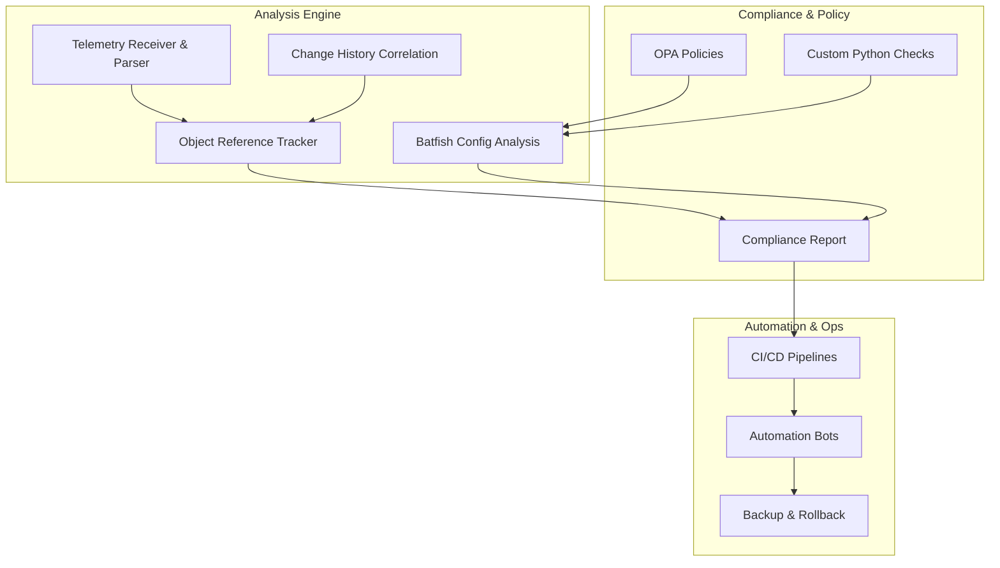
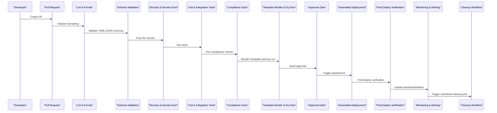
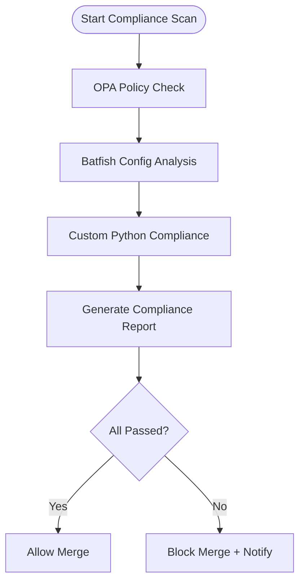
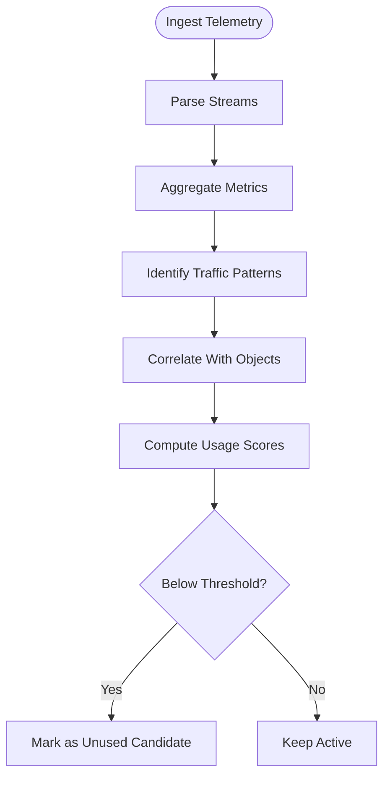
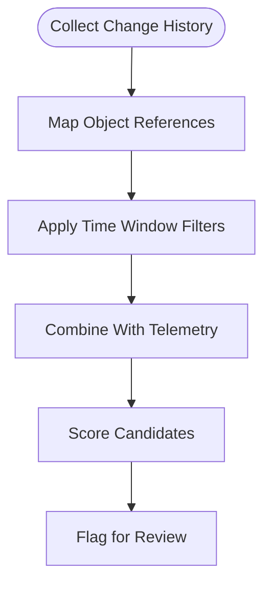
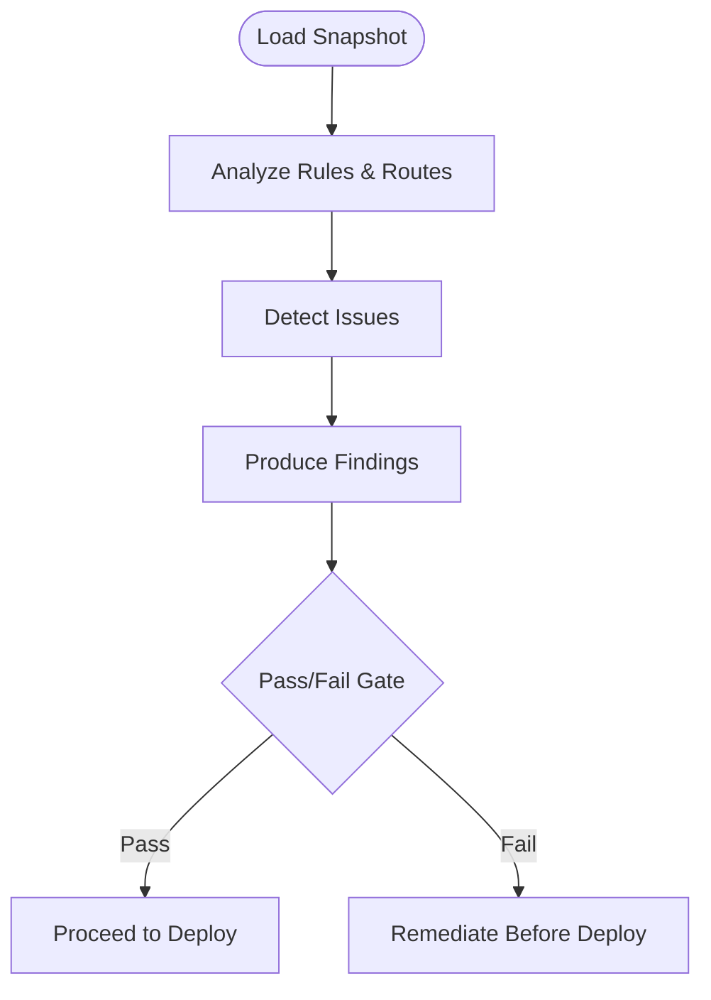
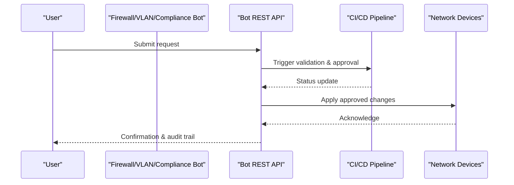
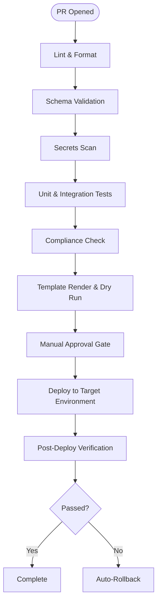
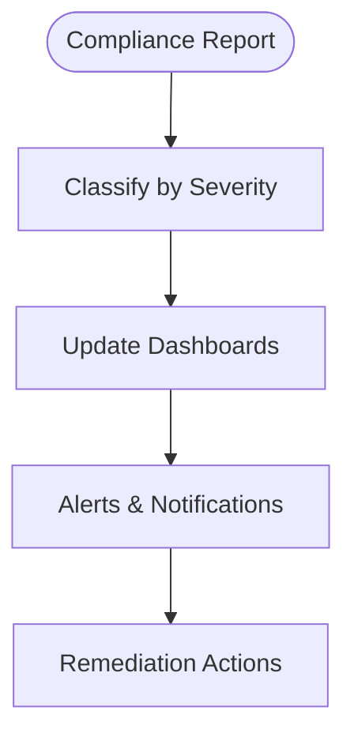
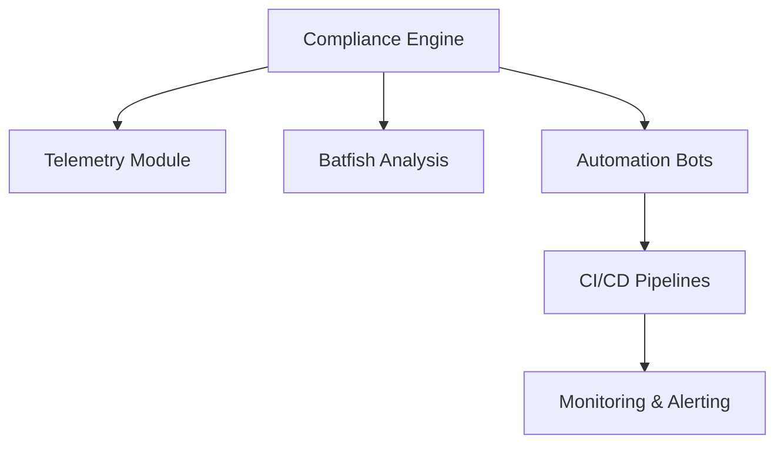

# Unused Object Detection

<cite>
**Referenced Files in This Document**
- [README.md](file://README.md)
</cite>

## Table of Contents
1. [Introduction](#introduction)
2. [Project Structure](#project-structure)
3. [Core Components](#core-components)
4. [Architecture Overview](#architecture-overview)
5. [Detailed Component Analysis](#detailed-component-analysis)
6. [Dependency Analysis](#dependency-analysis)
7. [Performance Considerations](#performance-considerations)
8. [Troubleshooting Guide](#troubleshooting-guide)
9. [Conclusion](#conclusion)

## Introduction

This document explains how the Enterprise Network Automation Platform identifies and manages unused network objects—such as ACLs, firewall rules, VLANs, routing objects, and other configurations—that consume resources without providing value. It covers the compliance framework’s detection logic, telemetry-driven validation, correlation with change history, reference tracking, severity classification, automated cleanup workflows, safety checks, false positive prevention, backup procedures, and audit reporting.

The platform enforces “Unused Objects” as a Low-severity compliance policy to continuously surface candidates for cleanup while preserving operational stability.

## Project Structure

At a high level, unused object detection spans multiple layers:
- Compliance engine and policy definitions
- Telemetry ingestion and parsing
- Configuration analysis (including Batfish-based simulation)
- Validation and reporting pipelines
- Automated bots and CI/CD integration for remediation

[No sources needed since this diagram shows conceptual workflow, not actual code structure]

## Core Components

- Compliance policy for unused objects:
  - Detects and flags unused ACLs, firewall rules, and other objects with Low severity.
- Telemetry receiver and parser:
  - Ingests model-driven telemetry to analyze traffic patterns and validate usage.
- Pre-deployment config validation:
  - Validates syntax and semantics before deployment; integrates with simulation tools.
- Network simulation (Batfish):
  - Performs ACL, routing, and firewall rule analysis to detect shadowing, duplicates, and reachability issues.
- Automation bots:
  - Provide APIs and ChatOps integrations for requesting, validating, and deploying changes, including cleanup actions.
- CI/CD pipelines:
  - Enforce linting, schema validation, secrets scanning, compliance checks, dry runs, approvals, and post-deploy verification.

Key references:
- Compliance checks include “Unused Objects” at Low severity.
- Telemetry module provides model-driven telemetry receiver and parser.
- Validation module performs pre-deployment config validation.
- Batfish is used for ACL, routing, and firewall rule analysis.
- Automation bots expose endpoints for firewall rules, VLAN provisioning, and compliance scans.
- CI/CD pipeline includes compliance check and dry run steps.

**Section sources**
- [README.md:552-566](file://README.md#L552-L566)
- [README.md:440-456](file://README.md#L440-L456)
- [README.md:524-529](file://README.md#L524-L529)
- [README.md:460-476](file://README.md#L460-L476)
- [README.md:479-514](file://README.md#L479-L514)

## Architecture Overview

The unused object detection pipeline combines configuration analysis, telemetry insights, and change history to identify candidates for cleanup. Results feed into compliance reports and automated workflows with safety gates.

**Diagram sources**
- [README.md:479-514](file://README.md#L479-L514)

## Detailed Component Analysis

### Compliance Framework and Policy Enforcement

- Policy coverage includes “Unused Objects,” flagged at Low severity.
- The compliance flow integrates OPA policy checks, Batfish configuration analysis, and custom Python checks.
- Reports are generated and gate merges based on pass/fail outcomes.

**Diagram sources**
- [README.md:568-579](file://README.md#L568-L579)

**Section sources**
- [README.md:552-566](file://README.md#L552-L566)
- [README.md:568-579](file://README.md#L568-L579)

### Telemetry-Driven Usage Analysis

- Model-driven telemetry receiver and parser collect runtime metrics from devices.
- Traffic pattern analysis helps determine whether an ACL, firewall rule, or VLAN is actively used.
- Telemetry data complements static configuration analysis to reduce false positives.

[No sources needed since this diagram shows conceptual workflow, not actual code structure]

### Change History Correlation and Reference Tracking

- Change history correlates recent modifications with current object usage.
- Object reference tracking maps dependencies across ACLs, firewall rules, VLANs, and routing objects.
- Combining telemetry and change history improves confidence in identifying truly unused objects.

[No sources needed since this diagram shows conceptual workflow, not actual code structure]

### Simulation-Based Validation (Batfish)

- Batfish analyzes ACLs, routing, and firewall rules to detect shadowing, duplicates, and reachability issues.
- Integrates into CI/CD to ensure proposed changes do not introduce unintended side effects.
- Supports pre-deployment validation and post-deploy verification.

**Diagram sources**
- [README.md:524-529](file://README.md#L524-L529)

**Section sources**
- [README.md:524-529](file://README.md#L524-L529)

### Automation Bots and Self-Service Workflows

- Firewall Bot exposes endpoints to request, validate, and deploy firewall rules.
- VLAN Bot provisions VLANs with approval workflows.
- Compliance Bot runs compliance scans and reports violations.
- These bots integrate with ChatOps channels for streamlined operations.

**Diagram sources**
- [README.md:460-476](file://README.md#L460-L476)

**Section sources**
- [README.md:460-476](file://README.md#L460-L476)

### CI/CD Integration and Safety Gates

- Pipelines enforce linting, schema validation, secrets scanning, unit/integration tests, compliance checks, template rendering, dry runs, and approvals.
- Post-deploy verification ensures correctness and triggers monitoring/alerting.
- Automated rollback is supported on failure.

**Diagram sources**
- [README.md:479-514](file://README.md#L479-L514)

**Section sources**
- [README.md:479-514](file://README.md#L479-L514)

### Severity Levels and Reporting

- Unused objects are classified as Low severity to avoid disruptive actions while surfacing optimization opportunities.
- Compliance reports summarize findings and drive remediation workflows.
- Monitoring dashboards provide visibility into compliance trends and cleanup progress.

**Diagram sources**
- [README.md:552-566](file://README.md#L552-L566)

**Section sources**
- [README.md:552-566](file://README.md#L552-L566)

### Examples of Unused Object Scenarios

- ACL entries with no matching traffic over a defined observation window.
- Firewall rules never matched by flows or shadowed by higher-priority rules.
- VLANs not referenced by any trunk or access port configuration.
- Static routes or route-map entries not utilized by active paths.
- Named objects (addresses, groups) not referenced by active policies.

Detection methodologies:
- Telemetry-based traffic pattern analysis to confirm absence of matches.
- Batfish simulation to detect unreachable or shadowed rules.
- Change history correlation to exclude recently created or temporarily disabled objects.
- Reference tracking to verify lack of downstream dependencies.

Safety considerations:
- Minimum observation windows and thresholds to prevent premature cleanup.
- Exclusions for maintenance windows, scheduled tasks, and known dormant-but-required objects.
- Human-in-the-loop approvals for production changes.

False positive prevention:
- Cross-validate telemetry with configuration analysis and change history.
- Use conservative thresholds and require multi-signal confirmation.
- Maintain allowlists for known exceptions.

Backup procedures:
- Automated backups before cleanup via backup bot and playbook.
- Versioned storage with encryption and retention policies.
- One-click rollback capability using last-known-good configurations.

Audit trails:
- All actions logged with timestamps, actors, and decisions.
- Compliance reports archived and integrated with monitoring/alerting.
- ChatOps notifications for transparency and traceability.

[No sources needed since this section synthesizes concepts from the repository overview]

## Dependency Analysis

The unused object detection system depends on:
- Compliance engine and policy definitions
- Telemetry ingestion and parsing
- Configuration analysis and simulation (Batfish)
- Automation bots and CI/CD pipelines
- Monitoring and alerting systems

[No sources needed since this diagram shows conceptual relationships, not direct code mappings]

## Performance Considerations

- Batch processing for large fleets to minimize overhead.
- Incremental updates leveraging change history to limit scope.
- Efficient aggregation of telemetry metrics to reduce storage and compute costs.
- Conservative thresholds to balance accuracy with performance.

[No sources needed since this section provides general guidance]

## Troubleshooting Guide

Common issues and resolutions:
- Ansible connection timeout: Verify SSH reachability and credentials.
- Template rendering errors: Inspect Jinja2 syntax and variables.
- Compliance check failures: Review policy definitions and device diffs.
- CI pipeline failures: Inspect logs for actionable error messages.
- Vault authentication failures: Confirm OIDC tokens or AppRole credentials.
- Molecule test failures: Ensure container runtime availability.
- Batfish analysis errors: Validate snapshots and input models.

**Section sources**
- [README.md:674-685](file://README.md#L674-L685)

## Conclusion

The platform’s compliance framework integrates telemetry, configuration analysis, and change history to identify unused network objects safely and efficiently. By classifying these findings as Low severity, the system surfaces optimization opportunities without disrupting operations. Automated workflows, safety gates, and robust auditing ensure responsible cleanup and continuous improvement of the network configuration baseline.