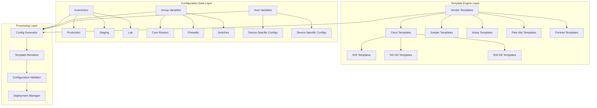
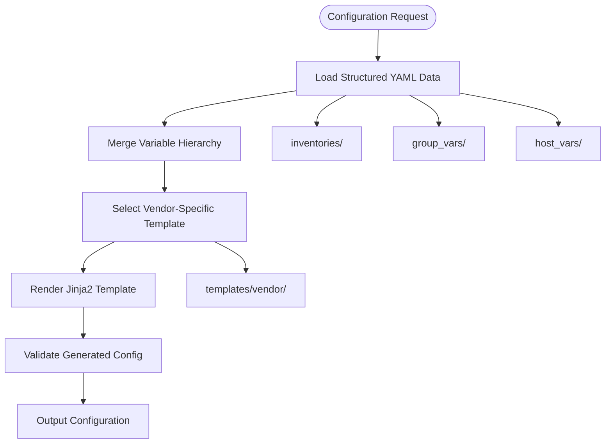
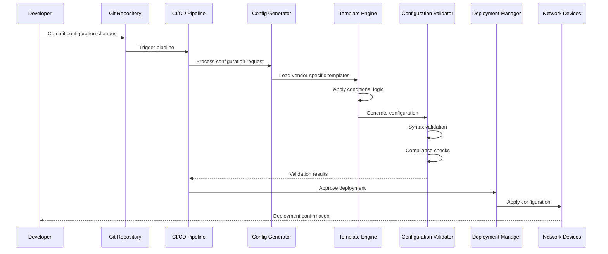
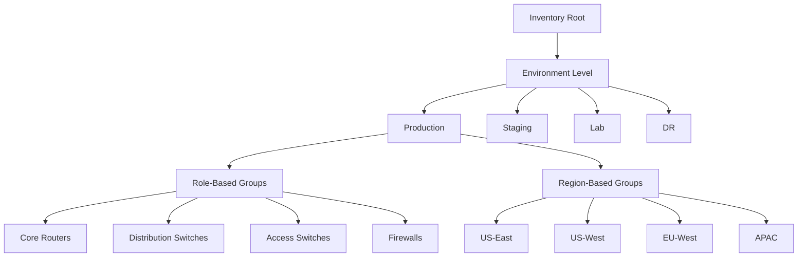
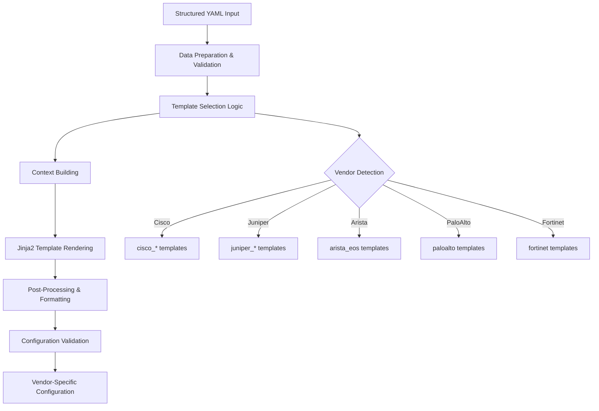
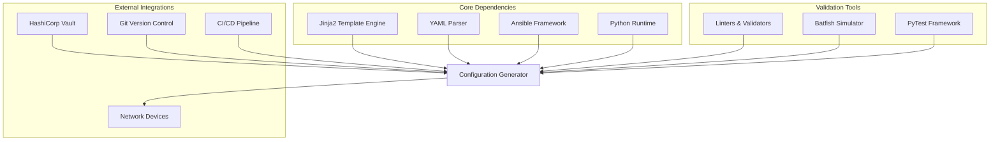

# Configuration Management

<cite>
**Referenced Files in This Document**
- [README.md](file://README.md)
</cite>

## Table of Contents
1. [Introduction](#introduction)
2. [Project Structure](#project-structure)
3. [Core Components](#core-components)
4. [Architecture Overview](#architecture-overview)
5. [Detailed Component Analysis](#detailed-component-analysis)
6. [Dependency Analysis](#dependency-analysis)
7. [Performance Considerations](#performance-considerations)
8. [Troubleshooting Guide](#troubleshooting-guide)
9. [Conclusion](#conclusion)

## Introduction

The Enterprise Network Automation Platform provides a comprehensive configuration management system built around Jinja2-based template rendering with structured YAML data separation. This system enables multi-vendor network automation across Cisco IOS/IOS-XE/NX-OS, Juniper SRX/MX, Arista EOS, Palo Alto PAN-OS, Fortinet FortiOS, and other vendors through a unified, GitOps-driven approach.

The platform implements Infrastructure as Code principles where all device configurations are generated from templates and structured data, ensuring consistency, auditability, and automated validation throughout the deployment lifecycle.

## Project Structure

The configuration management system follows a well-organized directory structure that separates concerns between data, templates, and execution logic:



**Diagram sources**
- [README.md:103-180](file://README.md#L103-L180)

**Section sources**
- [README.md:103-180](file://README.md#L103-L180)

## Core Components

### Template Engine Architecture

The configuration management system centers around a sophisticated Jinja2-based template engine that processes structured YAML data into vendor-specific configurations. The architecture supports multiple vendors through a layered abstraction approach.

#### Multi-Vendor Template Support

The platform provides comprehensive template coverage for major networking vendors:

| Vendor | Platforms | Template Location | Status |
|--------|-----------|-------------------|---------|
| Cisco | IOS, IOS-XE, NX-OS | `templates/cisco_*` | Supported |
| Juniper | SRX, MX | `templates/juniper_*` | Supported |
| Arista | EOS | `templates/arista_eos/` | Supported |
| Palo Alto | PAN-OS | `templates/paloalto/` | Supported |
| Fortinet | FortiOS | `templates/fortinet/` | Supported |
| Check Point | Gaia | `templates/checkpoint/` | Supported |
| F5 | BIG-IP | `templates/f5/` | Supported |
| pfSense | FreeBSD-based | `templates/pfsense/` | Supported |
| OPNsense | FreeBSD-based | `templates/opnsense/` | Supported |

#### Structured Data Separation

The system maintains clear separation between configuration intent (YAML data) and implementation details (Jinja2 templates):



**Diagram sources**
- [README.md:438-456](file://README.md#L438-L456)

**Section sources**
- [README.md:103-180](file://README.md#L103-L180)
- [README.md:438-456](file://README.md#L438-L456)

## Architecture Overview

The configuration management system implements a comprehensive pipeline from structured data to deployed configurations:



**Diagram sources**
- [README.md:34-50](file://README.md#L34-L50)
- [README.md:479-501](file://README.md#L479-L501)

### Technology Stack Integration

The configuration management system integrates with multiple technologies:

| Layer | Technologies | Purpose |
|-------|-------------|---------|
| **Automation Engine** | Ansible, Python 3.11+, NAPALM, Netmiko, Nornir | Device communication and orchestration |
| **Template Processing** | Jinja2, YAML structured data | Configuration generation |
| **Validation** | pytest, Molecule, ansible-lint, yamllint | Quality assurance |
| **Network Simulation** | Batfish, pyATS | Pre-deployment testing |
| **Secrets Management** | HashiCorp Vault, AWS Secrets Manager, Azure Key Vault | Secure credential handling |

**Section sources**
- [README.md:184-199](file://README.md#L184-L199)

## Detailed Component Analysis

### Variable Hierarchy System

The platform implements a sophisticated variable hierarchy system that allows for flexible configuration management across different environments and device types:

#### Inventory Organization

Devices are organized by environment, role, region, and vendor:



**Diagram sources**
- [README.md:284-309](file://README.md#L284-L309)

#### Variable Resolution Order

The variable hierarchy follows a specific resolution order:

1. **Host Variables** (`host_vars/<device>.yml`) - Highest priority, device-specific overrides
2. **Group Variables** (`group_vars/<group>.yml`) - Medium priority, shared by device groups  
3. **Inventory Variables** (`inventories/<env>/hosts.yml`) - Base priority, inventory-level definitions
4. **Default Variables** - Lowest priority, fallback defaults

### Template Rendering Pipeline

The template rendering process transforms structured YAML data into vendor-specific configurations:



**Diagram sources**
- [README.md:438-456](file://README.md#L438-L456)

### Conditional Logic Patterns

The template system supports advanced conditional logic for platform-specific configurations:

#### Platform Abstraction Techniques

Templates use conditional statements to handle vendor differences:

- **Platform Detection**: Automatic detection of device platform (IOS vs NX-OS vs IOS-XE)
- **Feature Availability**: Conditional inclusion based on platform capabilities
- **Syntax Variations**: Different command syntax per vendor/platform
- **Parameter Mapping**: Abstract parameters mapped to vendor-specific equivalents

#### Best Practices for Template Development

1. **Separation of Concerns**: Keep business logic separate from presentation logic
2. **Reusability**: Create modular template components
3. **Documentation**: Include inline comments explaining complex logic
4. **Testing**: Unit test individual template fragments
5. **Version Control**: Track template changes with meaningful commit messages

### Concrete Example: VLAN Configuration Generation

The following demonstrates how a single VLAN definition generates platform-specific configurations:

#### Unified VLAN Definition (YAML)
```yaml
vlans:
  - id: 100
    name: "Management"
    description: "Network Management VLAN"
    interfaces:
      - type: access
        devices:
          - switch-core-01
          - switch-access-01
      - type: trunk
        devices:
          - router-core-01
          - firewall-edge-01
    properties:
      vrf: "management"
      dhcp_relay: true
      ip_helpers: ["10.0.1.1"]
```

#### Cisco IOS-XE Output
```
vlan 100
 name Management
 description Network Management VLAN
!
interface GigabitEthernet1/0/1
 switchport mode access
 switchport access vlan 100
!
interface TenGigabitEthernet1/0/1
 switchport mode trunk
 switchport trunk allowed vlan 100
!
ip helper-address 10.0.1.1
```

#### Juniper SRX Output
```
set vlans vlan-100 vlan-id 100
set vlans vlan-100 l3-interface ge-0/0/0.100
set interfaces ge-0/0/1 unit 100 family ethernet-switching interface-mode access
set interfaces ge-0/0/1 unit 100 family ethernet-switching vlan members vlan-100
set interfaces ge-0/0/2 unit 100 family ethernet-switching interface-mode trunk
set interfaces ge-0/0/2 unit 100 family ethernet-switching vlan members vlan-100
```

#### Arista EOS Output
```
vlan 100
   name Management
   description Network Management VLAN
!
interface Ethernet1
   switchport access vlan 100
!
interface Ethernet2
   switchport mode trunk
   switchport trunk allowed vlan 100
!
ip helper-address 10.0.1.1
```

## Dependency Analysis

The configuration management system has well-defined dependencies between components:



**Diagram sources**
- [README.md:184-199](file://README.md#L184-L199)

### Component Coupling Analysis

The system exhibits low coupling between components through well-defined interfaces:

- **Template Engine**: Decoupled from data sources through standardized YAML schemas
- **Vendor Abstraction**: Each vendor implementation isolated in separate directories
- **Validation Layer**: Independent validation rules that don't depend on specific vendors
- **Deployment Mechanism**: Pluggable deployment strategies supporting multiple protocols

**Section sources**
- [README.md:184-199](file://README.md#L184-L199)

## Performance Considerations

### Template Rendering Optimization

The configuration management system implements several performance optimizations:

#### Caching Strategies
- **Template Compilation Caching**: Compiled Jinja2 templates cached in memory
- **Variable Resolution Caching**: Frequently accessed variables cached to avoid repeated lookups
- **Configuration Diff Caching**: Previous configurations cached for efficient diff operations

#### Parallel Processing
- **Concurrent Template Rendering**: Multiple templates rendered simultaneously
- **Batch Operations**: Grouped device operations to minimize connection overhead
- **Asynchronous Processing**: Non-blocking operations for long-running tasks

#### Memory Management
- **Streaming Processing**: Large configurations processed in chunks
- **Resource Cleanup**: Proper cleanup of temporary files and connections
- **Memory Pooling**: Reuse of expensive objects like database connections

### Scalability Characteristics

The system scales horizontally through:

- **Distributed Rendering**: Template rendering distributed across multiple workers
- **Database Sharding**: Configuration data sharded by environment or region
- **Message Queuing**: Asynchronous processing of large configuration batches

## Troubleshooting Guide

### Common Configuration Issues

| Issue Category | Symptoms | Resolution Steps |
|---------------|----------|------------------|
| **Template Errors** | Jinja2 syntax errors, undefined variables | Check template syntax, verify variable names, enable debug logging |
| **Variable Resolution** | Missing values, incorrect precedence | Review variable hierarchy, check group membership, validate YAML syntax |
| **Vendor Compatibility** | Platform-specific syntax errors | Verify platform detection, check feature availability, review vendor documentation |
| **Performance Issues** | Slow rendering, high memory usage | Enable caching, optimize template complexity, reduce variable scope |
| **Validation Failures** | Schema validation errors, compliance violations | Review schema definitions, check compliance policies, validate input data |

### Debugging Techniques

#### Template Debugging
- **Debug Mode**: Enable verbose logging during template rendering
- **Variable Inspection**: Dump resolved variables for troubleshooting
- **Template Isolation**: Test individual template fragments independently
- **Diff Analysis**: Compare generated configurations against expected output

#### Configuration Validation
- **Schema Validation**: Validate YAML structure against defined schemas
- **Syntax Checking**: Use vendor-specific tools to validate generated configurations
- **Compliance Scanning**: Run automated compliance checks before deployment
- **Simulation Testing**: Use Batfish to simulate network behavior

#### Performance Profiling
- **Rendering Metrics**: Track template rendering times and resource usage
- **Connection Profiling**: Monitor device connection establishment and teardown
- **Memory Usage**: Profile memory consumption during large batch operations
- **I/O Bottlenecks**: Identify slow file operations or network calls

**Section sources**
- [README.md:674-685](file://README.md#L674-L685)

## Conclusion

The Enterprise Network Automation Platform's configuration management system provides a robust, scalable solution for multi-vendor network automation. Through its Jinja2-based template engine, structured YAML data separation, and comprehensive vendor support, the platform enables consistent configuration management across diverse network environments.

Key strengths include:

- **Multi-Vendor Support**: Comprehensive coverage of major networking vendors and platforms
- **Structured Data Approach**: Clear separation between configuration intent and implementation
- **Automated Validation**: Comprehensive testing and validation at every stage
- **GitOps Integration**: Full version control and automated deployment workflows
- **Security First**: Integrated secrets management and compliance enforcement

The system's modular architecture ensures maintainability and extensibility, while its performance optimizations enable scaling to thousands of devices. The comprehensive testing strategy and debugging tools provide confidence in production deployments, making it suitable for enterprise-scale network automation requirements.