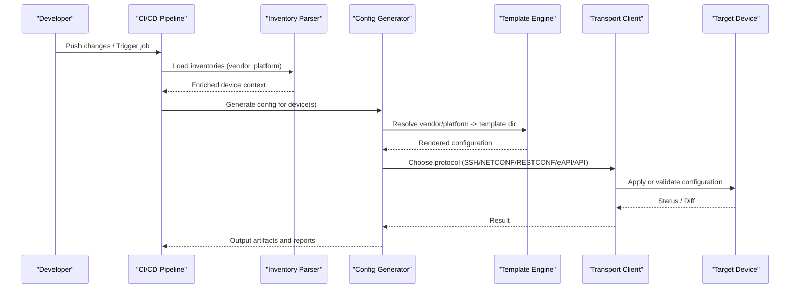
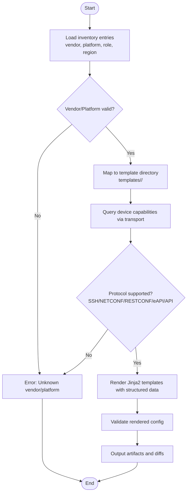
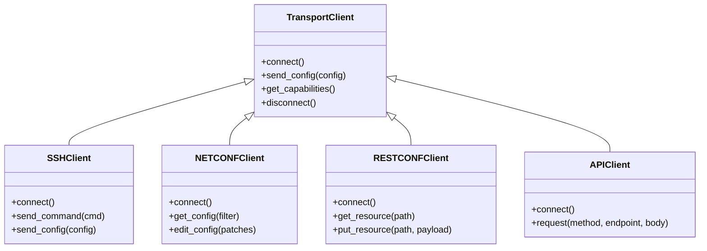
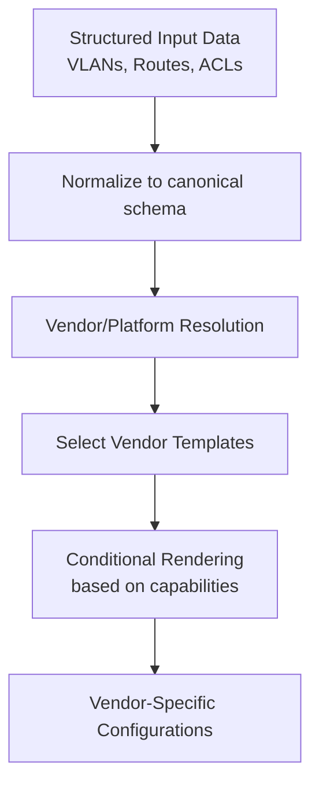
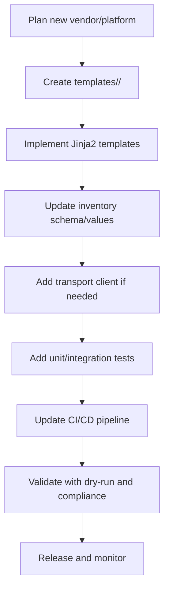
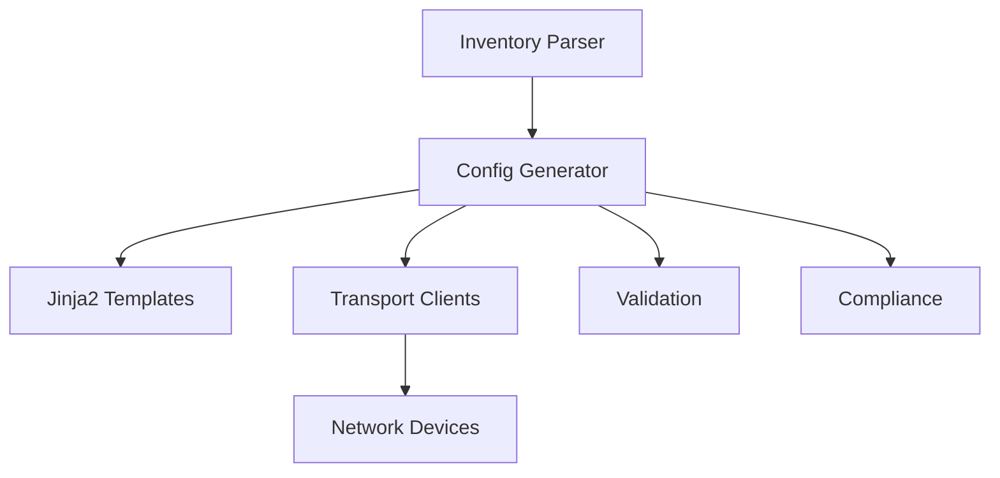

# Multi-Vendor Support Implementation

<cite>
**Referenced Files in This Document**
- [README.md](file://README.md)
</cite>

## Table of Contents
1. [Introduction](#introduction)
2. [Project Structure](#project-structure)
3. [Core Components](#core-components)
4. [Architecture Overview](#architecture-overview)
5. [Detailed Component Analysis](#detailed-component-analysis)
6. [Dependency Analysis](#dependency-analysis)
7. [Performance Considerations](#performance-considerations)
8. [Troubleshooting Guide](#troubleshooting-guide)
9. [Conclusion](#conclusion)
10. [Appendices](#appendices)

## Introduction

This document explains how the Enterprise Network Automation Platform implements multi-vendor support across Cisco IOS/IOS-XE/NX-OS, Juniper SRX/MX, Arista EOS, Palo Alto PAN-OS, Fortinet FortiOS, Check Point Gaia, F5 BIG-IP, pfSense, and OPNsense platforms. It covers the vendor abstraction layer, inventory-driven detection, template mapping, protocol support matrix, configuration patterns, and onboarding procedures for new platforms.

## Project Structure

The platform organizes vendor-specific logic through a combination of structured inventories, Jinja2 templates per vendor/platform, and Python automation modules. The repository layout includes dedicated directories for each vendor’s templates and modular Python components for transport protocols and configuration generation.

```mermaid
graph TB
subgraph "Templates"
T_Cisco_IOS["templates/cisco_ios"]
T_Cisco_IOSXE["templates/cisco_iosxe"]
T_Cisco_NXOS["templates/cisco_nxos"]
T_Juniper_SRX["templates/juniper_srx"]
T_Juniper_MX["templates/juniper_mx"]
T_Arista_EOS["templates/arista_eos"]
T_PaloAlto["templates/paloalto"]
T_Fortinet["templates/fortinet"]
T_CheckPoint["templates/checkpoint"]
T_F5["templates/f5"]
T_pfSense["templates/pfsense"]
T_OPNSense["templates/opnsense"]
end
subgraph "Python Modules"
P_Inventory["python/inventory"]
P_ConfigGen["python/config_gen"]
P_SSH["python/ssh"]
P_NETCONF["python/netconf"]
P_RESTCONF["python/restconf"]
P_Telemetry["python/telemetry"]
P_Validation["python/validation"]
P_Utils["python/utils"]
end
subgraph "Inventories"
INV_Lab["inventories/lab"]
INV_Staging["inventories/staging"]
INV_Prod["inventories/production"]
INV_DR["inventories/dr"]
end
INV_Lab --> P_Inventory
INV_Staging --> P_Inventory
INV_Prod --> P_Inventory
INV_DR --> P_Inventory
P_Inventory --> P_ConfigGen
P_ConfigGen --> T_Cisco_IOS
P_ConfigGen --> T_Cisco_IOSXE
P_ConfigGen --> T_Cisco_NXOS
P_ConfigGen --> T_Juniper_SRX
P_ConfigGen --> T_Juniper_MX
P_ConfigGen --> T_Arista_EOS
P_ConfigGen --> T_PaloAlto
P_ConfigGen --> T_Fortinet
P_ConfigGen --> T_CheckPoint
P_ConfigGen --> T_F5
P_ConfigGen --> T_pfSense
P_ConfigGen --> T_OPNSense
P_ConfigGen --> P_SSH
P_ConfigGen --> P_NETCONF
P_ConfigGen --> P_RESTCONF
P_ConfigGen --> P_Telemetry
P_ConfigGen --> P_Validation
P_ConfigGen --> P_Utils
```

**Diagram sources**
- [README.md:103-180](file://README.md#L103-L180)
- [README.md:438-456](file://README.md#L438-L456)

**Section sources**
- [README.md:103-180](file://README.md#L103-L180)
- [README.md:438-456](file://README.md#L438-L456)

## Core Components

- Inventory-driven device classification: Each device entry defines vendor and platform fields used to select the appropriate template directory and transport protocol.
- Template engine: Jinja2-based configuration generation from structured data with per-vendor template directories.
- Transport abstractions: SSH, NETCONF, RESTCONF, eAPI, and API-based management clients encapsulated under python modules.
- Validation and compliance: Pre-deployment validation and policy checks integrated into CI/CD.

Key responsibilities:
- Vendor detection and template resolution
- Protocol negotiation and capability discovery
- Configuration rendering and diffing
- Compliance enforcement and rollback safeguards

**Section sources**
- [README.md:284-335](file://README.md#L284-L335)
- [README.md:438-456](file://README.md#L438-L456)

## Architecture Overview

The multi-vendor architecture separates concerns between inventory metadata, template rendering, and transport protocols. The config generator resolves the target vendor/platform from inventory variables and selects the corresponding template set. Transport clients abstract differences in connectivity and capabilities.

**Diagram sources**
- [README.md:103-180](file://README.md#L103-L180)
- [README.md:438-456](file://README.md#L438-L456)
- [README.md:479-516](file://README.md#L479-L516)

## Detailed Component Analysis

### Vendor Abstraction Layer

The abstraction layer centers on two inputs:
- Inventory variables: vendor and platform fields define the target device family and OS variant.
- Template directories: A one-to-one mapping from vendor/platform to a Jinja2 template folder.

Resolution flow:
- Read device inventory entries (environment, role, region, vendor, platform).
- Map vendor/platform to a template directory path under templates/.
- Select transport protocol based on device capabilities and inventory hints.
- Render vendor-specific configuration using shared input structures.

**Diagram sources**
- [README.md:284-335](file://README.md#L284-L335)
- [README.md:103-180](file://README.md#L103-L180)
- [README.md:438-456](file://README.md#L438-L456)

**Section sources**
- [README.md:284-335](file://README.md#L284-L335)
- [README.md:103-180](file://README.md#L103-L180)
- [README.md:438-456](file://README.md#L438-L456)

### Protocol Support Matrix

Supported protocols by vendor/platform:
- Cisco: IOS, IOS-XE, NX-OS — SSH, NETCONF, RESTCONF
- Juniper: SRX, MX — SSH, NETCONF
- Arista: EOS — SSH, eAPI, NETCONF
- Palo Alto: PAN-OS — SSH, API
- Fortinet: FortiOS — SSH, API
- Check Point: Gaia — SSH, API
- F5: BIG-IP — SSH, iControl REST
- pfSense: FreeBSD-based — SSH, API
- OPNsense: FreeBSD-based — SSH, API

Transport selection is driven by device capabilities and inventory configuration.

**Diagram sources**
- [README.md:438-456](file://README.md#L438-L456)

**Section sources**
- [README.md:203-218](file://README.md#L203-L218)
- [README.md:438-456](file://README.md#L438-L456)

### Configuration Patterns and Syntax Differences

Common services implemented consistently via structured data but rendered differently per vendor:
- VLANs: Defined once in structured data; rendered into vendor-specific VLAN and interface configurations.
- Routing protocols: OSPF/BGP/IS-IS configured via unified inputs; template logic adapts syntax and feature flags.
- ACLs: Rule sets defined centrally; translated into vendor-specific access-list or firewall rule formats.

Feature availability varies by platform and OS version; capability negotiation informs conditional rendering.

[No sources needed since this diagram shows conceptual workflow, not actual code structure]

**Section sources**
- [README.md:388-416](file://README.md#L388-L416)
- [README.md:103-180](file://README.md#L103-L180)

### Practical Examples Across Vendors

Examples of common services:
- VLAN provisioning: Unified VLAN definitions render into Cisco SVI/VLAN commands, Juniper VLAN interfaces, Arista VLANs, Palo Alto zones/interfaces, Fortinet VLANs, Check Point objects, F5 VLANs, pfSense/OPNsense VLANs.
- Routing protocols: OSPF areas, BGP peers, IS-IS levels mapped to vendor command sets and address families.
- ACLs: Centralized ruleset translated into vendor-specific ACLs or firewall policies.

These examples rely on consistent input structures and template-driven output.

**Section sources**
- [README.md:388-416](file://README.md#L388-L416)
- [README.md:103-180](file://README.md#L103-L180)

### Vendor Onboarding Procedures

To add a new platform:
- Create a new template directory under templates/ named after the vendor/platform.
- Implement Jinja2 templates for required services (VLANs, routing, ACLs, etc.).
- Ensure inventory supports the new vendor/platform values.
- Add transport client support if needed (SSH/NETCONF/RESTCONF/eAPI/API).
- Update CI/CD pipeline to include template rendering validation for the new vendor.
- Add unit/integration tests and golden config baselines.

[No sources needed since this diagram shows conceptual workflow, not actual code structure]

**Section sources**
- [README.md:103-180](file://README.md#L103-L180)
- [README.md:479-516](file://README.md#L479-L516)

## Dependency Analysis

The system exhibits clear separation between inventory parsing, configuration generation, and transport layers. Dependencies are primarily unidirectional:
- Inventory depends on no runtime modules.
- Config generator depends on inventory, templates, and transport clients.
- Transport clients depend on underlying libraries (Netmiko/Paramiko, NETCONF/RESTCONF stacks).
- Validation and compliance depend on generated configs and policy engines.

**Diagram sources**
- [README.md:103-180](file://README.md#L103-L180)
- [README.md:438-456](file://README.md#L438-L456)

**Section sources**
- [README.md:103-180](file://README.md#L103-L180)
- [README.md:438-456](file://README.md#L438-L456)

## Performance Considerations

- Parallel execution: Use concurrency for bulk operations across devices.
- Capability caching: Cache device capabilities to avoid repeated queries.
- Template optimization: Minimize loops and conditionals in templates; precompute derived values.
- Transport efficiency: Prefer NETCONF/RESTCONF where available for atomic updates and diffs.
- Validation batching: Batch validation and compliance checks to reduce overhead.

[No sources needed since this section provides general guidance]

## Troubleshooting Guide

Common issues and resolutions:
- Ansible connection timeout: Verify SSH reachability and credentials.
- Template rendering error: Inspect Jinja2 syntax and variable mappings.
- Compliance check failure: Review policy violations and running config diffs.
- CI pipeline failure: Examine GitHub Actions logs for actionable errors.
- Vault authentication failure: Confirm OIDC token or AppRole credentials and policies.
- Molecule test failure: Ensure Docker/Podman is running and molecule.yml is correct.
- Batfish analysis error: Validate snapshots and model coverage.

**Section sources**
- [README.md:674-685](file://README.md#L674-L685)

## Conclusion

The platform achieves vendor-agnostic configuration management through a robust abstraction layer combining inventory-driven detection, Jinja2 templates per vendor/platform, and transport protocol clients. Consistent input structures enable unified service definitions while preserving vendor-specific syntax and feature nuances. The CI/CD pipeline enforces quality and compliance at every stage, ensuring safe deployments across diverse environments.

[No sources needed since this section summarizes without analyzing specific files]

## Appendices

### Supported Vendors and Protocols Summary

- Cisco: IOS, IOS-XE, NX-OS — SSH, NETCONF, RESTCONF
- Juniper: SRX, MX — SSH, NETCONF
- Arista: EOS — SSH, eAPI, NETCONF
- Palo Alto: PAN-OS — SSH, API
- Fortinet: FortiOS — SSH, API
- Check Point: Gaia — SSH, API
- F5: BIG-IP — SSH, iControl REST
- pfSense: FreeBSD-based — SSH, API
- OPNsense: FreeBSD-based — SSH, API

**Section sources**
- [README.md:203-218](file://README.md#L203-L218)