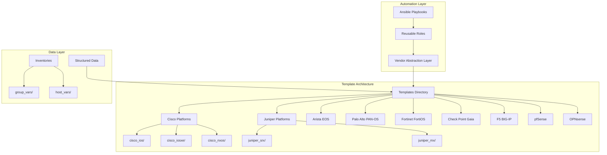
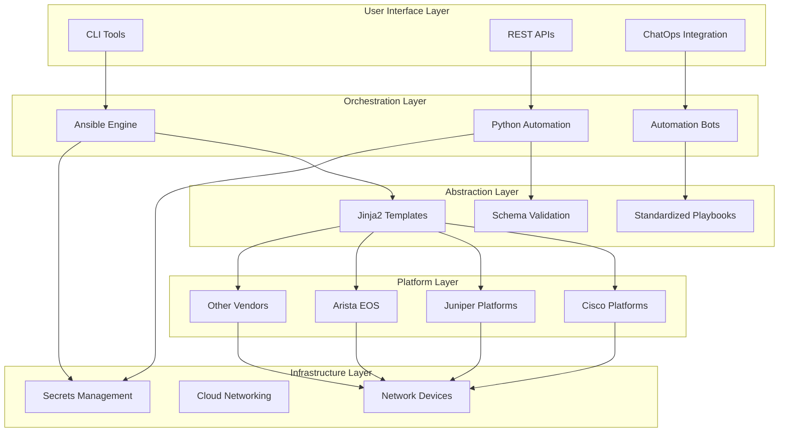
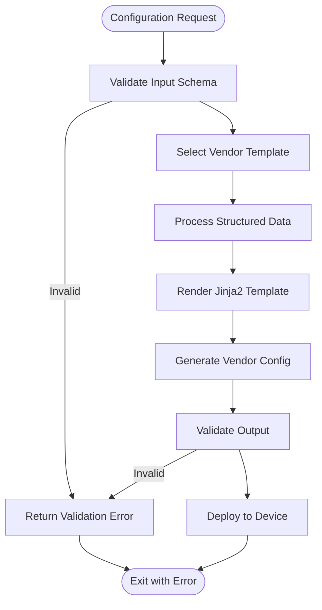
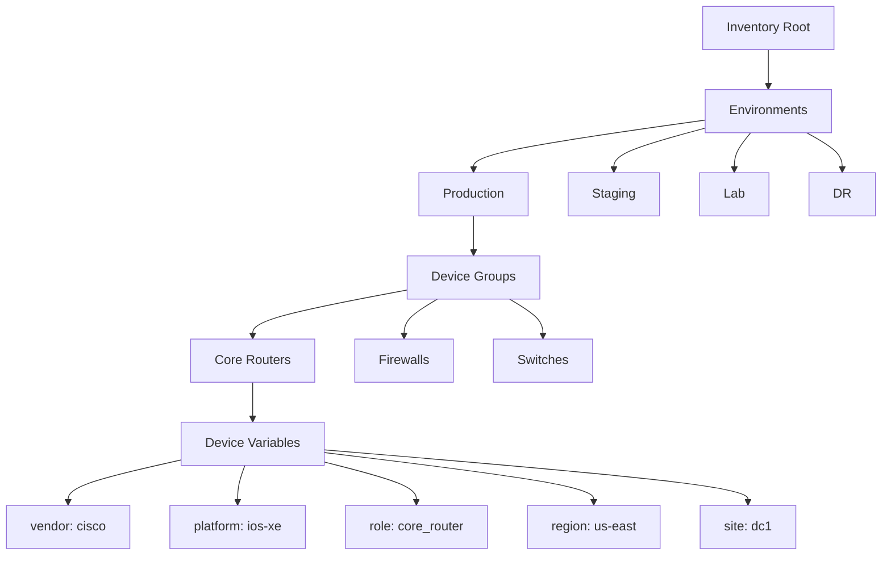
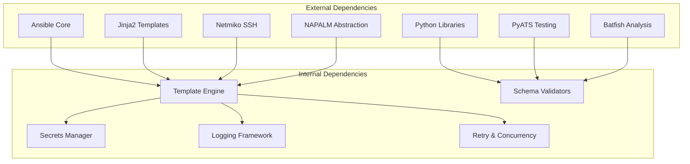
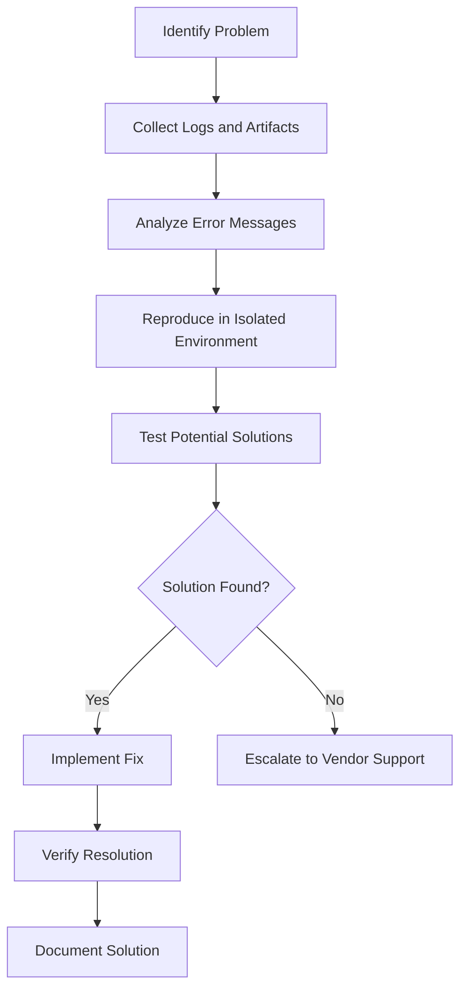
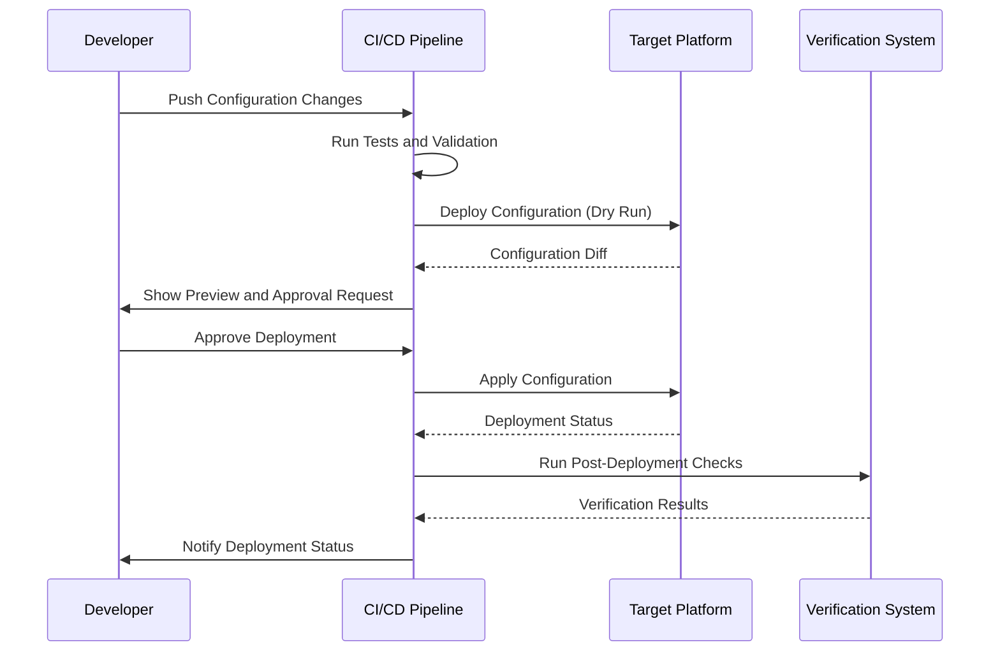

# Platform-Specific Implementations

<cite>
**Referenced Files in This Document**
- [README.md](file://README.md)
</cite>

## Table of Contents
1. [Introduction](#introduction)
2. [Project Structure](#project-structure)
3. [Core Components](#core-components)
4. [Architecture Overview](#architecture-overview)
5. [Detailed Component Analysis](#detailed-component-analysis)
6. [Dependency Analysis](#dependency-analysis)
7. [Performance Considerations](#performance-considerations)
8. [Troubleshooting Guide](#troubleshooting-guide)
9. [Conclusion](#conclusion)
10. [Appendices](#appendices)

## Introduction

This document provides comprehensive platform-specific implementation documentation for enterprise network automation across multiple vendor platforms including Cisco IOS/IOS-XE/NX-OS, Juniper SRX/MX, Arista EOS, Palo Alto PAN-OS, Fortinet FortiOS, Check Point Gaia, F5 BIG-IP, pfSense, and OPNsense. The platform follows Infrastructure as Code principles with GitOps workflows, automated compliance enforcement, and multi-vendor abstraction layers.

The system supports vendor-agnostic configuration management through Jinja2 templates, structured YAML data, and consistent API interfaces while accommodating platform-specific command syntax variations and feature availability differences.

## Project Structure

The platform implements a modular architecture with vendor-specific template directories and standardized playbooks:

**Diagram sources**
- [README.md:103-180](file://README.md#L103-L180)

**Section sources**
- [README.md:103-180](file://README.md#L103-L180)

## Core Components

### Template System Architecture

The platform uses Jinja2 templates organized by vendor and platform type, providing consistent input data structures while generating vendor-specific configuration syntax:

| Component | Purpose | Technology |
|-----------|---------|------------|
| **Jinja2 Templates** | Configuration generation per vendor/platform | Jinja2 templating engine |
| **Structured Data** | Vendor-agnostic configuration definitions | YAML/JSON schemas |
| **Ansible Playbooks** | Orchestration and deployment automation | Ansible framework |
| **Python Modules** | Advanced automation logic and API integration | Python 3.11+ |
| **Schema Validation** | Input data validation and compliance checking | JSON Schema/Cerberus |

### Supported Platform Matrix

| Vendor | Platform | Protocols | Status |
|--------|----------|-----------|--------|
| Cisco | IOS, IOS-XE, NX-OS | SSH, NETCONF, RESTCONF | Supported |
| Juniper | SRX, MX | SSH, NETCONF | Supported |
| Arista | EOS | SSH, eAPI, NETCONF | Supported |
| Palo Alto | PAN-OS | SSH, API | Supported |
| Fortinet | FortiOS | SSH, API | Supported |
| Check Point | Gaia | SSH, API | Supported |
| F5 | BIG-IP | SSH, iControl REST | Supported |
| pfSense | FreeBSD-based | SSH, API | Supported |
| OPNsense | FreeBSD-based | SSH, API | Supported |

**Section sources**
- [README.md:203-217](file://README.md#L203-L217)

## Architecture Overview

The platform implements a layered architecture with vendor abstraction at its core:

**Diagram sources**
- [README.md:34-99](file://README.md#L34-L99)

## Detailed Component Analysis

### Template Structure and Organization

Each vendor platform has dedicated template directories following consistent naming conventions:

**Diagram sources**
- [README.md:438-456](file://README.md#L438-L456)

### Inventory Design and Variable Management

The platform organizes devices by environment, role, region, and vendor with hierarchical variable inheritance:

**Diagram sources**
- [README.md:284-335](file://README.md#L284-L335)

### Playbook Architecture

Standardized playbooks provide consistent operations across all platforms:

| Category | Playbooks | Purpose |
|----------|-----------|---------|
| **Device Lifecycle** | initial_provisioning.yml, hostname.yml, aaa.yml | Bootstrap and baseline configuration |
| **Network Services** | vlan.yml, acl.yml, nat.yml, vpn.yml | Core networking features |
| **Routing Protocols** | ospf.yml, bgp.yml, isis.yml, static_routes.yml | Dynamic routing configuration |
| **High Availability** | vrrp.yml, hsrp.yml | Redundancy and failover |
| **Operations** | backup.yml, compliance_scan.yml, health_check.yml | Maintenance and monitoring |

**Section sources**
- [README.md:371-435](file://README.md#L371-L435)

### Python Module Architecture

The platform includes comprehensive Python modules for advanced automation scenarios:

| Module | Functionality | Key Features |
|--------|---------------|--------------|
| **inventory/** | Device discovery and enrichment | CMDB integration, dynamic inventory |
| **netconf/** | NETCONF client operations | Capability negotiation, YANG models |
| **restconf/** | RESTCONF API integration | Model-driven configuration |
| **ssh/** | SSH connection management | Retry logic, session pooling |
| **config_gen/** | Configuration generation | Jinja2 rendering, validation |
| **validation/** | Pre-deployment checks | Syntax and semantic validation |
| **compliance/** | Policy enforcement | Custom rules, OPA integration |

**Section sources**
- [README.md:438-456](file://README.md#L438-L456)

## Dependency Analysis

The platform maintains clear separation of concerns with well-defined dependencies:

**Diagram sources**
- [README.md:184-199](file://README.md#L184-L199)

**Section sources**
- [README.md:184-199](file://README.md#L184-L199)

## Performance Considerations

### Template Rendering Optimization

- **Parallel Processing**: Use concurrent template rendering for large device fleets
- **Template Caching**: Implement Jinja2 template caching to reduce rendering overhead
- **Variable Pre-processing**: Pre-compute complex variables before template rendering
- **Incremental Updates**: Apply only changed configurations using diff analysis

### Connection Management

- **Connection Pooling**: Maintain persistent SSH connections where supported
- **Timeout Tuning**: Configure appropriate timeouts for different device types
- **Retry Logic**: Implement exponential backoff for transient failures
- **Batch Operations**: Group related configuration changes to minimize connection overhead

### Memory Management

- **Streaming Configuration**: Process large configurations in chunks
- **Garbage Collection**: Explicit cleanup of temporary objects
- **Memory Profiling**: Monitor memory usage during bulk operations

## Troubleshooting Guide

### Common Issues and Resolutions

| Issue Category | Symptoms | Resolution Steps |
|----------------|----------|------------------|
| **Connection Failures** | Timeout errors, authentication failures | Verify SSH reachability, check credentials, validate firewall rules |
| **Template Errors** | Jinja2 syntax errors, missing variables | Debug template rendering, validate input schema, check variable inheritance |
| **Compliance Failures** | Policy violations, security check failures | Review compliance policies, analyze device configuration diffs |
| **CI/CD Pipeline Issues** | Workflow failures, validation errors | Check GitHub Actions logs, verify pre-commit hooks, validate schemas |
| **Secrets Management** | Vault authentication failures, permission denied | Verify OIDC tokens, check Vault policies, validate secret paths |

### Debugging Techniques

**Section sources**
- [README.md:674-685](file://README.md#L674-L685)

## Conclusion

This platform provides a comprehensive, vendor-agnostic approach to network automation with robust support for major networking vendors. The architecture emphasizes consistency, security, and maintainability through Infrastructure as Code principles, automated compliance enforcement, and GitOps workflows.

Key strengths include:
- **Multi-vendor support** with consistent abstraction layers
- **Comprehensive testing strategy** covering unit, integration, and compliance scenarios
- **Security-first design** with secrets management and policy enforcement
- **Observability and monitoring** built into every layer
- **Automated rollback and recovery** capabilities for production safety

The platform's modular design allows for easy extension to new vendors while maintaining operational consistency across diverse network environments.

## Appendices

### A. Vendor-Specific Implementation Patterns

#### Cisco Platforms (IOS/IOS-XE/NX-OS)
- **Command Syntax**: Hierarchical CLI with context-sensitive help
- **Configuration Style**: Line-by-line configuration with indentation
- **Feature Availability**: Varies significantly between IOS versions and hardware platforms
- **Best Practices**: Use configuration blocks, implement proper logging and monitoring

#### Juniper Platforms (SRX/MX)
- **Command Syntax**: Commit-based configuration with transaction model
- **Configuration Style**: Hierarchical XML-like structure
- **Feature Availability**: Consistent across platforms with version-dependent features
- **Best Practices**: Leverage commit scripts, use configuration groups for common settings

#### Arista EOS
- **Command Syntax**: Cisco-like CLI with enhanced features
- **Configuration Style**: Traditional CLI with modern automation capabilities
- **Feature Availability**: Rich feature set with eAPI and NETCONF support
- **Best Practices**: Use eAPI for programmatic access, leverage Python scripting

#### Firewall Platforms (Palo Alto/Fortinet/Check Point)
- **Command Syntax**: Object-oriented configuration with rule-based policies
- **Configuration Style**: Declarative policy definition with object references
- **Feature Availability**: Advanced threat protection and application awareness
- **Best Practices**: Implement least privilege, use object grouping, enable comprehensive logging

#### Load Balancer (F5 BIG-IP)
- **Command Syntax**: TMOS shell with iControl REST API
- **Configuration Style**: Object-based configuration with virtual server abstractions
- **Feature Availability**: Advanced traffic management and security features
- **Best Practices**: Use iControl REST for automation, implement proper monitoring and alerting

#### Open Source Firewalls (pfSense/OPNsense)
- **Command Syntax**: Web GUI with shell access and API
- **Configuration Style**: File-based configuration with XML storage
- **Feature Availability**: Community-driven feature development
- **Best Practices**: Use configuration backups, implement proper change control processes

### B. Testing Strategy by Platform

| Platform Type | Unit Testing | Integration Testing | Compliance Testing |
|---------------|--------------|---------------------|-------------------|
| **Cisco** | Template rendering tests | Netmiko/NAPALM connectivity | IOS-specific compliance rules |
| **Juniper** | Template rendering tests | NETCONF connectivity | Junos-specific compliance rules |
| **Arista** | Template rendering tests | eAPI connectivity | EOS-specific compliance rules |
| **Firewalls** | Template rendering tests | API connectivity | Security policy compliance |
| **Load Balancers** | Template rendering tests | iControl REST API | L4/L7 policy compliance |
| **Open Source** | Template rendering tests | SSH/API connectivity | Base system compliance |

### C. Deployment and Rollback Procedures

**Diagram sources**
- [README.md:619-638](file://README.md#L619-L638)