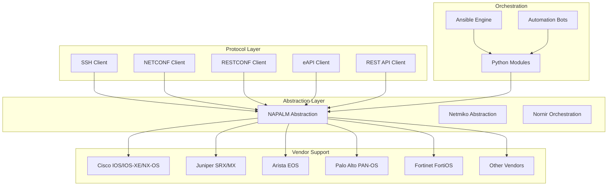
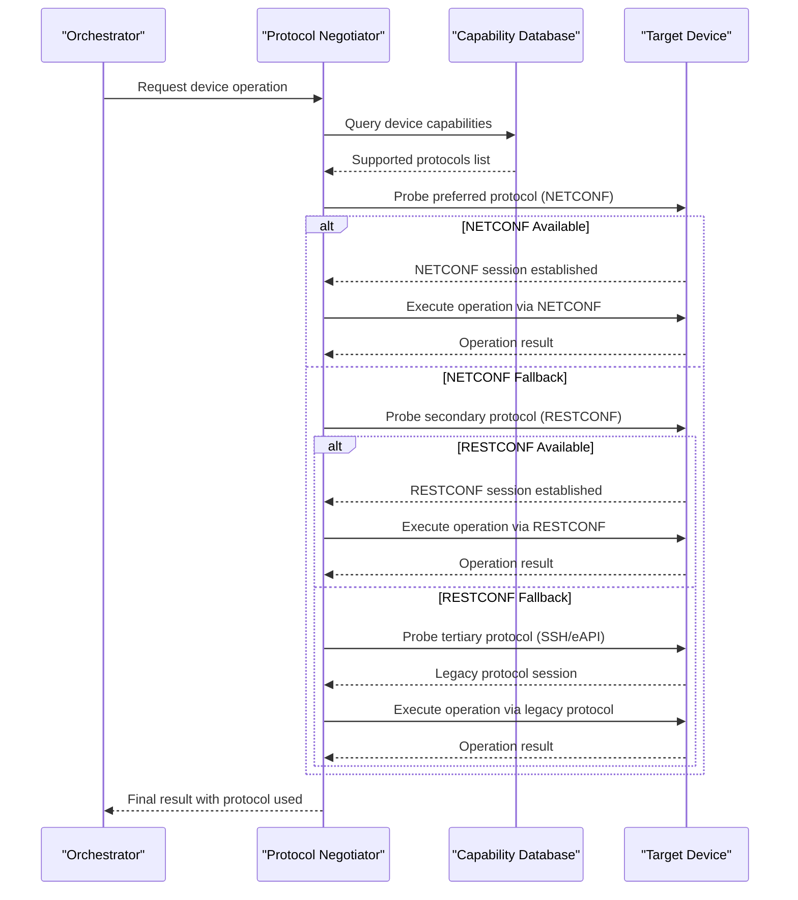
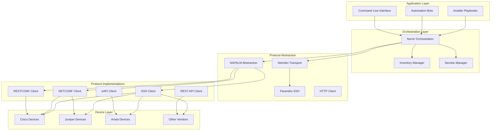

# Protocol Support Matrix

<cite>
**Referenced Files in This Document**
- [README.md](file://README.md)
</cite>

## Table of Contents
1. [Introduction](#introduction)
2. [Project Structure](#project-structure)
3. [Core Components](#core-components)
4. [Architecture Overview](#architecture-overview)
5. [Detailed Component Analysis](#detailed-component-analysis)
6. [Dependency Analysis](#dependency-analysis)
7. [Performance Considerations](#performance-considerations)
8. [Troubleshooting Guide](#troubleshooting-guide)
9. [Conclusion](#conclusion)
10. [Appendices](#appendices)

## Introduction

This document provides a comprehensive protocol support matrix for the Enterprise Network Automation Platform, covering SSH, NETCONF, RESTCONF, eAPI, and API-based management across all supported vendors. The platform implements a vendor-agnostic approach using multiple abstraction layers to provide unified access to diverse network devices through standardized interfaces.

The system supports enterprise-scale operations across multi-vendor, multi-region environments, implementing Infrastructure as Code principles with GitOps workflows, comprehensive security controls, and automated compliance enforcement.

## Project Structure

The platform follows a modular architecture with clear separation between protocol implementations, vendor abstractions, and orchestration layers:



**Diagram sources**
- [README.md:103-180](file://README.md#L103-L180)
- [README.md:184-200](file://README.md#L184-L200)

**Section sources**
- [README.md:103-180](file://README.md#L103-L180)

## Core Components

### Protocol Implementation Modules

The platform implements dedicated Python modules for each protocol type, providing consistent interfaces regardless of underlying transport:

| Module | Purpose | Key Features |
|--------|---------|--------------|
| `netconf/` | NETCONF client with capability negotiation | YANG model support, session management, error handling |
| `restconf/` | RESTCONF client with YANG model support | HTTP/HTTPS transport, JSON/XML formats, authentication |
| `ssh/` | SSH abstraction over Netmiko/Paramiko with retry | Connection pooling, command queuing, output parsing |
| `snmp/` | SNMPv3 polling and trap handling | Security models, bulk operations, trap processing |
| `telemetry/` | Model-driven telemetry receiver and parser | gRPC streaming, real-time data collection |

### Vendor Abstraction Layer

The platform uses NAPALM (Network Automation and Programmability Abstraction Layer with Multivendor support) as the primary abstraction mechanism, providing unified APIs across different vendor platforms.

**Section sources**
- [README.md:438-456](file://README.md#L438-L456)

## Architecture Overview

The protocol selection and negotiation system follows a hierarchical approach with intelligent fallback mechanisms:



**Diagram sources**
- [README.md:438-456](file://README.md#L438-L456)

## Detailed Component Analysis

### Protocol Support Matrix by Vendor

#### Cisco Platforms

| Platform | SSH | NETCONF | RESTCONF | eAPI | iControl REST | Notes |
|----------|-----|---------|----------|------|---------------|-------|
| IOS | ✅ Basic | ❌ Not supported | ❌ Not supported | ❌ Not supported | ❌ Not supported | Command-line interface only |
| IOS-XE | ✅ Advanced | ✅ Full | ✅ Full | ❌ Not supported | ❌ Not supported | Modern feature set |
| NX-OS | ✅ Advanced | ✅ Full | ✅ Full | ❌ Not supported | ❌ Not supported | Data center focused |

#### Juniper Platforms

| Platform | SSH | NETCONF | RESTCONF | eAPI | iControl REST | Notes |
|----------|-----|---------|----------|------|---------------|-------|
| SRX | ✅ Advanced | ✅ Full | ❌ Limited | ❌ Not supported | ❌ Not supported | Firewall specific features |
| MX | ✅ Advanced | ✅ Full | ❌ Limited | ❌ Not supported | ❌ Not supported | High-performance routing |

#### Arista Platforms

| Platform | SSH | NETCONF | RESTCONF | eAPI | iControl REST | Notes |
|----------|-----|---------|----------|------|---------------|-------|
| EOS | ✅ Advanced | ✅ Full | ❌ Not supported | ✅ Full | ❌ Not supported | eAPI is native Arista interface |

#### Other Vendor Platforms

| Vendor | Platform | SSH | NETCONF | RESTCONF | eAPI | Custom API | Notes |
|--------|----------|-----|---------|----------|------|------------|-------|
| Palo Alto | PAN-OS | ✅ Advanced | ❌ Not supported | ❌ Not supported | ❌ Not supported | ✅ XML API | Firewall management |
| Fortinet | FortiOS | ✅ Advanced | ❌ Not supported | ❌ Not supported | ❌ Not supported | ✅ REST API | SD-WAN capabilities |
| Check Point | Gaia | ✅ Advanced | ❌ Not supported | ❌ Not supported | ❌ Not supported | ✅ Management API | Enterprise firewall |
| F5 | BIG-IP | ✅ Advanced | ❌ Not supported | ❌ Not supported | ❌ Not supported | ✅ iControl REST | Load balancing |
| pfSense | FreeBSD-based | ✅ Basic | ❌ Not supported | ❌ Not supported | ❌ Not supported | ✅ Web API | Open source firewall |
| OPNsense | FreeBSD-based | ✅ Basic | ❌ Not supported | ❌ Not supported | ❌ Not supported | ✅ Web API | Open source firewall |

### Authentication Methods

#### SSH Authentication
- **Password-based**: Traditional username/password authentication
- **Key-based**: RSA, ECDSA, Ed25519 key pairs
- **Certificate-based**: Short-lived certificates via Vault SSH CA
- **Multi-factor**: Integration with TACACS+/RADIUS for AAA

#### NETCONF Authentication
- **Username/Password**: Basic authentication over SSH or TLS
- **Certificate-based**: Mutual TLS authentication
- **Kerberos**: Enterprise integration scenarios
- **OAuth2**: Modern API gateway scenarios

#### RESTCONF Authentication
- **Basic Auth**: Username/password over HTTPS
- **Bearer Tokens**: JWT tokens from identity providers
- **Mutual TLS**: Certificate-based client authentication
- **API Keys**: Service-to-service authentication

#### eAPI Authentication
- **Local Users**: Device-local user accounts
- **AAA Integration**: TACACS+/RADIUS backend
- **Certificate-based**: Client certificate validation
- **Role-based Access Control**: Granular permission sets

### Security Considerations

#### Encryption Standards
- **SSH**: AES-256-CBC, ChaCha20-Poly1305, Curve25519 key exchange
- **NETCONF**: TLS 1.3 with modern cipher suites
- **RESTCONF**: HTTPS with HSTS, modern TLS configurations
- **eAPI**: HTTPS with mutual TLS support

#### Compliance Requirements
- **FIPS 140-2**: Approved cryptographic algorithms
- **NIST SP 800-57**: Key management guidelines
- **PCI DSS**: Secure transmission requirements
- **SOC 2**: Audit logging and access controls

### Performance Characteristics

#### Connection Pooling Strategies
- **Connection Reuse**: Persistent connections for high-frequency operations
- **Connection Limits**: Per-device connection pool sizing
- **Timeout Configuration**: Read/write timeouts optimized for device characteristics
- **Retry Logic**: Exponential backoff with jitter for transient failures

#### Throughput Optimization
- **Batch Operations**: Group related commands for efficiency
- **Parallel Execution**: Concurrent device operations with rate limiting
- **Streaming Responses**: Real-time data collection without blocking
- **Caching**: Local caching of device capabilities and inventory

#### Error Handling Patterns
- **Graceful Degradation**: Fallback to alternative protocols
- **Partial Success**: Continue operations despite individual failures
- **Comprehensive Logging**: Detailed audit trails for troubleshooting
- **Health Monitoring**: Proactive device connectivity checks

**Section sources**
- [README.md:203-217](file://README.md#L203-L217)
- [README.md:339-368](file://README.md#L339-L368)
- [README.md:552-566](file://README.md#L552-L566)

## Dependency Analysis

The protocol layer dependencies follow a clear hierarchy with well-defined interfaces:



**Diagram sources**
- [README.md:184-200](file://README.md#L184-L200)
- [README.md:438-456](file://README.md#L438-L456)

**Section sources**
- [README.md:184-200](file://README.md#L184-L200)

## Performance Considerations

### Protocol Selection Optimization

The platform implements intelligent protocol selection based on:
- **Device Capabilities**: Runtime capability discovery
- **Operation Type**: Batch vs. single operations
- **Security Requirements**: Compliance-driven protocol selection
- **Performance Needs**: Throughput and latency requirements

### Connection Management

- **Pool Sizing**: Dynamic connection pool adjustment based on workload
- **Keep-alive**: Configurable keep-alive intervals per protocol
- **Resource Cleanup**: Automatic cleanup of stale connections
- **Memory Management**: Efficient memory usage for large data transfers

### Scalability Patterns

- **Horizontal Scaling**: Multiple orchestrator instances with shared state
- **Load Distribution**: Round-robin distribution across device pools
- **Rate Limiting**: Configurable throttling per device group
- **Queue Management**: Asynchronous operation queuing for high-volume tasks

## Troubleshooting Guide

### Common Protocol Issues

| Issue | Symptoms | Resolution |
|-------|----------|------------|
| SSH Connection Failures | Timeout errors, authentication failures | Verify SSH hardening configuration, check firewall rules |
| NETCONF Session Drops | Intermittent disconnections, partial responses | Adjust timeout settings, verify device capacity |
| RESTCONF Authentication Errors | 401/403 responses, token expiration | Validate credentials, check certificate validity |
| eAPI Permission Denied | Insufficient privileges, role conflicts | Review RBAC configuration, verify user permissions |
| Protocol Negotiation Failures | Fallback loops, capability mismatches | Update capability database, verify device firmware |

### Debugging Techniques

- **Protocol-Level Logging**: Enable detailed protocol communication logs
- **Packet Capture**: Network-level traffic analysis for protocol issues
- **Device-Specific Diagnostics**: Vendor-specific troubleshooting commands
- **Performance Profiling**: Identify bottlenecks in protocol implementations

### Recovery Procedures

- **Automatic Retry**: Configurable retry logic with exponential backoff
- **Fallback Mechanisms**: Graceful degradation to alternative protocols
- **State Recovery**: Resume operations after temporary failures
- **Audit Trail**: Comprehensive logging for forensic analysis

**Section sources**
- [README.md:674-685](file://README.md#L674-L685)

## Conclusion

The Enterprise Network Automation Platform provides comprehensive protocol support across multiple vendors through a sophisticated abstraction layer. The system's intelligent protocol negotiation, robust security model, and scalable architecture enable reliable automation at enterprise scale.

Key strengths include:
- **Vendor Agnostic Design**: Unified APIs across diverse platforms
- **Protocol Flexibility**: Multiple transport options with automatic fallback
- **Enterprise Security**: Comprehensive authentication and authorization
- **Operational Excellence**: Extensive monitoring, logging, and troubleshooting capabilities

The platform's modular architecture ensures maintainability while supporting future protocol additions and vendor integrations through well-defined interfaces and testing frameworks.

## Appendices

### Migration Paths

#### Legacy to Modern Protocols
- **Telnet → SSH**: Automated migration with configuration backup
- **SNMPv1/v2c → SNMPv3**: Security upgrade with credential rotation
- **CLI-only → NETCONF/RESTCONF**: Feature enhancement with capability detection

#### Vendor-Specific Migrations
- **Cisco IOS → IOS-XE**: Leverage modern protocol support
- **Legacy Firewalls → Next-gen**: API-based management adoption
- **Proprietary → Standard**: YAML/JSON configuration standardization

### Configuration Examples

#### Protocol Priority Configuration
```yaml
protocol_priority:
  - netconf
  - restconf
  - ssh
  - eapi
  - api
  
connection_settings:
  timeout: 30
  retries: 3
  backoff_factor: 2
  max_connections: 10
  
security_policy:
  min_ssh_version: 2
  allowed_ciphers:
    - aes256-gcm@openssh.com
    - chacha20-poly1305@openssh.com
  tls_versions:
    - "1.2"
    - "1.3"
```

**Section sources**
- [README.md:203-217](file://README.md#L203-L217)
- [README.md:339-368](file://README.md#L339-L368)
- [README.md:552-566](file://README.md#L552-L566)