# Vendor Abstraction Layer

<cite>
**Referenced Files in This Document**
- [README.md](file://README.md)
</cite>

## Table of Contents
1. [Introduction](#introduction)
2. [Project Structure](#project-structure)
3. [Core Components](#core-components)
4. [Architecture Overview](#architecture-overview)
5. [Detailed Component Analysis](#detailed-component-analysis)
6. [Dependency Analysis](#dependency-analysis)
7. [Performance Considerations](#performance-considerations)
8. [Troubleshooting Guide](#troubleshooting-guide)
9. [Conclusion](#conclusion)

## Introduction

The vendor abstraction layer is a sophisticated system designed to provide unified configuration generation across multiple network vendors including Cisco, Juniper, Arista, Palo Alto, Fortinet, Check Point, F5, pfSense, and OPNsense. This enterprise-grade platform enables Infrastructure as Code practices by abstracting vendor-specific command syntax and configuration models behind consistent APIs, allowing operators to manage thousands of devices across multi-vendor environments with a single codebase.

The system leverages Jinja2 templates, structured YAML data, and Python automation modules to detect vendors based on inventory variables and generate appropriate configurations while maintaining compliance, security, and operational consistency across diverse network infrastructures.

## Project Structure

The vendor abstraction layer is built around a modular architecture that separates concerns between inventory management, template rendering, protocol abstraction, and validation. The system follows a clear directory structure that organizes vendor-specific implementations while providing unified interfaces for common operations.

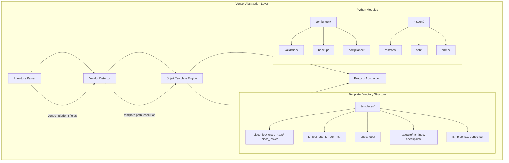

**Diagram sources**
- [README.md:103-180](file://README.md#L103-L180)
- [README.md:438-459](file://README.md#L438-L459)

**Section sources**
- [README.md:103-180](file://README.md#L103-L180)
- [README.md:438-459](file://README.md#L438-L459)

## Core Components

The vendor abstraction layer consists of several interconnected components that work together to provide unified configuration management across diverse network platforms.

### Inventory Management System

The inventory system serves as the foundation for vendor detection and device classification. Each device entry contains critical metadata including vendor identification, platform specification, role assignment, and geographic context.

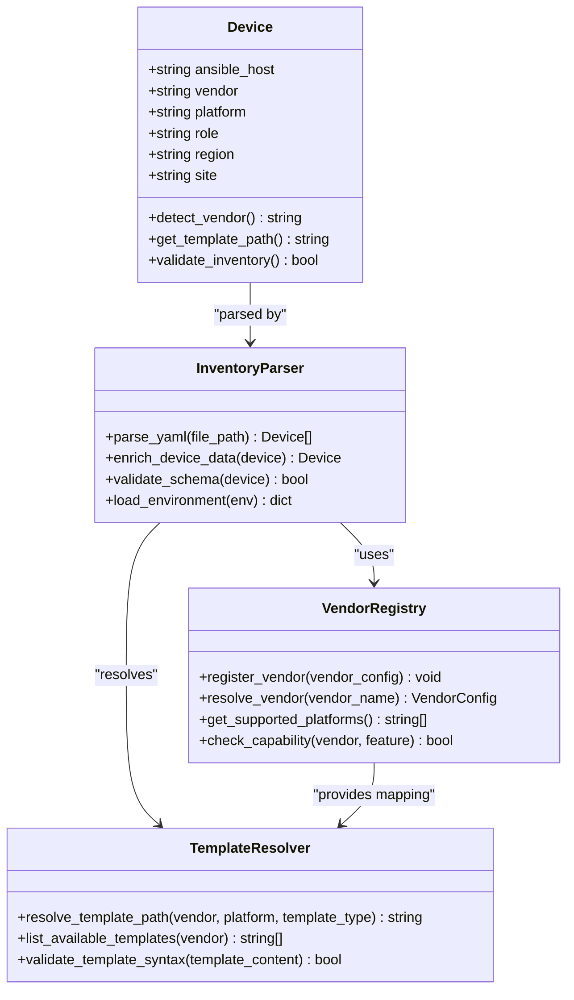

**Diagram sources**
- [README.md:284-338](file://README.md#L284-L338)
- [README.md:103-180](file://README.md#L103-L180)

### Configuration Generation Pipeline

The configuration generation pipeline transforms structured data into vendor-specific configurations through a multi-stage process involving template resolution, variable substitution, and validation.

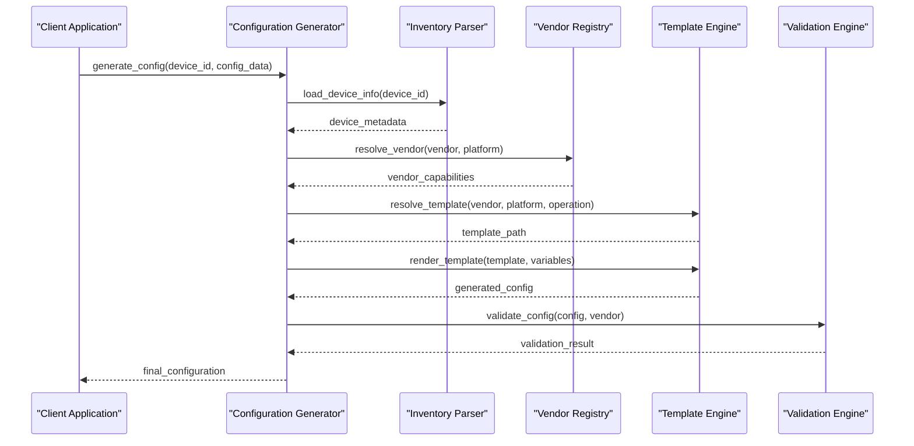

**Diagram sources**
- [README.md:438-459](file://README.md#L438-L459)
- [README.md:479-516](file://README.md#L479-L516)

**Section sources**
- [README.md:284-338](file://README.md#L284-L338)
- [README.md:438-459](file://README.md#L438-L459)

## Architecture Overview

The vendor abstraction layer implements a layered architecture that separates vendor-specific logic from common business operations, enabling consistent API exposure while handling underlying platform differences.

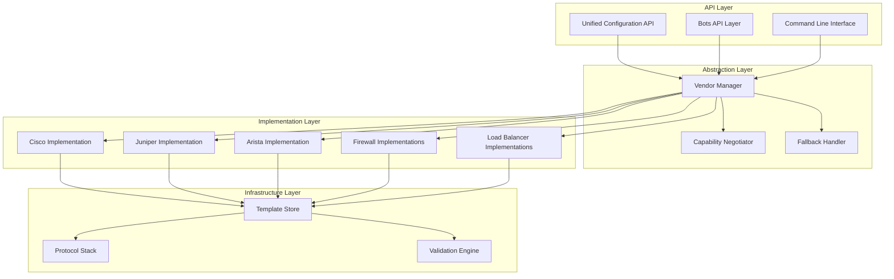

**Diagram sources**
- [README.md:103-180](file://README.md#L103-L180)
- [README.md:438-459](file://README.md#L438-L459)

## Detailed Component Analysis

### Vendor Detection Mechanism

The vendor detection system operates through a hierarchical approach that examines inventory variables to determine the appropriate vendor implementation and template selection.

#### Inventory-Based Detection

The primary detection mechanism relies on two key inventory fields: `vendor` and `platform`. These fields establish the foundation for all subsequent template resolution and capability negotiation.

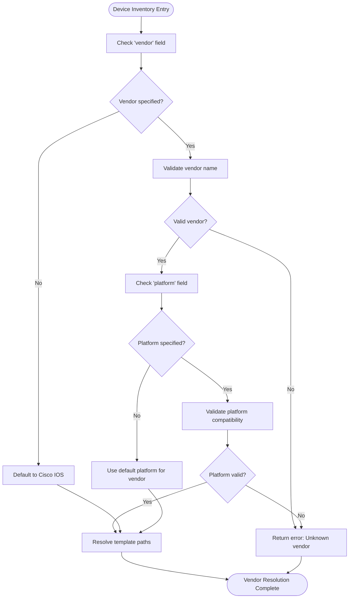

**Diagram sources**
- [README.md:284-338](file://README.md#L284-L338)

#### Supported Vendor-Platform Mappings

The system supports extensive vendor-platform combinations with specific template directories for each variant:

| Vendor | Platforms | Template Directory | Primary Protocols |
|--------|-----------|-------------------|-------------------|
| Cisco | IOS, IOS-XE, NX-OS | cisco_ios/, cisco_iosxe/, cisco_nxos/ | SSH, NETCONF, RESTCONF |
| Juniper | SRX, MX | juniper_srx/, juniper_mx/ | SSH, NETCONF |
| Arista | EOS | arista_eos/ | SSH, eAPI, NETCONF |
| Palo Alto | PAN-OS | paloalto/ | SSH, API |
| Fortinet | FortiOS | fortinet/ | SSH, API |
| Check Point | Gaia | checkpoint/ | SSH, API |
| F5 | BIG-IP | f5/ | SSH, iControl REST |
| pfSense | FreeBSD-based | pfsense/ | SSH, API |
| OPNsense | FreeBSD-based | opnsense/ | SSH, API |

**Section sources**
- [README.md:203-227](file://README.md#L203-L227)
- [README.md:284-338](file://README.md#L284-L338)
- [README.md:103-180](file://README.md#L103-L180)

### Template Resolution and Rendering

The template engine uses a sophisticated resolution algorithm that maps vendor-platform combinations to specific template directories and files.

#### Template Directory Structure

Each vendor maintains its own template directory containing standardized configuration templates for common operations:

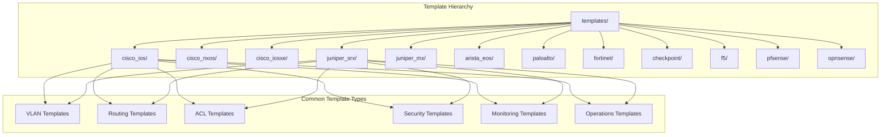

**Diagram sources**
- [README.md:103-180](file://README.md#L103-L180)

#### Template Rendering Process

The rendering process involves multiple stages of validation and transformation to ensure configuration correctness and compliance.

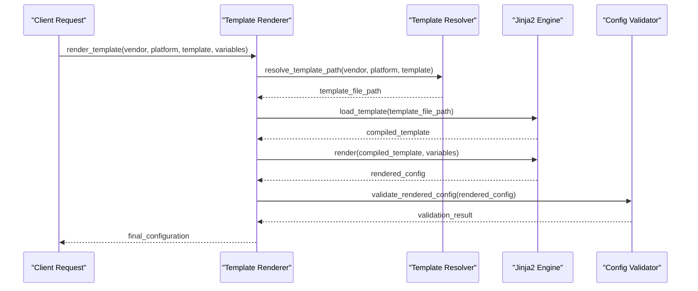

**Diagram sources**
- [README.md:438-459](file://README.md#L438-L459)

### Unified API Design

The abstraction layer provides consistent interfaces for common network operations regardless of underlying vendor implementation.

#### Common Operation Abstractions

The system abstracts complex vendor-specific operations into simple, unified APIs:

| Operation | Unified API Method | Description |
|-----------|-------------------|-------------|
| VLAN Creation | `create_vlan(vlan_id, name, description)` | Creates VLAN with vendor-specific syntax |
| Routing Protocol | `configure_routing(protocol, parameters)` | Configures OSPF, BGP, IS-IS across vendors |
| ACL Management | `manage_acl(acl_rules, action)` | Manages access control lists consistently |
| Interface Config | `configure_interface(interface, settings)` | Configures interfaces with vendor-specific options |
| Security Policies | `apply_security_policy(policy, scope)` | Applies security policies across different platforms |
| Monitoring Setup | `configure_monitoring(type, parameters)` | Sets up monitoring agents and collectors |

#### Capability Negotiation

The system performs capability negotiation to determine which features are available on specific platforms before attempting configuration.

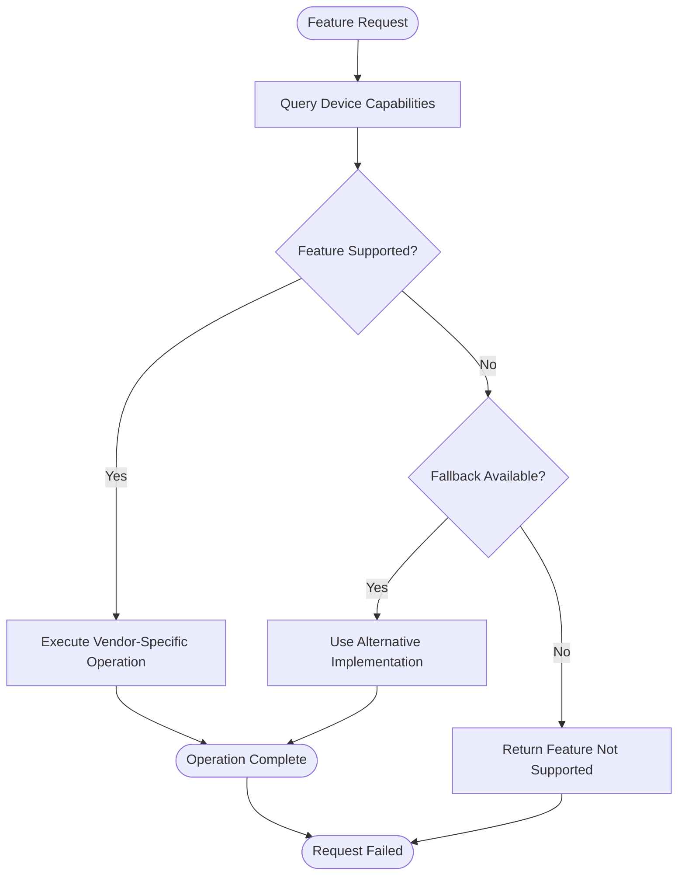

**Diagram sources**
- [README.md:438-459](file://README.md#L438-L459)

### Practical Examples

#### VLAN Creation Across Vendors

The unified API handles vendor-specific VLAN creation through a single interface:

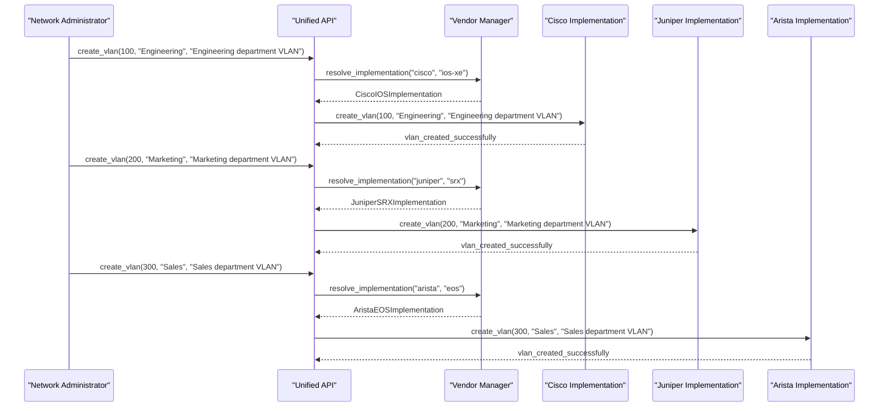

**Diagram sources**
- [README.md:203-227](file://README.md#L203-L227)
- [README.md:284-338](file://README.md#L284-L338)

#### Routing Protocol Configuration

The system abstracts complex routing protocol configurations across different vendors:

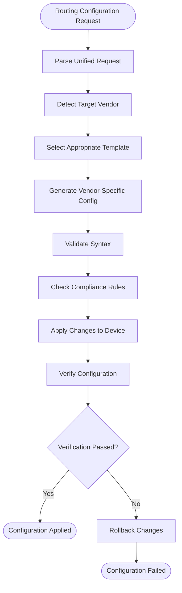

**Diagram sources**
- [README.md:401-410](file://README.md#L401-L410)

#### ACL Management Operations

Access control list management demonstrates the power of vendor abstraction:

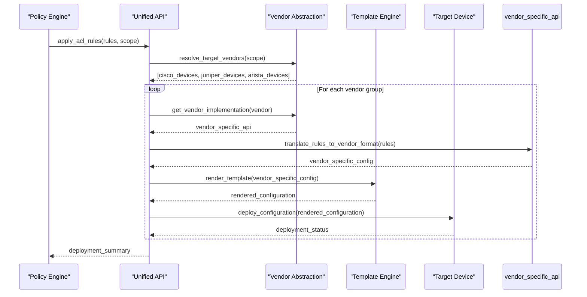

**Diagram sources**
- [README.md:388-400](file://README.md#L388-L400)

### Vendor Registry and Capability Management

The vendor registry maintains comprehensive information about supported vendors, platforms, capabilities, and fallback mechanisms.

#### Registry Structure

The registry contains metadata about each supported vendor including:

- Supported platforms and versions
- Available protocols (SSH, NETCONF, RESTCONF, etc.)
- Feature capabilities per platform
- Template directory mappings
- Fallback implementations for unsupported features
- Version compatibility matrices

#### Capability Negotiation Process

When a configuration request is made, the system performs capability negotiation to ensure the target device supports the requested features:

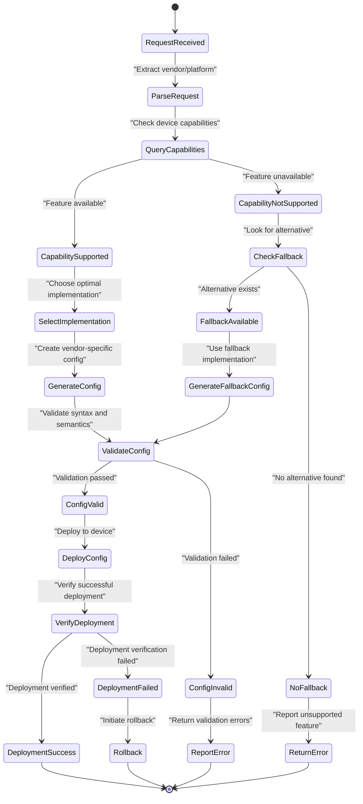

**Diagram sources**
- [README.md:438-459](file://README.md#L438-L459)

### Fallback Mechanisms

The system implements robust fallback mechanisms to handle scenarios where specific features are not available on certain platforms:

#### Feature Fallback Strategies

1. **Alternative Implementation**: Use different configuration methods when primary approach is unavailable
2. **Partial Configuration**: Apply available portions of requested configuration
3. **Warning Generation**: Alert administrators about limitations while proceeding with available features
4. **Graceful Degradation**: Provide reduced functionality when full feature set is unavailable

#### Platform-Specific Optimizations

The abstraction layer includes platform-specific optimizations that leverage unique capabilities of each vendor's implementation while maintaining consistent behavior across the unified interface.

**Section sources**
- [README.md:438-459](file://README.md#L438-L459)
- [README.md:203-227](file://README.md#L203-L227)

## Dependency Analysis

The vendor abstraction layer has well-defined dependencies and relationships between components that ensure maintainability and scalability.

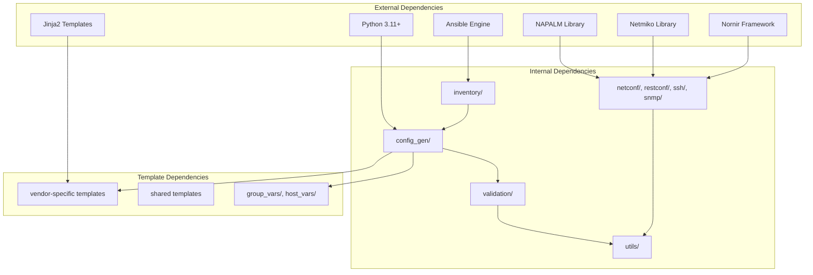

**Diagram sources**
- [README.md:184-200](file://README.md#L184-L200)
- [README.md:103-180](file://README.md#L103-L180)

### Component Coupling Analysis

The architecture demonstrates low coupling between vendor implementations and high cohesion within functional modules. Each vendor implementation is isolated and can be developed, tested, and maintained independently.

### External Integration Points

The system integrates with external tools and services through well-defined interfaces:

- **CI/CD Integration**: GitHub Actions workflows for automated testing and deployment
- **Secrets Management**: HashiCorp Vault, AWS Secrets Manager, Azure Key Vault integration
- **Monitoring**: Prometheus, Grafana, OpenTelemetry for observability
- **Testing**: pytest, Batfish, pyATS for comprehensive test coverage

**Section sources**
- [README.md:184-200](file://README.md#L184-L200)
- [README.md:479-516](file://README.md#L479-L516)

## Performance Considerations

The vendor abstraction layer is designed for enterprise-scale performance with considerations for large deployments managing thousands of devices.

### Template Caching Strategy

The system implements intelligent caching mechanisms to optimize template rendering performance:

- **Template Compilation Caching**: Compiled Jinja2 templates are cached in memory
- **Variable Resolution Caching**: Frequently used variable sets are cached
- **Vendor Capability Caching**: Device capability information is cached to avoid repeated queries
- **Configuration Diff Caching**: Previous configurations are cached for efficient change detection

### Concurrency and Parallelization

The architecture supports concurrent processing of configuration generation across multiple devices and vendors:

- **Parallel Template Rendering**: Multiple templates can be rendered simultaneously
- **Batch Processing**: Large batches of devices can be processed in parallel groups
- **Connection Pooling**: Network connections are pooled and reused efficiently
- **Resource Limiting**: Concurrent operations are limited to prevent resource exhaustion

### Memory Management

Efficient memory usage is achieved through:

- **Streaming Configuration Generation**: Large configurations are generated and streamed rather than loaded entirely into memory
- **Garbage Collection Optimization**: Temporary objects are properly cleaned up after use
- **Memory-Efficient Data Structures**: Optimized data structures minimize memory footprint

## Troubleshooting Guide

Common issues and their resolutions in the vendor abstraction layer:

### Vendor Detection Issues

**Problem**: Device not recognized or incorrect vendor detected
**Solution**: 
- Verify inventory `vendor` and `platform` fields are correctly specified
- Check vendor registry for supported vendor-platform combinations
- Review device discovery logs for detection failures

### Template Rendering Errors

**Problem**: Template rendering fails during configuration generation
**Solution**:
- Validate Jinja2 template syntax using provided validation tools
- Check variable completeness and data types
- Review template debugging output for specific error locations
- Verify template file permissions and accessibility

### Capability Negotiation Failures

**Problem**: Feature not available on target device
**Solution**:
- Check device capability database for supported features
- Review fallback mechanism configuration
- Verify device firmware version compatibility
- Consider alternative implementation strategies

### Protocol Connection Issues

**Problem**: Unable to connect to device via configured protocol
**Solution**:
- Verify network connectivity and firewall rules
- Check authentication credentials and permissions
- Validate protocol support on target device
- Review connection timeout and retry configurations

### Performance Issues

**Problem**: Slow configuration generation or deployment
**Solution**:
- Enable template caching and verify cache effectiveness
- Review concurrent processing limits and adjust as needed
- Monitor memory usage and optimize data structures
- Check network latency and connection pooling efficiency

**Section sources**
- [README.md:674-685](file://README.md#L674-L685)

## Conclusion

The vendor abstraction layer provides a robust, scalable solution for managing multi-vendor network infrastructure through unified APIs and consistent configuration generation. By leveraging Jinja2 templates, structured data, and intelligent vendor detection, the system successfully abstracts vendor-specific complexities while maintaining the flexibility to leverage platform-specific optimizations.

Key strengths of the architecture include:

- **Unified Interface**: Consistent APIs across all supported vendors
- **Extensible Design**: Easy addition of new vendors and platforms
- **Robust Fallbacks**: Graceful handling of unsupported features
- **Enterprise Scale**: Designed for large deployments with thousands of devices
- **Comprehensive Testing**: Extensive validation and compliance checking
- **Operational Excellence**: Integrated monitoring, backup, and rollback capabilities

The system represents a production-ready solution for enterprise network automation, demonstrating best practices in Infrastructure as Code, GitOps, DevSecOps, and compliance enforcement across diverse network environments.