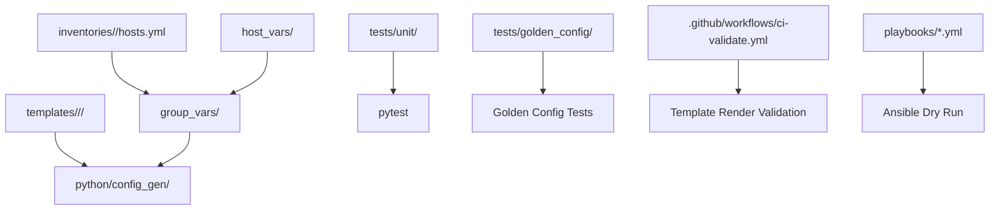
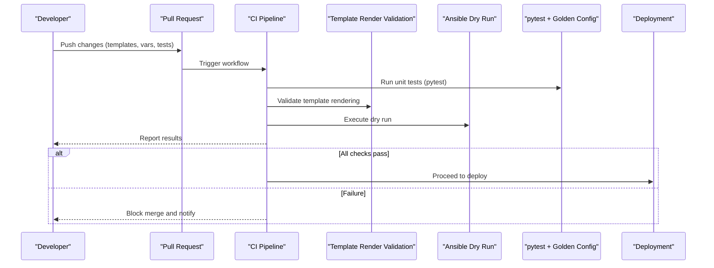
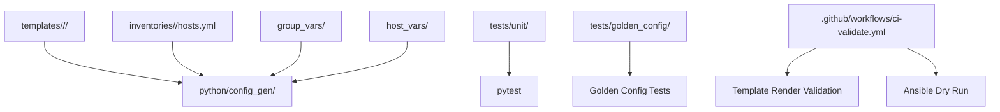

# Template Development Guidelines

<cite>
**Referenced Files in This Document**
- [README.md](file://README.md)
</cite>

## Table of Contents
1. [Introduction](#introduction)
2. [Project Structure](#project-structure)
3. [Core Components](#core-components)
4. [Architecture Overview](#architecture-overview)
5. [Detailed Component Analysis](#detailed-component-analysis)
6. [Dependency Analysis](#dependency-analysis)
7. [Performance Considerations](#performance-considerations)
8. [Troubleshooting Guide](#troubleshooting-guide)
9. [Conclusion](#conclusion)
10. [Appendices](#appendices)

## Introduction
This document provides comprehensive guidelines for developing and maintaining Jinja2 templates within the Enterprise Network Automation Platform. It focuses on template organization, naming conventions, code reuse patterns, filters and custom functions, testing strategies (pytest, dry-run, golden config comparisons), complex scenarios (conditional logic, loops, error handling), performance optimization for large device fleets, and debugging methodologies. The guidance is grounded in the repository’s documented architecture, CI/CD pipeline, and testing strategy.

## Project Structure
The platform organizes Jinja2 templates by vendor/platform under a dedicated directory, with structured data provided via inventories and variables. Configuration generation is performed by Python modules that render Jinja2 templates against structured inputs.

**Diagram sources**
- [README.md:103-180](file://README.md#L103-L180)
- [README.md:438-456](file://README.md#L438-L456)
- [README.md:479-514](file://README.md#L479-L514)
- [README.md:517-544](file://README.md#L517-L544)

**Section sources**
- [README.md:103-180](file://README.md#L103-L180)
- [README.md:438-456](file://README.md#L438-L456)

## Core Components
- Templates: Vendor-specific Jinja2 templates reside under templates/<vendor>/<platform>.
- Data Inputs: Inventories and variables provide structured data to templates.
- Rendering Engine: python/config_gen renders Jinja2 templates from structured data.
- Testing: pytest validates unit tests including Jinja2 filters; golden config tests compare rendered outputs against approved baselines.
- CI/CD: Pipeline includes template rendering validation and Ansible dry run before deployment.

Key responsibilities:
- Maintain clear separation between templates and data.
- Ensure deterministic output for golden config comparisons.
- Use consistent naming and structure across vendors.

**Section sources**
- [README.md:103-180](file://README.md#L103-L180)
- [README.md:438-456](file://README.md#L438-L456)
- [README.md:517-544](file://README.md#L517-L544)
- [README.md:479-514](file://README.md#L479-L514)

## Architecture Overview
The end-to-end flow integrates template rendering into CI/CD and local development workflows.

**Diagram sources**
- [README.md:479-514](file://README.md#L479-L514)
- [README.md:517-544](file://README.md#L517-L544)

## Detailed Component Analysis

### Template Organization and Naming Conventions
- Organize templates per vendor and platform under templates/<vendor>/<platform>.
- Use descriptive file names aligned with configuration domains (e.g., VLANs, ACLs, routing).
- Keep templates focused and small; compose larger configurations by including reusable fragments.
- Maintain consistency across platforms to simplify maintenance and testing.

Best practices:
- One logical configuration domain per template file.
- Avoid embedding secrets; use variables and secrets backends.
- Prefer deterministic output for golden config comparisons.

**Section sources**
- [README.md:103-180](file://README.md#L103-L180)

### Code Reuse Patterns
- Extract common blocks into reusable fragments and include them where needed.
- Centralize shared logic in Python helpers or filters rather than duplicating in templates.
- Use structured data (inventories/group_vars/host_vars) to parameterize behavior without changing templates.

Benefits:
- Reduced duplication and improved maintainability.
- Easier testing and validation of shared logic.

**Section sources**
- [README.md:103-180](file://README.md#L103-L180)
- [README.md:438-456](file://README.md#L438-L456)

### Filters, Custom Functions, and Extensions
- Implement reusable filters and custom functions in Python modules to keep templates declarative.
- Place filter implementations under python/utils or related modules for discoverability and testing.
- Use Jinja2 extensions only when necessary and document their purpose and usage.

Guidelines:
- Keep filters pure and deterministic.
- Provide unit tests for each filter/function.
- Document expected inputs and outputs.

**Section sources**
- [README.md:438-456](file://README.md#L438-L456)
- [README.md:517-544](file://README.md#L517-L544)

### Testing Strategies
- Unit tests: pytest validates Python modules and Jinja2 filters.
- Golden config tests: Compare rendered outputs against approved baselines to detect unintended changes.
- Integration tests: Use pyATS/NAPALM for connectivity and parsing validations in staging.
- CI integration: Template rendering validation and Ansible dry run are enforced in CI.

Recommended workflow:
- Write pytest cases for filters and template rendering paths.
- Maintain golden configs per vendor/platform/domain.
- Fail CI if diffs exceed acceptable thresholds.

**Section sources**
- [README.md:517-544](file://README.md#L517-L544)
- [README.md:479-514](file://README.md#L479-L514)

### Complex Template Scenarios
- Conditional logic: Branch based on vendor/platform attributes and feature availability.
- Loop structures: Iterate over lists (interfaces, peers, policies) to generate bulk configurations.
- Error handling: Use safe defaults and explicit checks to avoid undefined variable errors.

Approach:
- Encapsulate complex conditions in filters/functions for readability.
- Validate input data early to fail fast during rendering.
- Keep loops idempotent and deterministic.

**Section sources**
- [README.md:438-456](file://README.md#L438-L456)
- [README.md:517-544](file://README.md#L517-L544)

### Performance Optimization Techniques
- Minimize heavy computations inside templates; move logic to Python filters/functions.
- Cache expensive lookups and precompute derived data in structured variables.
- Batch operations and leverage concurrency utilities in Python modules for large fleets.
- Keep templates lean and modular to reduce rendering overhead.

**Section sources**
- [README.md:438-456](file://README.md#L438-L456)

### Debugging Methodologies
- Use debug mode in the configuration generator to inspect rendering issues.
- Validate environment setup and dependencies using provided scripts.
- Review CI logs for actionable error messages and pinpoint failures.

Practical steps:
- Run local rendering with verbose output.
- Isolate failing templates and narrow down problematic variables.
- Add targeted unit tests to reproduce and prevent regressions.

**Section sources**
- [README.md:674-685](file://README.md#L674-L685)

## Dependency Analysis
The following diagram maps key components involved in template rendering and validation.

**Diagram sources**
- [README.md:103-180](file://README.md#L103-L180)
- [README.md:438-456](file://README.md#L438-L456)
- [README.md:479-514](file://README.md#L479-L514)
- [README.md:517-544](file://README.md#L517-L544)

**Section sources**
- [README.md:103-180](file://README.md#L103-L180)
- [README.md:438-456](file://README.md#L438-L456)
- [README.md:479-514](file://README.md#L479-L514)
- [README.md:517-544](file://README.md#L517-L544)

## Performance Considerations
- Favor deterministic rendering to enable caching and golden config comparisons.
- Preprocess large datasets outside templates to reduce runtime complexity.
- Use efficient iteration patterns and avoid nested loops where possible.
- Monitor rendering times in CI and add performance tests for critical paths.

[No sources needed since this section provides general guidance]

## Troubleshooting Guide
Common issues and resolutions:
- Template rendering errors: Use debug mode in the configuration generator to inspect issues.
- Environment setup problems: Validate prerequisites and dependencies using provided scripts.
- CI pipeline failures: Review GitHub Actions logs for actionable error messages.

Operational tips:
- Reproduce failures locally with minimal inputs.
- Add unit tests to capture edge cases.
- Leverage golden config diffs to identify unexpected changes.

**Section sources**
- [README.md:674-685](file://README.md#L674-L685)

## Conclusion
Adhering to these guidelines ensures robust, maintainable, and scalable Jinja2 template development within the Enterprise Network Automation Platform. By organizing templates consistently, reusing logic through filters and functions, enforcing rigorous testing, and optimizing for performance, teams can confidently manage large device fleets while maintaining compliance and reliability.

[No sources needed since this section summarizes without analyzing specific files]

## Appendices

### Quick Reference Commands
- Generate configuration for a device:
  - python -m python.config_gen --device <name> --output ./output/
- Run unit tests:
  - pytest tests/unit/ -v
- Run all tests:
  - pytest tests/ -v --tb=short

**Section sources**
- [README.md:264-280](file://README.md#L264-L280)
- [README.md:531-544](file://README.md#L531-L544)