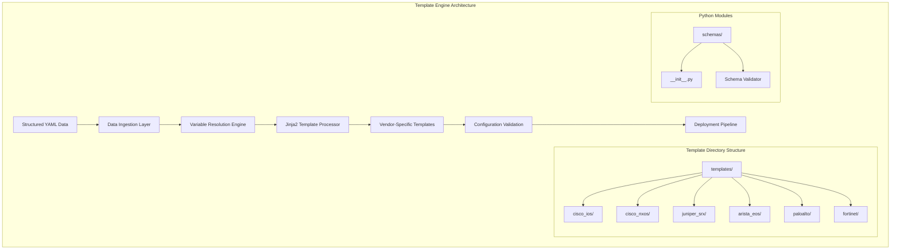
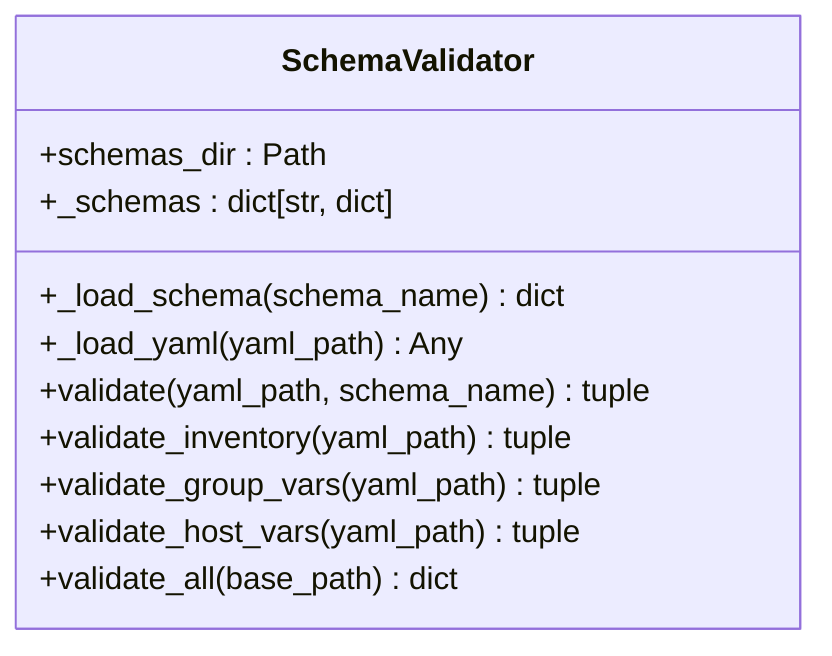
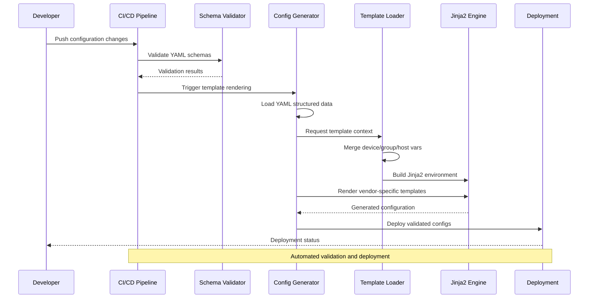
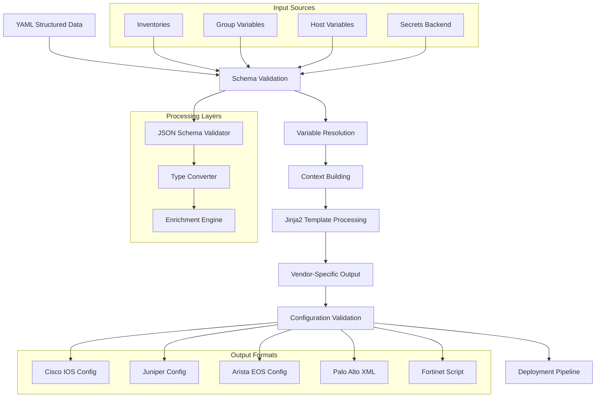
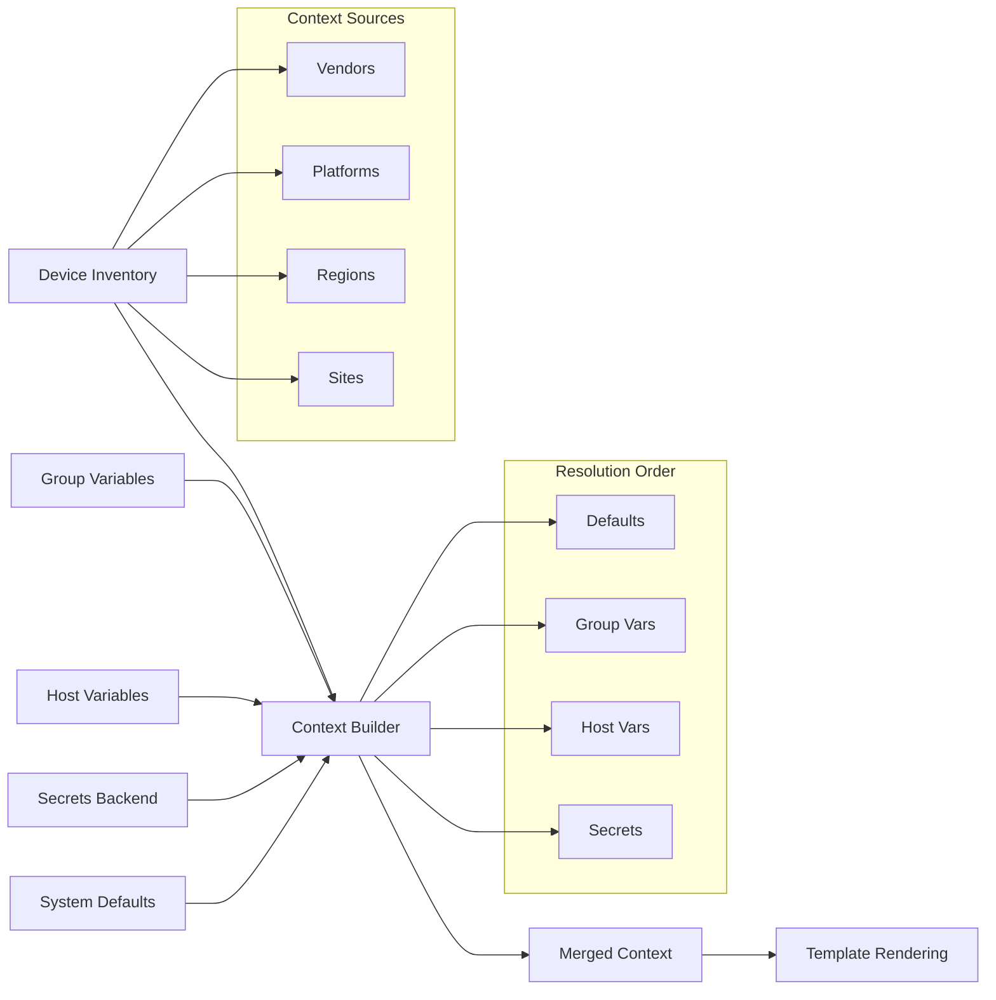
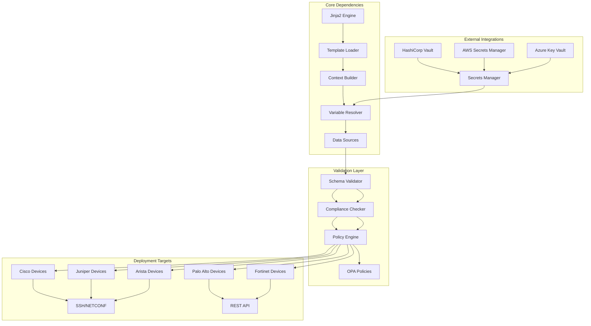

# Template Engine Architecture

<cite>
**Referenced Files in This Document**
- [README.md](file://README.md)
- [base_config.j2](file://templates/cisco_ios/base_config.j2)
- [base_config.j2](file://templates/arista_eos/base_config.j2)
- [base_config.j2](file://templates/cisco_nxos/base_config.j2)
- [all.yml](file://group_vars/all.yml)
- [core-rtr-01-us-east.yml](file://host_vars/core-rtr-01-us-east.yml)
- [__init__.py](file://schemas/__init__.py)
</cite>

## Update Summary
**Changes Made**
- Updated template engine architecture documentation to reflect implemented Jinja2-based configuration generation
- Added detailed analysis of vendor-specific templates for Cisco IOS, Arista EOS, and Cisco NX-OS platforms
- Enhanced template processing workflow documentation with concrete examples from actual template files
- Updated multi-vendor VLAN configuration example with real template outputs
- Added comprehensive coverage of routing protocols, security policies, and interface configurations
- Integrated schema validation module into the template rendering pipeline

## Table of Contents
1. [Introduction](#introduction)
2. [Project Structure](#project-structure)
3. [Core Components](#core-components)
4. [Architecture Overview](#architecture-overview)
5. [Detailed Component Analysis](#detailed-component-analysis)
6. [Template Processing Workflow](#template-processing-workflow)
7. [Vendor-Specific Template Implementation](#vendor-specific-template-implementation)
8. [Configuration Generation Pipeline](#configuration-generation-pipeline)
9. [Dependency Analysis](#dependency-analysis)
10. [Performance Considerations](#performance-considerations)
11. [Troubleshooting Guide](#troubleshooting-guide)
12. [Conclusion](#conclusion)

## Introduction

The Enterprise Network Automation Platform implements a sophisticated Jinja2-based template engine architecture designed for multi-vendor network automation at enterprise scale. This system transforms structured YAML data into vendor-specific network configurations through a comprehensive rendering pipeline that supports Cisco IOS/NX-OS, Arista EOS, Juniper SRX/MX, Palo Alto PAN-OS, Fortinet FortiOS, and other major networking platforms.

The template engine serves as the core component of the "Network as Code" principle, enabling consistent configuration generation across diverse vendor ecosystems while maintaining platform-specific syntax and capabilities. The architecture emphasizes maintainability, testability, and compliance enforcement throughout the configuration lifecycle.

## Project Structure

The template engine architecture follows a modular design with clear separation of concerns:



**Diagram sources**
- [README.md:160-237](file://README.md#L160-L237)

The architecture organizes templates by vendor under dedicated subdirectories, ensuring clean separation of platform-specific logic while maintaining shared business rules in structured data formats.

**Section sources**
- [README.md:160-237](file://README.md#L160-L237)

## Core Components

### Schema Validation Module (`schemas/`)

The schema validation module provides comprehensive validation for inventory, group_vars, and host_vars files against predefined JSON schemas. It ensures data integrity before template processing begins.

#### Key Responsibilities:
- **Schema Loading**: Dynamically loads JSON schema definitions for different file types
- **YAML Parsing**: Safely parses YAML configuration files with error handling
- **Validation Execution**: Applies Draft7 JSON Schema validation rules
- **Error Reporting**: Provides detailed validation errors with file paths and messages
- **Batch Processing**: Validates multiple files across the entire project structure

#### Module Architecture:


**Diagram sources**
- [__init__.py:14-161](file://schemas/__init__.py#L14-L161)

### Template Directory Structure

The template organization follows vendor-specific directories under `templates/`, each containing platform-appropriate Jinja2 templates:

| Vendor Directory | Platforms Supported | Configuration Types |
|------------------|-------------------|---------------------|
| `cisco_ios/` | Cisco IOS, IOS-XE | VLANs, ACLs, routing protocols, interfaces, SSH hardening, SNMPv3 |
| `cisco_nxos/` | Cisco NX-OS | VLANs, SVI, routing protocols, features, spanning tree |
| `juniper_srx/` | Juniper SRX | Security zones, policies, NAT rules |
| `arista_eos/` | Arista EOS | VLANs, STP, routing protocols, eAPI, port channels |
| `paloalto/` | Palo Alto PAN-OS | Security policies, address objects, zones |
| `fortinet/` | Fortinet FortiOS | Firewall policies, address groups, interfaces |

**Section sources**
- [README.md:173-185](file://README.md#L173-L185)

## Architecture Overview

The template rendering pipeline implements a comprehensive workflow from structured data input to vendor-specific configuration output:



**Diagram sources**
- [README.md:874-935](file://README.md#L874-L935)

### Data Flow Architecture



**Diagram sources**
- [README.md:874-935](file://README.md#L874-L935)

## Detailed Component Analysis

### Template Processing Workflow

The template processing workflow implements a multi-stage pipeline ensuring data integrity and configuration correctness:

#### Stage 1: Schema Validation
- **Source Identification**: Loads YAML data from inventories, group_vars, and host_vars
- **Schema Definition**: Validates data structure against predefined JSON schemas
- **Type Conversion**: Ensures proper data types for template processing
- **Error Detection**: Identifies structural issues before template rendering

#### Stage 2: Variable Resolution  
- **Hierarchy Resolution**: Applies variable precedence (host > group > default)
- **Secret Integration**: Resolves sensitive data from vault backends
- **Conditional Logic**: Evaluates conditional expressions based on device attributes
- **Template Functions**: Processes built-in and custom template functions

#### Stage 3: Template Rendering
- **Environment Setup**: Initializes Jinja2 environment with vendor-specific filters
- **Template Selection**: Chooses appropriate vendor-specific templates
- **Context Injection**: Injects resolved variables into template context
- **Rendering Execution**: Processes templates with error handling and logging

#### Stage 4: Validation and Deployment
- **Syntax Validation**: Checks generated configuration syntax
- **Compliance Checking**: Enforces security and operational policies
- **Dry Run Testing**: Simulates deployment without applying changes
- **Automated Deployment**: Applies validated configurations to target devices

**Section sources**
- [README.md:874-935](file://README.md#L874-L935)

### Template Context Building Process

The context building process constructs comprehensive Jinja2 template contexts by merging multiple data sources:



**Diagram sources**
- [README.md:284-335](file://README.md#L284-L335)

## Template Processing Workflow

The template processing workflow implements a multi-stage pipeline ensuring data integrity and configuration correctness:

#### Stage 1: Data Ingestion
- **Source Identification**: Loads YAML data from inventories, group_vars, and host_vars
- **Schema Validation**: Validates data structure against predefined schemas
- **Type Conversion**: Converts string values to appropriate Python types
- **Secret Resolution**: Integrates with secrets backends for sensitive data

#### Stage 2: Variable Resolution  
- **Hierarchy Resolution**: Applies variable precedence (host > group > default)
- **Conditional Logic**: Evaluates conditional expressions based on device attributes
- **Template Functions**: Processes built-in and custom template functions
- **Error Handling**: Provides meaningful error messages for missing variables

#### Stage 3: Template Rendering
- **Environment Setup**: Initializes Jinja2 environment with custom filters and extensions
- **Template Selection**: Chooses appropriate vendor-specific templates
- **Context Injection**: Injects resolved variables into template context
- **Rendering Execution**: Processes templates with error handling and logging

#### Stage 4: Validation and Deployment
- **Syntax Validation**: Checks generated configuration syntax
- **Compliance Checking**: Enforces security and operational policies
- **Dry Run Testing**: Simulates deployment without applying changes
- **Automated Deployment**: Applies validated configurations to target devices

**Section sources**
- [README.md:874-935](file://README.md#L874-L935)

## Vendor-Specific Template Implementation

### Cisco IOS Template Features

The Cisco IOS template (`templates/cisco_ios/base_config.j2`) provides comprehensive configuration generation including:

#### Core Infrastructure
- **Hostname and Domain Configuration**: Dynamic hostname assignment with domain search lists
- **NTP Synchronization**: Multiple NTP server support with authentication keys
- **DNS Resolution**: Configurable DNS servers and domain search domains
- **AAA Authentication**: TACACS+ server groups with authentication, authorization, and accounting

#### Security Hardening
- **SSH Configuration**: Version 2 enforcement with approved cipher suites and algorithms
- **SNMPv3 Support**: Secure SNMP with authentication and privacy settings
- **Syslog Integration**: Centralized logging with severity levels and source interfaces
- **Banner Configuration**: Login and MOTD banners with dynamic content

#### Network Services
- **VLAN Management**: Dynamic VLAN creation with names and states
- **Interface Configuration**: Physical and logical interfaces with IP addressing
- **Routing Protocols**: OSPF and BGP configuration with neighbor relationships
- **ACL Implementation**: Standard and extended access control lists

**Section sources**
- [base_config.j2:1-288](file://templates/cisco_ios/base_config.j2#L1-L288)

### Arista EOS Template Features

The Arista EOS template (`templates/arista_eos/base_config.j2`) delivers platform-specific configuration generation:

#### Platform-Specific Features
- **eAPI Management**: HTTP API management plane configuration
- **Spanning Tree Protocol**: Rapid-PVST mode with priority configuration
- **Port Channel Support**: LACP aggregation with minimum link requirements
- **SVI Interfaces**: Switched Virtual Interface configuration with HSRP support

#### Advanced Networking
- **Loopback Interfaces**: Stable router ID addresses with descriptions
- **Physical Interfaces**: Comprehensive interface configuration with MTU settings
- **Routing Protocols**: OSPF and BGP with neighbor relationships and network advertisements
- **Static Routes**: Default and specific route configuration

**Section sources**
- [base_config.j2:1-196](file://templates/arista_eos/base_config.j2#L1-L196)

### Cisco NX-OS Template Features

The Cisco NX-OS template (`templates/cisco_nxos/base_config.j2`) provides next-generation switching platform configuration:

#### Feature Management
- **Feature Activation**: Dynamic feature enablement (OSPF, BGP, VPC, NX-API)
- **Advanced Routing**: Enhanced routing protocol support with address families
- **High Availability**: HSRP configuration with preemption and delay settings
- **Layer 2 Services**: Spanning tree with VLAN-specific priority configuration

#### Modern Network Design
- **Virtual Port Channels**: VPC support for data center fabric connectivity
- **NX-API Integration**: RESTful API management plane configuration
- **Enhanced Interfaces**: Advanced interface configuration with switchport modes
- **Protocol Optimization**: Optimized routing protocol parameters for high-performance networks

**Section sources**
- [base_config.j2:1-163](file://templates/cisco_nxos/base_config.j2#L1-L163)

## Configuration Generation Pipeline

### Multi-Vendor VLAN Configuration Example

The template engine demonstrates its multi-vendor capabilities through unified VLAN management using structured YAML data:

#### Input Definition (YAML):
```yaml
vlans:
  - id: 100
    name: "Corporate Users"
    description: "Corporate user access VLAN"
    subnet: "10.100.0.0/24"
    gateway: "10.100.0.1"
    enabled: true
    security_policy: "standard_corporate"
```

#### Vendor-Specific Outputs:

**Cisco IOS:**
```
vlan 100
 name Corporate Users
 state active
!
```

**Arista EOS:**
```
vlan 100
 name Corporate Users
 state active
!
```

**Cisco NX-OS:**
```
vlan 100
 name Corporate Users
 state active
!
```

This example illustrates how a single YAML definition generates platform-specific configurations while maintaining semantic consistency across different vendor ecosystems.

### Comprehensive Device Configuration Example

Using the provided host variables for `core-rtr-01-us-east`, the template engine generates complete device configurations:

#### Host Variables Structure:
```yaml
hostname: core-rtr-01-us-east
asn: 65001
routing:
  bgp:
    neighbors:
      - ip: 10.255.1.2
        remote_as: 65001
        description: iBGP to core-rtr-02-us-east
        update_source: Loopback0
interfaces:
  - name: GigabitEthernet0/0/0
    description: TO-core-rtr-02-us-east
    ip:
      address: 10.100.0.1
      mask: 255.255.255.252
    enabled: true
    mtu: 9216
acl:
  - name: MGMT-ACCESS
    type: extended
    entries:
      - sequence: 10
        action: permit
        protocol: tcp
        source: 10.254.0.0 0.0.255.255
        destination: any
```

#### Generated Cisco IOS Configuration:
The template processes these variables to generate comprehensive IOS configuration including BGP peering, interface definitions, and ACL rules.

**Section sources**
- [core-rtr-01-us-east.yml:1-103](file://host_vars/core-rtr-01-us-east.yml#L1-L103)
- [base_config.j2:188-246](file://templates/cisco_ios/base_config.j2#L188-L246)

## Dependency Analysis

The template engine architecture maintains clear dependency boundaries and modular relationships:



**Diagram sources**
- [README.md:339-357](file://README.md#L339-L357)

### Component Coupling Analysis

The architecture demonstrates low coupling between components through well-defined interfaces:

- **Schema Validator**: Decouples data validation from template processing logic
- **Template Loader**: Abstracts template discovery from rendering logic
- **Context Builder**: Encapsulates data source complexity from template processing
- **Filter Functions**: Provides reusable transformation logic independent of specific templates

### External Dependencies

The system integrates with multiple external services:

| Service Type | Examples | Purpose |
|-------------|----------|---------|
| **Secrets Management** | HashiCorp Vault, AWS Secrets Manager, Azure Key Vault | Secure credential storage and retrieval |
| **Validation Services** | JSON Schema validators, OPA policy engines | Configuration compliance and security checks |
| **Device Communication** | SSH clients, NETCONF/RESTCONF libraries | Configuration deployment and monitoring |
| **CI/CD Integration** | GitHub Actions, Jenkins, GitLab CI | Automated testing and deployment workflows |

**Section sources**
- [README.md:339-357](file://README.md#L339-L357)

## Performance Considerations

For large-scale deployments supporting thousands of devices, the template engine implements several performance optimization strategies:

### Caching Strategies
- **Template Compilation Caching**: Pre-compiles frequently used templates to bytecode
- **Context Caching**: Stores computed template contexts for repeated device types
- **Secret Retrieval Caching**: Implements time-based caching for secrets backend calls
- **File System Caching**: Uses efficient file system operations for template loading

### Parallel Processing
- **Concurrent Template Rendering**: Processes multiple device configurations simultaneously
- **Batch Operations**: Groups similar device types for optimized template reuse
- **Resource Pooling**: Manages database connections and network resources efficiently

### Memory Management
- **Streaming Processing**: Handles large configuration files without loading entire contents into memory
- **Garbage Collection Optimization**: Explicitly manages object lifecycles for long-running processes
- **Memory-Efficient Data Structures**: Uses generators and iterators for large dataset processing

### Scalability Patterns
- **Horizontal Scaling**: Supports distributed template rendering across multiple workers
- **Load Balancing**: Distributes rendering tasks across available compute resources
- **Graceful Degradation**: Maintains partial functionality during resource constraints

## Troubleshooting Guide

The template engine provides comprehensive debugging and troubleshooting capabilities:

### Debug Mode Activation
Enable detailed debugging information using command-line flags:

```bash
# Enable debug mode for template rendering
python -m python.config_gen --debug --device core-rtr-01 --output ./output/

# Generate verbose logs for troubleshooting
python -m python.config_gen --verbose --device fw-edge-01 --log-level DEBUG
```

### Common Issues and Resolutions

| Issue Category | Symptoms | Resolution Steps |
|---------------|----------|------------------|
| **Template Syntax Errors** | Jinja2 compilation failures, undefined variable errors | Check template syntax, verify variable names, validate template inheritance |
| **Variable Resolution Failures** | Missing variable errors, type conversion issues | Verify inventory structure, check variable precedence, validate data types |
| **Secret Access Problems** | Authentication failures, permission denied errors | Verify secrets backend connectivity, check credentials, validate policies |
| **Performance Bottlenecks** | Slow rendering times, high memory usage | Enable caching, optimize template complexity, review parallel processing settings |
| **Vendor Compatibility Issues** | Platform-specific syntax errors, feature mismatches | Verify device capabilities, check platform version compatibility |

### Logging and Monitoring

The system implements comprehensive logging at multiple levels:

- **Template Rendering Logs**: Detailed information about template processing steps
- **Variable Resolution Logs**: Trace variable lookup and resolution paths  
- **Error Tracking**: Structured error reporting with stack traces and context
- **Performance Metrics**: Timing information for template rendering operations
- **Audit Trails**: Complete history of configuration changes and deployments

**Section sources**
- [README.md:674-685](file://README.md#L674-L685)

## Conclusion

The Enterprise Network Automation Platform's Jinja2-based template engine architecture provides a robust, scalable solution for multi-vendor network automation. The system successfully abstracts vendor-specific complexities while maintaining platform-appropriate configuration syntax and capabilities.

Key architectural strengths include:

- **Modular Design**: Clear separation of concerns enables maintainable and extensible codebase
- **Multi-Vendor Support**: Unified approach to managing diverse networking equipment
- **Enterprise-Grade Features**: Comprehensive validation, compliance, and security controls
- **Scalability**: Optimized for large-scale deployments with thousands of devices
- **Operational Excellence**: Extensive debugging, monitoring, and troubleshooting capabilities

The template engine serves as the foundation for the platform's "Network as Code" philosophy, enabling consistent, automated, and compliant network configuration management across heterogeneous environments. The architecture balances flexibility with standardization, allowing teams to leverage vendor-specific features while maintaining operational consistency and security posture.

Future enhancements focus on advanced AI-driven anomaly detection, zero-touch provisioning integration, and enhanced observability features to further improve operational efficiency and reliability.