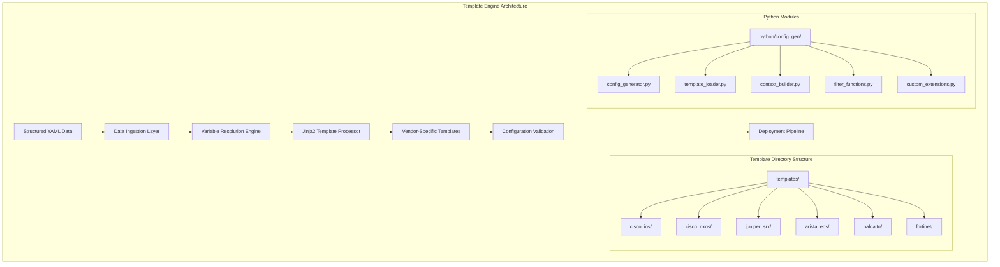
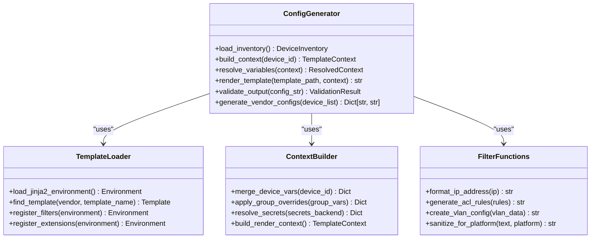
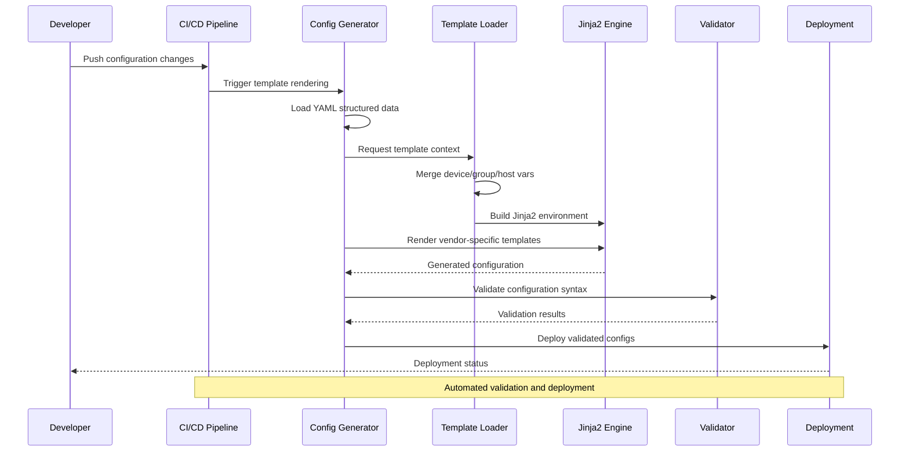
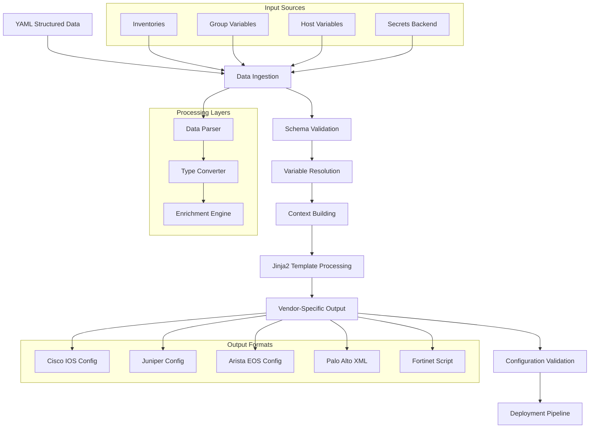
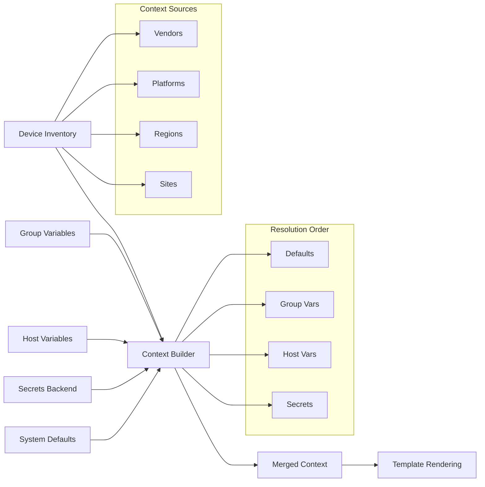
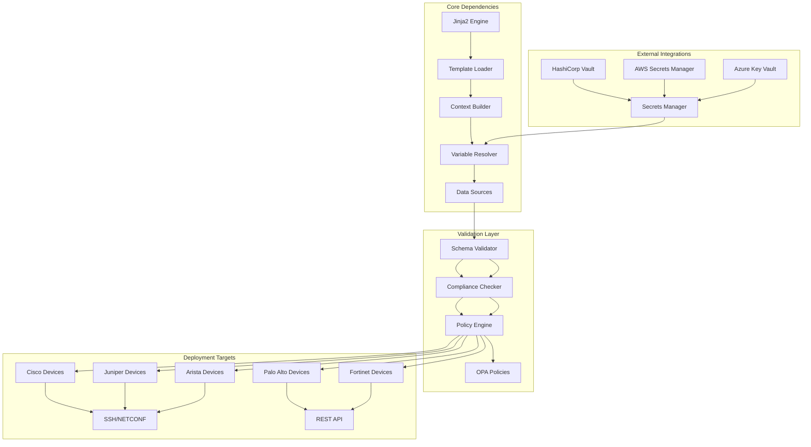

# Template Engine Architecture

<cite>
**Referenced Files in This Document**
- [README.md](file://README.md)
</cite>

## Table of Contents
1. [Introduction](#introduction)
2. [Project Structure](#project-structure)
3. [Core Components](#core-components)
4. [Architecture Overview](#architecture-overview)
5. [Detailed Component Analysis](#detailed-component-analysis)
6. [Dependency Analysis](#dependency-analysis)
7. [Performance Considerations](#performance-considerations)
8. [Troubleshooting Guide](#troubleshooting-guide)
9. [Conclusion](#conclusion)

## Introduction

The Enterprise Network Automation Platform implements a sophisticated Jinja2-based template engine architecture designed for multi-vendor network automation at enterprise scale. This system transforms structured YAML data into vendor-specific network configurations through a comprehensive rendering pipeline that supports Cisco IOS/NX-OS, Juniper SRX/MX, Arista EOS, Palo Alto PAN-OS, Fortinet FortiOS, and other major networking platforms.

The template engine serves as the core component of the "Network as Code" principle, enabling consistent configuration generation across diverse vendor ecosystems while maintaining platform-specific syntax and capabilities. The architecture emphasizes maintainability, testability, and compliance enforcement throughout the configuration lifecycle.

## Project Structure

The template engine architecture follows a modular design with clear separation of concerns:



**Diagram sources**
- [README.md:103-180](file://README.md#L103-L180)
- [README.md:438-456](file://README.md#L438-L456)

The architecture organizes templates by vendor under dedicated subdirectories, ensuring clean separation of platform-specific logic while maintaining shared business rules in structured data formats.

**Section sources**
- [README.md:103-180](file://README.md#L103-L180)
- [README.md:438-456](file://README.md#L438-L456)

## Core Components

### Config Generation Module (`python/config_gen/`)

The config generation module serves as the central orchestrator for the template rendering pipeline. It coordinates data ingestion, variable resolution, template loading, and output generation across multiple vendor platforms.

#### Key Responsibilities:
- **Data Ingestion**: Loading structured YAML configuration data from inventories and variables
- **Context Building**: Constructing Jinja2 template context from device inventory and group/host variables  
- **Template Resolution**: Selecting appropriate vendor-specific templates based on device attributes
- **Rendering Pipeline**: Executing Jinja2 template processing with custom filters and extensions
- **Validation Integration**: Coordinating with validation modules for pre-deployment checks

#### Module Architecture:


**Diagram sources**
- [README.md:438-456](file://README.md#L438-L456)

### Template Directory Structure

The template organization follows vendor-specific directories under `templates/`, each containing platform-appropriate Jinja2 templates:

| Vendor Directory | Platforms Supported | Configuration Types |
|------------------|-------------------|---------------------|
| `cisco_ios/` | Cisco IOS, IOS-XE | VLANs, ACLs, routing protocols, interfaces |
| `cisco_nxos/` | Cisco NX-OS | VLANs, ACI policies, fabric configuration |
| `juniper_srx/` | Juniper SRX | Security zones, policies, NAT rules |
| `juniper_mx/` | Juniper MX | Routing, firewall policies, interface configs |
| `arista_eos/` | Arista EOS | VLANs, STP, routing protocols, eAPI |
| `paloalto/` | Palo Alto PAN-OS | Security policies, address objects, zones |
| `fortinet/` | Fortinet FortiOS | Firewall policies, address groups, interfaces |

**Section sources**
- [README.md:116-128](file://README.md#L116-L128)

## Architecture Overview

The template rendering pipeline implements a comprehensive workflow from structured data input to vendor-specific configuration output:



**Diagram sources**
- [README.md:479-501](file://README.md#L479-L501)
- [README.md:272-274](file://README.md#L272-L274)

### Data Flow Architecture



**Diagram sources**
- [README.md:103-180](file://README.md#L103-L180)

## Detailed Component Analysis

### Template Processing Workflow

The template processing workflow implements a multi-stage pipeline ensuring data integrity and configuration correctness:

#### Stage 1: Data Ingestion
- **Source Identification**: Loads YAML data from inventories, group_vars, and host_vars
- **Schema Validation**: Validates data structure against predefined schemas
- **Type Conversion**: Converts string values to appropriate Python types
- **Secret Resolution**: Integrates with secrets backends for sensitive data

#### Stage 2: Variable Resolution  
- **Hierarchy Resolution**: Applies variable precedence (host > group > default)
- **Conditional Logic**: Evaluates conditional expressions based on device attributes
- **Template Functions**: Processes built-in and custom template functions
- **Error Handling**: Provides meaningful error messages for missing variables

#### Stage 3: Template Rendering
- **Environment Setup**: Initializes Jinja2 environment with custom filters and extensions
- **Template Selection**: Chooses appropriate vendor-specific templates
- **Context Injection**: Injects resolved variables into template context
- **Rendering Execution**: Processes templates with error handling and logging

#### Stage 4: Validation and Deployment
- **Syntax Validation**: Checks generated configuration syntax
- **Compliance Checking**: Enforces security and operational policies
- **Dry Run Testing**: Simulates deployment without applying changes
- **Automated Deployment**: Applies validated configurations to target devices

**Section sources**
- [README.md:479-501](file://README.md#L479-L501)
- [README.md:674-685](file://README.md#L674-L685)

### Template Context Building Process

The context building process constructs comprehensive Jinja2 template contexts by merging multiple data sources:



**Diagram sources**
- [README.md:284-335](file://README.md#L284-L335)

### Filter Functions and Custom Extensions

The template engine extends Jinja2 with custom filter functions and extensions tailored for network automation:

#### Built-in Filter Functions:
- **IP Address Formatting**: Standardizes IP address representations across vendors
- **ACL Rule Generation**: Creates vendor-specific access control list syntax
- **VLAN Configuration**: Generates platform-appropriate VLAN definitions
- **Interface Naming**: Normalizes interface naming conventions
- **Security Policy Creation**: Builds firewall and security policy configurations

#### Custom Jinja2 Extensions:
- **Secret Management**: Secure integration with HashiCorp Vault and cloud secret managers
- **Device Capability Detection**: Conditional template rendering based on device features
- **Compliance Enforcement**: Real-time policy checking during template rendering
- **Configuration Diffing**: Comparison utilities for change impact analysis

**Section sources**
- [README.md:438-456](file://README.md#L438-L456)

### Multi-Vendor VLAN Configuration Example

The template engine demonstrates its multi-vendor capabilities through unified VLAN management:

#### Input Definition (YAML):
```yaml
vlans:
  - id: 100
    name: "Corporate Users"
    description: "Corporate user access VLAN"
    subnet: "10.100.0.0/24"
    gateway: "10.100.0.1"
    enabled: true
    security_policy: "standard_corporate"
```

#### Vendor-Specific Outputs:

**Cisco IOS:**
```
vlan 100
 name Corporate Users
 description Corporate user access VLAN
 ip helper-address 10.100.0.1
```

**Juniper SRX:**
```
set vlans vlan-100 vlan-id 100
set vlans vlan-100 l3-interface ge-0/0/1.100
set vlans vlan-100 dhcp-relay group corporate-dhcp
```

**Arista EOS:**
```
vlan 100
   name Corporate Users
   description Corporate user access VLAN
ip route 10.100.0.0/24 10.100.0.1
```

**Palo Alto PAN-OS:**
```xml
<vsys>
  <entry name="vsys1">
    <interface>
      <ethernet>
        <entry name="eth1/1">
          <tagging>
            <entry name="100">
              <native-tagging/>
            </entry>
          </tagging>
        </entry>
      </ethernet>
    </interface>
  </entry>
</vsys>
```

This example illustrates how a single YAML definition generates platform-specific configurations while maintaining semantic consistency across different vendor ecosystems.

**Section sources**
- [README.md:116-128](file://README.md#L116-L128)
- [README.md:203-217](file://README.md#L203-L217)

## Dependency Analysis

The template engine architecture maintains clear dependency boundaries and modular relationships:



**Diagram sources**
- [README.md:339-357](file://README.md#L339-L357)
- [README.md:438-456](file://README.md#L438-L456)

### Component Coupling Analysis

The architecture demonstrates low coupling between components through well-defined interfaces:

- **Template Loader**: Decouples template discovery from rendering logic
- **Context Builder**: Abstracts data source complexity from template processing
- **Filter Functions**: Provides reusable transformation logic independent of specific templates
- **Custom Extensions**: Encapsulates complex functionality behind simple APIs

### External Dependencies

The system integrates with multiple external services:

| Service Type | Examples | Purpose |
|-------------|----------|---------|
| **Secrets Management** | HashiCorp Vault, AWS Secrets Manager, Azure Key Vault | Secure credential storage and retrieval |
| **Validation Services** | JSON Schema validators, OPA policy engines | Configuration compliance and security checks |
| **Device Communication** | SSH clients, NETCONF/RESTCONF libraries | Configuration deployment and monitoring |
| **CI/CD Integration** | GitHub Actions, Jenkins, GitLab CI | Automated testing and deployment workflows |

**Section sources**
- [README.md:339-357](file://README.md#L339-L357)
- [README.md:438-456](file://README.md#L438-L456)

## Performance Considerations

For large-scale deployments supporting thousands of devices, the template engine implements several performance optimization strategies:

### Caching Strategies
- **Template Compilation Caching**: Pre-compiles frequently used templates to bytecode
- **Context Caching**: Stores computed template contexts for repeated device types
- **Secret Retrieval Caching**: Implements time-based caching for secrets backend calls
- **File System Caching**: Uses efficient file system operations for template loading

### Parallel Processing
- **Concurrent Template Rendering**: Processes multiple device configurations simultaneously
- **Batch Operations**: Groups similar device types for optimized template reuse
- **Resource Pooling**: Manages database connections and network resources efficiently

### Memory Management
- **Streaming Processing**: Handles large configuration files without loading entire contents into memory
- **Garbage Collection Optimization**: Explicitly manages object lifecycles for long-running processes
- **Memory-Efficient Data Structures**: Uses generators and iterators for large dataset processing

### Scalability Patterns
- **Horizontal Scaling**: Supports distributed template rendering across multiple workers
- **Load Balancing**: Distributes rendering tasks across available compute resources
- **Graceful Degradation**: Maintains partial functionality during resource constraints

## Troubleshooting Guide

The template engine provides comprehensive debugging and troubleshooting capabilities:

### Debug Mode Activation
Enable detailed debugging information using command-line flags:

```bash
# Enable debug mode for template rendering
python -m python.config_gen --debug --device core-rtr-01 --output ./output/

# Generate verbose logs for troubleshooting
python -m python.config_gen --verbose --device fw-edge-01 --log-level DEBUG
```

### Common Issues and Resolutions

| Issue Category | Symptoms | Resolution Steps |
|---------------|----------|------------------|
| **Template Syntax Errors** | Jinja2 compilation failures, undefined variable errors | Check template syntax, verify variable names, validate template inheritance |
| **Variable Resolution Failures** | Missing variable errors, type conversion issues | Verify inventory structure, check variable precedence, validate data types |
| **Secret Access Problems** | Authentication failures, permission denied errors | Verify secrets backend connectivity, check credentials, validate policies |
| **Performance Bottlenecks** | Slow rendering times, high memory usage | Enable caching, optimize template complexity, review parallel processing settings |
| **Vendor Compatibility Issues** | Platform-specific syntax errors, feature mismatches | Verify device capabilities, check platform version compatibility |

### Logging and Monitoring

The system implements comprehensive logging at multiple levels:

- **Template Rendering Logs**: Detailed information about template processing steps
- **Variable Resolution Logs**: Trace variable lookup and resolution paths  
- **Error Tracking**: Structured error reporting with stack traces and context
- **Performance Metrics**: Timing information for template rendering operations
- **Audit Trails**: Complete history of configuration changes and deployments

**Section sources**
- [README.md:674-685](file://README.md#L674-L685)
- [README.md:272-274](file://README.md#L272-L274)

## Conclusion

The Enterprise Network Automation Platform's Jinja2-based template engine architecture provides a robust, scalable solution for multi-vendor network automation. The system successfully abstracts vendor-specific complexities while maintaining platform-appropriate configuration syntax and capabilities.

Key architectural strengths include:

- **Modular Design**: Clear separation of concerns enables maintainable and extensible codebase
- **Multi-Vendor Support**: Unified approach to managing diverse networking equipment
- **Enterprise-Grade Features**: Comprehensive validation, compliance, and security controls
- **Scalability**: Optimized for large-scale deployments with thousands of devices
- **Operational Excellence**: Extensive debugging, monitoring, and troubleshooting capabilities

The template engine serves as the foundation for the platform's "Network as Code" philosophy, enabling consistent, automated, and compliant network configuration management across heterogeneous environments. The architecture balances flexibility with standardization, allowing teams to leverage vendor-specific features while maintaining operational consistency and security posture.

Future enhancements focus on advanced AI-driven anomaly detection, zero-touch provisioning integration, and enhanced observability features to further improve operational efficiency and reliability.