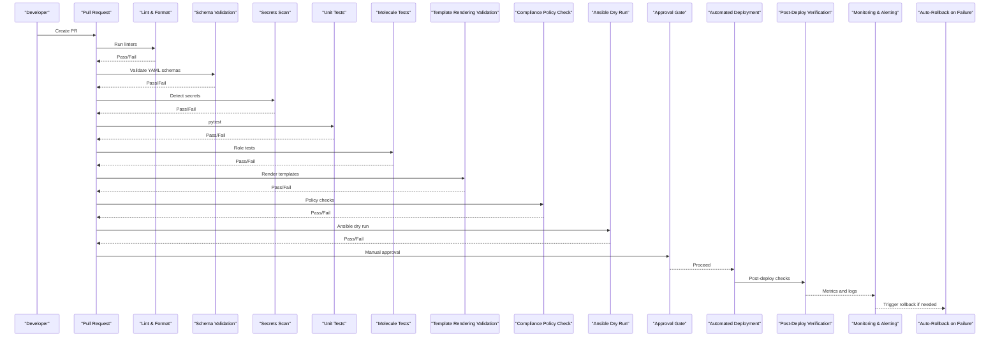
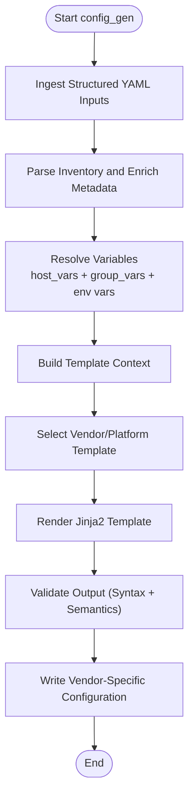
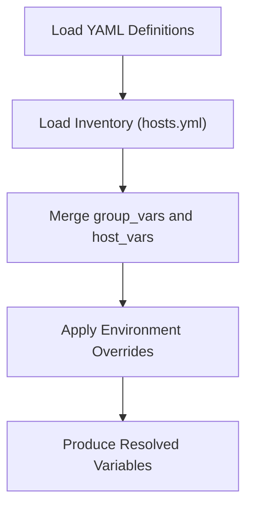
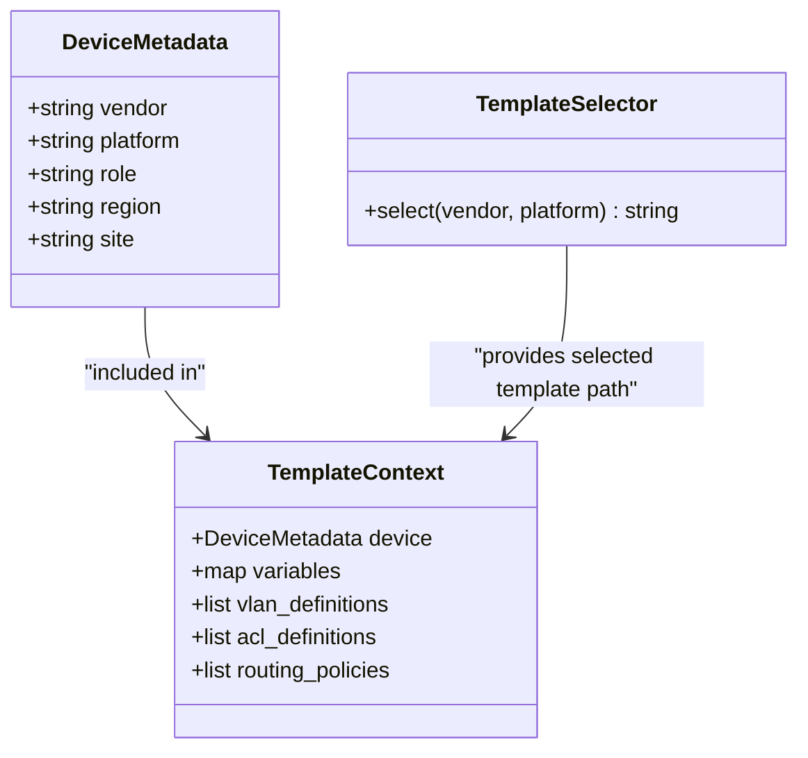
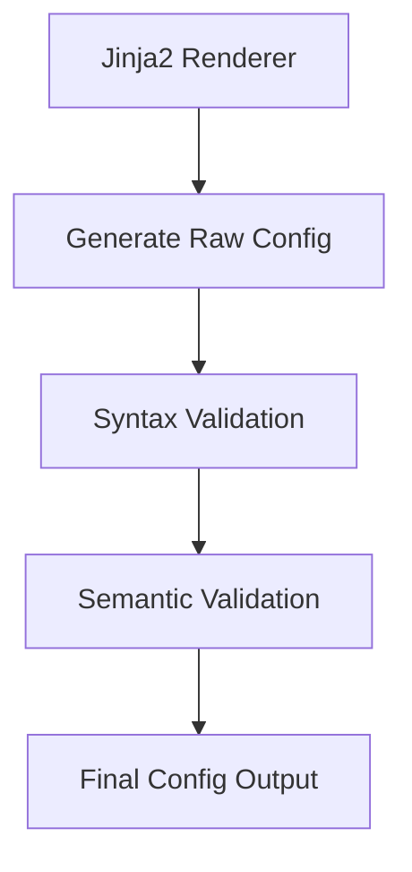
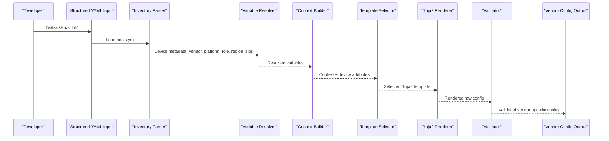
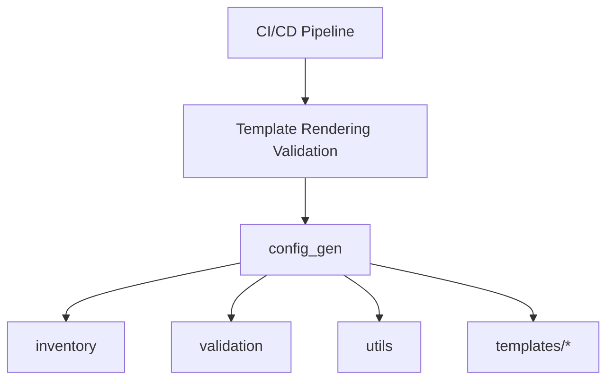

# Template Processing Pipeline

<cite>
**Referenced Files in This Document**
- [README.md](file://README.md)
</cite>

## Table of Contents
1. [Introduction](#introduction)
2. [Project Structure](#project-structure)
3. [Core Components](#core-components)
4. [Architecture Overview](#architecture-overview)
5. [Detailed Component Analysis](#detailed-component-analysis)
6. [Dependency Analysis](#dependency-analysis)
7. [Performance Considerations](#performance-considerations)
8. [Troubleshooting Guide](#troubleshooting-guide)
9. [Conclusion](#conclusion)
10. [Appendices](#appendices)

## Introduction
This document explains the template processing pipeline used by the Enterprise Network Automation Platform to transform structured YAML inputs into vendor-specific device configurations via Jinja2 rendering. It focuses on the config_gen module’s responsibilities, including data ingestion, variable resolution, template context building, and validation stages. It also covers pipeline architecture, error handling, logging, performance optimization, debugging techniques using --debug flags, and troubleshooting common rendering issues. A concrete example traces a single VLAN definition through each stage from input to output.

## Project Structure
The platform organizes configuration templates per vendor under a dedicated directory and provides Python modules for automation tasks, including configuration generation. The repository layout highlights where templates and Python modules live, and how they integrate with Ansible and CI/CD workflows.

```mermaid
graph TB
subgraph "Templates"
T_Cisco["templates/cisco_ios"]
T_NXOS["templates/cisco_nxos"]
T_IOSXE["templates/cisco_iosxe"]
T_JuniperSRX["templates/juniper_srx"]
T_JuniperMX["templates/juniper_mx"]
T_Arista["templates/arista_eos"]
T_PaloAlto["templates/paloalto"]
T_Fortinet["templates/fortinet"]
T_CheckPoint["templates/checkpoint"]
T_F5["templates/f5"]
T_pfSense["templates/pfsense"]
T_OPNSense["templates/opnsense"]
end
subgraph "Python Modules"
P_Inventory["python/inventory"]
P_ConfigGen["python/config_gen"]
P_Validation["python/validation"]
P_Utils["python/utils"]
end
subgraph "CI/CD"
C_Lint["Lint & Format"]
C_Schema["Schema Validation"]
C_Templates["Template Rendering Validation"]
C_Compliance["Compliance Policy Check"]
C_DryRun["Ansible Dry Run"]
end
P_ConfigGen --> T_Cisco
P_ConfigGen --> T_NXOS
P_ConfigGen --> T_IOSXE
P_ConfigGen --> T_JuniperSRX
P_ConfigGen --> T_JuniperMX
P_ConfigGen --> T_Arista
P_ConfigGen --> T_PaloAlto
P_ConfigGen --> T_Fortinet
P_ConfigGen --> T_CheckPoint
P_ConfigGen --> T_F5
P_ConfigGen --> T_pfSense
P_ConfigGen --> T_OPNSense
P_Inventory --> P_ConfigGen
P_ConfigGen --> P_Validation
P_ConfigGen --> P_Utils
C_Lint --> C_Schema
C_Schema --> C_Templates
C_Templates --> C_Compliance
C_Compliance --> C_DryRun
```

**Diagram sources**
- [README.md:105-180](file://README.md#L105-L180)
- [README.md:438-456](file://README.md#L438-L456)
- [README.md:479-516](file://README.md#L479-L516)

**Section sources**
- [README.md:105-180](file://README.md#L105-L180)
- [README.md:438-456](file://README.md#L438-L456)
- [README.md:479-516](file://README.md#L479-L516)

## Core Components
- config_gen module: Implements Jinja2-based configuration generation from structured data. It orchestrates data ingestion, variable resolution, template selection, context building, rendering, and validation.
- inventory module: Parses inventories and enriches device metadata (vendor, platform, role, region, site).
- validation module: Performs pre-deployment configuration validation (syntax + semantics).
- utils module: Provides logging, retry, concurrency, diff, and bulk operations utilities.
- Templates directory: Contains vendor-specific Jinja2 templates organized by vendor/platform.

Key responsibilities:
- Data ingestion: Load structured YAML inputs and inventory variables.
- Variable resolution: Merge host_vars, group_vars, and environment-specific values.
- Template context building: Construct a typed context object for Jinja2 rendering.
- Template selection: Choose appropriate vendor/platform templates based on device attributes.
- Rendering: Execute Jinja2 templates against the context to produce vendor-specific configuration.
- Validation: Apply schema checks and semantic rules before outputting final configs.

**Section sources**
- [README.md:438-456](file://README.md#L438-L456)
- [README.md:105-180](file://README.md#L105-L180)

## Architecture Overview
The template processing pipeline integrates with CI/CD to validate and render configurations safely before deployment. The flow includes linting, schema validation, secrets scanning, unit tests, Molecule tests, template rendering validation, compliance checks, dry run, approval gate, deployment, post-deploy verification, documentation generation, release, artifacts publishing, and rollback on failure.

**Diagram sources**
- [README.md:479-516](file://README.md#L479-L516)

**Section sources**
- [README.md:479-516](file://README.md#L479-L516)

## Detailed Component Analysis

### Config Generation Module (config_gen)
The config_gen module is responsible for transforming structured YAML inputs into vendor-specific configurations using Jinja2 templates. It coordinates with inventory parsing, variable resolution, template selection, context construction, rendering, and validation.

**Diagram sources**
- [README.md:438-456](file://README.md#L438-L456)
- [README.md:105-180](file://README.md#L105-L180)

**Section sources**
- [README.md:438-456](file://README.md#L438-L456)
- [README.md:105-180](file://README.md#L105-L180)

### Data Ingestion and Variable Resolution
Data ingestion loads structured YAML definitions (e.g., VLANs, ACLs, routing policies) and merges them with inventory-derived variables. Variable resolution ensures that device-specific and environment-specific values are correctly applied.

**Diagram sources**
- [README.md:311-335](file://README.md#L311-L335)
- [README.md:438-456](file://README.md#L438-L456)

**Section sources**
- [README.md:311-335](file://README.md#L311-L335)
- [README.md:438-456](file://README.md#L438-L456)

### Template Context Building and Selection
The context builder constructs a strongly-typed context object containing resolved variables and device metadata. Template selection chooses the correct Jinja2 template based on vendor and platform attributes.

**Diagram sources**
- [README.md:311-335](file://README.md#L311-L335)
- [README.md:105-180](file://README.md#L105-L180)

**Section sources**
- [README.md:311-335](file://README.md#L311-L335)
- [README.md:105-180](file://README.md#L105-L180)

### Rendering and Validation Stages
Rendering executes Jinja2 templates against the constructed context to produce vendor-specific configuration text. Validation applies syntax and semantic checks to ensure correctness and compliance before output.

**Diagram sources**
- [README.md:438-456](file://README.md#L438-L456)
- [README.md:479-516](file://README.md#L479-L516)

**Section sources**
- [README.md:438-456](file://README.md#L438-L456)
- [README.md:479-516](file://README.md#L479-L516)

### Concrete Example: Single VLAN Definition Flow
This example shows how a single VLAN definition flows through the pipeline from YAML input to vendor-specific configuration output.

**Diagram sources**
- [README.md:311-335](file://README.md#L311-L335)
- [README.md:438-456](file://README.md#L438-L456)
- [README.md:105-180](file://README.md#L105-L180)

**Section sources**
- [README.md:311-335](file://README.md#L311-L335)
- [README.md:438-456](file://README.md#L438-L456)
- [README.md:105-180](file://README.md#L105-L180)

## Dependency Analysis
The config_gen module depends on inventory parsing, validation, and utilities. Templates are selected based on vendor and platform attributes. CI/CD integrates template rendering validation early to catch errors before deployment.

**Diagram sources**
- [README.md:438-456](file://README.md#L438-L456)
- [README.md:479-516](file://README.md#L479-L516)

**Section sources**
- [README.md:438-456](file://README.md#L438-L456)
- [README.md:479-516](file://README.md#L479-L516)

## Performance Considerations
For large-scale deployments, consider the following optimizations:
- Batch processing: Group devices by vendor/platform to reuse template loaders and contexts.
- Caching: Cache parsed inventories and resolved variables to avoid repeated I/O.
- Concurrency: Use parallel rendering across independent devices while respecting rate limits.
- Incremental rendering: Only re-render changed templates when inputs change.
- Profiling: Measure rendering time per device and identify hotspots.

[No sources needed since this section provides general guidance]

## Troubleshooting Guide
Common issues and resolutions:
- Template rendering error: Use debug mode to inspect context and template paths. Command reference: `python -m python.config_gen --debug --device <name>`
- Ansible connection timeout: Verify SSH reachability using ping against inventory.
- Compliance check failure: Review compliance policies and device running config diffs.
- CI pipeline failure: Inspect GitHub Actions logs; failures typically include actionable messages.
- Vault authentication failure: Verify OIDC token or AppRole credentials and Vault policies.
- Molecule test failure: Ensure Docker/Podman is running and check molecule configuration.
- Batfish analysis error: Validate snapshots in the designated directory.

**Section sources**
- [README.md:674-685](file://README.md#L674-L685)

## Conclusion
The template processing pipeline transforms structured YAML inputs into vendor-specific configurations through a robust sequence of data ingestion, variable resolution, context building, template selection, rendering, and validation. Integrated with CI/CD, it ensures safety and compliance at every stage. Debugging tools and performance strategies enable efficient operation at enterprise scale.

[No sources needed since this section summarizes without analyzing specific files]

## Appendices
- Quick start command for generating configuration: `python -m python.config_gen --device core-rtr-01 --output ./output/`
- Supported vendors and platforms are listed in the repository overview.

**Section sources**
- [README.md:272-280](file://README.md#L272-L280)
- [README.md:203-226](file://README.md#L203-L226)