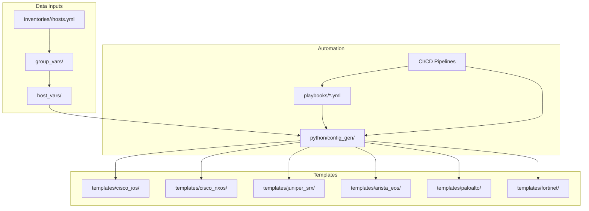
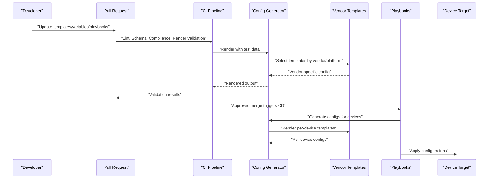
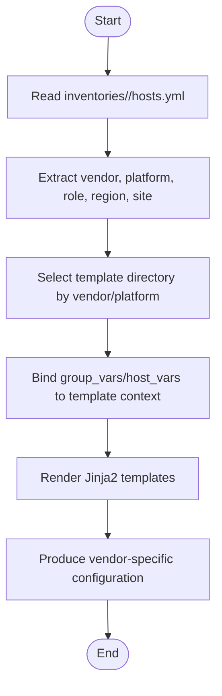
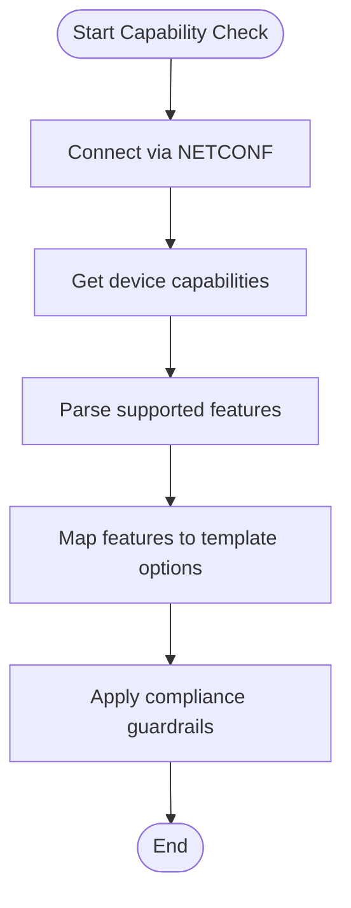
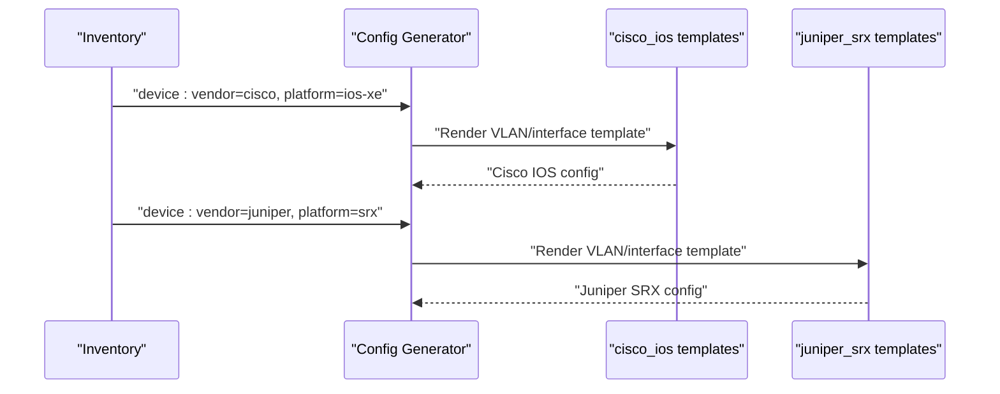
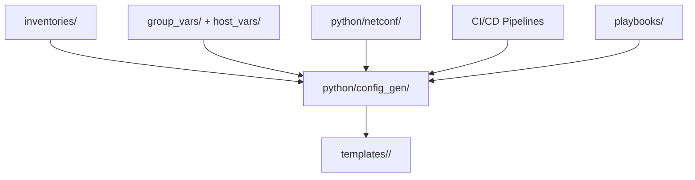

# Vendor Abstraction Layer

<cite>
**Referenced Files in This Document**
- [README.md](file://README.md)
</cite>

## Table of Contents
1. [Introduction](#introduction)
2. [Project Structure](#project-structure)
3. [Core Components](#core-components)
4. [Architecture Overview](#architecture-overview)
5. [Detailed Component Analysis](#detailed-component-analysis)
6. [Dependency Analysis](#dependency-analysis)
7. [Performance Considerations](#performance-considerations)
8. [Troubleshooting Guide](#troubleshooting-guide)
9. [Conclusion](#conclusion)
10. [Appendices](#appendices)

## Introduction
This document explains the vendor abstraction layer that enables multi-vendor support in the template engine. It focuses on how common network concepts (VLANs, routing protocols, ACLs) are mapped to vendor-specific syntax via Jinja2 templates and structured data, how platform detection and capability negotiation work, and how feature availability is managed across vendors. It also provides guidance for adding new vendor support and maintaining backward compatibility.

The repository uses a GitOps-driven approach where all configurations are generated from Jinja2 templates and structured data. The automation stack includes Ansible, Python modules, and CI/CD pipelines that validate and render templates before deployment.

## Project Structure
The vendor abstraction layer centers around:
- A per-vendor template directory under templates/
- Structured data inputs (inventory and variables)
- Python configuration generation module
- Playbooks that orchestrate rendering and deployment
- CI/CD steps that validate templates and run dry runs

**Diagram sources**
- [README.md:103-180](file://README.md#L103-L180)
- [README.md:438-456](file://README.md#L438-L456)
- [README.md:479-514](file://README.md#L479-L514)

**Section sources**
- [README.md:103-180](file://README.md#L103-L180)
- [README.md:438-456](file://README.md#L438-L456)
- [README.md:479-514](file://README.md#L479-L514)

## Core Components
- Template directories per vendor: Each vendor has its own folder under templates/, containing Jinja2 templates for services such as VLANs, routing protocols, ACLs, NAT, VPN, etc.
- Inventory and variables: Device metadata (vendor, platform, role, region, site) drives template selection and variable binding.
- Configuration generator: A Python module renders Jinja2 templates using structured data and outputs device-specific configuration.
- Playbooks: Orchestrate tasks like initial provisioning, network services, routing protocols, HA, and operations.
- CI/CD validation: Linting, schema checks, compliance policies, template rendering validation, and dry runs ensure correctness before deployment.

Key responsibilities:
- Platform detection: Determine target vendor/platform from inventory fields.
- Capability negotiation: Use NETCONF client capabilities or other discovery mechanisms to determine supported features.
- Feature matrix: Map logical features to vendor-specific template implementations and guardrails.

**Section sources**
- [README.md:103-180](file://README.md#L103-L180)
- [README.md:284-335](file://README.md#L284-L335)
- [README.md:438-456](file://README.md#L438-L456)
- [README.md:371-436](file://README.md#L371-L436)
- [README.md:479-514](file://README.md#L479-L514)

## Architecture Overview
The vendor abstraction layer sits between structured data and vendor-specific templates. The flow is:
- Inventory and variables define device attributes and desired state.
- The configuration generator selects appropriate templates based on vendor/platform.
- Templates render vendor-specific CLI/API payloads.
- CI/CD validates templates and performs dry runs; playbooks deploy validated configurations.

**Diagram sources**
- [README.md:479-514](file://README.md#L479-L514)
- [README.md:438-456](file://README.md#L438-L456)
- [README.md:103-180](file://README.md#L103-L180)

## Detailed Component Analysis

### Template Directory Organization
Each vendor has a dedicated directory under templates/. Supported directories include:
- cisco_ios
- cisco_nxos
- juniper_srx
- arista_eos
- paloalto
- fortinet
- Additional vendors: checkpoint, f5, pfsense, opnsense

Within each directory, templates are organized by service domain (e.g., VLANs, routing, ACLs). The same logical intent (e.g., create VLAN 100) maps to different template files per vendor.

**Section sources**
- [README.md:103-180](file://README.md#L103-L180)

### Data Model and Inventory Fields
Inventory entries provide the essential fields used by the abstraction layer:
- vendor: e.g., cisco, juniper, arista, paloalto, fortinet
- platform: e.g., ios-xe, panos
- role: e.g., core_router, firewall
- region/site: environment context

These fields drive template selection and variable scoping.

**Diagram sources**
- [README.md:284-335](file://README.md#L284-L335)
- [README.md:438-456](file://README.md#L438-L456)

**Section sources**
- [README.md:284-335](file://README.md#L284-L335)

### Platform Detection Mechanism
Platform detection relies on inventory fields:
- vendor and platform fields identify the target OS and family.
- roles and regions help scope shared variables and policy application.

The configuration generator uses these fields to select the correct template directory and apply relevant filters.

**Section sources**
- [README.md:284-335](file://README.md#L284-L335)
- [README.md:438-456](file://README.md#L438-L456)

### Capability Negotiation and Feature Availability Matrix
Capability negotiation is implemented through the NETCONF client module, which can query device capabilities to determine supported features. This informs:
- Which templates to use
- Conditional rendering within templates
- Guardrails in CI/CD to prevent unsupported features

Feature availability is effectively captured by:
- Template conditionals keyed on platform/vendor
- Capability responses from NETCONF
- Compliance checks ensuring only approved features are deployed

**Diagram sources**
- [README.md:438-456](file://README.md#L438-L456)

**Section sources**
- [README.md:438-456](file://README.md#L438-L456)

### Mapping Common Network Concepts to Vendor-Specific Syntax
Common concepts mapped across vendors include:
- VLANs: Create and assign interfaces per vendor syntax
- Routing protocols: OSPF, BGP, IS-IS configuration blocks
- ACLs: Access control lists and rule ordering
- NAT: Source/destination translation rules
- VPN: Site-to-site and remote-access tunnels
- QoS: Traffic classes and policies
- Trunking/LACP: Port channels and link aggregation

The mapping is achieved by:
- Shared structured data describing logical intent
- Per-vendor templates implementing vendor-specific commands
- Conditionals handling differences in syntax and defaults

Examples of logical-to-syntax mapping:
- Logical VLAN creation -> Cisco IOS vs Juniper SRX template variants
- Logical ACL rule -> Cisco IOS named ACL vs Juniper SRX security policy
- Logical BGP peer -> Cisco IOS router bgp block vs Juniper SRX routing-options bgp group

Note: Specific command content is not included here; refer to the corresponding template files under each vendor directory for exact syntax.

**Section sources**
- [README.md:103-180](file://README.md#L103-L180)
- [README.md:371-436](file://README.md#L371-L436)

### Example: Same Logical Configuration Across Cisco IOS and Juniper SRX
Conceptual example:
- Intent: Configure VLAN 100 and attach an interface
- Cisco IOS path: templates/cisco_ios/
- Juniper SRX path: templates/juniper_srx/

The configuration generator selects the appropriate template directory based on inventory vendor/platform and renders the vendor-specific output.

[No sources needed since this diagram shows conceptual workflow, not actual code structure]

### Adding New Vendor Support
Steps to add a new vendor:
1. Create a new directory under templates/ for the vendor (e.g., templates/new_vendor/).
2. Implement Jinja2 templates for required services (VLANs, routing, ACLs, etc.).
3. Ensure inventory supports the new vendor/platform values.
4. Update playbooks if necessary to handle new vendor-specific tasks.
5. Add unit tests and golden config tests for the new templates.
6. Validate via CI/CD pipeline (linting, schema, compliance, template rendering).

Maintain backward compatibility:
- Keep existing template APIs stable
- Use conditionals for optional features
- Avoid breaking changes to shared structured data schemas
- Run regression tests against existing vendors

**Section sources**
- [README.md:103-180](file://README.md#L103-L180)
- [README.md:438-456](file://README.md#L438-L456)
- [README.md:479-514](file://README.md#L479-L514)

## Dependency Analysis
The vendor abstraction layer depends on:
- Inventory and variables for device metadata
- Python configuration generator for template rendering
- NETCONF client for capability negotiation
- CI/CD pipelines for validation and dry runs
- Playbooks for orchestration and deployment

**Diagram sources**
- [README.md:103-180](file://README.md#L103-L180)
- [README.md:438-456](file://README.md#L438-L456)
- [README.md:479-514](file://README.md#L479-L514)

**Section sources**
- [README.md:103-180](file://README.md#L103-L180)
- [README.md:438-456](file://README.md#L438-L456)
- [README.md:479-514](file://README.md#L479-L514)

## Performance Considerations
- Template rendering should be optimized to avoid unnecessary loops and heavy computations.
- Use caching for capability negotiation results when feasible.
- Parallelize template rendering across devices where possible.
- Validate templates early in CI/CD to catch errors before deployment.

[No sources needed since this section provides general guidance]

## Troubleshooting Guide
Common issues and resolutions:
- Template rendering error: Use debug flags in the configuration generator to inspect rendered output.
- Compliance check failure: Review compliance policies and device running config diffs.
- CI pipeline failure: Check GitHub Actions logs for actionable error messages.
- Vault authentication failure: Verify OIDC token or AppRole credentials and Vault policies.
- Molecule test failure: Ensure Docker/Podman is running and check molecule configuration.
- Batfish analysis error: Validate snapshots and configuration consistency.

**Section sources**
- [README.md:674-685](file://README.md#L674-L685)

## Conclusion
The vendor abstraction layer enables consistent, multi-vendor configuration management by separating logical intent from vendor-specific syntax. Through structured data, Jinja2 templates, capability negotiation, and robust CI/CD validation, the platform ensures reliable, compliant deployments across diverse network environments. Extending support to new vendors follows a clear process that maintains backward compatibility and leverages existing automation workflows.

[No sources needed since this section summarizes without analyzing specific files]

## Appendices

### Supported Vendors and Platforms
- Cisco: IOS, IOS-XE, NX-OS
- Juniper: SRX, MX
- Arista: EOS
- Palo Alto: PAN-OS
- Fortinet: FortiOS
- Check Point: Gaia
- F5: BIG-IP
- pfSense: FreeBSD-based
- OPNsense: FreeBSD-based

**Section sources**
- [README.md:203-226](file://README.md#L203-L226)

### Technology Stack Highlights
- Automation Engine: Ansible, Python 3.11+, NAPALM, Netmiko, Nornir
- Protocols: NETCONF, RESTCONF, SSH, SNMPv3, gRPC, Telemetry Streaming
- Templates: Jinja2, YAML structured data
- Testing: pytest, Molecule, ansible-lint, yamllint, Batfish, pyATS
- Monitoring: Prometheus, Grafana, OpenTelemetry, Alertmanager, Syslog
- Secrets: HashiCorp Vault, AWS Secrets Manager, Azure Key Vault, CyberArk, Ansible Vault

**Section sources**
- [README.md:184-199](file://README.md#L184-L199)