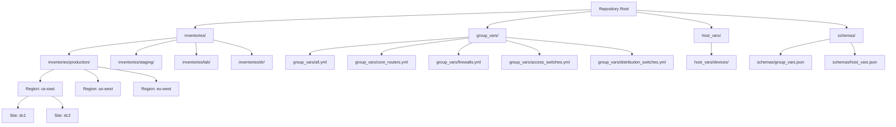
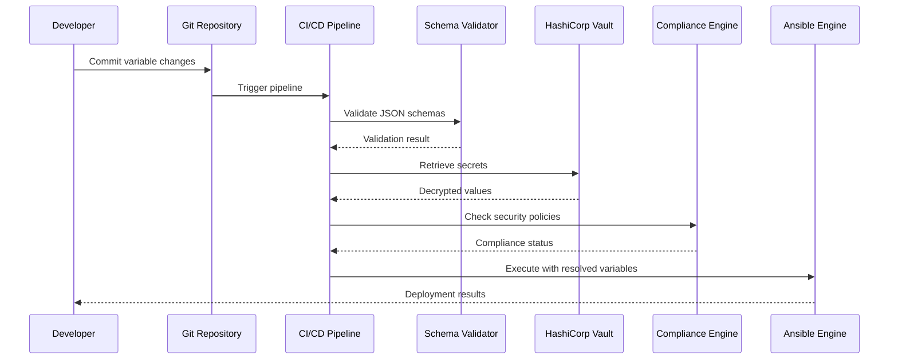
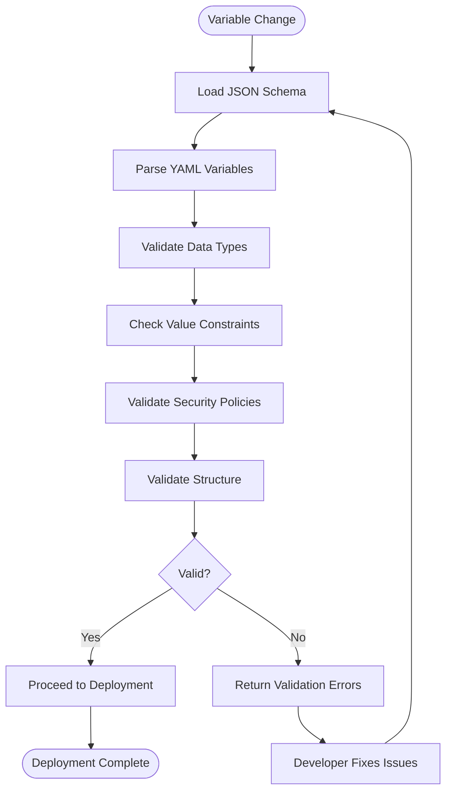
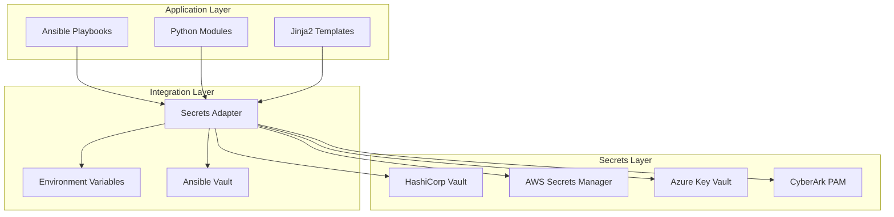
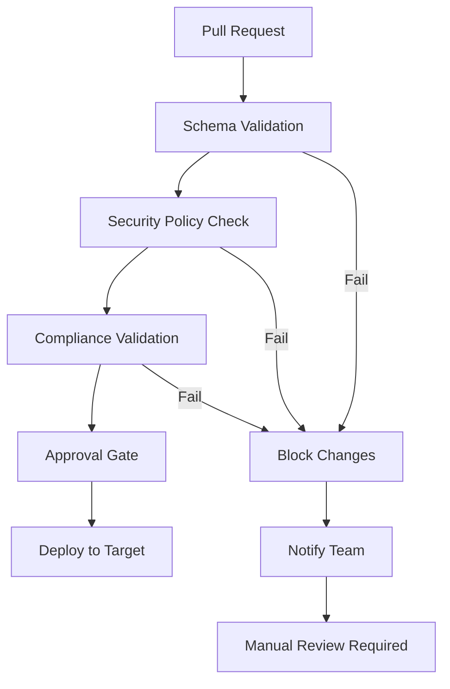
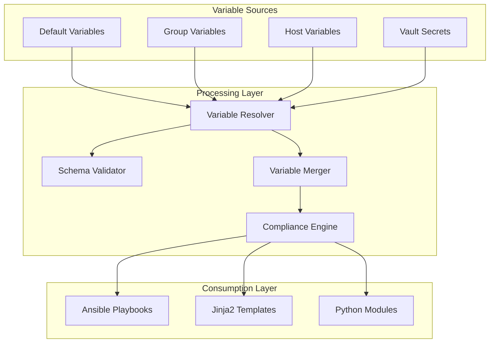

# Variable Management System

<cite>
**Referenced Files in This Document**
- [group_vars/all.yml](file://group_vars/all.yml)
- [group_vars/core_routers.yml](file://group_vars/core_routers.yml)
- [group_vars/firewalls.yml](file://group_vars/firewalls.yml)
- [group_vars/access_switches.yml](file://group_vars/access_switches.yml)
- [group_vars/distribution_switches.yml](file://group_vars/distribution_switches.yml)
- [host_vars/core-rtr-01-us-east.yml](file://host_vars/core-rtr-01-us-east.yml)
- [schemas/group_vars.json](file://schemas/group_vars.json)
- [schemas/host_vars.json](file://schemas/host_vars.json)
- [inventories/production/hosts.yml](file://inventories/production/hosts.yml)
- [README.md](file://README.md)
</cite>

## Update Summary
**Changes Made**
- Updated NTP configuration section to reflect authentication-enabled servers with key-based security
- Enhanced DNS configuration documentation with domain search and resolver redundancy
- Added comprehensive TACACS+ AAA configuration with three-server redundancy and vault integration
- Updated SNMP configuration to enforce v3-only compliance with SHA-256/AES-256 encryption
- Documented hardened SSH configuration with approved cipher suites and algorithms
- Added compliance baseline section covering approved firmware versions and golden config management
- Enhanced variable validation schema documentation with enterprise security requirements
- Updated troubleshooting guide with security-focused debugging techniques

## Table of Contents
1. [Introduction](#introduction)
2. [Project Structure](#project-structure)
3. [Core Components](#core-components)
4. [Architecture Overview](#architecture-overview)
5. [Detailed Component Analysis](#detailed-component-analysis)
6. [Enterprise Security Standards](#enterprise-security-standards)
7. [Variable Validation and Compliance](#variable-validation-and-compliance)
8. [Dependency Analysis](#dependency-analysis)
9. [Performance Considerations](#performance-considerations)
10. [Troubleshooting Guide](#troubleshooting-guide)
11. [Conclusion](#conclusion)

## Introduction

This document provides comprehensive coverage of the hierarchical variable management system used throughout the Enterprise Network Automation Platform. The platform implements a sophisticated variable resolution mechanism following Ansible best practices, supporting multi-environment deployments across production, staging, lab, and disaster recovery environments with enterprise-grade security standards.

The variable management system is designed to handle thousands of network devices across multiple vendors, regions, and sites while maintaining strict separation of concerns, environment isolation, and compliance enforcement. It supports complex data structures including strings, lists, dictionaries, and nested configurations for comprehensive network device management with built-in security hardening.

## Project Structure

The variable management system follows a well-defined directory structure that separates variables by scope, purpose, and security classification:



**Diagram sources**
- [group_vars/all.yml:1-180](file://group_vars/all.yml#L1-L180)
- [group_vars/core_routers.yml:1-87](file://group_vars/core_routers.yml#L1-L87)
- [group_vars/firewalls.yml:1-155](file://group_vars/firewalls.yml#L1-L155)
- [group_vars/access_switches.yml:1-115](file://group_vars/access_switches.yml#L1-L115)
- [group_vars/distribution_switches.yml:1-103](file://group_vars/distribution_switches.yml#L1-L103)

**Section sources**
- [group_vars/all.yml:1-180](file://group_vars/all.yml#L1-L180)
- [group_vars/core_routers.yml:1-87](file://group_vars/core_routers.yml#L1-L87)
- [group_vars/firewalls.yml:1-155](file://group_vars/firewalls.yml#L1-L155)
- [group_vars/access_switches.yml:1-115](file://group_vars/access_switches.yml#L1-L115)
- [group_vars/distribution_switches.yml:1-103](file://group_vars/distribution_switches.yml#L1-L103)

## Core Components

### Variable Precedence Order

The platform implements a strict variable precedence hierarchy that ensures consistent configuration management with enterprise security standards:

1. **Host Variables** (`host_vars/`) - Highest priority, device-specific overrides with security exceptions
2. **Group Variables** (`group_vars/`) - Medium priority, shared by device groups with security baselines
3. **Default Variables** - Lowest priority, secure baseline configurations

This precedence order allows for granular control where device-specific settings can override group-level defaults, which in turn override global baselines, while maintaining security compliance throughout the hierarchy.

### Environment Organization

The inventory system organizes devices across four primary environments with varying security postures:

| Environment | Purpose | Isolation Level | Security Posture |
|-------------|---------|----------------|------------------|
| **Production** | Live network operations | Full isolation with strict validation | Maximum security with compliance enforcement |
| **Staging** | Pre-production testing | Near-production parity | Production-like security with relaxed controls |
| **Lab** | Development and training | Relaxed constraints | Development-friendly with security awareness |
| **DR** | Disaster recovery scenarios | Standalone configuration | Recovery-focused with essential security |

### Role-Based Organization

Devices are categorized by their functional role within the network infrastructure with role-specific security profiles:

- **Core Routers**: High-performance routing devices at network core with BGP/OSPF/ISIS
- **Firewalls**: Security perimeter devices with zone-based policies
- **Distribution Switches**: Aggregation layer with HSRP/VRRP redundancy
- **Access Switches**: Edge connectivity with 802.1X/NAC support
- **Load Balancers**: Traffic distribution and application delivery
- **VPN Gateways**: Remote access and site-to-site connectivity

### Regional and Site Hierarchy

The platform supports geographic distribution through region and site organization with localized security policies:

- **Regions**: us-east, us-west, eu-west (with apac planned)
- **Sites**: dc1, dc2, dc3 (data center locations within each region)

**Section sources**
- [inventories/production/hosts.yml:1-491](file://inventories/production/hosts.yml#L1-L491)

## Architecture Overview

The variable management system integrates with the broader automation platform through multiple layers with enterprise security integration:



**Diagram sources**
- [schemas/group_vars.json:1-216](file://schemas/group_vars.json#L1-L216)
- [schemas/host_vars.json:1-331](file://schemas/host_vars.json#L1-L331)

## Detailed Component Analysis

### Variable File Structure and Naming Conventions

#### Group Variables Organization

The `group_vars/` directory contains shared variables organized by device roles with enterprise security standards:

```
group_vars/
├── all.yml                    # Global security baselines and common services
├── core_routers.yml           # Core router specific configurations
├── firewalls.yml              # Firewall policies and HA configuration
├── access_switches.yml        # Access layer security and port policies
└── distribution_switches.yml  # Distribution layer routing and redundancy
```

#### Host Variables Organization

The `host_vars/` directory contains device-specific overrides with local security exceptions:

```
host_vars/
├── core-rtr-01-us-east.yml    # Individual router configuration
├── fw-edge-01-us-east.yml     # Individual firewall configuration
└── sw-access-01-us-east.yml   # Individual switch configuration
```

### Variable Types and Data Structures

The platform supports comprehensive variable types for different configuration needs with security-aware structures:

#### String Variables
Used for simple text-based configurations like hostnames, descriptions, identifiers, and security policies.

#### List Variables
Used for arrays of values such as:
- NTP server lists with authentication keys
- DNS resolver lists with domain search
- AAA server lists with priority ordering
- Approved firmware version lists
- Security policy rule sets

#### Dictionary Variables
Used for structured configurations such as:
- Device interface configurations with security parameters
- Routing protocol parameters with authentication
- Security policies with cipher specifications
- Monitoring settings with encrypted credentials

#### Complex Nested Structures
Used for advanced configurations including:
- Multi-vendor template parameters with vendor-specific security
- Conditional logic configurations based on environment
- Policy-based routing rules with ACL integration
- Quality of Service (QoS) policies with traffic classification

### Shared Variables for Common Settings

#### NTP Server Configuration with Authentication
Shared NTP servers are defined centrally with key-based authentication for time synchronization security:

```yaml
# group_vars/all.yml - NTP Configuration
ntp_servers:
  - ip: 10.254.1.10
    prefer: true
    key_id: 1
    version: 4
  - ip: 10.254.1.11
    prefer: false
    key_id: 1
    version: 4
  - ip: 10.254.1.12
    prefer: false
    key_id: 1
    version: 4
```

#### DNS Resolver Configuration with Domain Search
DNS resolvers are configured per region with domain search for optimal performance and name resolution:

```yaml
# group_vars/all.yml - DNS Configuration
dns_servers:
  - 10.254.2.10
  - 10.254.2.11
dns_domain: corp.example.com
domain_search:
  - corp.example.com
  - internal.example.com
  - mgmt.example.com
```

#### TACACS+ AAA Configuration with Three-Server Redundancy
AAA configuration uses three TACACS+ servers with vault-managed keys for centralized authentication:

```yaml
# group_vars/all.yml - AAA Configuration
aaa:
  protocol: tacacs+
  servers:
    - ip: 10.254.3.10
      key: "{{ vault_tacacs_key }}"
      port: 49
      priority: 1
    - ip: 10.254.3.11
      key: "{{ vault_tacacs_key }}"
      port: 49
      priority: 2
    - ip: 10.254.3.12
      key: "{{ vault_tacacs_key }}"
      port: 49
      priority: 3
  authentication:
    login: group tacacs+ local
    enable: group tacacs+ local
  authorization:
    exec: group tacacs+ local
    config_commands: group tacacs+ local
  accounting:
    exec: group tacacs+
    commands:
      - 1
      - 15
```

#### SNMPv3-Only Monitoring Configuration
SNMP configuration enforces v3-only compliance with SHA-256 authentication and AES-256 encryption:

```yaml
# group_vars/all.yml - SNMP Configuration (v3 only)
snmp:
  version: v3
  contact: netops@example.com
  location: "{{ site | upper }} Data Center"
  groups:
    - name: NETOPS-RO
      auth: sha-256
      priv: aes-256
      users:
        - name: snmp_monitor
          auth_key: "{{ vault_snmp_auth_key }}"
          priv_key: "{{ vault_snmp_priv_key }}"
    - name: NETOPS-RW
      auth: sha-512
      priv: aes-256
      users:
        - name: snmp_admin
          auth_key: "{{ vault_snmp_admin_auth_key }}"
          priv_key: "{{ vault_snmp_admin_priv_key }}"
  communities: []  # Empty for compliance - no SNMPv1/v2c
```

### Device-Specific Overrides

Individual devices can override any inherited variable through host-specific files while maintaining security compliance:

```yaml
# host_vars/core-rtr-01-us-east.yml - Device Override Example
hostname: core-rtr-01-us-east
loopback_0_ip: 10.255.1.1
loopback_1_ip: 10.255.1.2
asn: 65001
routing:
  bgp:
    neighbors:
      - ip: 10.255.1.2
        remote_as: 65001
        description: iBGP to core-rtr-02-us-east
        update_source: Loopback0
```

### Variable Validation Using JSON Schemas

The platform implements comprehensive schema validation to ensure variable integrity and security compliance:



**Diagram sources**
- [schemas/group_vars.json:1-216](file://schemas/group_vars.json#L1-L216)
- [schemas/host_vars.json:1-331](file://schemas/host_vars.json#L1-L331)

### Secret Management Integration

The platform integrates with HashiCorp Vault for secure secret management with enterprise-grade security:



**Diagram sources**
- [group_vars/all.yml:36-46](file://group_vars/all.yml#L36-L46)
- [group_vars/all.yml:70-78](file://group_vars/all.yml#L70-L78)

### Environment-Specific Variable Isolation

Each environment maintains complete isolation of variables with appropriate security postures:

| Variable Type | Production | Staging | Lab | DR |
|---------------|------------|---------|-----|----|
| **NTP Servers** | Authenticated NTP | Test NTP servers | Lab NTP | Recovery NTP |
| **DNS Resolvers** | Prod DNS + search | Staging DNS | Lab DNS | DR DNS |
| **TACACS+ Servers** | 3-server redundant | 2-server backup | Local auth | Fallback auth |
| **SNMP Configuration** | v3-only, encrypted | v3 with test users | v3 with dev users | v3 with recovery users |
| **SSH Hardening** | Strict ciphers | Standard ciphers | Relaxed ciphers | Basic security |
| **Device Credentials** | Vault-managed | Vault-managed | Local vault | Backup credentials |
| **Network Policies** | Strict policies | Relaxed policies | Permissive policies | Recovery policies |

**Section sources**
- [group_vars/all.yml:1-180](file://group_vars/all.yml#L1-L180)
- [group_vars/core_routers.yml:1-87](file://group_vars/core_routers.yml#L1-L87)
- [group_vars/firewalls.yml:1-155](file://group_vars/firewalls.yml#L1-L155)
- [group_vars/access_switches.yml:1-115](file://group_vars/access_switches.yml#L1-L115)
- [group_vars/distribution_switches.yml:1-103](file://group_vars/distribution_switches.yml#L1-L103)
- [host_vars/core-rtr-01-us-east.yml:1-103](file://host_vars/core-rtr-01-us-east.yml#L1-L103)

## Enterprise Security Standards

### Hardened SSH Configuration

The platform enforces SSH hardening with approved cipher suites and algorithms:

```yaml
# group_vars/all.yml - SSH Hardening
ssh:
  version: 2
  timeout: 10
  authentication_retries: 3
  max_sessions: 4
  ciphers:
    - aes256-gcm@openssh.com
    - aes128-gcm@openssh.com
    - aes256-ctr
    - aes192-ctr
    - aes128-ctr
  mac_algorithms:
    - hmac-sha2-512-etm@openssh.com
    - hmac-sha2-256-etm@openssh.com
    - hmac-sha2-512
    - hmac-sha2-256
  key_exchange:
    - curve25519-sha256
    - ecdh-sha2-nistp521
    - ecdh-sha2-nistp384
    - ecdh-sha2-nistp256
  host_key_algorithms:
    - ssh-ed25519
    - ecdsa-sha2-nistp521
    - ecdsa-sha2-nistp384
    - ecdsa-sha2-nistp256
    - rsa-sha2-512
    - rsa-sha2-256
```

### Compliance Baseline Management

The platform maintains approved firmware versions and golden configuration baselines:

```yaml
# group_vars/all.yml - Compliance Baseline
golden_config_version: "2.1.0"
approved_firmware:
  - "17.6.5"
  - "17.9.3"
  - "17.11.1"
  - "4.28.3M"
  - "10.2.5"
  - "10.2.4"
  - "7.2.7"
  - "11.0.3"
```

### Security Monitoring and Logging

Comprehensive monitoring and logging configuration for security visibility:

```yaml
# group_vars/all.yml - Syslog Configuration
syslog:
  servers:
    - ip: 10.254.4.10
      port: 514
      severity: informational
      vrf: MGMT
      protocol: udp
    - ip: 10.254.4.11
      port: 514
      severity: informational
      vrf: MGMT
      protocol: udp
    - ip: 10.254.4.12
      port: 6514
      severity: notification
      vrf: MGMT
      protocol: tcp
  source_interface: Loopback0
  facility: local6
  buffer_size: 65536
  timestamp: year
```

### Advanced Security Features by Device Role

#### Core Router Security Features
- OSPF message-digest authentication
- IS-IS MD5 authentication with vault-managed keys
- BGP neighbor authentication
- NetFlow/IPFIX for traffic analysis
- BFD for fast failure detection

#### Firewall Security Features
- Zone-based security policies
- Application-layer inspection
- URL filtering and content scanning
- SSL/TLS inspection with approved ciphers
- GlobalProtect VPN with HIP checks

#### Switch Security Features
- 802.1X/NAC for endpoint authentication
- DHCP snooping and dynamic ARP inspection
- IP source guard for IP spoofing prevention
- Port security with MAC address limiting
- Storm control for broadcast/multicast protection

**Section sources**
- [group_vars/all.yml:104-133](file://group_vars/all.yml#L104-L133)
- [group_vars/all.yml:162-173](file://group_vars/all.yml#L162-L173)
- [group_vars/all.yml:81-103](file://group_vars/all.yml#L81-L103)
- [group_vars/core_routers.yml:7-36](file://group_vars/core_routers.yml#L7-L36)
- [group_vars/firewalls.yml:32-73](file://group_vars/firewalls.yml#L32-L73)
- [group_vars/access_switches.yml:41-115](file://group_vars/access_switches.yml#L41-L115)

## Variable Validation and Compliance

### Schema Validation Framework

The platform implements comprehensive JSON schema validation for all variable files:

#### Group Variables Schema Requirements
- NTP servers must include authentication keys and minimum 2 servers
- DNS configuration requires minimum 2 resolvers with valid domain patterns
- AAA configuration mandates TACACS+ or RADIUS with minimum 2 servers
- SNMP must be v3-only with empty communities array for compliance
- SSH configuration enforces approved cipher suites and algorithms
- Syslog requires minimum 2 servers with proper severity levels

#### Host Variables Schema Requirements
- Device hostnames follow naming conventions with pattern validation
- Interface configurations validate IP addresses, masks, and VLAN assignments
- Routing protocols require proper authentication and area definitions
- ACL entries must have sequential numbering with explicit permit/deny rules
- Loopback interfaces require unique IP addresses within subnets

### Compliance Enforcement

Automated compliance checking ensures all variables meet enterprise security standards:



### Automated Testing and Validation

The platform includes comprehensive testing for variable configurations:

- **Unit Tests**: Validate individual variable structures and types
- **Integration Tests**: Test variable resolution across environments
- **Compliance Tests**: Ensure security policies are enforced
- **Template Rendering Tests**: Verify Jinja2 templates render correctly
- **Golden Config Tests**: Compare against approved baselines

**Section sources**
- [schemas/group_vars.json:1-216](file://schemas/group_vars.json#L1-L216)
- [schemas/host_vars.json:1-331](file://schemas/host_vars.json#L1-L331)

## Dependency Analysis

The variable management system has well-defined dependencies and relationships with security integration:



**Diagram sources**
- [group_vars/all.yml:1-180](file://group_vars/all.yml#L1-L180)
- [schemas/group_vars.json:1-216](file://schemas/group_vars.json#L1-L216)

**Section sources**
- [group_vars/all.yml:1-180](file://group_vars/all.yml#L1-L180)
- [schemas/group_vars.json:1-216](file://schemas/group_vars.json#L1-L216)

## Performance Considerations

### Variable Resolution Optimization

- **Lazy Loading**: Variables are loaded on-demand rather than pre-loading all variables
- **Caching**: Resolved variables are cached during playbook execution
- **Parallel Processing**: Multiple device configurations are processed concurrently
- **Incremental Updates**: Only changed variables trigger reconfiguration
- **Schema Caching**: Validated schemas are cached for faster validation

### Memory Management

- **Streaming Processing**: Large variable sets are processed in streams
- **Garbage Collection**: Temporary variables are cleaned up after use
- **Memory Limits**: Configurable memory limits prevent resource exhaustion
- **Secret Caching**: Vault responses are cached with appropriate TTL

### Scalability Patterns

- **Horizontal Scaling**: Additional workers can be added for large deployments
- **Variable Partitioning**: Variables are partitioned by environment and region
- **Distributed Resolution**: Variable resolution can be distributed across nodes
- **Compliance Offloading**: Heavy compliance checks run asynchronously

## Troubleshooting Guide

### Common Variable Resolution Issues

| Issue | Symptoms | Resolution |
|-------|----------|------------|
| **Variable Not Found** | Template rendering errors | Verify variable path and naming conventions |
| **Type Mismatch** | Runtime errors during execution | Check variable type definitions in schemas |
| **Precedence Conflicts** | Unexpected configuration values | Review variable hierarchy and override paths |
| **Secret Access Failures** | Authentication or permission errors | Verify Vault connectivity and permissions |
| **Schema Validation Failures** | CI/CD pipeline failures | Update variables to match schema requirements |
| **Compliance Violations** | Security policy check failures | Review enterprise security standards and fix violations |
| **Authentication Failures** | AAA/TACACS+ connection issues | Verify server reachability and vault-managed keys |
| **SNMPv3 Errors** | Monitoring collection failures | Check user credentials and encryption settings |

### Debugging Techniques

#### Variable Inspection
Use Ansible's debug capabilities to inspect resolved variables:

```bash
ansible all -m debug -a "var=variable_name" -i inventories/production/hosts.yml
```

#### Template Rendering Debug
Enable verbose template rendering to identify issues:

```bash
python -m python.config_gen --debug --device device-name
```

#### Schema Validation Testing
Test variable schemas independently:

```bash
pytest tests/unit/schema_validation.py -v
```

#### Secret Access Testing
Verify secret retrieval functionality:

```bash
python -c "from python.utils.secrets import get_secret; print(get_secret('path/to/secret'))"
```

#### Compliance Testing
Run compliance checks locally:

```bash
python -m python.compliance --inventory inventories/lab/hosts.yml
```

#### Security Audit
Perform security audit on variable configurations:

```bash
python -m python.security_audit --check-all
```

### Best Practices for Variable Management

1. **Naming Conventions**: Use consistent, descriptive variable names following enterprise standards
2. **Documentation**: Comment complex variable structures and security purposes
3. **Validation**: Always test variables against schemas before deployment
4. **Isolation**: Keep environment-specific variables properly isolated
5. **Security**: Never commit sensitive data to version control - use vault references
6. **Testing**: Include unit tests for critical variable configurations
7. **Versioning**: Track variable changes with meaningful commit messages
8. **Compliance**: Ensure all variables meet enterprise security standards
9. **Review**: Require peer review for security-related variable changes
10. **Monitoring**: Monitor variable usage and compliance in production

### Security-Focused Troubleshooting

#### NTP Authentication Issues
```bash
# Check NTP server connectivity and authentication
ansible all -m command -a "show ntp status" -i inventories/production/hosts.yml
```

#### AAA/TACACS+ Connectivity
```bash
# Test TACACS+ server connectivity
ansible all -m command -a "test aaa server group tacacs+" -i inventories/production/hosts.yml
```

#### SNMPv3 Configuration
```bash
# Verify SNMPv3 user configuration
ansible all -m command -a "show snmp user" -i inventories/production/hosts.yml
```

#### SSH Hardening Verification
```bash
# Check SSH cipher negotiation
ansible all -m command -a "show ssh server-info" -i inventories/production/hosts.yml
```

**Section sources**
- [group_vars/all.yml:1-180](file://group_vars/all.yml#L1-L180)
- [inventories/production/hosts.yml:1-491](file://inventories/production/hosts.yml#L1-L491)

## Conclusion

The hierarchical variable management system provides a robust foundation for enterprise-scale network automation with comprehensive security standards. By implementing strict precedence rules, comprehensive validation, secure secret management, and automated compliance enforcement, the platform ensures reliable and maintainable configuration management across diverse network environments.

The system's design supports scalability, security, and operational efficiency while providing extensive debugging and troubleshooting capabilities. Through careful adherence to the documented patterns and best practices, teams can effectively manage complex network configurations across multiple environments, regions, and device types while maintaining enterprise security compliance.

The integration with modern DevOps practices, including CI/CD pipelines, automated testing, compliance enforcement, and enterprise security standards, makes this variable management system suitable for production environments requiring high availability, strict governance controls, and comprehensive security posture management.

The comprehensive group variables system implementing enterprise security standards—including authenticated NTP servers, hardened SSH, TACACS+ AAA with three-server redundancy, SNMPv3-only monitoring, and compliance baselines with approved firmware versions—ensures that all network devices maintain consistent security posture while allowing for necessary operational flexibility through the hierarchical variable resolution system.