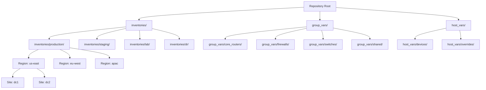
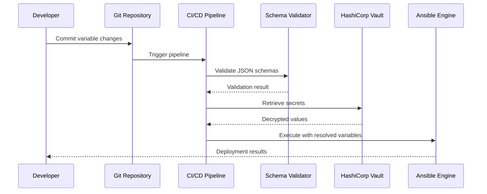
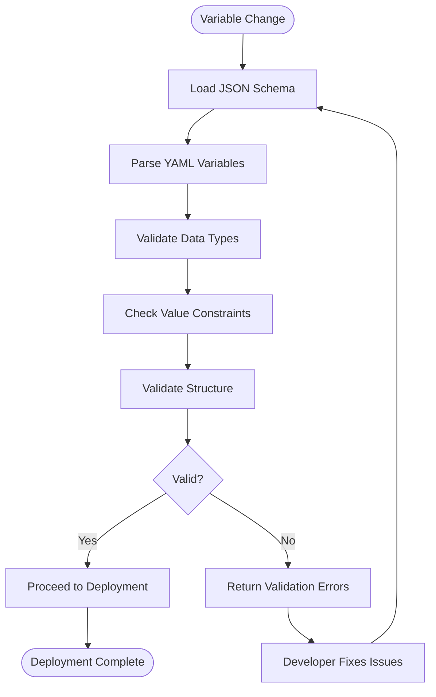
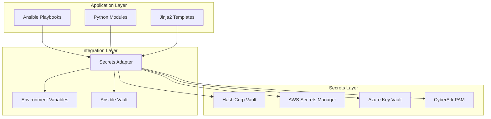
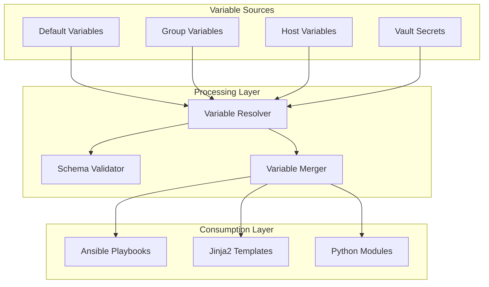

# Variable Management System

<cite>
**Referenced Files in This Document**
- [README.md](file://README.md)
</cite>

## Table of Contents
1. [Introduction](#introduction)
2. [Project Structure](#project-structure)
3. [Core Components](#core-components)
4. [Architecture Overview](#architecture-overview)
5. [Detailed Component Analysis](#detailed-component-analysis)
6. [Dependency Analysis](#dependency-analysis)
7. [Performance Considerations](#performance-considerations)
8. [Troubleshooting Guide](#troubleshooting-guide)
9. [Conclusion](#conclusion)

## Introduction

This document provides comprehensive coverage of the hierarchical variable management system used throughout the Enterprise Network Automation Platform. The platform implements a sophisticated variable resolution mechanism following Ansible best practices, supporting multi-environment deployments across production, staging, lab, and disaster recovery environments.

The variable management system is designed to handle thousands of network devices across multiple vendors, regions, and sites while maintaining strict separation of concerns and environment isolation. It supports complex data structures including strings, lists, dictionaries, and nested configurations for comprehensive network device management.

## Project Structure

The variable management system follows a well-defined directory structure that separates variables by scope and purpose:



**Diagram sources**
- [README.md:103-180](file://README.md#L103-L180)
- [README.md:284-335](file://README.md#L284-L335)

**Section sources**
- [README.md:103-180](file://README.md#L103-L180)

## Core Components

### Variable Precedence Order

The platform implements a strict variable precedence hierarchy that ensures consistent configuration management:

1. **Host Variables** (`host_vars/`) - Highest priority, device-specific overrides
2. **Group Variables** (`group_vars/`) - Medium priority, shared by device groups
3. **Default Variables** - Lowest priority, baseline configurations

This precedence order allows for granular control where device-specific settings can override group-level defaults, which in turn override global baselines.

### Environment Organization

The inventory system organizes devices across four primary environments:

| Environment | Purpose | Isolation Level |
|-------------|---------|----------------|
| **Production** | Live network operations | Full isolation with strict validation |
| **Staging** | Pre-production testing | Near-production parity |
| **Lab** | Development and training | Relaxed constraints |
| **DR** | Disaster recovery scenarios | Standalone configuration |

### Role-Based Organization

Devices are categorized by their functional role within the network infrastructure:

- **Core Routers**: High-performance routing devices at network core
- **Firewalls**: Security perimeter devices
- **Switches**: Distribution and access layer switching
- **Load Balancers**: Traffic distribution and application delivery
- **VPN Gateways**: Remote access and site-to-site connectivity

### Regional and Site Hierarchy

The platform supports geographic distribution through region and site organization:

- **Regions**: us-east, eu-west, apac
- **Sites**: dc1, dc2 (data center locations within each region)

**Section sources**
- [README.md:284-335](file://README.md#L284-L335)

## Architecture Overview

The variable management system integrates with the broader automation platform through multiple layers:



**Diagram sources**
- [README.md:339-369](file://README.md#L339-L369)
- [README.md:479-501](file://README.md#L479-L501)

## Detailed Component Analysis

### Variable File Structure and Naming Conventions

#### Group Variables Organization

The `group_vars/` directory contains shared variables organized by device roles and common settings:

```
group_vars/
├── all.yml                    # Global defaults for all devices
├── core_routers/
│   ├── all.yml               # Base router configuration
│   ├── us-east.yml           # US-East specific settings
│   └── dc1.yml              # Data Center 1 specifics
├── firewalls/
│   ├── all.yml               # Base firewall configuration
│   └── security_policies.yml  # Security policy definitions
├── switches/
│   ├── all.yml               # Base switch configuration
│   └── vlans.yml             # VLAN definitions
└── shared/
    ├── ntp_servers.yml       # NTP server configurations
    ├── dns_resolvers.yml     # DNS resolver settings
    └── snmp_communities.yml  # SNMP community strings
```

#### Host Variables Organization

The `host_vars/` directory contains device-specific overrides:

```
host_vars/
├── core-rtr-01.yml          # Individual router configuration
├── fw-edge-01.yml           # Individual firewall configuration
└── sw-access-01.yml         # Individual switch configuration
```

### Variable Types and Data Structures

The platform supports comprehensive variable types for different configuration needs:

#### String Variables
Used for simple text-based configurations like hostnames, descriptions, and identifiers.

#### List Variables
Used for arrays of values such as:
- NTP server lists
- DNS resolver lists
- ACL rule sets
- Interface configurations

#### Dictionary Variables
Used for structured configurations such as:
- Device interface configurations
- Routing protocol parameters
- Security policies
- Monitoring settings

#### Complex Nested Structures
Used for advanced configurations including:
- Multi-vendor template parameters
- Conditional logic configurations
- Policy-based routing rules
- Quality of Service (QoS) policies

### Shared Variables for Common Settings

#### NTP Server Configuration
Shared NTP servers are defined centrally and inherited by all devices:

```yaml
# group_vars/shared/ntp_servers.yml
ntp_servers:
  - name: "primary-ntp"
    address: "10.0.1.10"
    prefer: true
  - name: "secondary-ntp" 
    address: "10.0.1.11"
    prefer: false
```

#### DNS Resolver Configuration
DNS resolvers are configured per region for optimal performance:

```yaml
# group_vars/shared/dns_resolvers.yml
dns_resolvers:
  us-east:
    - "10.0.1.53"
    - "10.0.1.54"
  eu-west:
    - "10.1.1.53"
    - "10.1.1.54"
  apac:
    - "10.2.1.53"
    - "10.2.1.54"
```

#### SNMP Community Strings
SNMP configurations use secure community strings managed through secrets integration.

### Device-Specific Overrides

Individual devices can override any inherited variable through host-specific files:

```yaml
# host_vars/core-rtr-01.yml
hostname: "core-rtr-01.us-east.dc1"
ntp_servers:
  - name: "local-ntp"
    address: "10.0.1.100"
    prefer: true
snmp_community: "custom-community-string"
```

### Variable Validation Using JSON Schemas

The platform implements comprehensive schema validation to ensure variable integrity:



**Diagram sources**
- [README.md:517-544](file://README.md#L517-L544)

### Secret Management Integration

The platform integrates with HashiCorp Vault for secure secret management:



**Diagram sources**
- [README.md:339-369](file://README.md#L339-L369)

### Environment-Specific Variable Isolation

Each environment maintains complete isolation of variables:

| Variable Type | Production | Staging | Lab | DR |
|---------------|------------|---------|-----|----|
| **NTP Servers** | Production NTP | Staging NTP | Lab NTP | DR NTP |
| **DNS Resolvers** | Prod DNS | Staging DNS | Lab DNS | DR DNS |
| **SNMP Communities** | Secure communities | Test communities | Public communities | Recovery communities |
| **Device Credentials** | Vault-managed | Vault-managed | Local vault | Backup credentials |
| **Network Policies** | Strict policies | Relaxed policies | Permissive policies | Recovery policies |

## Dependency Analysis

The variable management system has well-defined dependencies and relationships:



**Diagram sources**
- [README.md:103-180](file://README.md#L103-L180)
- [README.md:438-456](file://README.md#L438-L456)

**Section sources**
- [README.md:103-180](file://README.md#L103-L180)
- [README.md:438-456](file://README.md#L438-L456)

## Performance Considerations

### Variable Resolution Optimization

- **Lazy Loading**: Variables are loaded on-demand rather than pre-loading all variables
- **Caching**: Resolved variables are cached during playbook execution
- **Parallel Processing**: Multiple device configurations are processed concurrently
- **Incremental Updates**: Only changed variables trigger reconfiguration

### Memory Management

- **Streaming Processing**: Large variable sets are processed in streams
- **Garbage Collection**: Temporary variables are cleaned up after use
- **Memory Limits**: Configurable memory limits prevent resource exhaustion

### Scalability Patterns

- **Horizontal Scaling**: Additional workers can be added for large deployments
- **Variable Partitioning**: Variables are partitioned by environment and region
- **Distributed Resolution**: Variable resolution can be distributed across nodes

## Troubleshooting Guide

### Common Variable Resolution Issues

| Issue | Symptoms | Resolution |
|-------|----------|------------|
| **Variable Not Found** | Template rendering errors | Verify variable path and naming conventions |
| **Type Mismatch** | Runtime errors during execution | Check variable type definitions in schemas |
| **Precedence Conflicts** | Unexpected configuration values | Review variable hierarchy and override paths |
| **Secret Access Failures** | Authentication or permission errors | Verify Vault connectivity and permissions |
| **Schema Validation Failures** | CI/CD pipeline failures | Update variables to match schema requirements |

### Debugging Techniques

#### Variable Inspection
Use Ansible's debug capabilities to inspect resolved variables:

```bash
ansible all -m debug -a "var=variable_name" -i inventories/production/hosts.yml
```

#### Template Rendering Debug
Enable verbose template rendering to identify issues:

```bash
python -m python.config_gen --debug --device device-name
```

#### Schema Validation Testing
Test variable schemas independently:

```bash
pytest tests/unit/schema_validation.py -v
```

#### Secret Access Testing
Verify secret retrieval functionality:

```bash
python -c "from python.utils.secrets import get_secret; print(get_secret('path/to/secret'))"
```

### Best Practices for Variable Management

1. **Naming Conventions**: Use consistent, descriptive variable names
2. **Documentation**: Comment complex variable structures and purposes
3. **Validation**: Always test variables against schemas before deployment
4. **Isolation**: Keep environment-specific variables properly isolated
5. **Security**: Never commit sensitive data to version control
6. **Testing**: Include unit tests for critical variable configurations
7. **Versioning**: Track variable changes with meaningful commit messages

## Conclusion

The hierarchical variable management system provides a robust foundation for enterprise-scale network automation. By implementing strict precedence rules, comprehensive validation, and secure secret management, the platform ensures reliable and maintainable configuration management across diverse network environments.

The system's design supports scalability, security, and operational efficiency while providing extensive debugging and troubleshooting capabilities. Through careful adherence to the documented patterns and best practices, teams can effectively manage complex network configurations across multiple environments, regions, and device types.

The integration with modern DevOps practices, including CI/CD pipelines, automated testing, and compliance enforcement, makes this variable management system suitable for production environments requiring high availability and strict governance controls.